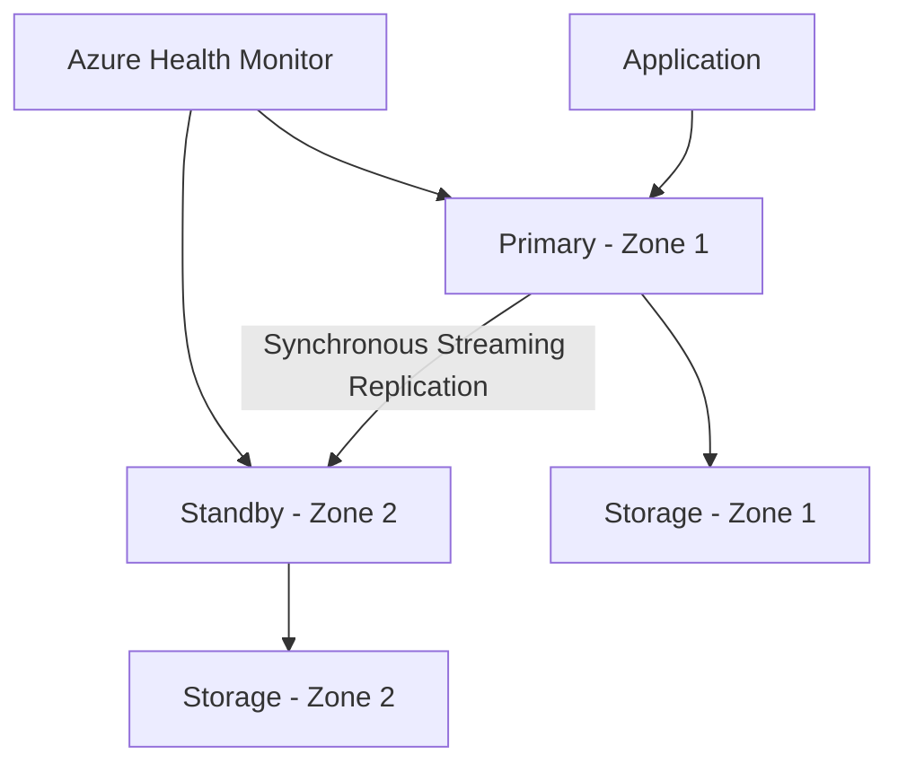

# How to Configure High Availability for Azure Database for PostgreSQL Flexible Server

Author: [nawazdhandala](https://www.github.com/nawazdhandala)

Tags: Azure, PostgreSQL, High Availability, Flexible Server, Zone Redundant, Disaster Recovery, Failover

Description: Learn how to configure zone-redundant and same-zone high availability for Azure Database for PostgreSQL Flexible Server with automatic failover.

---

Database downtime costs money and erodes trust. Whether it is a planned maintenance event, a hardware failure, or an entire availability zone going offline, your application needs the database to be there when it is needed. Azure Database for PostgreSQL Flexible Server offers built-in high availability (HA) with automatic failover, and setting it up is much simpler than managing your own PostgreSQL replication cluster.

This post covers the HA architecture, configuration steps, failover behavior, and the application-side work needed to handle failovers gracefully.

## HA Architecture Overview

When you enable HA on a Flexible Server, Azure deploys two instances of your PostgreSQL server:

- A **primary** that handles all read and write traffic.
- A **standby** that receives data through synchronous streaming replication.



The synchronous replication ensures that every committed transaction is written to both the primary and standby before the commit is acknowledged to the client. This means zero data loss during failover.

## Zone-Redundant vs. Same-Zone HA

| Aspect | Zone-Redundant | Same-Zone |
|--------|---------------|-----------|
| Standby location | Different availability zone | Same availability zone |
| Protection scope | Zone, rack, server, hardware | Rack, server, hardware |
| Write latency | Slightly higher (cross-zone) | Lower |
| Cost | ~2x compute | ~2x compute |
| Best for | Business-critical production | Non-zone-critical production |

Zone-redundant HA is the stronger option. If the primary's entire availability zone goes down - power failure, network outage, natural disaster affecting one datacenter - the standby in the other zone takes over. Same-zone HA protects against server-level failures but not zone-level ones.

## Prerequisites

- General Purpose or Memory Optimized compute tier (Burstable does not support HA).
- The region must support availability zones for zone-redundant HA.
- Your application must implement connection retry logic.

## Enabling HA During Server Creation

### Azure CLI

```bash
# Create a PostgreSQL Flexible Server with zone-redundant HA
az postgres flexible-server create \
  --resource-group myResourceGroup \
  --name my-pg-ha-server \
  --location eastus \
  --admin-user pgadmin \
  --admin-password 'StrongPassword123!' \
  --sku-name Standard_D4ds_v4 \
  --tier GeneralPurpose \
  --version 16 \
  --storage-size 128 \
  --high-availability ZoneRedundant \
  --zone 1 \
  --standby-zone 3
```

### Azure Portal

During server creation, go to the "High Availability" tab, select "Zone redundant," and choose your preferred availability zones for the primary and standby.

## Enabling HA on an Existing Server

If you already have a server without HA:

```bash
# Enable zone-redundant HA on an existing server
az postgres flexible-server update \
  --resource-group myResourceGroup \
  --name my-pg-existing-server \
  --high-availability ZoneRedundant \
  --standby-zone 2
```

This operation takes several minutes. There will be a brief connection interruption while the standby is being set up. Plan this for a maintenance window.

To enable same-zone HA:

```bash
# Enable same-zone HA
az postgres flexible-server update \
  --resource-group myResourceGroup \
  --name my-pg-existing-server \
  --high-availability SameZone
```

## What Happens During Failover

When the primary becomes unhealthy, here is the sequence:

1. **Detection**: Azure health monitoring detects the primary is unresponsive (typically within 30-40 seconds).
2. **Promotion**: The standby is promoted to primary. Because replication is synchronous, no committed data is lost.
3. **DNS update**: The server's FQDN is updated to point to the new primary's IP.
4. **New standby provisioning**: A new standby is created automatically.

The total failover time is typically 60-120 seconds. During this window, existing connections will drop and new connections will fail until the DNS update propagates.

### Failover Scenarios

Different scenarios have different failover behaviors:

- **Unplanned failover (primary crash)**: Automatic. Standby promotes within minutes.
- **Planned failover (maintenance)**: Azure performs a graceful failover. Connections drain before switchover. Downtime is minimal.
- **Storage failure**: If the primary's storage becomes unavailable, failover to the standby occurs.
- **Zone outage**: With zone-redundant HA, the standby in the other zone takes over.

## Testing Failover

Do not wait for a real outage to discover your failover does not work as expected. Test it proactively:

```bash
# Trigger a planned failover
az postgres flexible-server restart \
  --resource-group myResourceGroup \
  --name my-pg-ha-server \
  --failover Planned
```

For a more realistic test, use forced failover:

```bash
# Trigger an unplanned (forced) failover
az postgres flexible-server restart \
  --resource-group myResourceGroup \
  --name my-pg-ha-server \
  --failover Forced
```

During the test, measure:

- How long your application is unable to connect.
- Whether your application recovers automatically.
- Whether any transactions are lost.
- How quickly the new standby is provisioned.

## Application-Side Requirements

The database failover is only half the story. Your application needs to handle the interruption gracefully.

### Connection Retry Logic

Implement exponential backoff retry logic:

```python
import psycopg2
import time

def get_connection(max_retries=10, base_delay=1):
    """
    Connect to PostgreSQL with retry logic.
    Uses exponential backoff to handle failover events.
    """
    for attempt in range(max_retries):
        try:
            conn = psycopg2.connect(
                host="my-pg-ha-server.postgres.database.azure.com",
                port=5432,
                dbname="myapp",
                user="appuser",
                password="AppPassword456!",
                sslmode="require",
                connect_timeout=10
            )
            return conn
        except psycopg2.OperationalError as e:
            if attempt == max_retries - 1:
                raise
            delay = min(base_delay * (2 ** attempt), 30)
            print(f"Connection attempt {attempt + 1} failed: {e}")
            print(f"Retrying in {delay} seconds...")
            time.sleep(delay)
```

### Connection Pooling with Health Checks

Use a connection pool that can detect and replace broken connections:

```python
from psycopg2 import pool

# Create a threaded connection pool
connection_pool = pool.ThreadedConnectionPool(
    minconn=5,
    maxconn=20,
    host="my-pg-ha-server.postgres.database.azure.com",
    port=5432,
    dbname="myapp",
    user="appuser",
    password="AppPassword456!",
    sslmode="require"
)

def execute_with_retry(query, params=None, max_retries=3):
    """
    Execute a query with automatic retry on connection failure.
    Gets a fresh connection from the pool on each retry.
    """
    for attempt in range(max_retries):
        conn = None
        try:
            conn = connection_pool.getconn()
            cursor = conn.cursor()
            cursor.execute(query, params)
            conn.commit()
            results = cursor.fetchall() if cursor.description else None
            cursor.close()
            connection_pool.putconn(conn)
            return results
        except Exception as e:
            if conn:
                connection_pool.putconn(conn, close=True)
            if attempt == max_retries - 1:
                raise
            time.sleep(2 ** attempt)
```

### DNS Caching Considerations

After failover, the DNS record changes. Make sure your application does not cache the old IP:

- In Python, psycopg2 resolves DNS on each new connection by default.
- In Java, set `networkaddress.cache.ttl` to a low value (30 seconds).
- In .NET, `ServicePointManager.DnsRefreshTimeout` controls DNS caching.
- Avoid connection strings with IP addresses - always use the FQDN.

## Monitoring HA Health

Keep an eye on HA status:

```bash
# Check HA status
az postgres flexible-server show \
  --resource-group myResourceGroup \
  --name my-pg-ha-server \
  --query "{haState:highAvailability.state, haMode:highAvailability.mode, primaryZone:availabilityZone, standbyZone:highAvailability.standbyAvailabilityZone}"
```

Set up alerts for HA events:

```bash
# Alert on HA health degradation
az monitor metrics alert create \
  --name pg-ha-health-alert \
  --resource-group myResourceGroup \
  --scopes "/subscriptions/{sub-id}/resourceGroups/myResourceGroup/providers/Microsoft.DBforPostgreSQL/flexibleServers/my-pg-ha-server" \
  --condition "max Is HA Enabled < 1" \
  --description "HA health has degraded" \
  --action-group myActionGroup
```

## Cost Analysis

HA doubles your compute cost because you are running two servers:

| SKU | Without HA (monthly) | With HA (monthly) |
|-----|---------------------|-------------------|
| Standard_D2ds_v4 | ~$125 | ~$250 |
| Standard_D4ds_v4 | ~$250 | ~$500 |
| Standard_D8ds_v4 | ~$500 | ~$1,000 |
| Standard_E4ds_v4 | ~$330 | ~$660 |

Storage costs remain the same since the standby uses synchronized storage, not a separate copy.

For the cost-conscious: calculate the cost of downtime for your business. If an hour of downtime costs more than a month of HA, the math is straightforward.

## Disabling HA

If you need to disable HA (for example, to save costs in a staging environment):

```bash
# Disable HA
az postgres flexible-server update \
  --resource-group myResourceGroup \
  --name my-pg-ha-server \
  --high-availability Disabled
```

This removes the standby server and returns to a single-server deployment.

## Limitations

- Burstable tier does not support HA.
- The standby is not accessible for reads. Use read replicas for read scaling.
- HA is not available in all regions. Check Azure documentation for supported regions.
- During failover, you will see 60-120 seconds of downtime. Plan your application's tolerance accordingly.

## Summary

High availability for Azure Database for PostgreSQL Flexible Server provides automatic failover protection with zero data loss thanks to synchronous streaming replication. The configuration is simple - enable it during server creation or add it later with a single CLI command. The real work is on the application side: retry logic, connection pooling, and DNS handling. Test your failover regularly, monitor the HA health metrics, and make sure your team knows what happens when the pager goes off at 3 AM.
