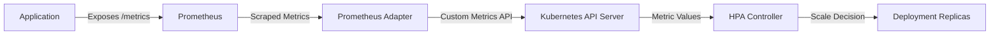

# How to Configure Horizontal Pod Autoscaler with Custom Metrics from Prometheus on AKS

Author: [nawazdhandala](https://www.github.com/nawazdhandala)

Tags: AKS, Horizontal Pod Autoscaler, Prometheus, Custom Metrics, Kubernetes, Auto Scaling, Monitoring

Description: Guide to configuring HPA on AKS with custom Prometheus metrics for scaling based on application-specific indicators like queue depth or request latency.

---

The default Horizontal Pod Autoscaler (HPA) in Kubernetes scales based on CPU and memory utilization. That works for some workloads, but many applications need to scale on application-specific metrics - queue depth, request latency, active connections, or business-level indicators like orders per minute. Prometheus collects these custom metrics, and with the right adapter, HPA can use them for scaling decisions on AKS.

## Why Custom Metrics Matter

Consider a worker service that processes messages from a queue. CPU might sit at 20% while thousands of messages pile up. Scaling on CPU would never add more workers. What you actually want is to scale based on the queue depth - add workers when messages are backing up and remove them when the queue is nearly empty.

The architecture looks like this:



## Prerequisites

You need:

- An AKS cluster with at least 3 nodes
- Helm 3 installed
- kubectl configured for your cluster
- An application that exposes Prometheus metrics at a `/metrics` endpoint
- Basic familiarity with PromQL

## Step 1: Install Prometheus on AKS

If you do not already have Prometheus running, install it with the kube-prometheus-stack Helm chart. This includes Prometheus, Alertmanager, and Grafana.

```bash
# Add the prometheus-community Helm repo
helm repo add prometheus-community https://prometheus-community.github.io/helm-charts
helm repo update

# Install the kube-prometheus-stack
# This deploys Prometheus, Grafana, and various exporters
helm install prometheus prometheus-community/kube-prometheus-stack \
  --namespace monitoring \
  --create-namespace \
  --set prometheus.prometheusSpec.serviceMonitorSelectorNilUsesHelmValues=false
```

The `serviceMonitorSelectorNilUsesHelmValues=false` setting tells Prometheus to discover ServiceMonitors from all namespaces, not just those installed by Helm.

## Step 2: Expose Application Metrics

Your application needs a `/metrics` endpoint that Prometheus can scrape. Here is an example using a Python Flask app that exposes a custom metric for queue depth.

```python
# app.py
# Flask application that exposes custom Prometheus metrics
from flask import Flask
from prometheus_client import Gauge, generate_latest, CONTENT_TYPE_LATEST
import redis

app = Flask(__name__)

# Define a Gauge metric that tracks the current queue depth
queue_depth_gauge = Gauge(
    'app_queue_depth',
    'Number of messages waiting in the processing queue',
    ['queue_name']
)

# Redis connection for reading queue length
r = redis.Redis(host='redis-service', port=6379)

@app.route('/metrics')
def metrics():
    # Update the gauge with the current queue length
    queue_depth_gauge.labels(queue_name='orders').set(
        r.llen('orders_queue')
    )
    return generate_latest(), 200, {'Content-Type': CONTENT_TYPE_LATEST}

@app.route('/health')
def health():
    return 'ok', 200
```

## Step 3: Create a ServiceMonitor

A ServiceMonitor tells Prometheus where to find your application's metrics endpoint.

```yaml
# service-monitor.yaml
# Tells Prometheus to scrape metrics from pods matching the app label
apiVersion: monitoring.coreos.com/v1
kind: ServiceMonitor
metadata:
  name: my-app-monitor
  namespace: default
  labels:
    release: prometheus
spec:
  selector:
    matchLabels:
      app: my-app
  endpoints:
  - port: http
    path: /metrics
    interval: 15s
```

Apply it and verify Prometheus is scraping your application.

```bash
# Apply the ServiceMonitor
kubectl apply -f service-monitor.yaml

# Port-forward to Prometheus UI to check targets
kubectl port-forward svc/prometheus-kube-prometheus-prometheus -n monitoring 9090:9090
```

Open http://localhost:9090/targets in your browser. Your application should appear as a target in the "Up" state.

## Step 4: Install the Prometheus Adapter

The Prometheus Adapter bridges Prometheus and the Kubernetes custom metrics API. HPA queries the custom metrics API, and the adapter translates those queries into PromQL against Prometheus.

```bash
# Install the Prometheus adapter
# Point it at the Prometheus service in your cluster
helm install prometheus-adapter prometheus-community/prometheus-adapter \
  --namespace monitoring \
  --set prometheus.url=http://prometheus-kube-prometheus-prometheus.monitoring.svc \
  --set prometheus.port=9090
```

## Step 5: Configure Custom Metric Rules

The adapter needs rules that define how to map Prometheus metrics to Kubernetes custom metrics. Create a values file for the adapter.

```yaml
# adapter-values.yaml
# Configuration for the Prometheus adapter
# Defines how Prometheus metrics are exposed as Kubernetes custom metrics
rules:
  custom:
  - seriesQuery: 'app_queue_depth{namespace!="",pod!=""}'
    resources:
      overrides:
        namespace:
          resource: namespace
        pod:
          resource: pod
    name:
      matches: "^(.*)$"
      as: "${1}"
    metricsQuery: 'sum(<<.Series>>{<<.LabelMatchers>>}) by (<<.GroupBy>>)'

  - seriesQuery: 'http_requests_per_second{namespace!="",pod!=""}'
    resources:
      overrides:
        namespace:
          resource: namespace
        pod:
          resource: pod
    name:
      matches: "^(.*)$"
      as: "${1}"
    metricsQuery: 'avg(<<.Series>>{<<.LabelMatchers>>}) by (<<.GroupBy>>)'
```

Upgrade the adapter with these rules.

```bash
# Upgrade the adapter with custom metric rules
helm upgrade prometheus-adapter prometheus-community/prometheus-adapter \
  --namespace monitoring \
  --values adapter-values.yaml \
  --set prometheus.url=http://prometheus-kube-prometheus-prometheus.monitoring.svc \
  --set prometheus.port=9090
```

## Step 6: Verify Custom Metrics Are Available

After the adapter restarts, check that Kubernetes can see your custom metrics.

```bash
# List all available custom metrics
# Your app_queue_depth metric should appear in this list
kubectl get --raw "/apis/custom.metrics.k8s.io/v1beta1" | python3 -m json.tool

# Query a specific metric for pods in the default namespace
kubectl get --raw "/apis/custom.metrics.k8s.io/v1beta1/namespaces/default/pods/*/app_queue_depth" | python3 -m json.tool
```

If the metric does not appear, check the adapter logs.

```bash
# Check adapter logs for errors
kubectl logs -n monitoring -l app.kubernetes.io/name=prometheus-adapter
```

## Step 7: Create the HPA with Custom Metrics

Now create an HPA that scales based on your custom metric.

```yaml
# hpa-custom-metrics.yaml
# HPA that scales based on queue depth from Prometheus
# Targets 10 messages per pod - if queue grows, more pods are added
apiVersion: autoscaling/v2
kind: HorizontalPodAutoscaler
metadata:
  name: my-app-hpa
  namespace: default
spec:
  scaleTargetRef:
    apiVersion: apps/v1
    kind: Deployment
    name: my-app
  minReplicas: 2
  maxReplicas: 20
  metrics:
  - type: Pods
    pods:
      metric:
        name: app_queue_depth
      target:
        type: AverageValue
        # Scale so each pod handles roughly 10 messages
        averageValue: "10"
  behavior:
    scaleUp:
      stabilizationWindowSeconds: 30
      policies:
      - type: Pods
        value: 4
        periodSeconds: 60
    scaleDown:
      stabilizationWindowSeconds: 300
      policies:
      - type: Pods
        value: 2
        periodSeconds: 120
```

Apply the HPA.

```bash
kubectl apply -f hpa-custom-metrics.yaml
```

This HPA maintains an average queue depth of 10 per pod. If the total queue depth is 50 and there are 2 pods (average 25 per pod), the HPA will scale up to 5 pods (50/10 = 5). The behavior section controls how aggressively scaling happens - it can add up to 4 pods per minute but only removes 2 pods every 2 minutes.

## Step 8: Monitor HPA Behavior

Watch the HPA to see it respond to metric changes.

```bash
# Watch the HPA status in real time
# Shows current metric values, desired replicas, and conditions
kubectl get hpa my-app-hpa --watch

# Get detailed HPA status including events
kubectl describe hpa my-app-hpa
```

The output shows the current metric value, the target value, and the current/desired replica count. If the metric is above the target, the HPA scales up. If below, it scales down (after the stabilization window).

## Combining Custom and Resource Metrics

You can combine custom metrics with standard CPU/memory metrics in a single HPA. Kubernetes uses the metric that results in the highest replica count.

```yaml
# hpa-combined.yaml
# HPA using both CPU and custom queue depth metrics
apiVersion: autoscaling/v2
kind: HorizontalPodAutoscaler
metadata:
  name: my-app-hpa-combined
  namespace: default
spec:
  scaleTargetRef:
    apiVersion: apps/v1
    kind: Deployment
    name: my-app
  minReplicas: 2
  maxReplicas: 20
  metrics:
  # Scale on CPU utilization
  - type: Resource
    resource:
      name: cpu
      target:
        type: Utilization
        averageUtilization: 70
  # Scale on custom queue depth metric
  - type: Pods
    pods:
      metric:
        name: app_queue_depth
      target:
        type: AverageValue
        averageValue: "10"
```

With this configuration, if CPU says you need 5 replicas but queue depth says you need 8, the HPA scales to 8.

## Troubleshooting Tips

**HPA shows "unknown" for custom metrics**: The adapter might not be scraping your metric. Verify the metric exists in Prometheus by querying it directly in the Prometheus UI. Check that the adapter rules match the metric name and labels.

**HPA not scaling up despite high metric values**: Check if you hit the maxReplicas limit. Also verify that pods have resource requests set - the HPA needs requests defined to calculate utilization for resource-based metrics.

**Metric values lagging behind reality**: The adapter queries Prometheus on a regular interval (default 30 seconds). Combined with Prometheus scrape intervals and HPA evaluation periods, there can be a 1-2 minute delay between a metric change and a scaling action. Tune these intervals based on how quickly you need to respond.

**Adapter returning stale data**: If you change adapter rules, the adapter might cache old values. Restart the adapter pods after rule changes.

## Summary

Scaling on custom Prometheus metrics gives you precise control over when and how your AKS workloads scale. The setup involves four components - your application exposing metrics, Prometheus scraping them, the adapter translating them into the Kubernetes API, and the HPA acting on them. Once this pipeline is in place, you can scale on virtually any metric your application produces, from queue depths to request rates to business-level indicators. The key is choosing metrics that actually correlate with load and tuning the HPA behavior to avoid thrashing.
