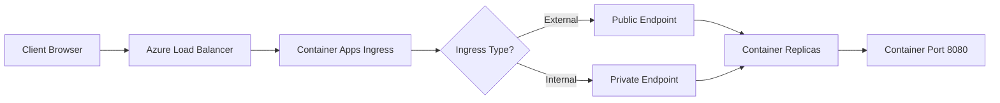

# How to Configure HTTP Ingress and Custom Domains on Azure Container Apps

Author: [nawazdhandala](https://www.github.com/nawazdhandala)

Tags: Azure, Container Apps, Ingress, Custom Domains, TLS, Networking, Cloud

Description: A practical guide to configuring HTTP ingress, enabling external access, and mapping custom domains with TLS on Azure Container Apps.

---

When you deploy a container to Azure Container Apps, it does not automatically get a public URL. You need to configure ingress to expose your application to the outside world, and if you want to use your own domain name instead of the auto-generated Azure URL, you need to set up custom domain mapping with TLS certificates. This guide covers both.

## What Is Ingress in Azure Container Apps?

Ingress in Azure Container Apps controls how external and internal traffic reaches your containers. You can configure it to be external (accessible from the internet) or internal (only accessible from other apps within the same environment). The platform provides a built-in reverse proxy that handles TLS termination, load balancing, and routing.

## Step 1: Enable External Ingress

If you are creating a new container app, you can enable ingress during creation.

```bash
# Create a container app with external HTTP ingress on port 8080
az containerapp create \
  --name my-web-app \
  --resource-group my-rg \
  --environment my-env \
  --image myregistry.azurecr.io/web-app:latest \
  --target-port 8080 \
  --ingress external \
  --transport auto
```

The `--target-port` flag specifies the port your container listens on. The `--ingress external` flag makes it publicly accessible. The `--transport auto` setting means it will accept both HTTP/1.1 and HTTP/2 traffic.

If your app is already deployed, update it.

```bash
# Enable external ingress on an existing container app
az containerapp ingress enable \
  --name my-web-app \
  --resource-group my-rg \
  --type external \
  --target-port 8080 \
  --transport auto
```

After enabling ingress, Azure generates a URL like `https://my-web-app.happyocean-abc123.eastus.azurecontainerapps.io`. This URL includes automatic TLS with a managed certificate.

## Step 2: Configure Internal Ingress

For backend services that should only be reached by other container apps in the same environment, use internal ingress.

```bash
# Enable internal-only ingress
az containerapp ingress enable \
  --name my-backend-api \
  --resource-group my-rg \
  --type internal \
  --target-port 3000
```

Internal services get a URL that is only resolvable within the Container Apps environment. Other apps can reach it at `http://my-backend-api` or `https://my-backend-api.internal.happyocean-abc123.eastus.azurecontainerapps.io`.

## Step 3: Configure IP Restrictions

You may want to restrict access to your externally exposed app. Azure Container Apps supports IP allow and deny rules.

```bash
# Add an IP restriction rule to allow only specific CIDR ranges
az containerapp ingress access-restriction set \
  --name my-web-app \
  --resource-group my-rg \
  --rule-name office-network \
  --ip-address 203.0.113.0/24 \
  --action Allow

# Set the default action to deny everything else
az containerapp ingress access-restriction set \
  --name my-web-app \
  --resource-group my-rg \
  --rule-name deny-all \
  --ip-address 0.0.0.0/0 \
  --action Deny
```

Rules are evaluated in order, so put the Allow rules first, followed by a deny-all catch-all rule.

## Step 4: Set Up a Custom Domain

Now for the interesting part - mapping your own domain to the container app. The process involves three steps: verifying domain ownership, uploading a TLS certificate, and binding it.

First, add the custom domain to your container app.

```bash
# Add the custom domain to the container app
az containerapp hostname add \
  --name my-web-app \
  --resource-group my-rg \
  --hostname app.example.com
```

Azure will tell you to create a CNAME record (or an A record for apex domains) and a TXT record for domain verification. Log in to your DNS provider and add these records.

For a subdomain like `app.example.com`, create a CNAME record pointing to your container app's default domain.

```
CNAME  app.example.com  ->  my-web-app.happyocean-abc123.eastus.azurecontainerapps.io
TXT    asuid.app.example.com  ->  <verification-id-from-azure>
```

## Step 5: Configure a Managed TLS Certificate

Azure Container Apps can automatically provision and renew TLS certificates for your custom domains using managed certificates. This is the easiest approach.

```bash
# Bind a managed certificate to the custom domain
az containerapp hostname bind \
  --name my-web-app \
  --resource-group my-rg \
  --hostname app.example.com \
  --environment my-env \
  --validation-method CNAME
```

The managed certificate takes a few minutes to provision. Azure handles renewal automatically, so you do not need to worry about expiring certificates.

## Step 6: Use Your Own TLS Certificate

If you prefer to use your own certificate (for example, a wildcard certificate), you can upload it to the Container Apps environment.

```bash
# Upload a PFX certificate to the environment
az containerapp env certificate upload \
  --name my-env \
  --resource-group my-rg \
  --certificate-file ./my-cert.pfx \
  --password "cert-password"
```

After uploading, bind it to your hostname.

```bash
# Get the certificate ID
CERT_ID=$(az containerapp env certificate list \
  --name my-env \
  --resource-group my-rg \
  --query "[?properties.subjectName=='*.example.com'].id" \
  --output tsv)

# Bind the certificate to the hostname
az containerapp hostname bind \
  --name my-web-app \
  --resource-group my-rg \
  --hostname app.example.com \
  --certificate $CERT_ID
```

## Step 7: Enable CORS

If your container app serves an API that frontend applications call from the browser, you will need to configure CORS settings.

```bash
# Configure CORS for the container app
az containerapp ingress cors enable \
  --name my-web-app \
  --resource-group my-rg \
  --allowed-origins "https://www.example.com" "https://app.example.com" \
  --allowed-methods "GET" "POST" "PUT" "DELETE" \
  --allowed-headers "Content-Type" "Authorization" \
  --max-age 3600
```

## Architecture Overview

Here is how the ingress flow works in Azure Container Apps.



## Troubleshooting Common Ingress Issues

**App returns 404:** Make sure the `--target-port` matches the port your application listens on inside the container. A mismatch here is the most common issue.

**Custom domain shows certificate error:** DNS propagation can take up to 48 hours. Check that your CNAME and TXT records are correctly set using `nslookup` or `dig`.

**Managed certificate stuck in provisioning:** The CNAME record must be in place before Azure can issue the certificate. Double-check DNS records and wait at least 15 minutes.

**Internal service unreachable:** Make sure both apps are in the same Container Apps environment. Internal DNS only works within the same environment.

**CORS errors in browser console:** Verify that the allowed origins include the full URL with protocol (e.g., `https://example.com`, not just `example.com`).

## Things to Keep in Mind

The built-in ingress in Azure Container Apps is sufficient for most web applications and APIs. However, it does have some limitations compared to a full reverse proxy like NGINX or Azure Application Gateway. For example, you cannot configure custom rewrite rules or advanced header manipulation directly. If you need those features, consider placing an Azure Application Gateway or Azure Front Door in front of your Container Apps environment.

Also, note that the auto-generated Azure domain always uses HTTPS with a valid certificate. There is no way to disable TLS on the external endpoint, which is a good security default.

## Summary

Configuring ingress and custom domains on Azure Container Apps is straightforward once you understand the building blocks. Enable ingress to expose your app, add DNS records for custom domains, and let Azure manage TLS certificates for you. For internal microservices, use internal ingress and let the platform handle service-to-service routing. These features cover the majority of use cases you will encounter when running containerized workloads on Azure.
