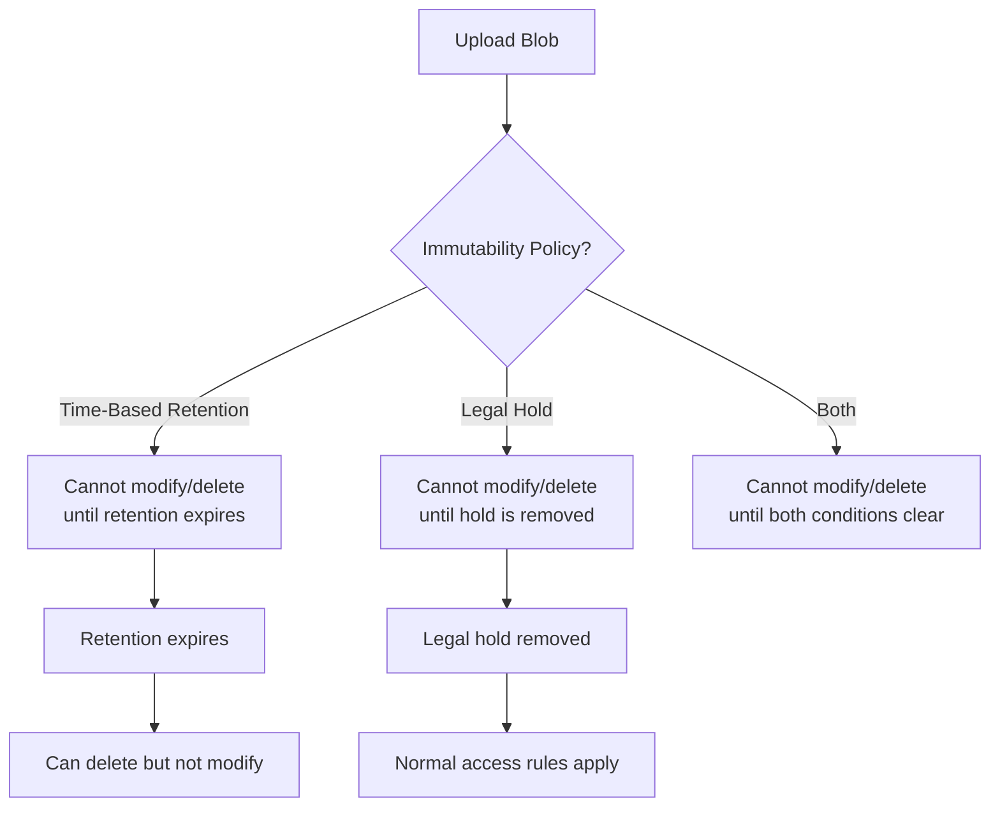

# How to Configure Immutable Storage with WORM Policies in Azure Blob Storage

Author: [nawazdhandala](https://www.github.com/nawazdhandala)

Tags: Azure, Blob Storage, Immutable Storage, WORM, Compliance, Data Protection, Azure Storage

Description: Learn how to configure Write Once Read Many (WORM) immutable storage policies in Azure Blob Storage for regulatory compliance and tamper-proof data retention.

---

Some data must never be modified or deleted once it is written. Financial records, medical data, legal documents, audit logs - regulations like SEC 17a-4, CFTC 1.31, HIPAA, and GDPR require that certain data remain immutable for specified retention periods. Azure Blob Storage supports this through immutable storage policies, also known as WORM (Write Once, Read Many) policies.

When an immutable policy is in effect, blobs cannot be modified or deleted until the retention period expires. Not by users, not by administrators, and not even by Microsoft support. This is the level of assurance regulators expect.

## Types of Immutability Policies

Azure offers two types of immutability policies:

### Time-Based Retention Policies

A time-based retention policy locks blobs for a specified duration. During the retention interval, blobs can be created and read, but cannot be modified or deleted. After the retention period expires, blobs can be deleted but still cannot be modified.

There are three states for a time-based policy:

1. **Unlocked** - The policy is active but can still be modified (extend the retention) or deleted.
2. **Locked** - The policy is permanently in effect. The retention period can be extended but never shortened. The policy cannot be deleted.

Once a policy is locked, there is no going back. Think carefully before locking.

### Legal Hold

A legal hold prevents modification and deletion of blobs regardless of any time-based retention settings. Legal holds are typically used in litigation scenarios where data must be preserved indefinitely until the hold is removed. Unlike time-based policies, legal holds do not have an expiration date.



## Setting Up a Time-Based Retention Policy

### Container-Level Policy

Immutability policies are set at the container level. All blobs in the container are subject to the policy.

```bash
# Create a container for immutable data
az storage container create \
  --account-name mystorageaccount \
  --name compliance-data

# Set a time-based retention policy of 365 days (unlocked state)
az storage container immutability-policy create \
  --account-name mystorageaccount \
  --container-name compliance-data \
  --period 365
```

The policy starts in an unlocked state. In this state, you can test it, modify the retention period, or delete it entirely.

To lock the policy permanently:

```bash
# First, get the current ETag of the immutability policy
ETAG=$(az storage container immutability-policy show \
  --account-name mystorageaccount \
  --container-name compliance-data \
  --query etag \
  --output tsv)

# Lock the policy - THIS IS IRREVERSIBLE
az storage container immutability-policy lock \
  --account-name mystorageaccount \
  --container-name compliance-data \
  --if-match "$ETAG"
```

I cannot stress this enough: locking is permanent. Once locked, you cannot remove the policy or shorten the retention period. You can only extend it.

### Version-Level Immutability

Azure also supports version-level immutability policies, which give you more granular control. Instead of applying a policy to an entire container, you can set immutability on individual blob versions.

To enable version-level immutability, you need to configure it on the storage account:

```bash
# Enable version-level immutability support on the storage account
az storage account update \
  --name mystorageaccount \
  --resource-group myresourcegroup \
  --allow-blob-public-access false \
  --enable-versioning true \
  --immutability-policy-period 90 \
  --immutability-policy-state Unlocked
```

Then set immutability on specific blobs:

```python
from azure.storage.blob import BlobServiceClient, ImmutabilityPolicy
from datetime import datetime, timedelta, timezone

# Connect to the storage account
blob_service_client = BlobServiceClient.from_connection_string("your-connection-string")
blob_client = blob_service_client.get_blob_client(
    container="compliance-data",
    blob="audit-report-2026-q1.pdf"
)

# Upload the blob first
with open("audit-report-2026-q1.pdf", "rb") as data:
    blob_client.upload_blob(data)

# Set immutability policy on this specific blob version
# Retain for 365 days from now
immutability_policy = ImmutabilityPolicy(
    expiry_time=datetime.now(timezone.utc) + timedelta(days=365),
    policy_mode="Unlocked"
)

blob_client.set_immutability_policy(immutability_policy)
print("Immutability policy set on blob")
```

## Applying a Legal Hold

Legal holds are simpler to manage than time-based policies since they do not have retention periods:

```bash
# Apply a legal hold with a tag identifying the reason
az storage container legal-hold set \
  --account-name mystorageaccount \
  --container-name compliance-data \
  --tags "litigation-case-2026-001" "regulatory-investigation"
```

Each legal hold has one or more tags that identify why the hold exists. This is useful for tracking purposes when multiple legal holds are active.

To remove a legal hold:

```bash
# Clear specific legal hold tags
az storage container legal-hold clear \
  --account-name mystorageaccount \
  --container-name compliance-data \
  --tags "litigation-case-2026-001"
```

A container can have both a time-based retention policy and a legal hold simultaneously. Both conditions must be satisfied before a blob can be deleted.

## Working with Immutable Blobs

Once immutability is in effect, certain operations are blocked:

**Allowed operations:**
- Creating new blobs in the container
- Reading blobs
- Listing blobs
- Creating snapshots (if versioning allows it)
- Setting blob metadata on new blobs

**Blocked operations:**
- Deleting blobs before retention expires
- Overwriting blob content
- Modifying blob metadata on existing blobs

Attempting a blocked operation results in an HTTP 409 Conflict error:

```python
from azure.storage.blob import BlobServiceClient
from azure.core.exceptions import HttpResponseError

blob_service_client = BlobServiceClient.from_connection_string("your-connection-string")
blob_client = blob_service_client.get_blob_client(
    container="compliance-data",
    blob="locked-file.pdf"
)

try:
    # This will fail if the blob is under an immutability policy
    blob_client.delete_blob()
except HttpResponseError as e:
    # Expected: "This operation is not permitted because the blob is immutable"
    print(f"Cannot delete: {e.message}")
```

## Extending a Retention Period

You can extend (but never shorten) the retention period on a locked policy:

```bash
# Extend retention from 365 to 730 days
# First, get the current ETag
ETAG=$(az storage container immutability-policy show \
  --account-name mystorageaccount \
  --container-name compliance-data \
  --query etag \
  --output tsv)

# Extend the retention period
az storage container immutability-policy extend \
  --account-name mystorageaccount \
  --container-name compliance-data \
  --period 730 \
  --if-match "$ETAG"
```

## Storage Account Requirements

Not all storage account types support immutable storage:

- General-purpose v2 and BlobStorage accounts support it
- The account must use LRS, GRS, RA-GRS, ZRS, GZRS, or RA-GZRS redundancy
- Premium block blob accounts also support it

Immutability policies are preserved during failover if you are using GRS/GZRS replication. This means your compliance posture is maintained even in a disaster recovery scenario.

## Audit Trail

Azure provides an audit log for immutability policy operations. You can see when policies were created, locked, or extended through Azure Activity Log:

```bash
# View activity log entries related to immutability policies
az monitor activity-log list \
  --resource-group myresourcegroup \
  --start-time 2026-02-01 \
  --end-time 2026-02-16 \
  --query "[?contains(operationName.value, 'immutabilityPolicies')]"
```

This audit trail is itself immutable and can be presented to auditors as evidence of compliance.

## Common Mistakes

**Locking a policy prematurely.** Test your policy in the unlocked state first. Make sure the retention period is correct before locking. There is no undo.

**Setting retention too short.** If your regulation requires 7-year retention, setting 365 days means you need to extend it annually. Consider setting the full required period from the start.

**Forgetting about storage costs.** Immutable data cannot be deleted or moved to cheaper tiers before the retention period expires. Budget for the full retention period at the current tier's pricing.

**Not using version-level immutability when needed.** Container-level policies apply uniformly. If different blobs need different retention periods, use version-level immutability instead.

## Wrapping Up

Immutable storage in Azure Blob Storage provides the tamper-proof data retention that regulatory compliance demands. Use time-based retention policies for standard retention requirements and legal holds for litigation-related preservation. Always test policies in the unlocked state before locking, plan your retention periods carefully, and remember that locking is irreversible. When configured correctly, immutable storage lets you demonstrate to auditors that your data has been protected from modification since the moment it was written.
