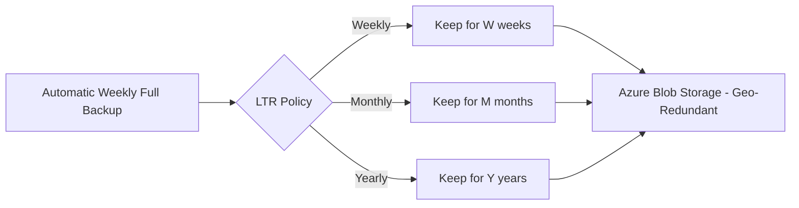

# How to Configure Long-Term Backup Retention for Azure SQL Database

Author: [nawazdhandala](https://www.github.com/nawazdhandala)

Tags: Azure SQL, Backup, Long-Term Retention, Compliance, Disaster Recovery, Azure, Database

Description: Learn how to configure long-term backup retention for Azure SQL Database to keep backups for months or years to meet compliance and archival requirements.

---

Azure SQL Database automatically keeps backups for 7 to 35 days depending on your configuration. But what if you need to keep backups for 6 months? A year? Seven years for regulatory compliance? That is where long-term backup retention (LTR) comes in. LTR lets you keep full database backups for up to 10 years in Azure Blob Storage.

In this post, I will explain how LTR works, walk through the configuration, and show you how to restore from a long-term backup when you need it.

## Why Long-Term Backup Retention?

Several scenarios require backups beyond the standard 35-day window:

**Regulatory compliance**: PCI DSS, HIPAA, SOX, and GDPR all have data retention requirements that can extend to 7 years or more.

**Legal holds**: If your organization is involved in litigation, you may need to preserve database states from specific dates.

**Annual audits**: Being able to restore a database to its state at the end of each fiscal year is useful for audit support.

**Historical analysis**: Some businesses need to compare current data with data from months or years ago.

## How LTR Works

Long-term retention operates on top of the automatic backup system:

1. Azure SQL Database creates full backups weekly as part of the normal backup cycle.
2. Based on your LTR policy, selected full backups are copied to a separate Azure Blob Storage account (managed by Azure, not visible to you).
3. These copies are retained according to your policy - weekly, monthly, yearly, or a combination.
4. LTR backups are geo-redundant by default, stored in the paired Azure region.

The LTR backups are independent of the short-term retention period. Even if you set short-term retention to 7 days, your LTR backups remain available for the configured duration.



## LTR Policy Parameters

The LTR policy has four parameters:

- **Weekly retention (W)**: How long to keep weekly backups. Example: W=4 keeps the last 4 weekly backups.
- **Monthly retention (M)**: How long to keep one backup per month. Example: M=12 keeps one backup from each of the last 12 months.
- **Yearly retention (Y)**: How long to keep one backup per year. Example: Y=5 keeps one backup from each of the last 5 years.
- **Week of year (WeekOfYear)**: Which week's backup to use for the yearly retention. Example: WeekOfYear=1 uses the first week of January.

You can set any combination of these. For example:
- W=0, M=12, Y=0: Keep monthly backups for one year
- W=4, M=12, Y=7: Keep 4 weekly, 12 monthly, and 7 yearly backups
- W=0, M=0, Y=10: Keep only annual backups for 10 years

## Configuring LTR via Azure Portal

### Step 1: Navigate to Your SQL Server

Go to the Azure Portal and open your logical SQL server (not the individual database).

### Step 2: Open Backup Management

In the left menu, under "Data management", click "Backups". You will see two tabs: "Retention policies" and "Available backups".

### Step 3: Configure the Policy

Click the "Retention policies" tab. You will see all databases on the server listed.

Select the database you want to configure and click "Configure policies".

Set the desired retention values:

- Toggle "Weekly Backups" and set the retention (e.g., 4 weeks)
- Toggle "Monthly Backups" and set the retention (e.g., 12 months)
- Toggle "Yearly Backups" and set the retention (e.g., 5 years)
- If yearly is enabled, choose the week of the year for the yearly backup

### Step 4: Save

Click "Apply". The policy takes effect immediately, and the next eligible backup will be retained according to the new policy.

## Configuring LTR via Azure CLI

```bash
# Set a long-term retention policy
# W=4 weeks, M=12 months, Y=5 years, yearly backup from week 1
az sql db ltr-policy set \
    --resource-group myResourceGroup \
    --server myserver \
    --name mydb \
    --weekly-retention P4W \
    --monthly-retention P12M \
    --yearly-retention P5Y \
    --week-of-year 1
```

The retention values use ISO 8601 duration format:
- P4W = 4 weeks
- P12M = 12 months
- P5Y = 5 years
- P35D = 35 days

To view the current policy:

```bash
# View the current LTR policy for a database
az sql db ltr-policy show \
    --resource-group myResourceGroup \
    --server myserver \
    --name mydb
```

## Configuring LTR via PowerShell

```powershell
# Set a long-term retention policy using PowerShell
Set-AzSqlDatabaseBackupLongTermRetentionPolicy `
    -ResourceGroupName "myResourceGroup" `
    -ServerName "myserver" `
    -DatabaseName "mydb" `
    -WeeklyRetention "P4W" `
    -MonthlyRetention "P12M" `
    -YearlyRetention "P5Y" `
    -WeekOfYear 1
```

## Viewing Available LTR Backups

To see which LTR backups are available for restore:

### Via Azure Portal

1. Go to your SQL server.
2. Click "Backups" under "Data management".
3. Click the "Available backups" tab.
4. Filter by database name and date range.

### Via Azure CLI

```bash
# List available LTR backups for a specific database
az sql db ltr-backup list \
    --resource-group myResourceGroup \
    --server myserver \
    --database mydb \
    --output table
```

To list all LTR backups across all databases on a server:

```bash
# List all LTR backups on the server
az sql db ltr-backup list \
    --resource-group myResourceGroup \
    --server myserver \
    --output table
```

### Via PowerShell

```powershell
# List available LTR backups
Get-AzSqlDatabaseLongTermRetentionBackup `
    -Location "eastus" `
    -ServerName "myserver" `
    -DatabaseName "mydb"
```

## Restoring from an LTR Backup

### Via Azure Portal

1. Go to your SQL server and open the "Backups" section.
2. Click "Available backups".
3. Find the LTR backup you want to restore.
4. Click "Restore".
5. Enter a name for the restored database.
6. Select the target server and pricing tier.
7. Click "Create".

### Via Azure CLI

First, get the backup ID:

```bash
# List LTR backups and note the backup ID
az sql db ltr-backup list \
    --resource-group myResourceGroup \
    --server myserver \
    --database mydb \
    --output table
```

Then restore:

```bash
# Restore from a specific LTR backup
az sql db ltr-backup restore \
    --backup-id "/subscriptions/{sub-id}/resourceGroups/myResourceGroup/providers/Microsoft.Sql/locations/eastus/longTermRetentionServers/myserver/longTermRetentionDatabases/mydb/longTermRetentionBackups/{backup-name}" \
    --dest-database mydb-restored \
    --dest-server myserver \
    --dest-resource-group myResourceGroup
```

### Via PowerShell

```powershell
# Get the specific backup
$backup = Get-AzSqlDatabaseLongTermRetentionBackup `
    -Location "eastus" `
    -ServerName "myserver" `
    -DatabaseName "mydb" | Select-Object -First 1

# Restore the backup
Restore-AzSqlDatabase `
    -FromLongTermRetentionBackup `
    -ResourceId $backup.ResourceId `
    -ResourceGroupName "myResourceGroup" `
    -ServerName "myserver" `
    -TargetDatabaseName "mydb-restored"
```

## Cost Considerations

LTR backup storage is billed based on the amount of data stored. The cost is significantly lower than active database storage because it uses Azure Blob Storage rates.

Key cost factors:
- **Storage volume**: Each full backup is roughly the size of your database. If your database is 100 GB and you keep 12 monthly backups, that is approximately 1.2 TB of backup storage.
- **Geo-redundancy**: LTR backups are geo-redundant by default, which adds cost compared to locally redundant storage.
- **Retention duration**: Longer retention means more concurrent backups stored, increasing total storage costs.

Rough pricing (varies by region): approximately $0.01-0.05 per GB per month for backup storage. For a 100 GB database with 12 monthly backups, expect roughly $12-60 per month.

## Designing Your Retention Policy

Here are common retention patterns based on compliance requirements:

**Minimal compliance (most applications)**:
```
Weekly: 4 weeks
Monthly: 3 months
Yearly: none
```

**Standard compliance (financial services, healthcare)**:
```
Weekly: 5 weeks
Monthly: 12 months
Yearly: 7 years (week 1)
```

**Maximum compliance (heavily regulated industries)**:
```
Weekly: 5 weeks
Monthly: 12 months
Yearly: 10 years (week 1)
```

**Development/testing (minimal retention)**:
```
Weekly: 0
Monthly: 1 month
Yearly: none
```

## Important Notes

**LTR backups are full backups only.** You cannot do point-in-time recovery from an LTR backup. The restore gives you the database as it was at the exact moment of the weekly full backup.

**LTR is not configurable for the master database.** Only user databases support LTR.

**Deleted databases and LTR.** If you delete a database, existing LTR backups remain until their retention expires. You can still restore from them even after the source database is deleted.

**Server deletion.** If you delete the SQL server, all LTR backups are also deleted. Be careful with server-level cleanup.

**Cross-subscription restore.** LTR backups can only be restored within the same subscription where the backup was created.

## Testing Your LTR Strategy

I recommend testing your LTR backups at least annually:

1. Pick an LTR backup from a few months ago.
2. Restore it to a test server.
3. Verify the data integrity and completeness.
4. Document the restore time and any issues.
5. Delete the test database.

This validates that your backups are usable and that your team knows the restore procedure.

## Summary

Long-term backup retention in Azure SQL Database extends your backup coverage from days to years, meeting compliance requirements and providing historical data access. Configure it through the Portal, CLI, or PowerShell by setting weekly, monthly, and yearly retention policies. The backups are geo-redundant and stored at low cost in Azure Blob Storage. Remember that LTR provides full backup restores only, not point-in-time recovery, and test your backups regularly to ensure they are usable when needed.
