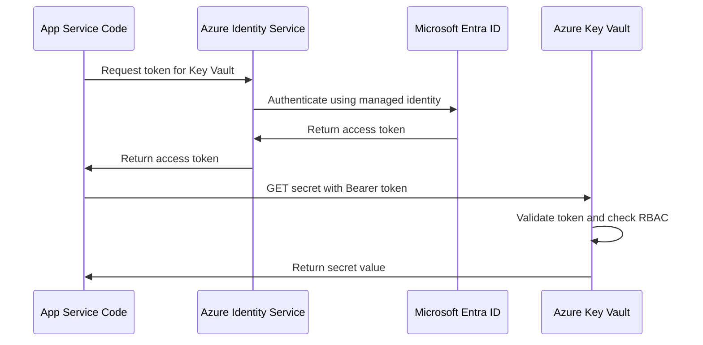

# How to Configure Managed Identity for Azure App Service to Access Key Vault Secrets Without Credentials

Author: [nawazdhandala](https://www.github.com/nawazdhandala)

Tags: Azure, Managed Identity, App Service, Key Vault, Security, Passwordless, Azure RBAC

Description: Learn how to use Azure Managed Identity to let your App Service access Key Vault secrets without storing any credentials in code or configuration.

---

One of the most common security mistakes in cloud applications is storing credentials in configuration files, environment variables, or even source code. Connection strings with passwords, API keys, and storage account keys end up scattered across app settings and deployment pipelines. Azure Managed Identity eliminates this problem entirely by giving your App Service its own identity in Microsoft Entra ID, which can then be granted access to Key Vault without any credentials being stored anywhere.

In this guide, I will show you how to set up managed identity on App Service, grant it Key Vault access, and use it in your application code to retrieve secrets seamlessly.

## How Managed Identity Works

When you enable managed identity on an App Service, Azure creates an identity (a service principal) in your Entra ID tenant that is tied to the lifecycle of the app. The app can request tokens from the Azure Instance Metadata Service (IMDS) endpoint, and Azure handles all the credential management behind the scenes.



There are no credentials to store, no secrets to rotate, and no keys to leak. The identity is automatically managed by Azure.

## Two Types of Managed Identity

Azure offers two types:

**System-assigned managed identity**: Created automatically with the resource and shares its lifecycle. When the App Service is deleted, the identity is deleted too. Each App Service gets exactly one system-assigned identity. This is the most common choice.

**User-assigned managed identity**: Created as a standalone Azure resource. It can be shared across multiple resources and persists independently. Use this when multiple services need the same identity or when you need the identity to outlive the resource.

## Prerequisites

You need:

- An Azure App Service (or Function App, Container App, etc.)
- An Azure Key Vault with secrets to access
- Contributor role on the App Service
- Owner or User Access Administrator role on the Key Vault (to assign RBAC roles)

## Step 1: Enable System-Assigned Managed Identity

### Via the Azure Portal

1. Navigate to your App Service in the Azure portal.
2. Click Identity in the left menu under Settings.
3. On the System assigned tab, toggle the Status to On.
4. Click Save and confirm.
5. Note the Object (principal) ID that appears - you will need it for role assignments.

### Via PowerShell

```powershell
# Enable system-assigned managed identity on an App Service
$app = Set-AzWebApp `
    -ResourceGroupName "myapp-rg" `
    -Name "myapp-webapp" `
    -AssignIdentity $true

# Get the identity principal ID
$principalId = $app.Identity.PrincipalId
Write-Host "Managed Identity enabled."
Write-Host "Principal ID: $principalId"
```

### Via Azure CLI

```bash
# Enable system-assigned managed identity
az webapp identity assign \
    --resource-group myapp-rg \
    --name myapp-webapp

# The output includes the principalId you need for role assignments
```

## Step 2: Grant Key Vault Access Using RBAC

Now give the managed identity permission to read secrets from Key Vault. If your Key Vault uses RBAC authorization (recommended), assign the appropriate role:

```powershell
# Get the managed identity principal ID
$app = Get-AzWebApp -ResourceGroupName "myapp-rg" -Name "myapp-webapp"
$principalId = $app.Identity.PrincipalId

# Assign Key Vault Secrets User role to the managed identity
# This allows the app to read secret values from the vault
New-AzRoleAssignment `
    -ObjectId $principalId `
    -RoleDefinitionName "Key Vault Secrets User" `
    -Scope "/subscriptions/SUB_ID/resourceGroups/myapp-rg/providers/Microsoft.KeyVault/vaults/myapp-keyvault"

Write-Host "Key Vault Secrets User role assigned to the App Service managed identity."
```

If your Key Vault still uses access policies (legacy model):

```powershell
# Grant access via access policy (only if RBAC is not enabled on the vault)
Set-AzKeyVaultAccessPolicy `
    -VaultName "myapp-keyvault" `
    -ObjectId $principalId `
    -PermissionsToSecrets Get, List

Write-Host "Access policy created for managed identity."
```

## Step 3: Use Key Vault References in App Settings

The simplest way to use Key Vault secrets in App Service is through Key Vault references. Instead of putting the actual secret value in an app setting, you put a reference to the Key Vault secret:

### Via the Azure Portal

1. Go to your App Service.
2. Click Configuration under Settings.
3. Click New application setting.
4. For the Name, enter something like `DatabasePassword`.
5. For the Value, use the Key Vault reference syntax:
   ```
   @Microsoft.KeyVault(SecretUri=https://myapp-keyvault.vault.azure.net/secrets/database-password/)
   ```
6. Click OK, then Save.

### Via PowerShell

```powershell
# Set an app setting with a Key Vault reference
# The app reads this setting like any other environment variable
# but the value is pulled from Key Vault at runtime
$appSettings = @{
    "DatabasePassword" = "@Microsoft.KeyVault(SecretUri=https://myapp-keyvault.vault.azure.net/secrets/database-password/)"
    "StorageConnectionString" = "@Microsoft.KeyVault(SecretUri=https://myapp-keyvault.vault.azure.net/secrets/storage-connection-string/)"
    "ApiKey" = "@Microsoft.KeyVault(SecretUri=https://myapp-keyvault.vault.azure.net/secrets/external-api-key/)"
}

Set-AzWebApp `
    -ResourceGroupName "myapp-rg" `
    -Name "myapp-webapp" `
    -AppSettings $appSettings

Write-Host "App settings configured with Key Vault references."
```

You can also reference a specific version of a secret:

```
@Microsoft.KeyVault(SecretUri=https://myapp-keyvault.vault.azure.net/secrets/database-password/abc123def456)
```

Or use the vault name and secret name directly:

```
@Microsoft.KeyVault(VaultName=myapp-keyvault;SecretName=database-password)
```

## Step 4: Verify Key Vault References Are Working

After configuring the references, verify they resolve correctly:

1. Go to your App Service Configuration page.
2. Look at the Source column next to each Key Vault reference.
3. A green checkmark means the reference is resolving correctly.
4. A red X means there is an access issue.

Common reasons for reference failures:

- The managed identity does not have the correct role assignment on the Key Vault
- The secret name is misspelled in the reference
- The Key Vault has firewall rules that block access from the App Service
- The Key Vault uses access policies but the managed identity is not listed

## Step 5: Access Key Vault Programmatically

For scenarios where Key Vault references are not sufficient (like needing to list secrets or work with keys and certificates), access Key Vault directly from code using the Azure SDK.

### .NET Example

```csharp
// Install NuGet packages:
// Azure.Identity
// Azure.Security.KeyVault.Secrets

using Azure.Identity;
using Azure.Security.KeyVault.Secrets;

// The DefaultAzureCredential automatically uses managed identity when running in Azure
// and falls back to developer credentials locally
var credential = new DefaultAzureCredential();
var client = new SecretClient(new Uri("https://myapp-keyvault.vault.azure.net"), credential);

// Retrieve a secret - no credentials needed in code
KeyVaultSecret secret = await client.GetSecretAsync("database-password");
string connectionString = secret.Value;

Console.WriteLine("Secret retrieved successfully.");
```

### Python Example

```python
# Install packages:
# pip install azure-identity azure-keyvault-secrets

from azure.identity import DefaultAzureCredential
from azure.keyvault.secrets import SecretClient

# DefaultAzureCredential uses managed identity in Azure
# and developer credentials (az login) locally
credential = DefaultAzureCredential()
client = SecretClient(
    vault_url="https://myapp-keyvault.vault.azure.net",
    credential=credential
)

# Retrieve the secret without any hardcoded credentials
secret = client.get_secret("database-password")
print(f"Secret retrieved: {secret.name}")
# Use secret.value for the actual secret value
```

### Node.js Example

```javascript
// Install packages:
// npm install @azure/identity @azure/keyvault-secrets

const { DefaultAzureCredential } = require("@azure/identity");
const { SecretClient } = require("@azure/keyvault-secrets");

// Create a credential that uses managed identity in Azure
const credential = new DefaultAzureCredential();
const client = new SecretClient(
    "https://myapp-keyvault.vault.azure.net",
    credential
);

// Retrieve the secret
async function getSecret() {
    const secret = await client.getSecret("database-password");
    console.log(`Secret retrieved: ${secret.name}`);
    // Use secret.value for the actual secret value
}

getSecret();
```

## Step 6: Configure Key Vault Networking for App Service

If your Key Vault has firewall rules enabled, you need to allow access from the App Service:

```powershell
# Get the App Service outbound IP addresses
$app = Get-AzWebApp -ResourceGroupName "myapp-rg" -Name "myapp-webapp"
$outboundIPs = $app.OutboundIpAddresses -split ","

# Add each IP to the Key Vault firewall
foreach ($ip in $outboundIPs) {
    Add-AzKeyVaultNetworkRule `
        -VaultName "myapp-keyvault" `
        -IpAddressRange "$ip/32"
    Write-Host "Added $ip to Key Vault firewall allowlist."
}

# Alternatively, enable the trusted Microsoft services bypass
Update-AzKeyVaultNetworkRuleSet `
    -VaultName "myapp-keyvault" `
    -Bypass AzureServices

Write-Host "Trusted Azure services bypass enabled."
```

For a more secure approach, use VNet integration with the App Service and a private endpoint for the Key Vault. This ensures traffic never leaves the Azure backbone network.

## Step 7: Use User-Assigned Managed Identity (Alternative)

If you need the same identity across multiple services, use a user-assigned managed identity:

```powershell
# Create a user-assigned managed identity
$identity = New-AzUserAssignedIdentity `
    -ResourceGroupName "myapp-rg" `
    -Name "myapp-shared-identity" `
    -Location "eastus"

# Assign it to the App Service
Set-AzWebApp `
    -ResourceGroupName "myapp-rg" `
    -Name "myapp-webapp" `
    -UserAssignedIdentityId $identity.Id

# Grant Key Vault access to the user-assigned identity
New-AzRoleAssignment `
    -ObjectId $identity.PrincipalId `
    -RoleDefinitionName "Key Vault Secrets User" `
    -Scope "/subscriptions/SUB_ID/resourceGroups/myapp-rg/providers/Microsoft.KeyVault/vaults/myapp-keyvault"

Write-Host "User-assigned managed identity configured and Key Vault access granted."
```

When using a user-assigned identity in code, specify the client ID:

```csharp
// Specify the user-assigned identity client ID
var credential = new DefaultAzureCredential(new DefaultAzureCredentialOptions
{
    ManagedIdentityClientId = "USER_ASSIGNED_IDENTITY_CLIENT_ID"
});
```

## Best Practices

- Prefer system-assigned identities unless you have a specific reason to use user-assigned.
- Use Key Vault references in app settings for the simplest integration. No code changes needed.
- Always use `DefaultAzureCredential` in code - it automatically picks the right credential for each environment.
- Assign the most restrictive Key Vault role. Use Secrets User, not Administrator.
- Combine with private endpoints for defense in depth.

## Conclusion

Managed Identity for App Service combined with Azure Key Vault is the gold standard for secret management in Azure. No credentials are stored in code, configuration, or deployment pipelines. The identity is managed entirely by Azure, with automatic credential rotation and no secret sprawl. Whether you use Key Vault references in app settings or the Azure SDK in code, the pattern is the same: enable managed identity, grant the appropriate Key Vault role, and let Azure handle the authentication. Once you adopt this pattern, you will never want to go back to managing connection strings with embedded passwords.
