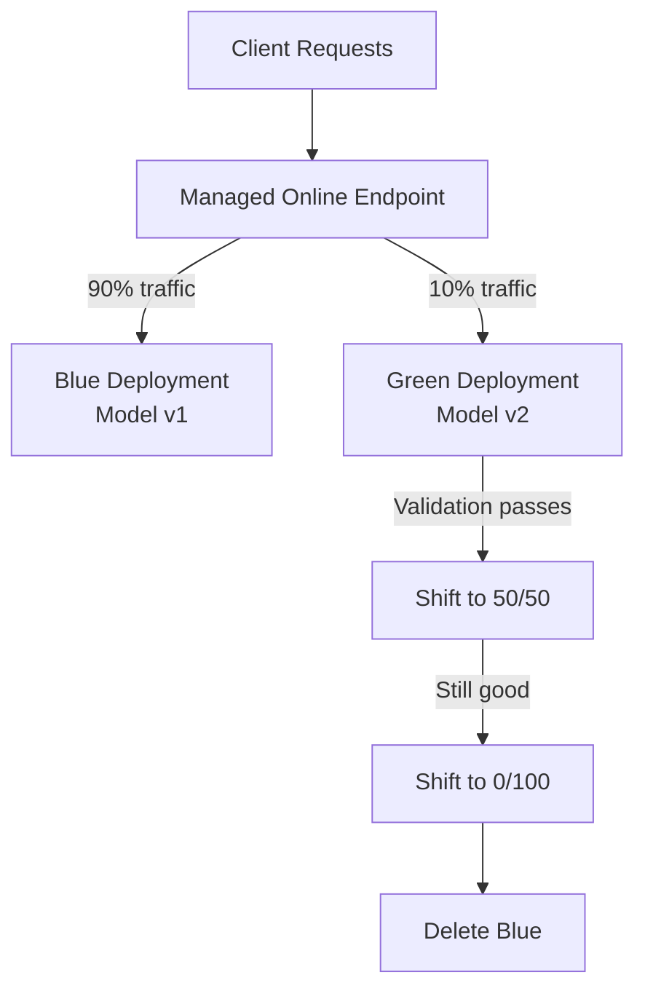

# How to Configure Managed Online Endpoints with Blue-Green Deployment in Azure ML

Author: [nawazdhandala](https://www.github.com/nawazdhandala)

Tags: Azure Machine Learning, Blue-Green Deployment, MLOps, Managed Endpoints, Model Deployment, Inference, Production ML

Description: Set up managed online endpoints in Azure Machine Learning with blue-green deployment for safe, zero-downtime model updates in production.

---

Deploying a machine learning model to production is one thing. Updating it safely without breaking anything is another. Blue-green deployment is a pattern where you run two versions of your model simultaneously and gradually shift traffic from the old version (blue) to the new version (green). If something goes wrong, you roll back instantly by routing all traffic back to blue.

Azure Machine Learning's managed online endpoints support this pattern natively. You can create multiple deployments under a single endpoint, assign traffic percentages to each, and shift traffic gradually. The endpoint handles load balancing, scaling, and health monitoring for you.

## How Blue-Green Deployment Works

The concept is simple:

1. You have a live endpoint serving traffic with the current model (blue deployment)
2. You deploy the new model version as a separate deployment (green deployment) under the same endpoint
3. You send a small percentage of traffic (say 10%) to green for validation
4. If green performs well, you gradually increase its traffic share to 100%
5. Once green handles all traffic, you delete the blue deployment



## Prerequisites

- An Azure Machine Learning workspace
- Azure CLI with the `ml` extension installed
- A trained model registered in the Azure ML model registry
- Python environment with `azure-ai-ml` SDK

```bash
# Install the Azure ML CLI extension
az extension add --name ml

# Install the Python SDK
pip install azure-ai-ml azure-identity
```

## Step 1: Create the Managed Online Endpoint

An endpoint is the stable URL that clients call. Deployments sit behind the endpoint and handle the actual inference.

```yaml
# endpoint.yml - Endpoint definition
$schema: https://azuremlschemas.azureedge.net/latest/managedOnlineEndpoint.schema.json
name: fraud-detection-endpoint
auth_mode: key
```

Create the endpoint:

```bash
# Create the managed online endpoint
az ml online-endpoint create \
    --name fraud-detection-endpoint \
    --resource-group rg-ml \
    --workspace-name ws-production \
    -f endpoint.yml
```

## Step 2: Deploy the Blue (Current) Deployment

Create the initial deployment with your current model version.

First, create a scoring script that your model will use for inference:

```python
# score.py - Scoring script for the fraud detection model
import json
import joblib
import numpy as np
import os

def init():
    """Load the model when the deployment starts."""
    global model
    # The model path is set by Azure ML based on the registered model
    model_path = os.path.join(os.getenv("AZUREML_MODEL_DIR"), "model.pkl")
    model = joblib.load(model_path)
    print(f"Model loaded from {model_path}")

def run(raw_data):
    """Process a prediction request."""
    try:
        # Parse the input data
        data = json.loads(raw_data)
        features = np.array(data["features"])

        # Run prediction
        predictions = model.predict(features)
        probabilities = model.predict_proba(features)

        return {
            "predictions": predictions.tolist(),
            "probabilities": probabilities.tolist()
        }
    except Exception as e:
        return {"error": str(e)}
```

Define the blue deployment:

```yaml
# blue-deployment.yml - Blue deployment configuration
$schema: https://azuremlschemas.azureedge.net/latest/managedOnlineDeployment.schema.json
name: blue
endpoint_name: fraud-detection-endpoint
model:
  path: ./model/           # Path to the model files
  # Or reference a registered model:
  # name: fraud-detection-model
  # version: 1
code_configuration:
  code: ./src/             # Directory containing score.py
  scoring_script: score.py
environment:
  conda_file: ./env/conda.yml
  image: mcr.microsoft.com/azureml/openmpi4.1.0-ubuntu20.04:latest
instance_type: Standard_DS3_v2
instance_count: 2          # Start with 2 instances for redundancy
```

Create the conda environment file:

```yaml
# conda.yml - Python environment for the deployment
name: fraud-detection-env
channels:
  - conda-forge
dependencies:
  - python=3.10
  - pip
  - pip:
    - scikit-learn==1.3.0
    - numpy==1.24.0
    - joblib==1.3.0
    - inference-schema
```

Deploy blue and route all traffic to it:

```bash
# Create the blue deployment
az ml online-deployment create \
    --name blue \
    --endpoint-name fraud-detection-endpoint \
    --resource-group rg-ml \
    --workspace-name ws-production \
    -f blue-deployment.yml

# Route 100% of traffic to blue
az ml online-endpoint update \
    --name fraud-detection-endpoint \
    --resource-group rg-ml \
    --workspace-name ws-production \
    --traffic "blue=100"
```

## Step 3: Test the Blue Deployment

Verify that the blue deployment is working correctly:

```bash
# Test with sample data
az ml online-endpoint invoke \
    --name fraud-detection-endpoint \
    --resource-group rg-ml \
    --workspace-name ws-production \
    --request-file sample-request.json
```

Where `sample-request.json` contains:

```json
{
    "features": [[0.5, 1.2, 3.4, 0.8, 2.1, 0.3, 1.7, 4.2, 0.9, 1.1]]
}
```

## Step 4: Deploy the Green (New) Deployment

Now deploy the updated model as the green deployment. This could be a retrained model, a different algorithm, or the same model with updated preprocessing.

```yaml
# green-deployment.yml - Green deployment with the new model version
$schema: https://azuremlschemas.azureedge.net/latest/managedOnlineDeployment.schema.json
name: green
endpoint_name: fraud-detection-endpoint
model:
  name: fraud-detection-model
  version: 2               # New model version
code_configuration:
  code: ./src/
  scoring_script: score.py
environment:
  conda_file: ./env/conda.yml
  image: mcr.microsoft.com/azureml/openmpi4.1.0-ubuntu20.04:latest
instance_type: Standard_DS3_v2
instance_count: 2
```

```bash
# Create the green deployment (no traffic yet)
az ml online-deployment create \
    --name green \
    --endpoint-name fraud-detection-endpoint \
    --resource-group rg-ml \
    --workspace-name ws-production \
    -f green-deployment.yml
```

## Step 5: Test Green Before Routing Traffic

Before sending any production traffic to green, test it directly using the deployment-specific header:

```bash
# Test the green deployment directly (bypassing traffic routing)
az ml online-endpoint invoke \
    --name fraud-detection-endpoint \
    --deployment-name green \
    --resource-group rg-ml \
    --workspace-name ws-production \
    --request-file sample-request.json
```

You can also test programmatically:

```python
# test_green.py - Programmatic testing of the green deployment
from azure.ai.ml import MLClient
from azure.identity import DefaultAzureCredential

# Connect to the Azure ML workspace
ml_client = MLClient(
    DefaultAzureCredential(),
    subscription_id="your-subscription-id",
    resource_group_name="rg-ml",
    workspace_name="ws-production"
)

# Invoke the green deployment directly
response = ml_client.online_endpoints.invoke(
    endpoint_name="fraud-detection-endpoint",
    deployment_name="green",  # Target the green deployment specifically
    request_file="sample-request.json"
)

print(f"Green deployment response: {response}")
```

## Step 6: Gradually Shift Traffic

Start sending a small percentage of traffic to green:

```bash
# Send 10% of traffic to green, 90% stays on blue
az ml online-endpoint update \
    --name fraud-detection-endpoint \
    --resource-group rg-ml \
    --workspace-name ws-production \
    --traffic "blue=90 green=10"
```

Monitor the performance of both deployments. Check metrics like latency, error rates, and prediction quality. Azure ML provides built-in monitoring through the endpoint metrics.

```bash
# Check endpoint metrics
az ml online-endpoint show \
    --name fraud-detection-endpoint \
    --resource-group rg-ml \
    --workspace-name ws-production
```

If green looks good after the initial 10%, increase to 50/50:

```bash
# Shift to 50/50 traffic split
az ml online-endpoint update \
    --name fraud-detection-endpoint \
    --resource-group rg-ml \
    --workspace-name ws-production \
    --traffic "blue=50 green=50"
```

If everything is still healthy, shift all traffic to green:

```bash
# Move all traffic to green
az ml online-endpoint update \
    --name fraud-detection-endpoint \
    --resource-group rg-ml \
    --workspace-name ws-production \
    --traffic "blue=0 green=100"
```

## Step 7: Clean Up the Blue Deployment

Once green is handling all traffic and you are confident it is stable, delete the blue deployment to stop paying for its compute:

```bash
# Delete the old blue deployment
az ml online-deployment delete \
    --name blue \
    --endpoint-name fraud-detection-endpoint \
    --resource-group rg-ml \
    --workspace-name ws-production \
    --yes
```

## Rolling Back

If green starts showing issues at any point during the traffic shift, roll back immediately:

```bash
# Rollback: send all traffic back to blue
az ml online-endpoint update \
    --name fraud-detection-endpoint \
    --resource-group rg-ml \
    --workspace-name ws-production \
    --traffic "blue=100 green=0"
```

This takes effect within seconds because both deployments are already running and warmed up. There is no cold start penalty for the rollback.

## Automating with Python SDK

For CI/CD pipelines, automate the entire blue-green process with the Azure ML Python SDK:

```python
# automate_deployment.py - Automated blue-green deployment pipeline
from azure.ai.ml import MLClient
from azure.ai.ml.entities import (
    ManagedOnlineDeployment,
    ManagedOnlineEndpoint,
    Model,
    Environment,
    CodeConfiguration
)
from azure.identity import DefaultAzureCredential
import time

ml_client = MLClient(
    DefaultAzureCredential(),
    subscription_id="your-sub-id",
    resource_group_name="rg-ml",
    workspace_name="ws-production"
)

endpoint_name = "fraud-detection-endpoint"

# Define the green deployment
green_deployment = ManagedOnlineDeployment(
    name="green",
    endpoint_name=endpoint_name,
    model=Model(path="./model-v2/"),
    code_configuration=CodeConfiguration(
        code="./src/",
        scoring_script="score.py"
    ),
    environment=Environment(
        conda_file="./env/conda.yml",
        image="mcr.microsoft.com/azureml/openmpi4.1.0-ubuntu20.04:latest"
    ),
    instance_type="Standard_DS3_v2",
    instance_count=2
)

# Create the green deployment
print("Creating green deployment...")
ml_client.online_deployments.begin_create_or_update(green_deployment).result()

# Gradually shift traffic in stages
traffic_stages = [
    {"blue": 90, "green": 10},
    {"blue": 50, "green": 50},
    {"blue": 0, "green": 100}
]

for stage in traffic_stages:
    print(f"Shifting traffic to: {stage}")
    endpoint = ml_client.online_endpoints.get(endpoint_name)
    endpoint.traffic = stage
    ml_client.online_endpoints.begin_create_or_update(endpoint).result()

    # Wait and monitor (in production, check actual metrics here)
    print("Monitoring for 5 minutes...")
    time.sleep(300)

print("Blue-green deployment complete!")
```

## Summary

Blue-green deployment with Azure ML managed online endpoints gives you a safe path for updating production models. The key is that both versions run simultaneously, traffic shifts are instant and reversible, and you can validate the new model with real production traffic before committing. This pattern significantly reduces the risk of model updates and gives your team confidence that they can iterate quickly without breaking production inference.
