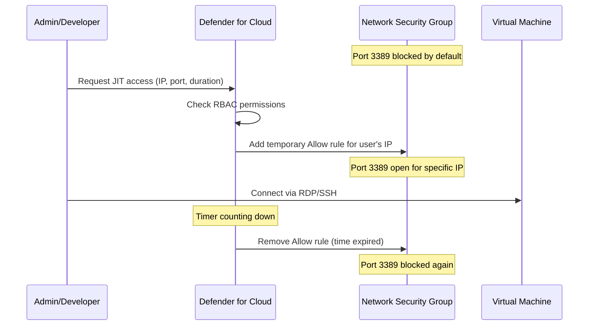
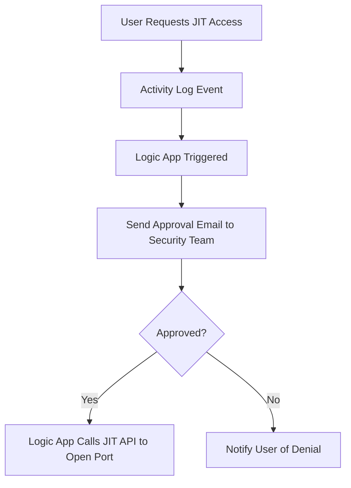

# How to Configure Microsoft Defender for Cloud Just-in-Time VM Access to Reduce Attack Surface

Author: [nawazdhandala](https://www.github.com/nawazdhandala)

Tags: Azure, Microsoft Defender, Just-in-Time Access, VM Security, Network Security, Attack Surface Reduction, Zero Trust

Description: Learn how to configure Just-in-Time VM access in Microsoft Defender for Cloud to lock down management ports and only open them when needed for a limited time.

---

Leaving SSH port 22 or RDP port 3389 open to the internet on your virtual machines is like leaving your front door unlocked all day because you might need to come home at some point. Just-in-Time (JIT) VM access in Microsoft Defender for Cloud solves this by keeping management ports closed by default and only opening them for specific IP addresses, for a limited time, when an authorized user requests access. When the time window expires, the port closes automatically.

In this post, I will walk through setting up JIT access, configuring the policies, and show how the request and approval workflow works in practice.

## How JIT VM Access Works

JIT access works by managing the Network Security Group (NSG) rules on your VMs. Here is the workflow:



The key points:

1. Management ports are blocked by deny rules in the NSG at all times.
2. When access is requested and approved, a temporary allow rule is inserted with higher priority than the deny rule.
3. The allow rule is scoped to the requesting user's IP address.
4. When the time window expires (or when the user manually closes the access), the allow rule is automatically removed.

## Prerequisites

- Microsoft Defender for Servers Plan 2 enabled on the subscription (JIT requires this plan).
- NSGs attached to the VMs or their subnets.
- The user requesting access needs at least the Reader role on the VM and a role with `Microsoft.Security/locations/jitNetworkAccessPolicies/initiate/action` permission.

## Step 1: Enable JIT Access on Your VMs

You can enable JIT on individual VMs or across your environment. Let us start with the portal approach and then show the programmatic method.

In the Azure portal, navigate to Microsoft Defender for Cloud, then go to Workload protections, then Just-in-time VM access. You will see three tabs:

- **Configured** - VMs that already have JIT enabled.
- **Not configured** - VMs that are eligible for JIT but do not have it set up.
- **Unsupported** - VMs that cannot use JIT (usually because they do not have an NSG).

Select the VMs you want to protect from the "Not configured" tab and click "Enable JIT on VMs."

For programmatic setup, use the REST API or Azure CLI. This script enables JIT on a specific VM with a custom port configuration:

```bash
# Enable JIT access on a VM with custom port rules
# This configures which ports can be requested and their maximum allowed time
az rest --method PUT \
  --url "https://management.azure.com/subscriptions/<sub-id>/resourceGroups/rg-production/providers/Microsoft.Security/locations/eastus/jitNetworkAccessPolicies/default?api-version=2020-01-01" \
  --body '{
    "kind": "Basic",
    "properties": {
      "virtualMachines": [
        {
          "id": "/subscriptions/<sub-id>/resourceGroups/rg-production/providers/Microsoft.Compute/virtualMachines/vm-web-01",
          "ports": [
            {
              "number": 22,
              "protocol": "TCP",
              "allowedSourceAddressPrefix": "*",
              "maxRequestAccessDuration": "PT3H"
            },
            {
              "number": 3389,
              "protocol": "TCP",
              "allowedSourceAddressPrefix": "*",
              "maxRequestAccessDuration": "PT3H"
            },
            {
              "number": 5985,
              "protocol": "TCP",
              "allowedSourceAddressPrefix": "*",
              "maxRequestAccessDuration": "PT1H"
            }
          ]
        }
      ]
    }
  }'
```

The `maxRequestAccessDuration` field uses ISO 8601 duration format. `PT3H` means 3 hours maximum. I recommend keeping this as short as practical for your workflows - 1 to 3 hours is usually sufficient for troubleshooting sessions.

## Step 2: Configure JIT Policy Per Port

You can customize the JIT policy for each port to control:

- **Maximum request duration** - The longest time window a user can request.
- **Allowed source addresses** - Restrict which IP ranges can be used. For example, you might only allow your corporate VPN range.
- **Protocol** - TCP, UDP, or both.

Here is a more restrictive configuration that limits SSH access to corporate IP ranges and sets a shorter maximum duration:

```bash
# More restrictive JIT policy
# SSH only from corporate networks, RDP only from specific admin subnet
az rest --method PUT \
  --url "https://management.azure.com/subscriptions/<sub-id>/resourceGroups/rg-production/providers/Microsoft.Security/locations/eastus/jitNetworkAccessPolicies/default?api-version=2020-01-01" \
  --body '{
    "kind": "Basic",
    "properties": {
      "virtualMachines": [
        {
          "id": "/subscriptions/<sub-id>/resourceGroups/rg-production/providers/Microsoft.Compute/virtualMachines/vm-web-01",
          "ports": [
            {
              "number": 22,
              "protocol": "TCP",
              "allowedSourceAddressPrefix": "203.0.113.0/24",
              "maxRequestAccessDuration": "PT1H"
            },
            {
              "number": 3389,
              "protocol": "TCP",
              "allowedSourceAddressPrefix": "10.0.5.0/24",
              "maxRequestAccessDuration": "PT2H"
            }
          ]
        }
      ]
    }
  }'
```

## Step 3: Request JIT Access

When you need to access a VM, you request JIT access through the portal, CLI, or API.

Through the portal: Go to the VM's Connect page. If JIT is enabled, you will see a "Request access" button instead of the usual connect options. Click it, specify your IP address and the duration you need, and submit.

Through the CLI, this script requests access for a specific port and duration:

```bash
# Request JIT access for SSH from your current IP for 1 hour
MY_IP=$(curl -s https://api.ipify.org)

az rest --method POST \
  --url "https://management.azure.com/subscriptions/<sub-id>/resourceGroups/rg-production/providers/Microsoft.Security/locations/eastus/jitNetworkAccessPolicies/default/initiate?api-version=2020-01-01" \
  --body "{
    \"virtualMachines\": [
      {
        \"id\": \"/subscriptions/<sub-id>/resourceGroups/rg-production/providers/Microsoft.Compute/virtualMachines/vm-web-01\",
        \"ports\": [
          {
            \"number\": 22,
            \"allowedSourceAddressPrefix\": \"$MY_IP\",
            \"endTimeUtc\": \"$(date -u -v+1H '+%Y-%m-%dT%H:%M:%S.0000000Z')\"
          }
        ]
      }
    ]
  }"

echo "JIT access granted from $MY_IP for 1 hour"
```

## Step 4: Set Up Approval Workflow (Optional)

By default, anyone with the right RBAC permissions can request and immediately get JIT access. For higher-security environments, you might want an approval workflow where a security team member must approve the request before the port opens.

You can implement this using Azure Logic Apps triggered by JIT request events.

The general flow looks like this:



To implement this, create an Activity Log alert that triggers when a JIT request is initiated, and connect it to a Logic App with an approval action.

## Step 5: Monitor JIT Access Activity

Track who is requesting access, when, and for how long. This is essential for audit trails and for detecting unusual access patterns.

This KQL query shows JIT access activity over the past 30 days:

```kusto
// Monitor JIT access requests and their outcomes
AzureActivity
| where TimeGenerated > ago(30d)
| where OperationNameValue contains "jitNetworkAccessPolicies"
| extend
    RequestDetails = parse_json(Properties)
| project
    TimeGenerated,
    CallerIpAddress,
    Caller,
    OperationNameValue,
    ActivityStatusValue,
    ResourceGroup
| order by TimeGenerated desc
```

You can also query the JIT policy to see currently active access windows:

```bash
# List all active JIT requests
az rest --method GET \
  --url "https://management.azure.com/subscriptions/<sub-id>/resourceGroups/rg-production/providers/Microsoft.Security/locations/eastus/jitNetworkAccessPolicies?api-version=2020-01-01" \
  --query "value[].properties.virtualMachines[].{vm:id, ports:ports}"
```

## Step 6: Automate JIT for CI/CD Pipelines

If your deployment pipelines need to SSH into VMs (for example, to run deployment scripts), you can automate JIT requests as a pipeline step.

This GitHub Actions step requests JIT access before deploying:

```yaml
# Step in a deployment workflow that requests JIT access
- name: Request JIT Access for Deployment
  run: |
    # Get the runner's public IP
    RUNNER_IP=$(curl -s https://api.ipify.org)

    # Calculate end time (30 minutes from now)
    END_TIME=$(date -u -d "+30 minutes" '+%Y-%m-%dT%H:%M:%S.0000000Z')

    # Request JIT access
    az rest --method POST \
      --url "https://management.azure.com/subscriptions/${{ vars.AZURE_SUBSCRIPTION_ID }}/resourceGroups/rg-production/providers/Microsoft.Security/locations/eastus/jitNetworkAccessPolicies/default/initiate?api-version=2020-01-01" \
      --body "{
        \"virtualMachines\": [{
          \"id\": \"/subscriptions/${{ vars.AZURE_SUBSCRIPTION_ID }}/resourceGroups/rg-production/providers/Microsoft.Compute/virtualMachines/vm-web-01\",
          \"ports\": [{
            \"number\": 22,
            \"allowedSourceAddressPrefix\": \"$RUNNER_IP\",
            \"endTimeUtc\": \"$END_TIME\"
          }]
        }]
      }"

    # Wait for NSG rule to propagate
    sleep 15

- name: Deploy Application
  run: |
    # SSH connection will now work through the JIT-opened port
    ssh deploy@vm-web-01 "cd /app && ./deploy.sh"
```

## Best Practices

**Keep maximum durations short.** 1-3 hours is plenty for most administrative tasks. If someone needs longer, they can request again.

**Use the most restrictive source IP.** Always use specific IPs rather than wildcards. The user's current IP should be auto-detected in most request flows.

**Enable JIT on all internet-facing VMs.** Even VMs behind a load balancer should have JIT on their management ports as defense in depth.

**Do not bypass JIT with NSG rules.** If someone manually adds an allow rule for port 22 in the NSG, it defeats the purpose. Use Azure Policy to prevent manual creation of allow rules for management ports.

**Review access logs regularly.** Look for patterns like frequent after-hours access or access from unusual locations that might indicate credential compromise.

**Consider Azure Bastion as a complement.** Azure Bastion provides browser-based RDP/SSH access without exposing management ports at all. JIT and Bastion work well together - use Bastion as the primary access method and JIT as a fallback for direct connectivity needs.

## Wrapping Up

Just-in-Time VM access is one of the simplest and most effective security improvements you can make in Azure. It takes an always-open attack surface and turns it into a narrowly scoped, time-limited access window. The setup takes minutes, it works with your existing NSGs, and it provides a clear audit trail of every access request. If your VMs have management ports open right now - even if they are filtered to specific IP ranges - JIT adds a meaningful additional layer of protection that costs nothing extra beyond the Defender for Servers plan you should already have enabled.
