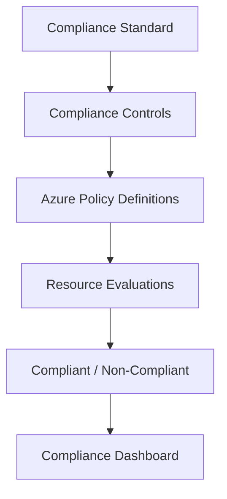

# How to Configure Microsoft Defender for Cloud Regulatory Compliance Assessments Against Custom Benchmarks

Author: [nawazdhandala](https://www.github.com/nawazdhandala)

Tags: Azure, Microsoft Defender, Compliance, Regulatory, Security Benchmarks, Governance, Cloud Security

Description: Learn how to configure Microsoft Defender for Cloud to assess your Azure environment against custom compliance benchmarks and generate audit-ready compliance reports.

---

Regulatory compliance is not optional for most organizations. Whether you need to meet PCI DSS for payment processing, HIPAA for healthcare data, SOC 2 for SaaS products, or an industry-specific framework, you need a way to continuously assess your Azure environment against these standards. Microsoft Defender for Cloud provides a regulatory compliance dashboard that maps Azure security recommendations to compliance controls.

While Defender for Cloud includes many standard benchmarks out of the box, most organizations also need to track compliance against their own internal standards or benchmarks that are not in the built-in library. This guide covers both: using built-in benchmarks and creating custom ones.

## Understanding the Compliance Architecture

Defender for Cloud's regulatory compliance feature works by mapping security recommendations (powered by Azure Policy) to compliance controls. Each compliance control (like "Encrypt data at rest" or "Require MFA for privileged accounts") maps to one or more Azure Policy evaluations.



For example, a PCI DSS control for "Protect stored cardholder data" might map to:
- Azure Policy: "Storage accounts should use customer-managed keys"
- Azure Policy: "Transparent data encryption on SQL databases should be enabled"
- Azure Policy: "Azure Cosmos DB accounts should use customer-managed keys"

If all mapped policies are compliant, the control is marked as passed.

## Prerequisites

- Microsoft Defender for Cloud with at least the Foundational CSPM plan (some features require the Defender CSPM plan)
- Security Admin or Compliance Admin role on the subscription
- Azure Policy Contributor role (for creating custom initiatives)

## Step 1: Enable Built-In Regulatory Standards

Defender for Cloud includes several built-in standards:

- Azure Security Benchmark (enabled by default)
- PCI DSS v4.0
- HIPAA/HITRUST
- SOC 2 Type 2
- NIST SP 800-53
- ISO 27001
- CIS Azure Foundations Benchmark
- CMMC Level 3

To add a standard, go to Defender for Cloud, then Regulatory Compliance, then Manage Compliance Policies. Select your subscription and click "Add more standards."

Using Azure CLI:

```bash
# List available regulatory compliance standards
az security regulatory-compliance-standards list \
  --query "[].{Name:name, State:state}" \
  --output table

# Enable a specific standard (e.g., PCI DSS v4)
az security regulatory-compliance-standard update \
  --name "PCI-DSS-4" \
  --state "Passed"
```

Alternatively, you can enable standards by assigning the corresponding Azure Policy initiative:

```bash
# Assign the PCI DSS v4 initiative to a subscription
# This both enables the standard and starts evaluating compliance
az policy assignment create \
  --name "pci-dss-v4-compliance" \
  --display-name "PCI DSS v4 Compliance Assessment" \
  --policy-set-definition "/providers/Microsoft.Authorization/policySetDefinitions/c676748e-3af9-4e22-bc28-50feed564afb" \
  --scope "/subscriptions/{sub-id}" \
  --enforcement-mode "DoNotEnforce"
```

Note the `DoNotEnforce` mode. This means the policies only audit - they do not block deployments. For compliance assessment, you almost always want audit-only mode.

## Step 2: Create a Custom Compliance Standard

When your organization has internal security standards that go beyond the built-in benchmarks, you create a custom standard by building a custom Azure Policy initiative and registering it with Defender for Cloud.

First, define your controls and map them to Azure Policy definitions. Here is an example for a custom "Organization Security Standard v1":

```json
{
  // Custom policy initiative for internal security standard
  "properties": {
    "displayName": "Organization Security Standard v1",
    "description": "Internal security requirements for all Azure workloads",
    "policyType": "Custom",
    "metadata": {
      "category": "Regulatory Compliance",
      // This metadata structure is required for Defender for Cloud
      // to recognize the initiative as a compliance standard
      "ASC": {
        "complianceStandard": {
          "displayName": "Organization Security Standard v1",
          "version": "1.0"
        }
      }
    },
    "policyDefinitionGroups": [
      {
        "name": "ORG-1.1",
        "displayName": "ORG-1.1: All data must be encrypted at rest",
        "category": "Data Protection"
      },
      {
        "name": "ORG-1.2",
        "displayName": "ORG-1.2: Network access must be restricted to private endpoints",
        "category": "Network Security"
      },
      {
        "name": "ORG-2.1",
        "displayName": "ORG-2.1: All privileged accounts must use MFA",
        "category": "Identity"
      },
      {
        "name": "ORG-2.2",
        "displayName": "ORG-2.2: Guest accounts with privileged roles should be removed",
        "category": "Identity"
      },
      {
        "name": "ORG-3.1",
        "displayName": "ORG-3.1: Diagnostic logs must be enabled on all services",
        "category": "Monitoring"
      }
    ],
    "policyDefinitions": [
      {
        "policyDefinitionId": "/providers/Microsoft.Authorization/policyDefinitions/6fac406b-40ca-413b-bf8e-0bf964659c25",
        "policyDefinitionReferenceId": "storageEncryption",
        "groupNames": ["ORG-1.1"]
      },
      {
        "policyDefinitionId": "/providers/Microsoft.Authorization/policyDefinitions/0049a6b3-a662-4f3e-8635-39cf44ace45a",
        "policyDefinitionReferenceId": "sqlEncryption",
        "groupNames": ["ORG-1.1"]
      },
      {
        "policyDefinitionId": "/providers/Microsoft.Authorization/policyDefinitions/6edd7eda-6dd8-40f7-810d-67160c639cd9",
        "policyDefinitionReferenceId": "storagePrivateLink",
        "groupNames": ["ORG-1.2"]
      },
      {
        "policyDefinitionId": "/providers/Microsoft.Authorization/policyDefinitions/931e118d-50a1-4457-a5e4-78550e086c52",
        "policyDefinitionReferenceId": "mfaForOwners",
        "groupNames": ["ORG-2.1"]
      },
      {
        "policyDefinitionId": "/providers/Microsoft.Authorization/policyDefinitions/b0f33259-77d7-4c9e-aac6-3aabcfae693c",
        "policyDefinitionReferenceId": "removeGuestOwners",
        "groupNames": ["ORG-2.2"]
      }
    ]
  }
}
```

Create the custom initiative:

```bash
# Create the custom policy initiative
az policy set-definition create \
  --name "org-security-standard-v1" \
  --display-name "Organization Security Standard v1" \
  --description "Internal security requirements for all Azure workloads" \
  --definitions @policy-definitions.json \
  --definition-groups @policy-groups.json \
  --metadata '{"category": "Regulatory Compliance"}' \
  --subscription "{sub-id}"
```

## Step 3: Register the Custom Standard with Defender for Cloud

After creating the initiative, assign it to your subscription. Defender for Cloud will automatically pick it up and display it in the Regulatory Compliance dashboard.

```bash
# Assign the custom initiative to the subscription
az policy assignment create \
  --name "org-security-standard-v1-assessment" \
  --display-name "Org Security Standard v1 Assessment" \
  --policy-set-definition "org-security-standard-v1" \
  --scope "/subscriptions/{sub-id}" \
  --enforcement-mode "DoNotEnforce"
```

After assignment, go to Defender for Cloud, then Regulatory Compliance. Your custom standard should appear in the list. It may take up to 24 hours for the initial compliance evaluation to complete.

## Step 4: Review Compliance Dashboard

The compliance dashboard shows:

- **Overall compliance percentage** for each standard
- **Per-control compliance status** (passed, failed, not applicable)
- **Non-compliant resources** for each failed control
- **Remediation guidance** for each recommendation

Each control shows the number of passed and failed assessments. Click on a failed control to see which specific resources are non-compliant and what needs to be fixed.

## Step 5: Generate Compliance Reports

For auditors, you need exportable reports. Defender for Cloud supports PDF and CSV export from the compliance dashboard.

Click "Download report" in the Regulatory Compliance view. Select:

- The standard you want to report on
- The date range
- The format (PDF for presentation, CSV for detailed analysis)

The PDF report includes an executive summary with the compliance percentage, a breakdown by control domain, and details of each non-compliant finding.

For automated report generation, use the REST API:

```bash
# Export regulatory compliance data via REST API
az rest --method GET \
  --uri "https://management.azure.com/subscriptions/{sub-id}/providers/Microsoft.Security/regulatoryComplianceStandards/org-security-standard-v1/regulatoryComplianceControls?api-version=2019-01-01-preview" \
  --query "value[].{Control:name, State:properties.state, PassedAssessments:properties.passedAssessments, FailedAssessments:properties.failedAssessments}"
```

## Step 6: Set Up Continuous Export

For continuous compliance monitoring, configure Defender for Cloud to export compliance data to a Log Analytics workspace or Event Hub:

```bash
# Configure continuous export of regulatory compliance data
# This sends compliance state changes to Log Analytics
az security automation create \
  --name "compliance-export" \
  --resource-group myResourceGroup \
  --location eastus \
  --scopes "[{\"description\":\"Subscription\",\"scopePath\":\"/subscriptions/{sub-id}\"}]" \
  --sources "[{\"eventSource\":\"RegulatoryComplianceAssessment\",\"ruleSets\":[]}]" \
  --actions "[{\"actionType\":\"LogAnalytics\",\"logAnalyticsResourceId\":\"/subscriptions/{sub-id}/resourceGroups/{rg}/providers/Microsoft.OperationalInsights/workspaces/myWorkspace\",\"workspaceResourceId\":\"/subscriptions/{sub-id}/resourceGroups/{rg}/providers/Microsoft.OperationalInsights/workspaces/myWorkspace\"}]"
```

Then query the exported data in Log Analytics:

```
// Track compliance status changes over time
SecurityRegulatoryCompliance
| where TimeGenerated > ago(30d)
| where ComplianceStandard == "org-security-standard-v1"
| summarize
    LatestState = arg_max(TimeGenerated, State),
    StateChanges = dcount(State)
    by ComplianceControl
| order by LatestState asc
```

## Step 7: Create Exemptions for Accepted Risks

Not every non-compliant finding needs remediation. Some are accepted risks with compensating controls. Create exemptions for these:

```bash
# Create a compliance exemption for an accepted risk
az policy exemption create \
  --name "legacy-db-encryption-exemption" \
  --policy-assignment "org-security-standard-v1-assessment" \
  --policy-definition-reference-id "sqlEncryption" \
  --exemption-category "Waiver" \
  --description "Legacy database cannot support CMK. Compensating control: network isolation via private endpoint. Approved by CISO 2026-01-15" \
  --expires-on "2026-12-31" \
  --scope "/subscriptions/{sub-id}/resourceGroups/{rg}/providers/Microsoft.Sql/servers/legacydb"
```

Exemptions appear in the compliance dashboard with their justification. This is what auditors want to see - acknowledged findings with documented compensating controls and expiration dates.

## Mapping Controls Across Multiple Standards

Many compliance controls overlap across standards. "Encrypt data at rest" appears in PCI DSS, HIPAA, SOC 2, and probably your internal standard. Instead of duplicating policies, use the same policy definitions in multiple initiatives with different group mappings.

This means fixing a non-compliant resource can satisfy controls across multiple standards simultaneously.

## Best Practices

- Start with the Azure Security Benchmark since it is the most comprehensive baseline and maps to most other standards.
- Do not enable standards you do not need. Each standard generates assessments that can create noise.
- Use the `DoNotEnforce` mode for compliance initiatives. You want to measure compliance, not block deployments through the compliance initiative.
- Set up exemptions with expiration dates and review them quarterly.
- Automate report generation for recurring audit cycles. Set up a Logic App that generates and emails compliance reports monthly.
- Track compliance trends over time by exporting to Log Analytics. Point-in-time snapshots are useful, but trends show whether you are improving.
- Assign a compliance owner for each control domain who is responsible for remediation.

## Summary

Microsoft Defender for Cloud's regulatory compliance dashboard gives you continuous visibility into your compliance posture. Enable the built-in standards you need, create custom initiatives for internal requirements, map your controls to Azure Policy definitions, and use the dashboard to track compliance, generate reports, and manage exemptions. The combination of continuous assessment and exportable reporting makes compliance a living process rather than a periodic scramble before audits.
