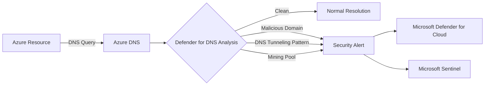
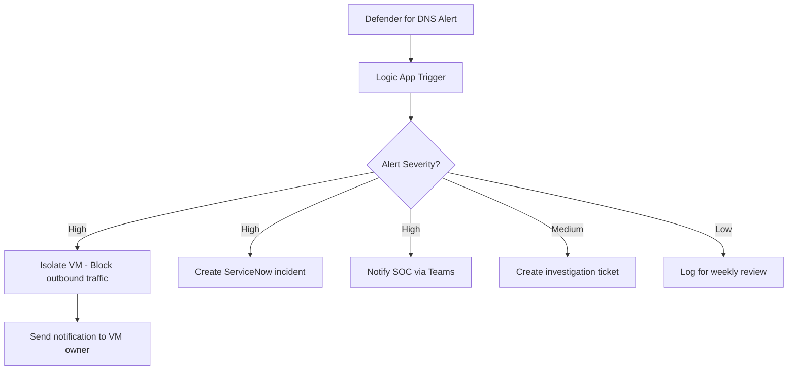

# How to Configure Microsoft Defender for DNS to Detect Communication with Malicious Domains

Author: [nawazdhandala](https://www.github.com/nawazdhandala)

Tags: Azure, Microsoft Defender, DNS Security, Threat Detection, Malicious Domains, Network Security, Cloud Security

Description: Learn how to enable and configure Microsoft Defender for DNS to detect when Azure resources communicate with known malicious domains and command-and-control servers.

---

DNS is the backbone of almost every network communication, and that makes it one of the most valuable signals for detecting malicious activity. When a compromised VM reaches out to a command-and-control server, it starts with a DNS query. When malware tries to exfiltrate data through DNS tunneling, it generates distinctive query patterns. When a phishing campaign directs traffic to a newly registered domain, the DNS resolution is the first observable event.

Microsoft Defender for DNS analyzes all DNS queries originating from your Azure resources and flags communications with known malicious domains, suspicious query patterns, and anomalous DNS behaviors. In this post, I will walk through enabling Defender for DNS, understanding what it detects, and configuring your response workflow.

## What Defender for DNS Detects

Defender for DNS uses Microsoft's threat intelligence and behavioral analytics to detect several categories of DNS threats:

**Communication with known malicious domains** - Queries to domains associated with malware, botnets, phishing campaigns, or other malicious infrastructure.

**DNS tunneling** - Abnormal DNS query patterns that suggest data is being encoded in DNS requests or responses to bypass network controls.

**Communication with cryptocurrency mining pools** - DNS queries to known mining pool domains, which often indicate cryptojacking.

**Communication with domains linked to digital currency mining** - Similar to above but covers a broader range of cryptocurrency-related domains.

**Dangling DNS and subdomain takeover indicators** - Detection of DNS configurations that could be exploited for subdomain takeover attacks.

**Anonymity network connections** - DNS queries to known Tor exit nodes and similar anonymity network infrastructure.



## How It Works Under the Hood

Defender for DNS does not require any agents or configuration changes on your VMs. It operates at the Azure DNS resolver level, analyzing the DNS queries that your Azure resources make through Azure-provided DNS (168.63.129.16). This is the default DNS resolver for VMs in Azure virtual networks.

This means:

- **No agent required** - All DNS queries are analyzed at the platform level.
- **No performance impact** - The analysis happens asynchronously and does not add latency to DNS resolution.
- **Automatic coverage** - Every VM and resource that uses Azure DNS is covered.

The caveat: if your VMs use custom DNS servers instead of Azure DNS, those queries may not be analyzed by Defender for DNS. If you forward from custom DNS to Azure DNS, the analysis still occurs on the forwarded queries.

## Step 1: Enable Defender for DNS

Defender for DNS is enabled at the subscription level as part of Microsoft Defender for Cloud.

This enables the Defender for DNS plan on your subscription:

```bash
# Enable Microsoft Defender for DNS
az security pricing create \
  --name Dns \
  --tier Standard

# Verify it is enabled
az security pricing show \
  --name Dns \
  --query "{name:name, tier:pricingTier}" -o json
```

That is literally all it takes to enable it. No agents to deploy, no network changes, no DNS server reconfiguration. Once enabled, Defender for DNS starts analyzing all DNS queries from your Azure resources in that subscription.

## Step 2: Configure Security Contact Notifications

Make sure you have a security contact configured so alerts reach the right people.

This configures email notifications for DNS security alerts:

```bash
# Set up the security contact for alert notifications
az security contact create \
  --name "default" \
  --email "soc-team@yourcompany.com" \
  --alert-notifications on \
  --alerts-to-admins on
```

For more advanced notification routing, consider integrating with Microsoft Sentinel and using automation rules to route alerts to different teams based on severity and alert type.

## Step 3: Review DNS Security Alerts

Once enabled, alerts appear in the Microsoft Defender for Cloud dashboard. Let us understand the types of alerts you will see.

**"Communication with suspicious domain identified by threat intelligence"** - This is the most common alert. It means one of your resources resolved a domain that appears in Microsoft's threat intelligence feeds. The alert includes the domain name, the resource that made the query, and the threat category.

**"DNS tunneling detected"** - This alert fires when Defender detects a pattern of DNS queries that looks like data exfiltration through DNS tunneling. This typically involves unusual query volumes, long subdomain names, or queries to domains with high entropy in their labels.

**"Communication with cryptocurrency mining domain"** - Your resource resolved a domain associated with a cryptocurrency mining pool. This often indicates a compromised VM being used for unauthorized mining.

You can query alerts programmatically:

```bash
# List recent DNS-related security alerts
az security alert list \
  --query "[?contains(alertType,'DNS')].{name:alertDisplayName, severity:severity, status:status, time:properties.timeGeneratedUtc, resource:properties.compromisedEntity}" \
  -o table
```

## Step 4: Investigate a DNS Alert

When you receive an alert, here is how to investigate it effectively.

First, get the full alert details:

```bash
# Get detailed information about a specific DNS alert
az security alert show \
  --name "<alert-id>" \
  --location "centralus" \
  --query "{
    alertName: alertDisplayName,
    severity: severity,
    description: description,
    compromisedResource: properties.compromisedEntity,
    maliciousDomain: properties.domainName,
    queryTime: properties.timeGeneratedUtc,
    remediationSteps: remediationSteps
  }" -o json
```

Then investigate the affected resource. Use Azure Resource Graph and Log Analytics to understand what the VM has been doing:

```kusto
// Investigate DNS queries from a specific VM in the past 24 hours
// Run this in Log Analytics
DnsEvents
| where TimeGenerated > ago(24h)
| where Computer == "compromised-vm-name"
| summarize QueryCount = count() by Name, QueryType
| order by QueryCount desc
| take 50
```

If you have NSG flow logs enabled, check what other network connections the VM has been making:

```kusto
// Check network connections from the potentially compromised VM
AzureNetworkAnalytics_CL
| where TimeGenerated > ago(24h)
| where SrcIP_s == "10.0.1.5"  // IP of the compromised VM
| summarize
    ConnectionCount = count(),
    BytesSent = sum(BytesSent_d)
    by DestIP_s, DestPort_d
| order by ConnectionCount desc
| take 20
```

## Step 5: Set Up Automated Response

For high-severity DNS alerts, you might want to automate the initial response. A common pattern is to automatically isolate the VM by modifying its NSG rules when a malicious DNS communication is detected.

This Logic App approach creates an automated incident response flow:



You can set this up in Defender for Cloud using workflow automation:

```bash
# Create a workflow automation rule for DNS alerts
az security automation create \
  --name "auto-respond-dns-alerts" \
  --resource-group rg-security \
  --location eastus \
  --scopes "[{\"description\":\"Subscription scope\",\"scopePath\":\"/subscriptions/<sub-id>\"}]" \
  --sources "[{\"eventSource\":\"Alerts\",\"ruleSets\":[{\"rules\":[{\"propertyJPath\":\"AlertType\",\"propertyType\":\"String\",\"expectedValue\":\"DNS\",\"operator\":\"Contains\"}]}]}]" \
  --actions "[{\"actionType\":\"LogicApp\",\"logicAppResourceId\":\"/subscriptions/<sub-id>/resourceGroups/rg-security/providers/Microsoft.Logic/workflows/respond-dns-alert\"}]"
```

## Step 6: Block Malicious Domains Proactively

While Defender for DNS detects malicious DNS communications, it does not block them. To actually prevent communication with malicious domains, you need a complementary control.

**Azure Firewall with threat intelligence** - Azure Firewall can be configured to deny traffic to known malicious FQDNs and IPs based on Microsoft's threat intelligence feed.

```bash
# Configure Azure Firewall to block threat intelligence-identified traffic
az network firewall update \
  --name fw-hub \
  --resource-group rg-networking \
  --threat-intel-mode Deny
```

**Azure DNS Private Resolver with DNS security policy** - You can create DNS forwarding rules that redirect queries for known bad domains to a sinkhole.

**Third-party DNS security** - If you use a third-party DNS security service (like Cisco Umbrella or Zscaler), ensure it covers your Azure workloads too.

## Step 7: Monitor DNS Query Patterns

Beyond specific alerts, monitoring overall DNS query patterns can reveal subtle threats that might not trigger an alert on their own.

Set up a workbook in Sentinel or Azure Monitor that tracks DNS query trends:

```kusto
// Monitor DNS query patterns for anomaly detection
// Look for unusual spikes in queries to new domains
DnsEvents
| where TimeGenerated > ago(7d)
| extend Domain = tostring(split(Name, ".")[-2])
| summarize
    QueryCount = count(),
    UniqueSubdomains = dcount(Name),
    FirstSeen = min(TimeGenerated),
    LastSeen = max(TimeGenerated),
    SourceVMs = dcount(Computer)
    by Domain
| where FirstSeen > ago(24h)  // Domains first seen in the last 24 hours
| where QueryCount > 100      // With significant query volume
| order by QueryCount desc
```

This query surfaces newly seen domains with high query volumes, which could indicate a fresh malware campaign or a misconfigured application.

## Cost Considerations

Defender for DNS is priced per subscription per month (not per VM or per query). The cost is relatively modest compared to other Defender plans. There is also a 30-day free trial when you first enable it.

Since it operates at the platform level with no agents, there is no additional compute cost. The only ongoing cost is the subscription fee for the Defender plan.

## Limitations to Be Aware Of

- **Custom DNS servers**: If your VMs point to custom DNS servers that do not forward to Azure DNS, those queries are not analyzed.
- **Detection only, not prevention**: Defender for DNS alerts on malicious DNS activity but does not block it. You need Azure Firewall or another tool for blocking.
- **DNS over HTTPS (DoH)**: If applications use DNS over HTTPS to bypass the system DNS resolver, those queries will not be visible to Defender for DNS.
- **Encrypted DNS tunneling**: While Defender can detect many DNS tunneling patterns, sophisticated encoding or low-volume tunneling may evade detection.

## Wrapping Up

Microsoft Defender for DNS is one of the easiest security controls to enable in Azure - a single CLI command covers your entire subscription with no agents, no network changes, and no VM downtime. The intelligence it provides about DNS-based threats fills an important visibility gap, especially for detecting command-and-control communications and data exfiltration attempts. Combine it with Azure Firewall's threat intelligence filtering for a complete detect-and-prevent approach to DNS-layer security. The setup takes less than five minutes, and the visibility it provides is well worth the investment.
