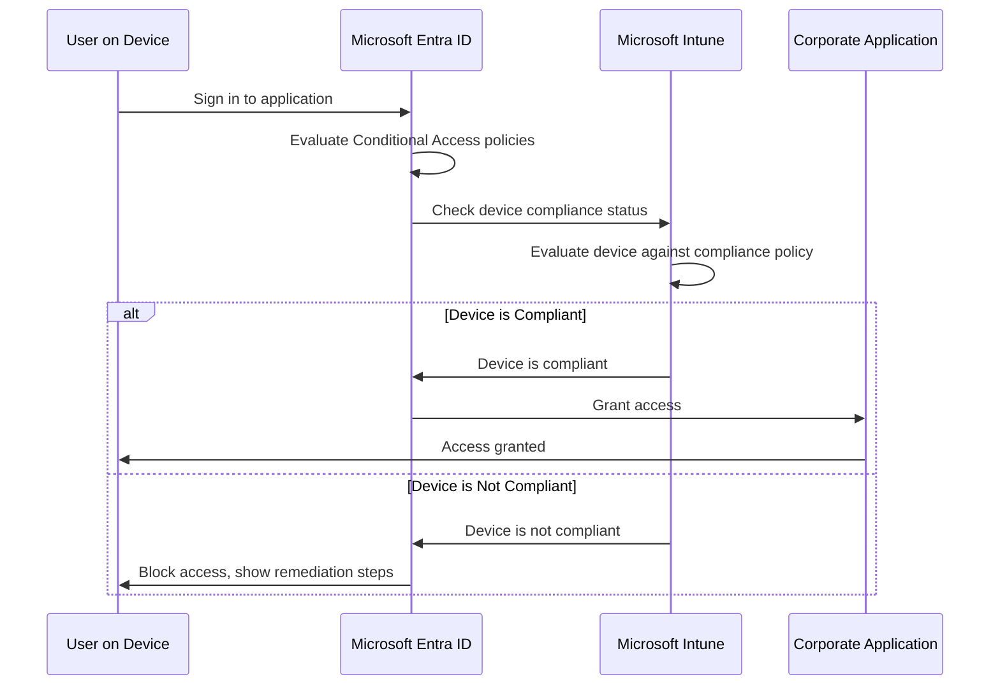

# How to Configure Microsoft Entra Conditional Access for Device Compliance with Intune

Author: [nawazdhandala](https://www.github.com/nawazdhandala)

Tags: Azure, Microsoft Entra ID, Conditional Access, Intune, Device Compliance, Endpoint Management, Zero Trust

Description: Learn how to create Conditional Access policies that require Intune device compliance before granting access to corporate resources and applications.

---

In a Zero Trust security model, you do not just verify the user's identity - you also verify that their device meets your security requirements. A user might have a valid password and pass MFA, but if their laptop has not received security updates in six months and has no disk encryption, do you really want that device accessing your corporate data? Device compliance through Microsoft Intune combined with Conditional Access in Microsoft Entra ID lets you enforce device health requirements before granting access.

This guide covers the full pipeline: creating compliance policies in Intune, connecting them to Conditional Access, and handling the edge cases that come up in real deployments.

## How Device Compliance and Conditional Access Work Together

The flow involves three services working in coordination:



Intune evaluates device compliance based on policies you define (encryption required, minimum OS version, antivirus running, etc.). Conditional Access queries Intune's compliance verdict and uses it to make access decisions.

## Prerequisites

You need:
- Microsoft Entra ID P1 or P2 license
- Microsoft Intune license (included in Microsoft 365 E3/E5 or as standalone)
- Intune set up and devices enrolled
- Global Administrator or a combination of Intune Administrator and Security Administrator roles

## Step 1: Create Device Compliance Policies in Intune

Before Conditional Access can check compliance, you need to define what "compliant" means for your organization.

### Windows Device Compliance Policy

1. Go to the Microsoft Intune admin center at intune.microsoft.com.
2. Navigate to Devices, then Compliance policies.
3. Click Create policy.
4. Select Windows 10 and later as the platform.
5. Configure the compliance settings:

For device health:
- Require BitLocker: Yes
- Require Secure Boot: Yes
- Require code integrity: Yes

For device properties:
- Minimum OS version: Set to a supported version (e.g., 10.0.19045 for Windows 10 22H2)

For system security:
- Require a password: Yes
- Minimum password length: 8
- Firewall: Require
- Antivirus: Require
- Microsoft Defender Antimalware: Require
- Microsoft Defender Antimalware minimum version: Current version

Here is how to create the same policy using PowerShell with the Microsoft Graph module:

```powershell
# Connect to Microsoft Graph with Intune permissions
Connect-MgGraph -Scopes "DeviceManagementConfiguration.ReadWrite.All"

# Create a Windows compliance policy
$compliancePolicy = @{
    "@odata.type" = "#microsoft.graph.windows10CompliancePolicy"
    DisplayName = "Windows Corporate Device Compliance"
    Description = "Compliance requirements for corporate Windows devices."
    # Device health requirements
    BitLockerEnabled = $true
    SecureBootEnabled = $true
    CodeIntegrityEnabled = $true
    # OS version requirements
    OsMinimumVersion = "10.0.19045"
    # System security requirements
    PasswordRequired = $true
    PasswordMinimumLength = 8
    FirewallEnabled = $true
    AntivirusRequired = $true
    DefenderEnabled = $true
    # Real-time protection
    RtpEnabled = $true
    # Scheduled actions for non-compliance
    ScheduledActionsForRule = @(
        @{
            RuleName = "PasswordRequired"
            ScheduledActionConfigurations = @(
                @{
                    # Mark as non-compliant immediately
                    ActionType = "block"
                    GracePeriodHours = 0
                    NotificationTemplateId = ""
                },
                @{
                    # Send notification after 1 day
                    ActionType = "notification"
                    GracePeriodHours = 24
                    NotificationTemplateId = "compliance-notification-template"
                },
                @{
                    # Retire device after 30 days
                    ActionType = "retire"
                    GracePeriodHours = 720
                    NotificationTemplateId = ""
                }
            )
        }
    )
}

$policy = New-MgDeviceManagementDeviceCompliancePolicy -BodyParameter $compliancePolicy
Write-Host "Windows compliance policy created: $($policy.DisplayName)"
```

### iOS/macOS Compliance Policy

Create separate policies for each platform:

```powershell
# Create an iOS compliance policy
$iosPolicy = @{
    "@odata.type" = "#microsoft.graph.iosCompliancePolicy"
    DisplayName = "iOS Corporate Device Compliance"
    Description = "Compliance requirements for corporate iOS devices."
    # Security settings
    PasscodeRequired = $true
    PasscodeMinimumLength = 6
    # Device health
    ManagedEmailProfileRequired = $true
    # OS requirements
    OsMinimumVersion = "16.0"
    # Jailbreak detection
    SecurityBlockJailbrokenDevices = $true
    ScheduledActionsForRule = @(
        @{
            RuleName = "PasswordRequired"
            ScheduledActionConfigurations = @(
                @{
                    ActionType = "block"
                    GracePeriodHours = 0
                }
            )
        }
    )
}

$policy = New-MgDeviceManagementDeviceCompliancePolicy -BodyParameter $iosPolicy
Write-Host "iOS compliance policy created."
```

## Step 2: Assign Compliance Policies to Groups

Policies need to be assigned to device or user groups:

```powershell
# Assign the compliance policy to a group of users
$assignment = @{
    Assignments = @(
        @{
            Target = @{
                "@odata.type" = "#microsoft.graph.groupAssignmentTarget"
                GroupId = "ALL_CORPORATE_USERS_GROUP_ID"
            }
        }
    )
}

# Assign to the Windows compliance policy
Invoke-MgGraphRequest -Method POST `
    -Uri "https://graph.microsoft.com/v1.0/deviceManagement/deviceCompliancePolicies/$($policy.Id)/assign" `
    -Body ($assignment | ConvertTo-Json -Depth 10)

Write-Host "Compliance policy assigned to corporate users group."
```

## Step 3: Configure Compliance Policy Settings (Grace Period)

When a device becomes non-compliant, you can give users time to fix the issue before blocking access:

1. In the compliance policy, go to Actions for noncompliance.
2. Configure the timeline:
   - **Mark device noncompliant**: Set a grace period (e.g., 1 day). During this period, the device is flagged but not blocked.
   - **Send email notification**: Notify the user that their device needs attention.
   - **Remotely lock device**: For serious compliance failures, lock the device after a longer period.
   - **Retire device**: As a last resort, retire the device enrollment after an extended grace period.

A typical escalation timeline might be:
- Immediately: Mark as non-compliant
- After 1 day: Send email to user
- After 3 days: Send email to user and manager
- After 30 days: Retire the device

## Step 4: Create the Conditional Access Policy

Now create a Conditional Access policy that requires device compliance:

### Via the Azure Portal

1. In the Entra admin center, go to Protection, then Conditional Access, then Policies.
2. Click New policy.
3. Configure:
   - **Name**: "Require Compliant Device for Corporate Apps"
   - **Users**: All users (exclude emergency access accounts)
   - **Cloud apps**: All cloud apps (or select specific applications)
   - **Conditions**: Optionally filter by device platform if you only have compliance policies for certain platforms
   - **Grant**: Require device to be marked as compliant
4. Set the policy to Report-only first, then switch to On after validation.

### Via PowerShell

```powershell
# Create a Conditional Access policy requiring device compliance
Connect-MgGraph -Scopes "Policy.ReadWrite.ConditionalAccess"

$params = @{
    DisplayName = "Require Compliant Device for Corporate Apps"
    State = "enabledForReportingButNotEnforced"  # Start in report-only mode
    Conditions = @{
        Users = @{
            IncludeUsers = @("All")
            ExcludeUsers = @("EMERGENCY_ACCOUNT_ID_1", "EMERGENCY_ACCOUNT_ID_2")
        }
        Applications = @{
            IncludeApplications = @("All")
        }
        # Optionally target specific platforms
        Platforms = @{
            IncludePlatforms = @("windows", "iOS", "android", "macOS")
        }
    }
    GrantControls = @{
        Operator = "OR"
        BuiltInControls = @("compliantDevice")
    }
}

$policy = New-MgIdentityConditionalAccessPolicy -BodyParameter $params
Write-Host "Conditional Access policy created in report-only mode."
Write-Host "Policy ID: $($policy.Id)"
```

## Step 5: Handle Unmanaged Devices

Not all devices will be enrolled in Intune. You need to decide how to handle unmanaged personal devices:

Option 1 - Block unmanaged devices entirely:
```powershell
# The compliantDevice grant control already blocks unmanaged devices
# because they cannot be evaluated for compliance
```

Option 2 - Allow unmanaged devices with restrictions:
```powershell
# Create a separate policy for unmanaged devices
# Require MFA and limit session duration
$params = @{
    DisplayName = "Restrict Access from Unmanaged Devices"
    State = "enabled"
    Conditions = @{
        Users = @{
            IncludeUsers = @("All")
            ExcludeUsers = @("EMERGENCY_ACCOUNT_ID")
        }
        Applications = @{
            IncludeApplications = @("All")
        }
        # Use a filter to target unmanaged devices
        Devices = @{
            DeviceFilter = @{
                Mode = "include"
                Rule = "device.isCompliant -ne True -and device.trustType -ne 'ServerAD'"
            }
        }
    }
    GrantControls = @{
        Operator = "AND"
        BuiltInControls = @("mfa")
    }
    SessionControls = @{
        # Restrict to browser-only access with no download capability
        ApplicationEnforcedRestrictions = @{
            IsEnabled = $true
        }
        # Limit session to 1 hour
        SignInFrequency = @{
            Value = 1
            Type = "hours"
            IsEnabled = $true
        }
    }
}

New-MgIdentityConditionalAccessPolicy -BodyParameter $params
Write-Host "Restricted access policy for unmanaged devices created."
```

## Step 6: Monitor Compliance Status

Track device compliance across your organization:

1. In the Intune admin center, go to Devices, then Monitor.
2. Check the Device compliance dashboard for:
   - Overall compliance percentage
   - Compliance by platform
   - Devices that have been non-compliant for extended periods
   - Most common reasons for non-compliance

You can also query compliance data:

```kusto
// If you have Intune logs in Log Analytics
// Query device compliance status changes
IntuneDeviceComplianceOrg
| where TimeGenerated > ago(7d)
| summarize
    CompliantDevices = countif(ComplianceState == "Compliant"),
    NonCompliantDevices = countif(ComplianceState == "NonCompliant"),
    InGracePeriod = countif(ComplianceState == "InGracePeriod")
    by bin(TimeGenerated, 1d)
| render timechart
```

## Step 7: Set Up Compliance Notifications

Configure email notifications for users whose devices fall out of compliance:

1. In Intune, go to Tenant administration, then Notifications.
2. Create a notification template:
   - Include a message explaining what compliance means and why it matters
   - Provide self-service remediation steps (update OS, enable encryption, etc.)
   - Include help desk contact information

## Common Troubleshooting

When users report being blocked despite having compliant devices:

- **Device not enrolled**: The device might not be enrolled in Intune at all. Check the device enrollment status.
- **Stale compliance evaluation**: Intune evaluates compliance periodically. A recently fixed device may take time to be marked compliant. Users can force a sync from the Company Portal app.
- **Wrong user**: If multiple users share a device, compliance is tied to the device, not the user. Both users benefit from a compliant device.
- **Platform mismatch**: Make sure you have compliance policies assigned for the platform the user is on. If there is no iOS compliance policy but you require compliance, iOS devices will be blocked.

## Conclusion

Device compliance through Intune combined with Conditional Access is a foundational element of Zero Trust security. The approach ensures that only devices meeting your security standards can access corporate resources, regardless of where the user is or what network they are on. Start with compliance policies that set a reasonable baseline (encryption, firewall, up-to-date OS), connect them to Conditional Access, use report-only mode to validate before enforcing, and plan for the unmanaged device scenario. The result is a security posture where both identity and device health are verified before granting access to sensitive data.
