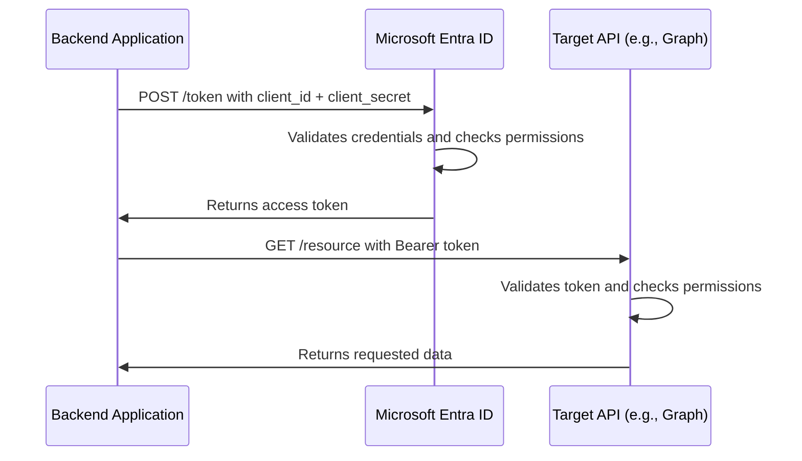

# How to Configure Microsoft Entra ID App Registration with API Permissions and Client Credentials Flow

Author: [nawazdhandala](https://www.github.com/nawazdhandala)

Tags: Azure, Microsoft Entra ID, App Registration, API Permissions, Client Credentials, OAuth, Service Principal

Description: A detailed walkthrough for setting up Microsoft Entra ID app registrations with API permissions and client credentials flow for service-to-service authentication.

---

When your backend services, automation scripts, or daemon applications need to call Microsoft APIs (like Microsoft Graph) or your own custom APIs, they cannot pop up a sign-in dialog. They need to authenticate without a user present. That is where the OAuth 2.0 client credentials flow comes in. You register an application in Microsoft Entra ID, grant it the appropriate API permissions, and the application authenticates using its own credentials (a client secret or certificate) rather than a user's credentials.

This guide walks through the complete setup, from creating the app registration to making authenticated API calls.

## How Client Credentials Flow Works

In the client credentials flow, the application authenticates directly with Microsoft Entra ID using its own identity:



There are two types of API permissions relevant here:

- **Delegated permissions**: Used when a user is present. The app acts on behalf of the user.
- **Application permissions**: Used in client credentials flow. The app acts as itself with no user context.

For daemon applications and service-to-service communication, you use application permissions.

## Prerequisites

You need:

- Microsoft Entra ID tenant
- Application Administrator or Global Administrator role
- Understanding of which API permissions your application needs

## Step 1: Create the App Registration

### Via the Azure Portal

1. Sign in to the Microsoft Entra admin center at entra.microsoft.com.
2. Navigate to Applications, then App registrations.
3. Click New registration.
4. Enter the following:
   - **Name**: A descriptive name like "Backend Data Processor" or "Monitoring Automation Service"
   - **Supported account types**: Select "Accounts in this organizational directory only" for single-tenant applications
   - **Redirect URI**: Leave this blank for client credentials flow (no redirect is needed since there is no user interaction)
5. Click Register.

After registration, note the **Application (client) ID** and **Directory (tenant) ID** from the overview page. You will need both.

### Via PowerShell

```powershell
# Connect to Microsoft Graph
Connect-MgGraph -Scopes "Application.ReadWrite.All"

# Create the app registration
$appParams = @{
    DisplayName = "Backend Data Processor"
    # Single-tenant application
    SignInAudience = "AzureADMyOrg"
    # No web redirect URIs needed for client credentials flow
}

$app = New-MgApplication @appParams

Write-Host "Application created:"
Write-Host "  App ID (Client ID): $($app.AppId)"
Write-Host "  Object ID: $($app.Id)"

# Create the corresponding service principal
# The service principal is the local representation of the app in the tenant
$sp = New-MgServicePrincipal -AppId $app.AppId

Write-Host "  Service Principal ID: $($sp.Id)"
```

## Step 2: Configure API Permissions

Now grant the application the permissions it needs. Let us say our backend service needs to read users and groups from Microsoft Graph and send emails.

### Via the Azure Portal

1. In the app registration, click API permissions in the left menu.
2. Click Add a permission.
3. Select Microsoft Graph.
4. Select Application permissions (not Delegated).
5. Search for and select the permissions you need:
   - User.Read.All (to read all user profiles)
   - Group.Read.All (to read all groups)
   - Mail.Send (to send email as any user)
6. Click Add permissions.

After adding permissions, you will see them listed with a status of "Not granted for [tenant]." Application permissions for Microsoft Graph require admin consent.

7. Click Grant admin consent for [tenant name].
8. Click Yes to confirm.

The permissions should now show a green checkmark indicating consent has been granted.

### Via PowerShell

```powershell
# Get the Microsoft Graph service principal (the API we want to access)
$graphSP = Get-MgServicePrincipal -Filter "appId eq '00000003-0000-0000-c000-000000000000'"

# Find the specific permission IDs we need
$permissions = $graphSP.AppRoles | Where-Object {
    $_.Value -in @("User.Read.All", "Group.Read.All", "Mail.Send")
}

foreach ($perm in $permissions) {
    Write-Host "Permission: $($perm.Value) - ID: $($perm.Id)"
}

# Grant each application permission to our app's service principal
foreach ($perm in $permissions) {
    $grantParams = @{
        PrincipalId = $sp.Id                   # Our app's service principal
        ResourceId = $graphSP.Id               # Microsoft Graph service principal
        AppRoleId = $perm.Id                   # The specific permission
    }

    New-MgServicePrincipalAppRoleAssignment `
        -ServicePrincipalId $sp.Id `
        -BodyParameter $grantParams

    Write-Host "Granted: $($perm.Value)"
}
```

## Step 3: Create Client Credentials

Your application needs credentials to authenticate. You have two options: client secrets and certificates. Certificates are more secure and recommended for production.

### Option A: Client Secret

```powershell
# Create a client secret for the application
# Note: Secrets expire and need to be rotated regularly
$secretParams = @{
    PasswordCredential = @{
        DisplayName = "Backend Service Secret"
        # Set expiration to 6 months (adjust based on your rotation schedule)
        EndDateTime = (Get-Date).AddMonths(6)
    }
}

$secret = Add-MgApplicationPassword -ApplicationId $app.Id -BodyParameter $secretParams

Write-Host "Client Secret created:"
Write-Host "  Secret Value: $($secret.SecretText)"
Write-Host "  Expires: $($secret.EndDateTime)"
Write-Host ""
Write-Host "IMPORTANT: Save the secret value now. It cannot be retrieved later."
```

Save the secret value securely (in Azure Key Vault, for example). You cannot retrieve it again after this point.

### Option B: Certificate (Recommended)

```powershell
# Generate a self-signed certificate for the application
# In production, use a certificate from your organization's CA
$cert = New-SelfSignedCertificate `
    -Subject "CN=BackendDataProcessor" `
    -CertStoreLocation "Cert:\CurrentUser\My" `
    -KeyExportPolicy Exportable `
    -KeySpec Signature `
    -KeyLength 2048 `
    -KeyAlgorithm RSA `
    -HashAlgorithm SHA256 `
    -NotAfter (Get-Date).AddYears(2)

# Export the public key as a .cer file
$certPath = "C:\certs\BackendDataProcessor.cer"
Export-Certificate -Cert $cert -FilePath $certPath

# Upload the certificate to the app registration
$certData = [System.Convert]::ToBase64String(
    (Get-Content $certPath -Encoding Byte)
)

$certParams = @{
    KeyCredential = @{
        DisplayName = "Backend Service Certificate"
        Type = "AsymmetricX509Cert"
        Usage = "Verify"
        Key = [System.Convert]::FromBase64String($certData)
    }
}

Update-MgApplication -ApplicationId $app.Id -BodyParameter $certParams

Write-Host "Certificate uploaded to app registration."
Write-Host "Thumbprint: $($cert.Thumbprint)"
```

## Step 4: Authenticate and Call the API

Now use the credentials to obtain an access token and call the API.

### Using Client Secret (PowerShell)

```powershell
# Acquire an access token using client credentials flow with a secret
$tokenEndpoint = "https://login.microsoftonline.com/YOUR_TENANT_ID/oauth2/v2.0/token"

$body = @{
    client_id     = "YOUR_CLIENT_ID"
    scope         = "https://graph.microsoft.com/.default"
    client_secret = "YOUR_CLIENT_SECRET"
    grant_type    = "client_credentials"
}

# Request the token
$tokenResponse = Invoke-RestMethod -Method Post -Uri $tokenEndpoint -Body $body
$accessToken = $tokenResponse.access_token

Write-Host "Access token acquired. Expires in $($tokenResponse.expires_in) seconds."

# Use the token to call Microsoft Graph
$headers = @{
    Authorization = "Bearer $accessToken"
    "Content-Type" = "application/json"
}

# Example: Get all users
$users = Invoke-RestMethod `
    -Method Get `
    -Uri "https://graph.microsoft.com/v1.0/users?`$top=10" `
    -Headers $headers

Write-Host "Found $($users.value.Count) users:"
$users.value | ForEach-Object { Write-Host "  $($_.displayName) - $($_.userPrincipalName)" }
```

### Using Certificate (C#)

```csharp
// C# example using Microsoft.Identity.Client (MSAL)
// Install the NuGet package: Microsoft.Identity.Client

using Microsoft.Identity.Client;
using System.Security.Cryptography.X509Certificates;

// Load the certificate from the certificate store
var certificate = new X509Certificate2("path/to/cert.pfx", "certPassword");

// Build the confidential client application
var app = ConfidentialClientApplicationBuilder
    .Create("YOUR_CLIENT_ID")
    .WithCertificate(certificate)
    .WithAuthority(AzureCloudInstance.AzurePublic, "YOUR_TENANT_ID")
    .Build();

// Acquire a token for Microsoft Graph
var scopes = new[] { "https://graph.microsoft.com/.default" };
var result = await app.AcquireTokenForClient(scopes).ExecuteAsync();

// Use the token to call the API
var httpClient = new HttpClient();
httpClient.DefaultRequestHeaders.Authorization =
    new System.Net.Http.Headers.AuthenticationHeaderValue("Bearer", result.AccessToken);

var response = await httpClient.GetStringAsync("https://graph.microsoft.com/v1.0/users");
Console.WriteLine(response);
```

## Step 5: Secure the App Registration

Follow these security practices for production app registrations:

**Limit permissions to the minimum required.** Do not grant User.ReadWrite.All if you only need User.Read.All.

**Use certificates instead of secrets.** Certificates cannot be accidentally leaked in logs the way secret strings can.

**Set secret and certificate expiration dates.** Rotate credentials regularly. Store rotation schedules in your team's operational runbook.

**Restrict which users can consent to the app.** Use the admin consent workflow in Entra ID to prevent users from granting permissions to unauthorized applications.

**Monitor sign-in activity for the app.** Check the service principal sign-in logs regularly for unexpected activity:

```kusto
// Monitor service principal sign-ins for your application
// Look for unexpected IP addresses or failure patterns
AADServicePrincipalSignInLogs
| where TimeGenerated > ago(7d)
| where AppId == "YOUR_CLIENT_ID"
| summarize
    SignInCount = count(),
    DistinctIPs = dcount(IPAddress),
    FailureCount = countif(ResultType != "0")
    by bin(TimeGenerated, 1d)
| sort by TimeGenerated desc
```

## Step 6: Implement Token Caching

Access tokens are valid for a period (typically 1 hour). Cache them and reuse until they expire:

```powershell
# Simple token caching pattern in PowerShell
# Avoid requesting a new token for every API call
$script:cachedToken = $null
$script:tokenExpiry = [DateTime]::MinValue

function Get-CachedAccessToken {
    # Check if we have a valid cached token (with 5-minute buffer)
    if ($script:cachedToken -and $script:tokenExpiry -gt (Get-Date).AddMinutes(5)) {
        return $script:cachedToken
    }

    # Request a new token
    $body = @{
        client_id     = $env:CLIENT_ID
        scope         = "https://graph.microsoft.com/.default"
        client_secret = $env:CLIENT_SECRET
        grant_type    = "client_credentials"
    }

    $response = Invoke-RestMethod -Method Post `
        -Uri "https://login.microsoftonline.com/$env:TENANT_ID/oauth2/v2.0/token" `
        -Body $body

    $script:cachedToken = $response.access_token
    $script:tokenExpiry = (Get-Date).AddSeconds($response.expires_in)

    return $script:cachedToken
}
```

## Conclusion

App registrations with client credentials flow are the foundation for service-to-service authentication in Microsoft Entra ID. The setup involves creating the registration, granting application permissions with admin consent, configuring credentials (preferring certificates over secrets), and then using those credentials to obtain access tokens. Keep your permissions minimal, rotate credentials regularly, and monitor the service principal sign-in logs for anomalies. This pattern works for everything from simple automation scripts to complex microservice architectures where services need to securely call Microsoft APIs or each other.
