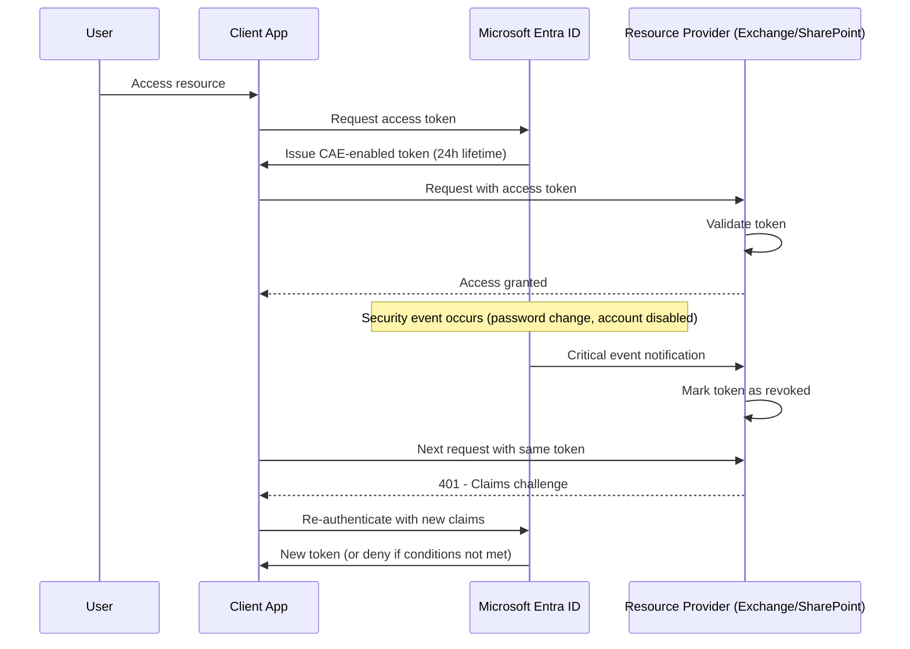

# How to Configure Microsoft Entra ID Continuous Access Evaluation for Real-Time Token Revocation

Author: [nawazdhandala](https://www.github.com/nawazdhandala)

Tags: Azure, Microsoft Entra ID, Continuous Access Evaluation, Token Revocation, Zero Trust, Identity Security, CAE

Description: Learn how to enable and configure Continuous Access Evaluation in Microsoft Entra ID to enforce near real-time token revocation when security conditions change.

---

There is a fundamental weakness in traditional token-based authentication: once an access token is issued, it is valid until it expires, regardless of what happens to the user's session in the meantime. If you disable a user account, change their password, or detect that their credentials are compromised, the access token they already have continues to work until it reaches its natural expiration time - which could be up to an hour or more.

Continuous Access Evaluation (CAE) fixes this by establishing a communication channel between the identity provider (Microsoft Entra ID) and the resource provider (like Exchange Online or SharePoint). When a critical security event occurs, the resource provider is notified immediately and can reject the token without waiting for it to expire. This is a significant improvement for zero-trust architectures where you need to enforce "never trust, always verify" in near real-time.

## How CAE Works

In the traditional model, an access token is a self-contained document. The resource provider validates the token's signature and expiration date, and if both check out, the request is allowed. The resource provider has no way to know if something has changed since the token was issued.

CAE changes this by adding a backchannel between Entra ID and supported resource providers:



When a critical event occurs, the resource provider receives a notification and starts rejecting the old token. The client receives a "claims challenge" response, which tells it to go back to Entra ID and re-authenticate. If the user's account is disabled or the conditions have changed, re-authentication will fail.

## What Events Trigger CAE

CAE responds to two types of events:

**Critical events** (near real-time, usually within minutes):
- User account disabled or deleted
- Password changed or reset
- MFA enabled for the user
- Admin explicitly revokes refresh tokens
- High user risk detected by Entra ID Protection

**Conditional Access policy evaluation** (for IP-based policies):
- User's IP address changes and no longer matches a Conditional Access location policy
- For example, if you have a policy that requires corporate network access and the user moves to an untrusted network

## Step 1: Check CAE Status

CAE is enabled by default for tenants with supported Microsoft 365 workloads. However, it is worth verifying that it is active and not being overridden by any policies.

Check the current CAE configuration using PowerShell:

```powershell
# Connect to Microsoft Graph
Connect-MgGraph -Scopes "Policy.Read.All"

# Check if CAE is enabled at the tenant level
# CAE is controlled through Conditional Access session controls
$policies = Get-MgIdentityConditionalAccessPolicy

foreach ($policy in $policies) {
    if ($policy.SessionControls.DisableResilienceDefaults -eq $true) {
        Write-Output "WARNING: Policy '$($policy.DisplayName)' has disabled resilience defaults, which can affect CAE"
    }

    if ($policy.SessionControls.ContinuousAccessEvaluation) {
        Write-Output "Policy '$($policy.DisplayName)' has CAE configuration: $($policy.SessionControls.ContinuousAccessEvaluation.Mode)"
    }
}
```

## Step 2: Configure CAE Through Conditional Access

While CAE is on by default, you can fine-tune its behavior through Conditional Access policies. The key setting is the `continuousAccessEvaluation` session control.

CAE has two modes:

- **Strict enforcement** - Both critical events and IP-based Conditional Access policies trigger CAE. This is the most secure option.
- **Disabled** - CAE is turned off (not recommended).

This creates a Conditional Access policy that enforces strict CAE evaluation:

```powershell
# Create a Conditional Access policy with strict CAE enforcement
$caePolicy = @{
    displayName = "Enforce Strict Continuous Access Evaluation"
    state = "enabledForReportingButNotEnforced"  # Start in report-only
    conditions = @{
        users = @{
            includeUsers = @("All")
            excludeUsers = @("<break-glass-account-id>")
        }
        applications = @{
            includeApplications = @("All")
        }
        clientAppTypes = @("all")
    }
    grantControls = @{
        operator = "OR"
        builtInControls = @("block")
    }
    sessionControls = @{
        continuousAccessEvaluation = @{
            mode = "strictEnforcement"
        }
    }
}

# Note: For strict enforcement, the grant control should match
# your actual access requirements, not just "block"
# The above is simplified - adjust grant controls to your needs

New-MgIdentityConditionalAccessPolicy -BodyParameter $caePolicy
```

In strict enforcement mode, CAE-capable clients are required to handle claims challenges. Non-CAE-capable clients will fall back to regular token validation, which means they will not benefit from near real-time revocation.

## Step 3: Understand Token Lifetime with CAE

One important behavior change with CAE: access tokens for CAE-capable resources can have extended lifetimes, up to 28 hours instead of the standard 60-90 minutes. This might seem counterintuitive - why make tokens last longer if you are trying to improve security?

The reasoning is that with CAE, the token can be revoked at any time through the backchannel, so a longer lifetime reduces the number of token refresh operations and improves performance. The longer lifetime is safe because the resource provider can always reject the token when a critical event occurs.

If you have custom token lifetime policies, be aware that CAE may override the access token lifetime for supported resources.

## Step 4: Test CAE with Token Revocation

To verify that CAE is working, you can test the revocation flow. The simplest test is to revoke a user's sessions and verify that the resource provider stops accepting their token.

This script tests CAE by revoking a user's sessions and then checking access:

```powershell
# Step 1: Note the user's current access
$testUser = "test.user@company.com"
$userId = (Get-MgUser -Filter "userPrincipalName eq '$testUser'").Id

Write-Output "Revoking sessions for $testUser at $(Get-Date)"

# Step 2: Revoke all refresh tokens for the user
# This triggers a critical event that CAE will propagate
Invoke-MgInvalidateUserRefreshToken -UserId $userId

Write-Output "Tokens revoked. CAE should enforce this within minutes."
Write-Output "The user's next request to a CAE-enabled resource should trigger a claims challenge."
```

After revoking tokens, the user should be prompted to re-authenticate within a few minutes when accessing CAE-enabled resources like Exchange Online or SharePoint Online. Without CAE, they would continue to have access until their current access token expires.

## Step 5: Monitor CAE Events

Track CAE enforcement in the Entra ID sign-in logs to see when claims challenges are issued and whether they result in successful re-authentication or access denial.

This KQL query finds CAE-related events in the sign-in logs:

```kusto
// Monitor CAE claims challenge events
SigninLogs
| where TimeGenerated > ago(7d)
// Look for sign-ins that include CAE-related information
| where AuthenticationProcessingDetails has "continuous access evaluation"
    or AuthenticationProcessingDetails has "CAE"
| extend
    CAEDetails = parse_json(AuthenticationProcessingDetails)
| project
    TimeGenerated,
    UserPrincipalName,
    AppDisplayName,
    IPAddress,
    Status,
    ConditionalAccessStatus,
    CAEDetails,
    RiskLevelAggregated
| order by TimeGenerated desc
```

You can also check for token revocation events specifically:

```kusto
// Track token revocation events and their CAE enforcement
AuditLogs
| where TimeGenerated > ago(7d)
| where OperationName == "Revoke user sign-in tokens"
    or OperationName == "Invalidate all refresh tokens for a user"
| project
    TimeGenerated,
    OperationName,
    InitiatedBy,
    TargetResources,
    Result
| order by TimeGenerated desc
```

## Step 6: Handle CAE in Custom Applications

If you build custom applications that act as resource providers, you can implement CAE support to benefit from near real-time token revocation. The Microsoft Authentication Library (MSAL) handles much of this automatically for client applications.

For your client application to support CAE, it needs to handle claims challenges. Here is how to handle a claims challenge in a Python application using MSAL:

```python
import msal
import requests

# Initialize the MSAL confidential client
app = msal.ConfidentialClientApplication(
    client_id="<your-app-id>",
    client_credential="<your-client-secret>",
    authority="https://login.microsoftonline.com/<tenant-id>",
)

def make_api_call(token):
    """Make an API call and handle CAE claims challenges."""
    headers = {"Authorization": f"Bearer {token['access_token']}"}

    response = requests.get(
        "https://graph.microsoft.com/v1.0/me",
        headers=headers,
    )

    if response.status_code == 401:
        # Check for a claims challenge in the WWW-Authenticate header
        www_auth = response.headers.get("WWW-Authenticate", "")

        if "claims" in www_auth:
            # Extract the claims challenge value
            # The claims value is base64-encoded
            import re
            claims_match = re.search(r'claims="([^"]+)"', www_auth)

            if claims_match:
                claims = claims_match.group(1)

                # Re-acquire a token with the claims challenge
                # This forces re-authentication
                new_token = app.acquire_token_for_client(
                    scopes=["https://graph.microsoft.com/.default"],
                    claims_challenge=claims,
                )

                if "access_token" in new_token:
                    # Retry the request with the new token
                    headers = {"Authorization": f"Bearer {new_token['access_token']}"}
                    response = requests.get(
                        "https://graph.microsoft.com/v1.0/me",
                        headers=headers,
                    )

    return response
```

## Supported Resources and Clients

Not all resources and clients support CAE. Currently supported resources include:

- Exchange Online
- SharePoint Online
- Microsoft Teams
- Microsoft Graph

Supported client applications:
- Outlook (desktop and mobile)
- Teams (desktop and mobile)
- OneDrive
- Office web apps
- Applications using MSAL with CAE support enabled

For unsupported resources, the standard token lifetime and refresh flow still applies.

## Strict vs. Default Enforcement

The difference between strict and default enforcement mainly affects IP-based Conditional Access evaluation:

**Default enforcement**: IP location changes are evaluated on a best-effort basis. Some scenarios (like a user on a VPN that routes traffic through different exit points) might not trigger immediate re-evaluation.

**Strict enforcement**: All IP location changes are strictly evaluated. The client must prove its network location on every request. This provides stronger security but may cause more frequent re-authentication prompts for mobile users.

Choose strict enforcement for high-security applications and users with access to sensitive data. Use default enforcement as the baseline for the rest of your organization.

## Wrapping Up

Continuous Access Evaluation closes the gap between security event detection and enforcement. Without CAE, there is always a window where a revoked credential still grants access. With CAE, that window shrinks from up to an hour down to minutes. The setup is minimal since CAE is enabled by default for supported Microsoft 365 workloads. Your main tasks are verifying it is active, configuring strict enforcement where needed, and making sure your Conditional Access policies are designed to take advantage of CAE's near real-time evaluation capabilities. For any organization pursuing a zero-trust architecture, CAE is a critical component that ensures your access policies are enforced continuously, not just at the time of initial authentication.
