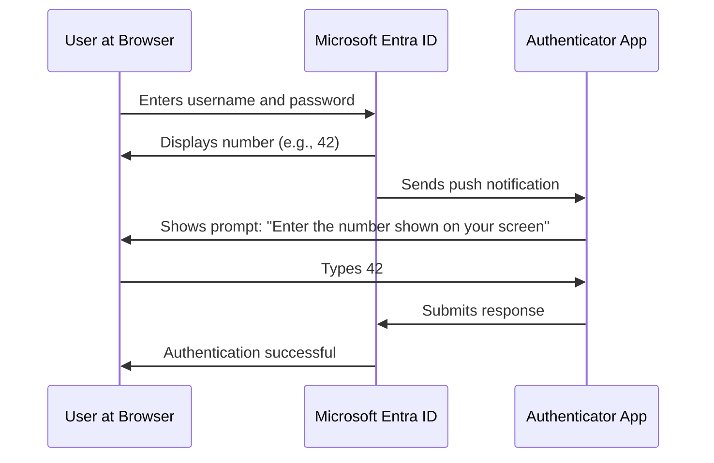

# How to Configure Microsoft Entra ID Multi-Factor Authentication with Number Matching and Additional Context

Author: [nawazdhandala](https://www.github.com/nawazdhandala)

Tags: Azure, Microsoft Entra ID, Multi-Factor Authentication, MFA, Number Matching, Security, Identity

Description: A step-by-step guide to configuring MFA in Microsoft Entra ID with number matching and additional context to prevent MFA fatigue attacks.

---

MFA fatigue attacks have become one of the most talked-about security threats in recent years. Attackers who already have a user's password repeatedly send push notifications hoping the user will eventually approve one out of frustration or confusion. Number matching and additional context are two features in Microsoft Entra ID that directly counter this attack vector. Instead of a simple approve or deny prompt, users must type a number displayed on the sign-in screen, and they see location and application details so they can make an informed decision.

In this post, I will show you how to configure both features and explain why they matter.

## Understanding the Problem with Traditional Push Notifications

Traditional MFA push notifications show a simple prompt on the user's phone: approve or deny. The problem is that this binary choice gives the user very little information about what they are approving. If an attacker triggers a push notification, the user sees the same prompt they see during their own legitimate sign-ins.

MFA fatigue (also called push bombing or push spam) works like this:

1. The attacker obtains the user's password through phishing, credential stuffing, or a data breach.
2. The attacker initiates a sign-in, which triggers an MFA push to the user's phone.
3. If the user denies it, the attacker tries again. And again. Sometimes dozens of times.
4. Eventually, many users approve the request just to make the notifications stop, especially at 2 AM.

This is not a theoretical attack. It has been used successfully against major companies. Number matching fundamentally changes the dynamic because the user cannot approve a request without seeing the number on their own screen.

## Prerequisites

You need the following to follow along:

- Microsoft Entra ID P1 or P2 license
- Authentication Policy Administrator or Global Administrator role
- Users registered for Microsoft Authenticator push notifications
- Microsoft Authenticator app updated to the latest version on user devices

## How Number Matching Works

When number matching is enabled, the sign-in screen displays a two-digit number after the user enters their password. The Microsoft Authenticator app then asks the user to type that number instead of simply tapping approve. If the user is not at a computer looking at the sign-in screen, they will not know what number to type.

The flow looks like this:



If an attacker triggers the push, the user sees a prompt asking for a number but has no way to know what number is displayed on the attacker's screen.

## Step 1: Enable Number Matching

As of mid-2023, Microsoft made number matching the default for all Microsoft Authenticator push notifications. However, you should verify this is configured correctly in your tenant.

1. Sign in to the Microsoft Entra admin center at entra.microsoft.com.
2. Navigate to Protection, then Authentication methods, then Policies.
3. Click on Microsoft Authenticator.
4. Under the Configure tab, make sure the authentication mode is set to Push or Any.
5. Click on the Configure tab for Microsoft Authenticator settings.
6. Under Require number matching for push notifications, verify it is set to Enabled with the target set to All users.

You can also configure this using PowerShell:

```powershell
# Connect to Microsoft Graph with the required scopes
Connect-MgGraph -Scopes "Policy.ReadWrite.AuthenticationMethod"

# Get the current Microsoft Authenticator authentication method configuration
$authMethod = Get-MgPolicyAuthenticationMethodPolicyAuthenticationMethodConfiguration `
    -AuthenticationMethodConfigurationId "MicrosoftAuthenticator"

# Update the configuration to require number matching
# The 'enabled' state with 'all' target applies to all users
$params = @{
    "@odata.type" = "#microsoft.graph.microsoftAuthenticatorAuthenticationMethodConfiguration"
    FeatureSettings = @{
        NumberMatchingRequiredState = @{
            State = "enabled"
            IncludeTarget = @{
                TargetType = "group"
                Id = "all_users"
            }
        }
    }
}

Update-MgPolicyAuthenticationMethodPolicyAuthenticationMethodConfiguration `
    -AuthenticationMethodConfigurationId "MicrosoftAuthenticator" `
    -BodyParameter $params
```

## Step 2: Enable Additional Context (Show Application Name)

Additional context shows the user which application is requesting the authentication and from what location. This gives users the information they need to recognize illegitimate requests.

1. In the Microsoft Entra admin center, go to Protection, then Authentication methods, then Policies.
2. Click on Microsoft Authenticator.
3. Under the Configure tab, find Show application name in push and passwordless notifications.
4. Set it to Enabled and target All users.

When this is enabled, the Authenticator app will display something like "Sign in to Outlook" instead of a generic approval request.

## Step 3: Enable Additional Context (Show Geographic Location)

The geographic location context shows the user the approximate location where the sign-in is happening. If a user in New York sees a sign-in attempt from Moscow, they know immediately to deny it.

1. In the same Microsoft Authenticator settings page, find Show geographic location in push and passwordless notifications.
2. Set it to Enabled and target All users.

Here is the PowerShell to enable both additional context features at once:

```powershell
# Connect with required permissions
Connect-MgGraph -Scopes "Policy.ReadWrite.AuthenticationMethod"

# Enable both application name and geographic location in push notifications
$params = @{
    "@odata.type" = "#microsoft.graph.microsoftAuthenticatorAuthenticationMethodConfiguration"
    FeatureSettings = @{
        # Show application name in the push notification
        DisplayAppInformationRequiredState = @{
            State = "enabled"
            IncludeTarget = @{
                TargetType = "group"
                Id = "all_users"
            }
        }
        # Show the geographic location of the sign-in attempt
        DisplayLocationInformationRequiredState = @{
            State = "enabled"
            IncludeTarget = @{
                TargetType = "group"
                Id = "all_users"
            }
        }
        # Ensure number matching is also enabled
        NumberMatchingRequiredState = @{
            State = "enabled"
            IncludeTarget = @{
                TargetType = "group"
                Id = "all_users"
            }
        }
    }
}

Update-MgPolicyAuthenticationMethodPolicyAuthenticationMethodConfiguration `
    -AuthenticationMethodConfigurationId "MicrosoftAuthenticator" `
    -BodyParameter $params

Write-Host "Number matching and additional context features enabled successfully."
```

## Step 4: Configure Companion App Settings

If your organization uses the companion app for Apple Watch or other wearable devices, be aware that number matching may not work on all companion devices. You should test this in your environment and consider whether to allow companion app approvals.

In the Microsoft Authenticator settings, you can find the option to disable companion app notifications if needed. This forces users to approve from their phone where the full number matching and context experience is available.

## Step 5: Test the Configuration

Before rolling this out to the entire organization, test with a pilot group:

1. Create a security group in Microsoft Entra ID for your pilot users.
2. Instead of targeting All users, target this specific group initially.
3. Have pilot users sign in and verify they see the number matching prompt.
4. Confirm that application name and location information appear correctly.
5. Ask pilot users for feedback on the experience.

During testing, watch for these common issues:

- Users with older versions of the Authenticator app may not see the number matching prompt. They need to update the app.
- Users who have the Authenticator app installed but are not registered for push notifications will not be affected by these settings.
- Some users may confuse number matching with a password prompt. Clear communication helps.

## Step 6: Communicate the Change to Users

Rolling out number matching without telling users is a recipe for confusion and help desk tickets. Send a communication that explains:

- What will change in the sign-in experience
- Why the change is being made (to protect against phishing and MFA fatigue)
- What users need to do (update their Authenticator app, look for the number on the sign-in screen)
- Who to contact if they have problems

A simple visual guide showing the new prompt goes a long way toward reducing support calls.

## Monitoring and Reporting

After enabling these features, monitor the sign-in logs for any issues:

```kusto
// Query to check MFA authentication details and methods used
// Look for any failures related to number matching
SigninLogs
| where TimeGenerated > ago(7d)
| where AuthenticationRequirement == "multiFactorAuthentication"
| extend AuthMethod = tostring(AuthenticationDetails[1].authenticationMethod)
| extend AuthDetail = tostring(AuthenticationDetails[1].authenticationStepResultDetail)
| summarize Count = count() by AuthMethod, AuthDetail, ResultType
| sort by Count desc
```

You should also review the Authentication methods activity report in the Microsoft Entra admin center. This shows you how many users are registered for each authentication method and how often each method is used.

## Combining with Conditional Access

Number matching and additional context work best when combined with Conditional Access policies that require MFA. Create a Conditional Access policy that requires MFA for all users across all cloud applications:

1. Go to Protection, then Conditional Access, then Policies.
2. Create a new policy requiring MFA for all users and all cloud apps.
3. Exclude your emergency access accounts.
4. Consider adding conditions like requiring MFA only from untrusted locations or for risky sign-ins.

This ensures every user encounters the number matching experience when signing in, making your entire authentication flow resistant to MFA fatigue attacks.

## What About FIDO2 and Passwordless

Number matching improves the security of push-based MFA, but if you want the strongest protection available, consider moving to passwordless authentication methods like FIDO2 security keys or passkeys. These methods are phishing-resistant because they are bound to the specific domain and cannot be replayed by an attacker.

Microsoft Authenticator also supports passwordless phone sign-in, which uses the same number matching experience but eliminates the password entirely.

## Conclusion

Enabling number matching and additional context in Microsoft Authenticator is a straightforward change that dramatically improves your security posture against MFA fatigue attacks. The configuration takes minutes, and the impact is immediate. Users get better information to make decisions about authentication requests, and attackers lose one of their most effective tools for bypassing MFA. Combined with a Conditional Access policy that requires MFA and the blocking of legacy authentication, these features form a solid foundation for modern identity security in Microsoft Entra ID.
