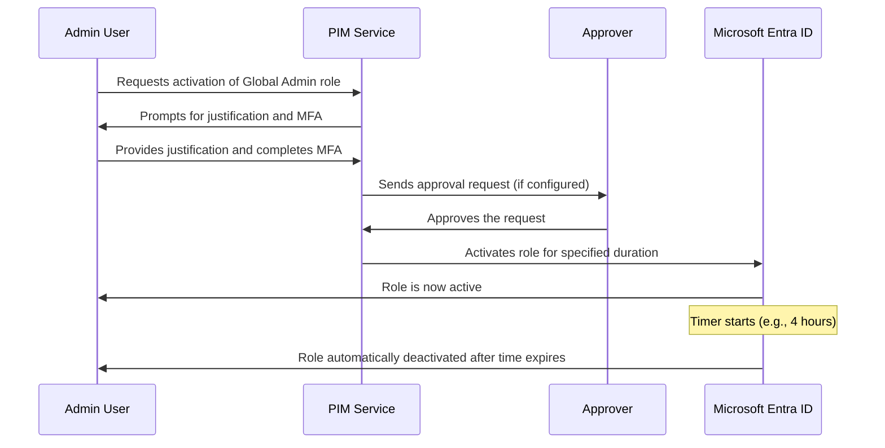

# How to Configure Microsoft Entra Privileged Identity Management for Just-in-Time Admin Access

Author: [nawazdhandala](https://www.github.com/nawazdhandala)

Tags: Azure, Microsoft Entra ID, PIM, Privileged Identity Management, Just-in-Time Access, Security, Zero Trust

Description: Configure Privileged Identity Management in Microsoft Entra ID to provide just-in-time administrative access and reduce standing privilege risks.

---

Standing administrative privileges are one of the biggest security risks in any cloud environment. When an admin account is permanently assigned the Global Administrator role, that level of access exists 24/7, whether the admin is actively working or sleeping. If that account is compromised, the attacker immediately has full control. Privileged Identity Management (PIM) in Microsoft Entra ID solves this by making administrative roles available on-demand, with time limits, approval requirements, and full audit trails.

This guide covers how to set up PIM from scratch and configure it for real-world use.

## What Is Just-in-Time Access

Just-in-Time (JIT) access means that instead of permanently holding a privileged role, users are eligible for that role. When they need it, they activate the role for a limited time period. Once the time expires, the privileges are automatically revoked.

Here is how the flow works:



The key benefit is that even if an admin's credentials are compromised, the attacker does not automatically get privileged access. They would need to activate the role, which requires MFA, a justification, and potentially an approval from another administrator.

## Prerequisites

PIM requires:

- Microsoft Entra ID P2 license for each user who will use PIM
- Global Administrator or Privileged Role Administrator role to configure PIM
- At least two emergency access accounts that are permanently assigned (not eligible) to prevent lockout

## Step 1: Access Privileged Identity Management

1. Sign in to the Microsoft Entra admin center at entra.microsoft.com.
2. Navigate to Identity governance, then Privileged Identity Management.
3. If this is your first time, you may see a consent prompt. Click Consent and complete MFA verification.

## Step 2: Review Current Permanent Role Assignments

Before configuring PIM, audit your existing role assignments to understand who has standing privileges:

1. In PIM, click Microsoft Entra roles.
2. Click Roles to see all directory roles.
3. Click on a role like Global Administrator to see who is currently assigned.
4. Note which assignments are Permanent versus Eligible.

You want to convert most permanent assignments to eligible assignments, keeping only your emergency access accounts as permanent.

## Step 3: Configure Role Settings

Each role can have its own activation settings. Let me walk through configuring the Global Administrator role as an example:

1. In PIM under Microsoft Entra roles, click Settings.
2. Find and click on Global Administrator.
3. Click Edit to modify the settings.

### Activation Settings

- **Activation maximum duration**: Set this to the minimum time needed. For Global Admin, 4 hours is usually enough. You can set it from 30 minutes to 24 hours.
- **On activation, require**: Select Azure MFA. This forces the user to complete multi-factor authentication when activating the role.
- **Require justification on activation**: Enable this. The user must explain why they need the privileges.
- **Require ticket information on activation**: Optionally enable this to require a ticket number for audit purposes.
- **Require approval to activate**: Enable this for highly sensitive roles like Global Administrator. You will then need to specify who can approve.
- **Select approvers**: Choose one or more users or groups who can approve activation requests.

### Assignment Settings

- **Allow permanent eligible assignment**: You can keep this enabled but set expiration policies for eligible assignments.
- **Expire eligible assignments after**: Set a reasonable period like 6 months or 1 year. This forces periodic review of who should be eligible.
- **Allow permanent active assignment**: Disable this for most roles. Only your emergency access accounts should have permanent active assignments.
- **Expire active assignments after**: If you allow active assignments at all, set them to expire.

### Notification Settings

Configure who gets notified when:
- A role is assigned (eligible or active)
- A role is activated
- An eligible assignment is expiring

Make sure security administrators receive activation notifications so they can monitor for unusual activity.

Click Update to save the settings.

## Step 4: Convert Permanent Assignments to Eligible

Now convert your existing permanent admins to eligible:

1. In PIM under Microsoft Entra roles, click Assignments.
2. Filter to show Active assignments for the Global Administrator role.
3. For each permanent admin (except emergency accounts), click on the assignment.
4. Click Update and change the assignment type from Active to Eligible.
5. Set an end date for the eligible assignment or leave it as permanent eligible.
6. Click Save.

You can also do this with PowerShell:

```powershell
# Connect to Microsoft Graph with PIM permissions
Connect-MgGraph -Scopes "RoleManagement.ReadWrite.Directory"

# Get the role definition ID for Global Administrator
$globalAdminRole = Get-MgRoleManagementDirectoryRoleDefinition -Filter "displayName eq 'Global Administrator'"

# Get the user you want to make eligible instead of permanent
$user = Get-MgUser -Filter "userPrincipalName eq 'admin@contoso.com'"

# Create an eligible role assignment schedule
# This replaces the permanent active assignment with an eligible one
$params = @{
    Action = "adminAssign"
    Justification = "Converting from permanent to eligible assignment"
    RoleDefinitionId = $globalAdminRole.Id
    DirectoryScopeId = "/"
    PrincipalId = $user.Id
    ScheduleInfo = @{
        StartDateTime = (Get-Date).ToUniversalTime().ToString("yyyy-MM-ddTHH:mm:ssZ")
        Expiration = @{
            # Set the eligible assignment to expire in 1 year
            Type = "afterDateTime"
            EndDateTime = (Get-Date).AddYears(1).ToUniversalTime().ToString("yyyy-MM-ddTHH:mm:ssZ")
        }
    }
}

New-MgRoleManagementDirectoryRoleEligibilityScheduleRequest -BodyParameter $params
Write-Host "Eligible assignment created for $($user.UserPrincipalName)"
```

## Step 5: Configure PIM for Azure Resource Roles

PIM is not just for directory roles. You can also manage Azure resource roles (like Owner, Contributor, etc.) on subscriptions, resource groups, and individual resources:

1. In PIM, click Azure resources.
2. Select the subscription or resource group you want to manage.
3. Click Settings and configure each role similar to how you configured directory roles.
4. Convert permanent Owner and Contributor assignments to eligible assignments.

This is especially important for production subscriptions where you want tight control over who can make changes.

## Step 6: Set Up Access Reviews

PIM works best when combined with regular access reviews that verify whether users still need their eligible role assignments:

1. In PIM under Microsoft Entra roles, click Access reviews.
2. Click New to create an access review.
3. Configure the review:
   - Select which roles to review (start with Global Administrator and other highly privileged roles)
   - Choose reviewers (the users themselves, their managers, or specific reviewers)
   - Set the frequency (monthly or quarterly for critical roles)
   - Set what happens when reviewers do not respond (remove access is the safest default)
4. Click Start.

## Step 7: Test the Activation Process

Before telling your admins about the change, test the process yourself:

1. Sign in as a user who has an eligible role assignment.
2. Go to PIM, then My roles.
3. Click on Microsoft Entra roles.
4. Find the eligible role and click Activate.
5. Enter a justification and complete MFA.
6. If approval is required, wait for an approver to approve the request.
7. Once activated, verify you have the expected permissions.
8. After the activation period expires, verify the permissions are automatically revoked.

## Monitoring and Alerts

PIM generates detailed audit logs that you should monitor:

```kusto
// Query PIM audit logs for role activations
// Use this to monitor who is activating which roles and how often
AuditLogs
| where TimeGenerated > ago(30d)
| where Category == "RoleManagement"
| where OperationName has "PIM"
| extend UserPrincipal = tostring(InitiatedBy.user.userPrincipalName)
| extend RoleName = tostring(TargetResources[0].displayName)
| extend Result = tostring(Result)
| project TimeGenerated, UserPrincipal, OperationName, RoleName, Result
| sort by TimeGenerated desc
```

Set up alerts for suspicious patterns like:
- A user activating roles much more frequently than usual
- Activations happening at unusual hours
- Role activations from unexpected locations

## Best Practices

From experience setting up PIM in various organizations, here are the practices that matter most:

First, keep your emergency access accounts outside of PIM. These accounts should have permanent Global Administrator assignments, be protected with strong unique passwords, and be stored securely. They are your safety net if PIM or Entra ID has issues.

Second, start with the most sensitive roles and expand gradually. Do not try to PIM-enable every role at once. Begin with Global Administrator, then move to Privileged Role Administrator, Security Administrator, and other high-impact roles.

Third, set the shortest reasonable activation duration. If your admins typically need elevated access for 30 minutes to make a configuration change, do not set the maximum duration to 24 hours.

Fourth, require approval for the most sensitive roles. Global Administrator and Privileged Role Administrator should require approval. Less sensitive roles can use self-activation with MFA and justification.

Fifth, integrate PIM alerts with your SIEM. Forward the audit logs to Microsoft Sentinel or your preferred SIEM platform for correlation with other security events.

## Conclusion

Privileged Identity Management transforms how your organization handles administrative access. By replacing standing privileges with just-in-time access, you dramatically reduce the window of opportunity for attackers and create a full audit trail of every privileged action. The setup takes some planning, especially around converting existing permanent assignments and communicating the change to your admin team, but the security improvement is substantial. Combined with access reviews and monitoring, PIM gives you the visibility and control that modern security requires.
