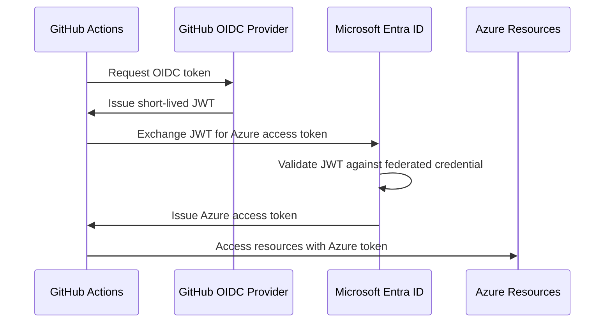

# How to Configure Microsoft Entra Workload Identity Federation for GitHub Actions CI/CD Pipelines

Author: [nawazdhandala](https://www.github.com/nawazdhandala)

Tags: Azure, Microsoft Entra ID, Workload Identity, GitHub Actions, CI/CD, Federation, OIDC

Description: Learn how to set up workload identity federation between Microsoft Entra ID and GitHub Actions to deploy to Azure without storing secrets in your repository.

---

Storing Azure service principal credentials in GitHub secrets has always felt wrong. You have a secret that grants access to your Azure resources sitting in a third-party system, it needs to be rotated periodically, and if it leaks you have a serious security incident on your hands. Workload identity federation eliminates this problem entirely. Instead of using secrets, your GitHub Actions workflow authenticates to Azure using a short-lived OIDC token issued by GitHub. No secrets to store, no secrets to rotate, no secrets to leak.

In this post, I will walk through the complete setup of workload identity federation between Microsoft Entra ID and GitHub Actions, from creating the app registration to configuring the GitHub workflow.

## How Workload Identity Federation Works

The mechanism is based on OpenID Connect (OIDC) trust. Here is what happens when your GitHub Actions workflow runs:



1. The GitHub Actions runner requests an OIDC token from GitHub's token endpoint.
2. GitHub issues a short-lived JWT that contains claims about the workflow (repository, branch, environment, etc.).
3. The workflow presents this JWT to Microsoft Entra ID and requests an Azure access token.
4. Entra ID validates the JWT against the federated credential you configured. It checks the issuer, audience, and subject claims.
5. If everything checks out, Entra ID issues an Azure access token.
6. The workflow uses that Azure token to interact with Azure resources.

The key security benefit: no long-lived credentials are involved. The GitHub OIDC token is valid for only a few minutes, and the Azure access token is similarly short-lived.

## Step 1: Create an App Registration in Entra ID

First, you need an app registration (service principal) in Entra ID that your GitHub workflow will authenticate as.

This script creates the app registration and service principal:

```bash
# Create an app registration for GitHub Actions
APP_NAME="github-actions-deploy"

APP_ID=$(az ad app create \
  --display-name $APP_NAME \
  --query appId -o tsv)

# Create a service principal for the app
SP_ID=$(az ad sp create \
  --id $APP_ID \
  --query id -o tsv)

echo "Application (client) ID: $APP_ID"
echo "Service Principal Object ID: $SP_ID"

# Get your tenant and subscription IDs for later use
TENANT_ID=$(az account show --query tenantId -o tsv)
SUBSCRIPTION_ID=$(az account show --query id -o tsv)

echo "Tenant ID: $TENANT_ID"
echo "Subscription ID: $SUBSCRIPTION_ID"
```

## Step 2: Add a Federated Credential

This is the critical step. You are telling Entra ID to trust OIDC tokens from GitHub that match specific criteria. The subject claim defines which GitHub repository and branch (or environment) can use this credential.

This creates a federated credential that only trusts tokens from a specific repository and branch:

```bash
# Create a federated credential for the main branch
# This restricts authentication to only the main branch of your specific repo
az ad app federated-credential create \
  --id $APP_ID \
  --parameters '{
    "name": "github-actions-main",
    "issuer": "https://token.actions.githubusercontent.com",
    "subject": "repo:your-org/your-repo:ref:refs/heads/main",
    "description": "GitHub Actions deploying from main branch",
    "audiences": ["api://AzureADTokenExchange"]
  }'
```

The `subject` field is where you control the scope of trust. Here are the common patterns:

```bash
# Trust a specific branch
# subject: "repo:your-org/your-repo:ref:refs/heads/main"

# Trust a specific environment (recommended for production deployments)
# subject: "repo:your-org/your-repo:environment:production"

# Trust pull requests (use cautiously)
# subject: "repo:your-org/your-repo:pull_request"

# Trust a specific tag pattern
# subject: "repo:your-org/your-repo:ref:refs/tags/v*"
```

I strongly recommend using environment-based subjects for production deployments because GitHub Environments support required reviewers and other protection rules. Let us create one for both staging and production:

```bash
# Federated credential for the staging environment
az ad app federated-credential create \
  --id $APP_ID \
  --parameters '{
    "name": "github-actions-staging",
    "issuer": "https://token.actions.githubusercontent.com",
    "subject": "repo:your-org/your-repo:environment:staging",
    "description": "GitHub Actions deploying to staging",
    "audiences": ["api://AzureADTokenExchange"]
  }'

# Federated credential for the production environment
az ad app federated-credential create \
  --id $APP_ID \
  --parameters '{
    "name": "github-actions-production",
    "issuer": "https://token.actions.githubusercontent.com",
    "subject": "repo:your-org/your-repo:environment:production",
    "description": "GitHub Actions deploying to production",
    "audiences": ["api://AzureADTokenExchange"]
  }'
```

## Step 3: Assign Azure RBAC Roles

The service principal needs appropriate permissions on the Azure resources it will manage. Assign only the minimum roles needed.

This assigns Contributor on a specific resource group rather than the entire subscription:

```bash
# Assign Contributor role on the target resource group
az role assignment create \
  --assignee $APP_ID \
  --role "Contributor" \
  --scope "/subscriptions/$SUBSCRIPTION_ID/resourceGroups/rg-myapp-prod"

# If you only need to deploy web apps, use a more specific role
az role assignment create \
  --assignee $APP_ID \
  --role "Website Contributor" \
  --scope "/subscriptions/$SUBSCRIPTION_ID/resourceGroups/rg-myapp-prod"
```

## Step 4: Configure GitHub Repository Settings

In your GitHub repository, you need to add a few variables (not secrets - since there are no secrets) that the workflow will use. Go to Settings, then Secrets and variables, then Actions, and add these as variables:

- `AZURE_CLIENT_ID` - The Application (client) ID from step 1
- `AZURE_TENANT_ID` - Your Entra ID tenant ID
- `AZURE_SUBSCRIPTION_ID` - Your Azure subscription ID

Note that these are safe to store as plain variables (not secrets) because they are not sensitive on their own. An attacker cannot authenticate with just these values; they also need a valid OIDC token from GitHub, which requires running a workflow in your repository.

## Step 5: Create the GitHub Actions Workflow

Now create the workflow that uses workload identity federation. The key components are the `permissions` block (which grants the workflow permission to request an OIDC token) and the `azure/login` action configured for OIDC.

This is a complete workflow that authenticates to Azure and deploys a web application:

```yaml
# .github/workflows/deploy.yml
# Deploys to Azure using workload identity federation (no secrets required)
name: Deploy to Azure

on:
  push:
    branches: [main]

# These permissions are required for the OIDC token request
permissions:
  id-token: write   # Required to request the OIDC JWT
  contents: read     # Required to checkout the repository

jobs:
  deploy-staging:
    name: Deploy to Staging
    runs-on: ubuntu-latest
    environment: staging  # Must match the federated credential subject

    steps:
      - name: Checkout code
        uses: actions/checkout@v4

      # Authenticate to Azure using OIDC - no secrets involved
      - name: Azure Login
        uses: azure/login@v2
        with:
          client-id: ${{ vars.AZURE_CLIENT_ID }}
          tenant-id: ${{ vars.AZURE_TENANT_ID }}
          subscription-id: ${{ vars.AZURE_SUBSCRIPTION_ID }}

      # Now you can run any Azure CLI or deployment commands
      - name: Deploy Web App
        uses: azure/webapps-deploy@v3
        with:
          app-name: myapp-staging
          package: ./dist

      # Verify the deployment
      - name: Smoke Test
        run: |
          # Simple health check on the deployed application
          HTTP_STATUS=$(curl -s -o /dev/null -w "%{http_code}" https://myapp-staging.azurewebsites.net/health)
          if [ "$HTTP_STATUS" != "200" ]; then
            echo "Health check failed with status $HTTP_STATUS"
            exit 1
          fi
          echo "Health check passed"

  deploy-production:
    name: Deploy to Production
    runs-on: ubuntu-latest
    needs: deploy-staging  # Only deploy to prod after staging succeeds
    environment: production  # Must match the federated credential subject

    steps:
      - name: Checkout code
        uses: actions/checkout@v4

      - name: Azure Login
        uses: azure/login@v2
        with:
          client-id: ${{ vars.AZURE_CLIENT_ID }}
          tenant-id: ${{ vars.AZURE_TENANT_ID }}
          subscription-id: ${{ vars.AZURE_SUBSCRIPTION_ID }}

      - name: Deploy Web App
        uses: azure/webapps-deploy@v3
        with:
          app-name: myapp-production
          package: ./dist
```

## Step 6: Test and Verify

Push a commit to your main branch and watch the workflow run. In the "Azure Login" step, you should see output indicating that OIDC authentication was used instead of a service principal secret.

If the authentication fails, check these common issues:

**"AADSTS70021: No matching federated identity record found"** - This means the subject claim in the OIDC token does not match any of your federated credentials. Double-check that the repository name, branch, and environment in the subject exactly match your workflow.

**"AADSTS700016: Application not found"** - The client ID is wrong or the app registration was deleted.

**"AuthorizationFailed"** - The service principal does not have the right RBAC role on the target resource. Check your role assignments.

## Security Best Practices

**Use environment-based subjects for production.** Branch-based subjects are fine for development, but production deployments should use GitHub Environments with required reviewers. This adds a human approval gate before the federated credential can be used.

**Create separate app registrations per environment.** Instead of one app registration with multiple federated credentials, consider separate registrations for staging and production with different RBAC permissions. This limits blast radius.

**Audit federated credential usage.** Check the Entra ID sign-in logs periodically to see when and how the federated credentials are being used. Look for any unexpected usage patterns.

**Limit the subject scope.** Never use a wildcard subject like `repo:your-org/your-repo:*` unless you have a specific reason. The more specific the subject, the smaller the attack surface.

## Migrating from Service Principal Secrets

If you are currently using service principal secrets in your GitHub workflows, here is the migration path:

1. Create federated credentials on your existing app registration (you do not need a new one).
2. Update your workflow to use the OIDC login method.
3. Test in a non-production environment.
4. Once confirmed working, remove the old client secret from the app registration and delete it from GitHub Secrets.

The best part is you can have both authentication methods active during the transition period, so there is no downtime.

## Wrapping Up

Workload identity federation is one of those security improvements that also makes your life easier. You get better security (no long-lived secrets) and less operational overhead (no secret rotation) at the same time. The setup is a one-time investment of maybe 30 minutes, and after that your CI/CD pipeline authenticates to Azure cleanly without any stored credentials. If you are still using service principal secrets in your GitHub Actions workflows, this should be at the top of your migration list.
