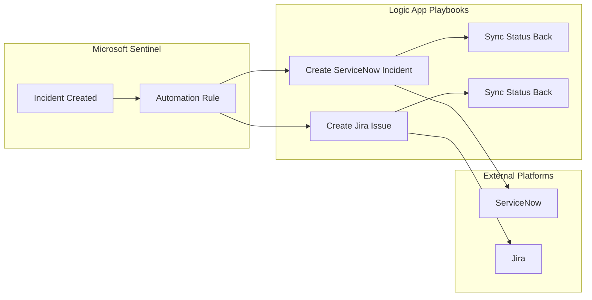

# How to Configure Microsoft Sentinel SOAR Connectors to Integrate with ServiceNow and Jira

Author: [nawazdhandala](https://www.github.com/nawazdhandala)

Tags: Azure, Microsoft Sentinel, SOAR, ServiceNow, Jira, Automation, Incident Response

Description: Learn how to connect Microsoft Sentinel to ServiceNow and Jira for automated incident ticket creation, bidirectional sync, and streamlined security operations workflows.

---

Security operations teams rarely work exclusively in their SIEM tool. Incidents need to be tracked in ServiceNow for IT service management workflows. Vulnerability findings need Jira tickets for engineering teams to remediate. Manually copying incident details between tools is slow and error-prone. Microsoft Sentinel's SOAR (Security Orchestration, Automation, and Response) capabilities let you automate these integrations through Logic App playbooks.

In this guide, I will cover setting up both ServiceNow and Jira integrations with Sentinel, including automatic ticket creation, bidirectional status sync, and enrichment workflows.

## Architecture Overview

The integration uses Logic Apps (playbooks) that are triggered by Sentinel incidents or alerts. Each playbook connects to the target platform through managed API connectors.



## Prerequisites

- Microsoft Sentinel workspace with incidents being generated
- ServiceNow instance with REST API access (Admin role needed for initial setup)
- Jira Cloud or Jira Data Center with API access
- Logic App Contributor role on the resource group
- Service accounts in ServiceNow and Jira for the integration

## Part 1: ServiceNow Integration

### Step 1: Install the ServiceNow Sentinel Solution

In Microsoft Sentinel, go to Content Hub and search for "ServiceNow." Install the "Microsoft Sentinel Solution for ServiceNow" package. This installs:

- Logic App playbooks for ticket creation and sync
- Automation rule templates
- Workbook for monitoring the integration

### Step 2: Create a ServiceNow Service Account

In your ServiceNow instance, create a dedicated service account for the Sentinel integration:

1. Go to User Administration, then Users
2. Create a new user (for example, `sentinel.integration`)
3. Assign the `itil` role for incident management capabilities
4. Generate or set a password
5. Ensure the user has the `rest_api_explorer` role if you need to test API calls

### Step 3: Create the ServiceNow Incident Playbook

Create a Logic App that creates a ServiceNow incident from a Sentinel incident:

```json
{
  // Logic App definition for creating ServiceNow incidents from Sentinel
  "definition": {
    "$schema": "https://schema.management.azure.com/providers/Microsoft.Logic/schemas/2016-06-01/workflowdefinition.json#",
    "triggers": {
      "Microsoft_Sentinel_incident": {
        "type": "ApiConnectionWebhook",
        "inputs": {
          "host": {
            "connection": {
              "name": "@parameters('$connections')['azuresentinel']['connectionId']"
            }
          },
          "body": {
            "callback_url": "@{listCallbackUrl()}"
          },
          "path": "/incident-creation"
        }
      }
    },
    "actions": {
      "Create_ServiceNow_Incident": {
        "type": "ApiConnection",
        "inputs": {
          "host": {
            "connection": {
              "name": "@parameters('$connections')['service-now']['connectionId']"
            }
          },
          "method": "post",
          "path": "/api/now/v2/table/incident",
          "body": {
            // Map Sentinel incident fields to ServiceNow fields
            "short_description": "Sentinel: @{triggerBody()?['object']?['properties']?['title']}",
            "description": "@{triggerBody()?['object']?['properties']?['description']}\n\nSeverity: @{triggerBody()?['object']?['properties']?['severity']}\nIncident URL: @{triggerBody()?['object']?['properties']?['incidentUrl']}",
            "urgency": "@{if(equals(triggerBody()?['object']?['properties']?['severity'], 'High'), '1', if(equals(triggerBody()?['object']?['properties']?['severity'], 'Medium'), '2', '3'))}",
            "impact": "@{if(equals(triggerBody()?['object']?['properties']?['severity'], 'High'), '1', if(equals(triggerBody()?['object']?['properties']?['severity'], 'Medium'), '2', '3'))}",
            "category": "Security",
            "assignment_group": "Security Operations",
            "caller_id": "sentinel.integration"
          }
        }
      },
      "Add_comment_to_Sentinel_incident": {
        "type": "ApiConnection",
        "runAfter": {
          "Create_ServiceNow_Incident": ["Succeeded"]
        },
        "inputs": {
          "host": {
            "connection": {
              "name": "@parameters('$connections')['azuresentinel']['connectionId']"
            }
          },
          "method": "post",
          "path": "/incident-comments",
          "body": {
            "incidentArmId": "@triggerBody()?['object']?['id']",
            "message": "ServiceNow incident created: @{body('Create_ServiceNow_Incident')?['result']?['number']}\nServiceNow URL: https://yourinstance.service-now.com/nav_to.do?uri=incident.do?sys_id=@{body('Create_ServiceNow_Incident')?['result']?['sys_id']}"
          }
        }
      }
    }
  }
}
```

You can create this through the Logic App designer in the portal rather than writing JSON:

1. Create a new Logic App
2. Add trigger: "Microsoft Sentinel incident"
3. Add action: "ServiceNow - Create Record"
4. Map the fields as shown above
5. Add action: "Microsoft Sentinel - Add comment to incident"
6. Include the ServiceNow ticket number in the comment

### Step 4: Create an Automation Rule to Trigger the Playbook

In Sentinel, go to Automation and create a new automation rule:

- **Name:** "Create ServiceNow ticket for high severity incidents"
- **Trigger:** When incident is created
- **Conditions:** Incident severity equals High
- **Actions:** Run playbook - select the ServiceNow playbook you created

### Step 5: Set Up Bidirectional Status Sync

When the ServiceNow incident is resolved, you want the Sentinel incident to be updated too. Create a second Logic App that polls ServiceNow for status changes:

```json
{
  // Polling-based sync from ServiceNow to Sentinel
  "triggers": {
    "Recurrence": {
      "type": "Recurrence",
      "recurrence": {
        "frequency": "Minute",
        "interval": 5
      }
    }
  },
  "actions": {
    "Query_resolved_ServiceNow_incidents": {
      "type": "ApiConnection",
      "inputs": {
        "host": {
          "connection": {
            "name": "@parameters('$connections')['service-now']['connectionId']"
          }
        },
        "method": "get",
        // Find recently resolved incidents created by Sentinel
        "path": "/api/now/v2/table/incident",
        "queries": {
          "sysparm_query": "caller_id=sentinel.integration^state=6^sys_updated_on>=javascript:gs.minutesAgoStart(10)",
          "sysparm_limit": "50"
        }
      }
    }
  }
}
```

For each resolved ServiceNow incident, the playbook extracts the Sentinel incident ID from the description, finds the corresponding Sentinel incident, and closes it.

## Part 2: Jira Integration

### Step 1: Create a Jira API Token

In Jira Cloud:

1. Go to https://id.atlassian.com/manage/api-tokens
2. Click "Create API token"
3. Give it a label like "Sentinel Integration"
4. Copy the token (you will not see it again)

For Jira Data Center, create a Personal Access Token in your user profile settings.

### Step 2: Create the Jira Issue Playbook

Create a Logic App that creates Jira issues from Sentinel incidents:

In the Logic App designer:

1. **Trigger:** Microsoft Sentinel incident
2. **Action:** HTTP request to Jira REST API

Since the managed Jira connector has limitations, using the HTTP action with the REST API gives you more control:

```json
{
  // Logic App action to create a Jira issue via REST API
  "Create_Jira_Issue": {
    "type": "Http",
    "inputs": {
      "method": "POST",
      "uri": "https://yourcompany.atlassian.net/rest/api/3/issue",
      "headers": {
        "Content-Type": "application/json",
        // Basic auth with email:api_token base64 encoded
        // Store credentials in Key Vault and reference them
        "Authorization": "Basic @{base64(concat('sentinel-bot@company.com', ':', parameters('JiraApiToken')))}"
      },
      "body": {
        "fields": {
          "project": {
            "key": "SEC"
          },
          "issuetype": {
            // Issue type for security incidents
            "name": "Bug"
          },
          // Map Sentinel severity to Jira priority
          "priority": {
            "name": "@{if(equals(triggerBody()?['object']?['properties']?['severity'], 'High'), 'High', if(equals(triggerBody()?['object']?['properties']?['severity'], 'Medium'), 'Medium', 'Low'))}"
          },
          "summary": "[Sentinel] @{triggerBody()?['object']?['properties']?['title']}",
          "description": {
            "type": "doc",
            "version": 1,
            "content": [
              {
                "type": "paragraph",
                "content": [
                  {
                    "type": "text",
                    "text": "@{triggerBody()?['object']?['properties']?['description']}"
                  }
                ]
              },
              {
                "type": "paragraph",
                "content": [
                  {
                    "type": "text",
                    "text": "Sentinel Incident URL: @{triggerBody()?['object']?['properties']?['incidentUrl']}"
                  }
                ]
              }
            ]
          },
          "labels": ["sentinel", "security-incident"]
        }
      }
    }
  }
}
```

### Step 3: Add Entity Enrichment

Before creating the ticket, enrich it with entity information from the Sentinel incident. This saves analysts from having to switch back to Sentinel to get details:

```json
{
  "Get_Entities": {
    "type": "ApiConnection",
    "inputs": {
      "host": {
        "connection": {
          "name": "@parameters('$connections')['azuresentinel']['connectionId']"
        }
      },
      "method": "post",
      "path": "/entities/@{triggerBody()?['object']?['id']}"
    }
  },
  "For_each_entity": {
    "type": "Foreach",
    "foreach": "@body('Get_Entities')?['entities']",
    "actions": {
      "Append_entity_to_description": {
        "type": "AppendToStringVariable",
        "inputs": {
          "name": "entityDetails",
          "value": "Entity: @{items('For_each_entity')?['kind']} - @{items('For_each_entity')?['properties']?['friendlyName']}\n"
        }
      }
    }
  }
}
```

Include the entity details in the Jira issue description so the security team has all the context they need.

### Step 4: Configure the Automation Rule

Create an automation rule for Jira ticket creation. You might want different rules for different scenarios:

- High severity incidents create Jira tickets in the SEC project
- Incidents tagged "vulnerability" create tickets in the VULN project
- Incidents from specific analytics rules create tickets assigned to specific teams

```bash
# Example: Create an automation rule via Sentinel API
# This triggers the Jira playbook for medium and high severity incidents
az sentinel automation-rule create \
  --resource-group myResourceGroup \
  --workspace-name mySentinelWorkspace \
  --name "create-jira-for-security-incidents" \
  --display-name "Create Jira issue for security incidents" \
  --order 1 \
  --triggering-logic '{"isEnabled": true, "triggersOn": "Incidents", "triggersWhen": "Created", "conditions": [{"conditionType": "Property", "conditionProperties": {"propertyName": "IncidentSeverity", "operator": "Contains", "propertyValues": ["High", "Medium"]}}]}'
```

## Part 3: Monitoring the Integration

### Create a Health Monitoring Workbook

Build a Sentinel workbook that tracks the health of your SOAR integrations:

```
// Track playbook execution success and failures
AzureDiagnostics
| where ResourceProvider == "MICROSOFT.LOGIC"
| where TimeGenerated > ago(7d)
| summarize
    Succeeded = countif(status_s == "Succeeded"),
    Failed = countif(status_s == "Failed"),
    Running = countif(status_s == "Running")
    by resource_workflowName_s, bin(TimeGenerated, 1h)
| order by TimeGenerated desc
```

### Handle Failures

Playbook failures are inevitable. ServiceNow might be down for maintenance, or the Jira API token might expire. Set up retry policies and failure notifications:

1. In the Logic App, configure retry policies on the HTTP actions (3 retries with exponential backoff)
2. Add an error handling scope that sends a notification when the playbook fails
3. Monitor the Logic App failure rate in Azure Monitor

## Best Practices

- Use service accounts with minimal permissions for both ServiceNow and Jira. Do not use personal accounts.
- Store API tokens and credentials in Azure Key Vault, not in the Logic App parameters directly.
- Map Sentinel severity to the target platform's priority/urgency correctly. A mismatch can cause SOC confusion.
- Include the Sentinel incident URL in every ticket so analysts can easily navigate back.
- Implement bidirectional sync for status changes. Closing a ticket in ServiceNow should update Sentinel, and vice versa.
- Test the integration with low-severity test incidents before connecting it to real alerts.
- Monitor playbook execution metrics and set up alerts for failure spikes.

## Summary

Integrating Microsoft Sentinel with ServiceNow and Jira through SOAR playbooks eliminates the manual overhead of creating tickets and syncing status between platforms. Use Logic Apps as the glue, map incident fields to ticket fields, include entity enrichment for analyst context, and set up bidirectional status sync. The result is a streamlined workflow where security incidents flow automatically into your IT service management and project tracking systems, with all the relevant context attached.
