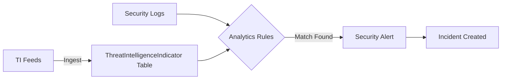

# How to Configure Microsoft Sentinel Threat Intelligence Connectors and Indicator Matching Rules

Author: [nawazdhandala](https://www.github.com/nawazdhandala)

Tags: Microsoft Sentinel, Threat Intelligence, STIX, TAXII, SIEM, Indicators of Compromise, Security Operations

Description: A practical guide to connecting threat intelligence feeds to Microsoft Sentinel and creating analytics rules that match indicators against your log data.

---

Threat intelligence turns raw security data into actionable context. Instead of looking at millions of log entries and trying to spot malicious activity, you match your logs against known indicators of compromise (IOCs) - malicious IP addresses, domain names, file hashes, and URLs that have been identified by threat researchers. Microsoft Sentinel's threat intelligence framework lets you ingest these indicators from multiple sources and automatically match them against your security data.

In this guide, I will cover how to connect threat intelligence feeds to Sentinel, manage the indicators, and create analytics rules that generate alerts when your environment communicates with known threats.

## Understanding Threat Intelligence in Sentinel

Sentinel supports two types of threat intelligence data:

**Indicators of Compromise (IOCs)**: Individual data points like IP addresses, domain names, URLs, file hashes, and email addresses that are associated with known threats. These are stored in the `ThreatIntelligenceIndicator` table.

**Threat Intelligence Platforms (TIPs)**: External platforms that aggregate and curate threat intelligence from multiple sources. Sentinel can pull indicators from these platforms via APIs.

The matching workflow looks like this:



## Step 1: Enable the Threat Intelligence Data Connectors

Sentinel offers several ways to ingest threat intelligence. Navigate to Microsoft Sentinel > Content hub and install the "Threat Intelligence" solution, which includes the data connectors and analytics rule templates.

### Connector 1: Microsoft Defender Threat Intelligence

This is the simplest connector - it pulls indicators from Microsoft's own threat intelligence, which covers a broad range of threats based on Microsoft's visibility into the global threat landscape.

```bash
# Enable the Microsoft Defender Threat Intelligence connector
az sentinel data-connector create \
  --resource-group sentinel-rg \
  --workspace-name sentinel-workspace \
  --data-connector-id "MicrosoftDefenderThreatIntelligence" \
  --kind "MicrosoftThreatIntelligence" \
  --properties '{"dataTypes":{"microsoftEmergingThreatFeed":{"lookbackPeriod":"1970-01-01T00:00:00Z","state":"Enabled"}}}'
```

### Connector 2: TAXII Server

TAXII (Trusted Automated Exchange of Indicator Information) is an industry standard protocol for sharing threat intelligence. Many open-source and commercial TI providers offer TAXII feeds.

Navigate to Microsoft Sentinel > Data connectors > Threat Intelligence - TAXII.

Configure the TAXII connection with these parameters:

- **Friendly name**: A descriptive name for the feed
- **API root URL**: The TAXII server's API root (e.g., `https://limo.anomali.com/api/v1/taxii2/taxii/`)
- **Collection ID**: The specific collection to subscribe to
- **Username/Password**: Credentials for the TAXII server (if required)
- **Polling frequency**: How often to check for new indicators

Here is an example using the popular Anomali Limo free feed.

```bash
# Configure a TAXII feed connector (example with Anomali Limo)
az sentinel data-connector create \
  --resource-group sentinel-rg \
  --workspace-name sentinel-workspace \
  --data-connector-id "TaxiiAnomali" \
  --kind "ThreatIntelligenceTaxii" \
  --properties '{
    "tenantId": "YOUR_TENANT_ID",
    "workspaceId": "YOUR_WORKSPACE_ID",
    "friendlyName": "Anomali Limo Free Feed",
    "taxiiServer": "https://limo.anomali.com/api/v1/taxii2/taxii/",
    "collectionId": "YOUR_COLLECTION_ID",
    "userName": "guest",
    "password": "guest",
    "pollingFrequency": "OnceAnHour",
    "dataTypes": {
      "taxiiClient": {
        "state": "Enabled"
      }
    }
  }'
```

### Connector 3: Threat Intelligence Upload API

For custom feeds or indicators from your own research, use the Upload Indicators API to push indicators directly to Sentinel.

```python
# Python script to upload custom threat indicators to Sentinel
import requests
import json
from datetime import datetime, timedelta

# Azure authentication (use your preferred method)
headers = {
    "Authorization": f"Bearer {access_token}",
    "Content-Type": "application/json"
}

# Define a malicious IP indicator in STIX format
indicator = {
    "sourcesystem": "CustomThreatFeed",
    "indicators": [
        {
            "type": "indicator",
            "spec_version": "2.1",
            "id": "indicator--custom-001",
            "created": datetime.utcnow().isoformat() + "Z",
            "modified": datetime.utcnow().isoformat() + "Z",
            "name": "Malicious C2 Server",
            "description": "Command and control server identified by internal research",
            "pattern": "[ipv4-addr:value = '203.0.113.50']",
            "pattern_type": "stix",
            "valid_from": datetime.utcnow().isoformat() + "Z",
            "valid_until": (datetime.utcnow() + timedelta(days=90)).isoformat() + "Z",
            "confidence": 85,
            "labels": ["malicious-activity", "c2"],
            "threat_types": ["malware"]
        }
    ]
}

# Upload the indicator to Sentinel
response = requests.post(
    f"https://sentinelus.azure-api.net/workspaces/{workspace_id}/threatintelligenceindicators:upload?api-version=2024-01-01-preview",
    headers=headers,
    json=indicator
)

print(f"Upload status: {response.status_code}")
```

## Step 2: Verify Indicator Ingestion

After configuring the connectors, verify that indicators are flowing into the `ThreatIntelligenceIndicator` table.

Navigate to Microsoft Sentinel > Threat Intelligence to see the indicator management blade. You can filter by source, type, and confidence level.

Or run a KQL query to check the data.

```kql
// Check the volume and types of threat intelligence indicators
ThreatIntelligenceIndicator
| where TimeGenerated > ago(24h)
| summarize Count = count() by IndicatorType = tostring(parse_json(AdditionalInformation).IndicatorProvider), ThreatType
| order by Count desc
```

```kql
// View the most recent indicators with their details
ThreatIntelligenceIndicator
| where TimeGenerated > ago(1h)
| where Active == true
| project TimeGenerated, IndicatorType = ThreatType, NetworkIP, DomainName, Url, FileHashValue,
    Confidence = ConfidenceScore, Source = SourceSystem, ExpirationDateTime
| take 20
```

## Step 3: Create Analytics Rules for Indicator Matching

This is where the intelligence becomes actionable. Analytics rules match the indicators against your actual log data and generate alerts when there is a hit.

Sentinel provides built-in rule templates for the most common matching scenarios. Navigate to Analytics > Rule templates and search for "TI map" to find them.

### Rule: TI Map IP Entity to Network Data

This rule matches malicious IP indicators against network connection logs.

```kql
// Match threat intelligence IPs against network connection logs
let dt_lookBack = 1h;
let ioc_lookBack = 14d;
// Get active IP indicators
let IP_Indicators = ThreatIntelligenceIndicator
    | where TimeGenerated >= ago(ioc_lookBack)
    | where Active == true
    | where isnotempty(NetworkIP) or isnotempty(NetworkSourceIP) or isnotempty(NetworkDestinationIP)
    | extend TI_IP = coalesce(NetworkIP, NetworkSourceIP, NetworkDestinationIP)
    | summarize LatestIndicatorTime = arg_max(TimeGenerated, *) by TI_IP;
// Join against common network log tables
IP_Indicators
| join kind=inner (
    CommonSecurityLog
    | where TimeGenerated >= ago(dt_lookBack)
    | where isnotempty(DestinationIP)
    | extend CSL_IP = DestinationIP
) on $left.TI_IP == $right.CSL_IP
| project AlertTime = TimeGenerated1, ThreatIP = TI_IP, Description, Confidence = ConfidenceScore,
    SourceDevice = DeviceName, DestinationIP, Activity, LogSource = DeviceVendor
```

Enable this as a scheduled analytics rule that runs every hour. When an IP from your firewall or proxy logs matches a threat intelligence indicator, an alert is created and optionally grouped into an incident.

### Rule: TI Map Domain Entity to DNS Events

This rule matches malicious domain indicators against DNS query logs.

```kql
// Match threat intelligence domains against DNS query logs
let dt_lookBack = 1h;
let ioc_lookBack = 14d;
let Domain_Indicators = ThreatIntelligenceIndicator
    | where TimeGenerated >= ago(ioc_lookBack)
    | where Active == true
    | where isnotempty(DomainName)
    | summarize LatestIndicatorTime = arg_max(TimeGenerated, *) by DomainName;
Domain_Indicators
| join kind=inner (
    DnsEvents
    | where TimeGenerated >= ago(dt_lookBack)
    | where isnotempty(Name)
) on $left.DomainName == $right.Name
| project AlertTime = TimeGenerated1, MaliciousDomain = DomainName, Description,
    Confidence = ConfidenceScore, ClientIP, QueryType = QueryType
```

### Rule: TI Map File Hash to Security Events

This rule matches file hash indicators against endpoint security logs.

```kql
// Match threat intelligence file hashes against endpoint logs
let dt_lookBack = 1h;
let ioc_lookBack = 14d;
let Hash_Indicators = ThreatIntelligenceIndicator
    | where TimeGenerated >= ago(ioc_lookBack)
    | where Active == true
    | where isnotempty(FileHashValue)
    | summarize LatestIndicatorTime = arg_max(TimeGenerated, *) by FileHashValue;
Hash_Indicators
| join kind=inner (
    DeviceFileEvents
    | where TimeGenerated >= ago(dt_lookBack)
    | where isnotempty(SHA256)
    | extend FileHash = SHA256
) on $left.FileHashValue == $right.FileHash
| project AlertTime = TimeGenerated1, MaliciousHash = FileHashValue, FileName,
    DeviceName, Description, Confidence = ConfidenceScore
```

## Step 4: Configure Alert Grouping and Incident Creation

For the analytics rules you create, configure incident settings to avoid alert fatigue.

In the analytics rule settings:
- **Incident settings**: Enable incident creation
- **Alert grouping**: Group alerts into a single incident when they share the same TI indicator. This prevents 50 separate incidents if the same malicious IP is seen in 50 different connections.
- **Entity mapping**: Map the indicator value to the appropriate entity type (IP address, domain, file hash) so that Sentinel can enrich the incident with entity details.

## Step 5: Manage Indicator Lifecycle

Threat indicators have a shelf life. An IP address used for a phishing campaign six months ago may be clean now. Manage the lifecycle of your indicators to reduce false positives.

```kql
// Find indicators that have expired but are still marked as active
ThreatIntelligenceIndicator
| where Active == true
| where ExpirationDateTime < now()
| summarize Count = count() by SourceSystem
```

Expired indicators should be deactivated. Most connectors handle this automatically, but custom-uploaded indicators may need manual cleanup.

```bash
# Deactivate an expired indicator using the API
az rest --method PATCH \
  --url "https://management.azure.com/subscriptions/YOUR_SUB/resourceGroups/sentinel-rg/providers/Microsoft.OperationalInsights/workspaces/sentinel-workspace/providers/Microsoft.SecurityInsights/threatIntelligence/main/indicators/indicator-id?api-version=2024-01-01-preview" \
  --body '{"properties":{"active":false}}'
```

## Wrapping Up

Microsoft Sentinel's threat intelligence framework turns external threat data into automated detection. Connect your preferred TI feeds through TAXII, the Microsoft Defender TI connector, or the upload API. Then create analytics rules that match indicators against your network, DNS, and endpoint logs. The combination of curated threat intelligence and automated matching means your SOC team gets alerted to known threats without manually sifting through millions of log entries. Start with the built-in rule templates, tune the confidence thresholds to reduce noise, and add custom feeds as your threat intelligence program matures.
