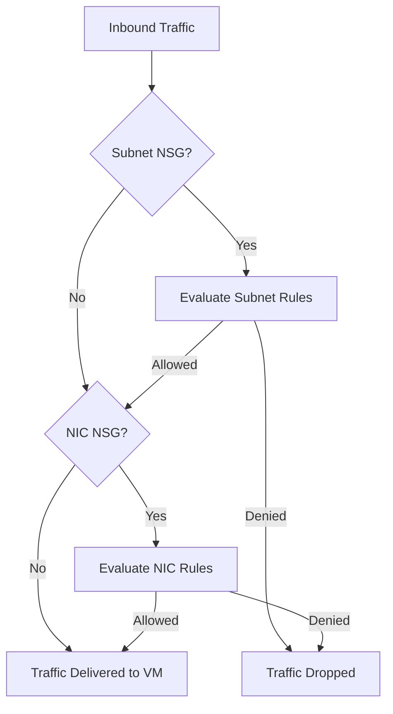

# How to Configure Network Security Group Rules for Azure Virtual Machines

Author: [nawazdhandala](https://www.github.com/nawazdhandala)

Tags: Azure, Network Security Group, NSG, Virtual Machine, Networking, Security, Firewall

Description: Learn how to create and manage Azure Network Security Group rules to control inbound and outbound traffic for your virtual machines.

---

Network Security Groups (NSGs) are the first line of defense for your Azure virtual machines. They act as a virtual firewall, filtering traffic based on rules you define. Every VM should have well-configured NSG rules, but getting them right requires understanding how NSGs work, where they can be applied, and how rules are evaluated.

In this post, I will cover everything you need to know about configuring NSG rules, from basic port-opening to more advanced patterns.

## What Is a Network Security Group?

An NSG is a collection of security rules that allow or deny network traffic. Each rule specifies a source, destination, port, protocol, and whether to allow or deny the matching traffic. NSGs can be associated with either a network interface (NIC) or a subnet.

When you create a VM using the Azure CLI or portal, Azure usually creates a default NSG and associates it with the VM's NIC. This default NSG has a few built-in rules and, depending on the options you chose, might have an SSH or RDP rule.

## Default Rules

Every NSG comes with three default inbound rules and three default outbound rules. You cannot delete these, but you can override them with higher-priority rules.

Default inbound rules:
- **AllowVNetInBound** (priority 65000): Allow all traffic from the virtual network.
- **AllowAzureLoadBalancerInBound** (priority 65001): Allow traffic from the Azure load balancer.
- **DenyAllInBound** (priority 65500): Deny everything else.

Default outbound rules:
- **AllowVNetOutBound** (priority 65000): Allow all outbound traffic to the virtual network.
- **AllowInternetOutBound** (priority 65001): Allow outbound traffic to the internet.
- **DenyAllOutBound** (priority 65500): Deny everything else.

The key takeaway: by default, inbound traffic from the internet is blocked, and outbound traffic to the internet is allowed. You need to explicitly open inbound ports.

## Creating an NSG

If you need to create a new NSG:

```bash
# Create a new Network Security Group
az network nsg create \
  --resource-group myResourceGroup \
  --name myNSG \
  --location eastus
```

## Adding Inbound Rules

The most common task is opening inbound ports. Here is how to allow SSH traffic:

```bash
# Allow inbound SSH (port 22) from any source
az network nsg rule create \
  --resource-group myResourceGroup \
  --nsg-name myNSG \
  --name AllowSSH \
  --priority 1000 \
  --direction Inbound \
  --access Allow \
  --protocol Tcp \
  --source-address-prefixes '*' \
  --source-port-ranges '*' \
  --destination-address-prefixes '*' \
  --destination-port-ranges 22
```

Let me explain each parameter:

- `--priority`: A number between 100 and 4096. Lower numbers are evaluated first. Leave gaps (like 100, 200, 300) so you can insert rules later.
- `--direction`: Inbound or Outbound.
- `--access`: Allow or Deny.
- `--protocol`: Tcp, Udp, Icmp, or * for any.
- `--source-address-prefixes`: Where the traffic comes from. Use * for anywhere, a CIDR range like 10.0.0.0/24, or a service tag like Internet.
- `--destination-port-ranges`: The port or port range to match.

## Restricting Access by Source IP

Opening SSH to the entire internet is a bad practice. Restrict it to your IP address or your office network:

```bash
# Allow SSH only from a specific IP address
az network nsg rule create \
  --resource-group myResourceGroup \
  --nsg-name myNSG \
  --name AllowSSH-MyIP \
  --priority 1000 \
  --direction Inbound \
  --access Allow \
  --protocol Tcp \
  --source-address-prefixes '203.0.113.50/32' \
  --source-port-ranges '*' \
  --destination-address-prefixes '*' \
  --destination-port-ranges 22
```

You can specify multiple source addresses:

```bash
# Allow SSH from multiple IP addresses
az network nsg rule create \
  --resource-group myResourceGroup \
  --nsg-name myNSG \
  --name AllowSSH-Team \
  --priority 1000 \
  --direction Inbound \
  --access Allow \
  --protocol Tcp \
  --source-address-prefixes '203.0.113.50/32' '198.51.100.0/24' \
  --source-port-ranges '*' \
  --destination-address-prefixes '*' \
  --destination-port-ranges 22
```

## Opening Multiple Ports

You can open a range of ports or multiple specific ports in a single rule:

```bash
# Allow HTTP (80) and HTTPS (443) from anywhere
az network nsg rule create \
  --resource-group myResourceGroup \
  --nsg-name myNSG \
  --name AllowWeb \
  --priority 1010 \
  --direction Inbound \
  --access Allow \
  --protocol Tcp \
  --source-address-prefixes '*' \
  --source-port-ranges '*' \
  --destination-address-prefixes '*' \
  --destination-port-ranges 80 443
```

For a port range:

```bash
# Allow a range of ports (e.g., for a custom application)
az network nsg rule create \
  --resource-group myResourceGroup \
  --nsg-name myNSG \
  --name AllowAppPorts \
  --priority 1020 \
  --direction Inbound \
  --access Allow \
  --protocol Tcp \
  --source-address-prefixes '10.0.0.0/16' \
  --source-port-ranges '*' \
  --destination-address-prefixes '*' \
  --destination-port-ranges '8000-8999'
```

## Using Service Tags

Service tags are predefined labels that represent groups of IP addresses for Azure services. They save you from having to track IP ranges that change over time.

Common service tags:

- **Internet**: All public IP addresses.
- **VirtualNetwork**: The virtual network address space plus connected networks.
- **AzureLoadBalancer**: The Azure load balancer health probes.
- **AzureCloud**: All Azure datacenter IP addresses.
- **Storage**: Azure Storage service IP addresses.
- **Sql**: Azure SQL Database IP addresses.

Example using a service tag:

```bash
# Allow traffic from Azure SQL to a backend subnet
az network nsg rule create \
  --resource-group myResourceGroup \
  --nsg-name myNSG \
  --name AllowAzureSQL \
  --priority 1030 \
  --direction Inbound \
  --access Allow \
  --protocol Tcp \
  --source-address-prefixes Sql \
  --source-port-ranges '*' \
  --destination-address-prefixes '*' \
  --destination-port-ranges 1433
```

## Creating Deny Rules

Sometimes you want to explicitly deny traffic. Deny rules should have a lower priority number (higher priority) than any allow rules they need to override:

```bash
# Deny all inbound traffic from a specific IP range
az network nsg rule create \
  --resource-group myResourceGroup \
  --nsg-name myNSG \
  --name DenySuspiciousRange \
  --priority 900 \
  --direction Inbound \
  --access Deny \
  --protocol '*' \
  --source-address-prefixes '192.0.2.0/24' \
  --source-port-ranges '*' \
  --destination-address-prefixes '*' \
  --destination-port-ranges '*'
```

## Associating an NSG with a Subnet or NIC

An NSG can be associated at the subnet level, the NIC level, or both.

Associate with a subnet:

```bash
# Associate the NSG with a subnet
az network vnet subnet update \
  --resource-group myResourceGroup \
  --vnet-name myVNet \
  --name mySubnet \
  --network-security-group myNSG
```

Associate with a NIC:

```bash
# Associate the NSG with a network interface
az network nic update \
  --resource-group myResourceGroup \
  --name myVMNic \
  --network-security-group myNSG
```

When NSGs are applied at both levels, the rules are evaluated independently. Traffic must be allowed by both NSGs to pass through. This gives you layered security: use subnet-level NSGs for broad rules and NIC-level NSGs for VM-specific rules.

## How Rules Are Evaluated

Understanding rule evaluation order is critical:

1. For inbound traffic, subnet NSG rules are evaluated first, then NIC NSG rules.
2. For outbound traffic, NIC NSG rules are evaluated first, then subnet NSG rules.
3. Within an NSG, rules are evaluated in priority order (lowest number first).
4. Once a matching rule is found, evaluation stops.
5. If no custom rule matches, the default rules apply.

Here is a visual representation of the evaluation flow:



## Listing and Viewing Rules

To see all rules in an NSG:

```bash
# List all rules in the NSG, including default rules
az network nsg rule list \
  --resource-group myResourceGroup \
  --nsg-name myNSG \
  --include-default \
  --output table
```

To view a specific rule:

```bash
# Show details of a specific rule
az network nsg rule show \
  --resource-group myResourceGroup \
  --nsg-name myNSG \
  --name AllowSSH
```

## Updating and Deleting Rules

Update an existing rule:

```bash
# Update the source IP for an existing SSH rule
az network nsg rule update \
  --resource-group myResourceGroup \
  --nsg-name myNSG \
  --name AllowSSH-MyIP \
  --source-address-prefixes '203.0.113.100/32'
```

Delete a rule:

```bash
# Remove a rule that is no longer needed
az network nsg rule delete \
  --resource-group myResourceGroup \
  --nsg-name myNSG \
  --name AllowSSH-MyIP
```

## Best Practices

1. **Principle of least privilege**: Only open ports that are absolutely necessary. Start with everything denied and add allow rules incrementally.
2. **Never expose management ports to the internet**: Use Azure Bastion, a VPN, or at minimum restrict SSH/RDP to specific IP addresses.
3. **Use subnet-level NSGs for shared rules**: If all VMs in a subnet need the same rules, apply the NSG at the subnet level rather than duplicating it on each NIC.
4. **Document your rules**: Use meaningful names and add descriptions. Future you will thank present you.
5. **Use NSG flow logs**: Enable flow logging to see what traffic is being allowed or denied. This is invaluable for troubleshooting.
6. **Review rules regularly**: Remove rules that are no longer needed. Stale rules are a security risk.

## Wrapping Up

NSGs are fundamental to securing your Azure VMs. They are simple in concept but powerful in practice. Get your rules right from the start, restrict management access, and use service tags to keep your rules maintainable. Combined with other Azure security features like Azure Bastion and Just-In-Time access, NSGs form a solid foundation for your network security posture.
