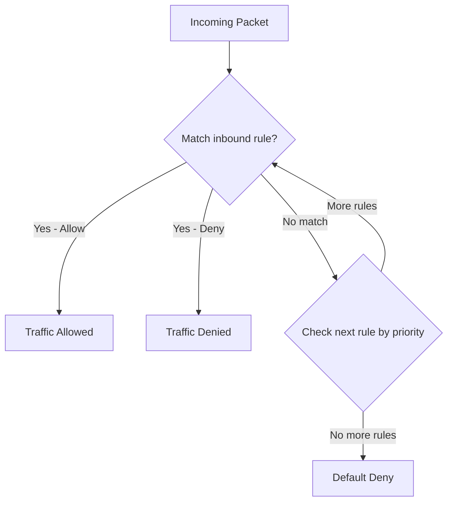

# How to Configure Network Security Group Rules to Allow Specific Traffic in Azure

Author: [nawazdhandala](https://www.github.com/nawazdhandala)

Tags: Azure, Network Security Groups, NSG, Azure Networking, Cloud Security, Firewall Rules

Description: Step-by-step guide to configuring Azure Network Security Group rules for controlling inbound and outbound traffic to your cloud resources.

---

Network Security Groups (NSGs) in Azure are your first line of defense when it comes to controlling traffic to and from your virtual machines and subnets. They act as stateful firewalls that evaluate rules based on a five-tuple: source IP, source port, destination IP, destination port, and protocol. If you have ever deployed a VM in Azure and wondered why you cannot reach it from the internet, or why one VM cannot talk to another, the answer almost always involves NSG rules.

This guide walks through creating and configuring NSG rules to allow specific traffic patterns, from basic web server access to more nuanced scenarios.

## How NSG Rules Work

Every NSG comes with a set of default rules that you cannot delete. These defaults allow all traffic within the VNet, allow outbound internet access, and deny all other inbound traffic from the internet. When you add custom rules, Azure evaluates them by priority number - lower numbers are evaluated first.

Here is the evaluation flow:



Each rule has a priority between 100 and 4096. Azure processes rules from lowest to highest priority number. Once a rule matches, processing stops. This means if you have an Allow rule at priority 100 and a Deny rule at priority 200 for the same traffic, the Allow wins.

## Step 1: Create a Network Security Group

Let us start by creating an NSG in your resource group.

```bash
# Create a resource group if you do not have one
az group create --name rg-nsg-demo --location eastus

# Create a network security group
az network nsg create \
  --resource-group rg-nsg-demo \
  --name nsg-web-servers \
  --location eastus
```

At this point, the NSG has only the default rules. No custom inbound traffic is allowed.

## Step 2: Allow HTTP Traffic (Port 80)

The most common scenario is allowing web traffic. This rule allows inbound HTTP from any source to any destination within the NSG scope.

```bash
# Allow inbound HTTP traffic on port 80
az network nsg rule create \
  --resource-group rg-nsg-demo \
  --nsg-name nsg-web-servers \
  --name AllowHTTP \
  --priority 100 \
  --direction Inbound \
  --access Allow \
  --protocol Tcp \
  --source-address-prefixes '*' \
  --source-port-ranges '*' \
  --destination-address-prefixes '*' \
  --destination-port-ranges 80
```

The `--source-address-prefixes '*'` means any source IP can connect. For a public-facing web server, this is what you want. But think carefully before using wildcards on other ports.

## Step 3: Allow HTTPS Traffic (Port 443)

Almost every web server needs HTTPS too. Add another rule with the next priority.

```bash
# Allow inbound HTTPS traffic on port 443
az network nsg rule create \
  --resource-group rg-nsg-demo \
  --nsg-name nsg-web-servers \
  --name AllowHTTPS \
  --priority 110 \
  --direction Inbound \
  --access Allow \
  --protocol Tcp \
  --source-address-prefixes '*' \
  --source-port-ranges '*' \
  --destination-address-prefixes '*' \
  --destination-port-ranges 443
```

## Step 4: Allow SSH from a Specific IP Range

You do not want SSH open to the world. Restrict it to your corporate network or a specific IP.

```bash
# Allow SSH only from a specific IP range
az network nsg rule create \
  --resource-group rg-nsg-demo \
  --nsg-name nsg-web-servers \
  --name AllowSSHFromOffice \
  --priority 120 \
  --direction Inbound \
  --access Allow \
  --protocol Tcp \
  --source-address-prefixes '203.0.113.0/24' \
  --source-port-ranges '*' \
  --destination-address-prefixes '*' \
  --destination-port-ranges 22
```

Replace `203.0.113.0/24` with your actual office or VPN IP range. This is significantly more secure than opening SSH to `*`.

## Step 5: Deny All Other Inbound Traffic Explicitly

While the default rules already deny unlisted inbound traffic, adding an explicit deny-all rule at a high priority number makes your intent clear and helps with auditing.

```bash
# Explicitly deny all other inbound traffic
az network nsg rule create \
  --resource-group rg-nsg-demo \
  --nsg-name nsg-web-servers \
  --name DenyAllInbound \
  --priority 4000 \
  --direction Inbound \
  --access Deny \
  --protocol '*' \
  --source-address-prefixes '*' \
  --source-port-ranges '*' \
  --destination-address-prefixes '*' \
  --destination-port-ranges '*'
```

## Step 6: Associate the NSG with a Subnet or NIC

An NSG does nothing until you attach it to a subnet or a network interface. You can do both, but be aware that traffic must pass both the subnet-level NSG and the NIC-level NSG.

```bash
# Associate the NSG with a subnet
az network vnet subnet update \
  --resource-group rg-nsg-demo \
  --vnet-name vnet-demo \
  --name subnet-web \
  --network-security-group nsg-web-servers
```

Or attach it directly to a VM's network interface:

```bash
# Associate the NSG with a network interface
az network nic update \
  --resource-group rg-nsg-demo \
  --name nic-webserver01 \
  --network-security-group nsg-web-servers
```

## Working with Service Tags

One of the most useful features of Azure NSG rules is service tags. Instead of hard-coding IP ranges, you can use logical names that Azure keeps up to date. For example:

- `Internet` - All public IP addresses
- `VirtualNetwork` - All address spaces in the VNet and peered VNets
- `AzureLoadBalancer` - Azure's infrastructure load balancer
- `Storage` - Azure Storage service IP ranges
- `Sql` - Azure SQL Database IP ranges

Here is an example allowing traffic from Azure Load Balancer health probes:

```bash
# Allow Azure Load Balancer health probes
az network nsg rule create \
  --resource-group rg-nsg-demo \
  --nsg-name nsg-web-servers \
  --name AllowAzureLBProbes \
  --priority 130 \
  --direction Inbound \
  --access Allow \
  --protocol Tcp \
  --source-address-prefixes 'AzureLoadBalancer' \
  --source-port-ranges '*' \
  --destination-address-prefixes '*' \
  --destination-port-ranges 80
```

## Application Security Groups

For complex environments, managing individual IP addresses in rules gets messy fast. Application Security Groups (ASGs) let you group NICs together and reference the group in NSG rules.

```bash
# Create an application security group
az network asg create \
  --resource-group rg-nsg-demo \
  --name asg-web-servers \
  --location eastus

# Add a NIC to the ASG
az network nic ip-config update \
  --resource-group rg-nsg-demo \
  --nic-name nic-webserver01 \
  --name ipconfig1 \
  --application-security-groups asg-web-servers

# Create a rule using the ASG as the destination
az network nsg rule create \
  --resource-group rg-nsg-demo \
  --nsg-name nsg-web-servers \
  --name AllowHTTPToWebASG \
  --priority 140 \
  --direction Inbound \
  --access Allow \
  --protocol Tcp \
  --source-address-prefixes '*' \
  --source-port-ranges '*' \
  --destination-asgs asg-web-servers \
  --destination-port-ranges 80
```

## Viewing Effective Rules

When troubleshooting, the effective security rules view is invaluable. It shows you the combined effect of all NSGs applied to a NIC, including both subnet-level and NIC-level rules.

```bash
# View effective security rules for a NIC
az network nic list-effective-nsg \
  --resource-group rg-nsg-demo \
  --name nic-webserver01
```

## Common Mistakes

**Forgetting the stateful nature.** NSGs are stateful. If you allow inbound traffic on port 80, the return traffic is automatically allowed. You do not need a separate outbound rule for response packets.

**Setting priorities too close together.** If you set rules at 100, 101, 102, you leave no room to insert rules later. Use increments of 10 or even 100.

**Applying NSGs at both subnet and NIC level without realizing both are evaluated.** Traffic must be allowed by both NSGs. If the subnet NSG allows port 80 but the NIC NSG denies it, traffic is blocked.

**Using broad source addresses for management ports.** Never open SSH (22) or RDP (3389) to `*`. Always restrict to known IP ranges or use Azure Bastion instead.

## Wrapping Up

NSG rules are fundamental to Azure networking security. Start with a deny-all posture and explicitly allow only the traffic your workloads need. Use service tags instead of hard-coded IPs where possible, group related NICs into Application Security Groups, and always verify effective rules when troubleshooting connectivity. A well-configured NSG setup can save you from a lot of security headaches down the road.
