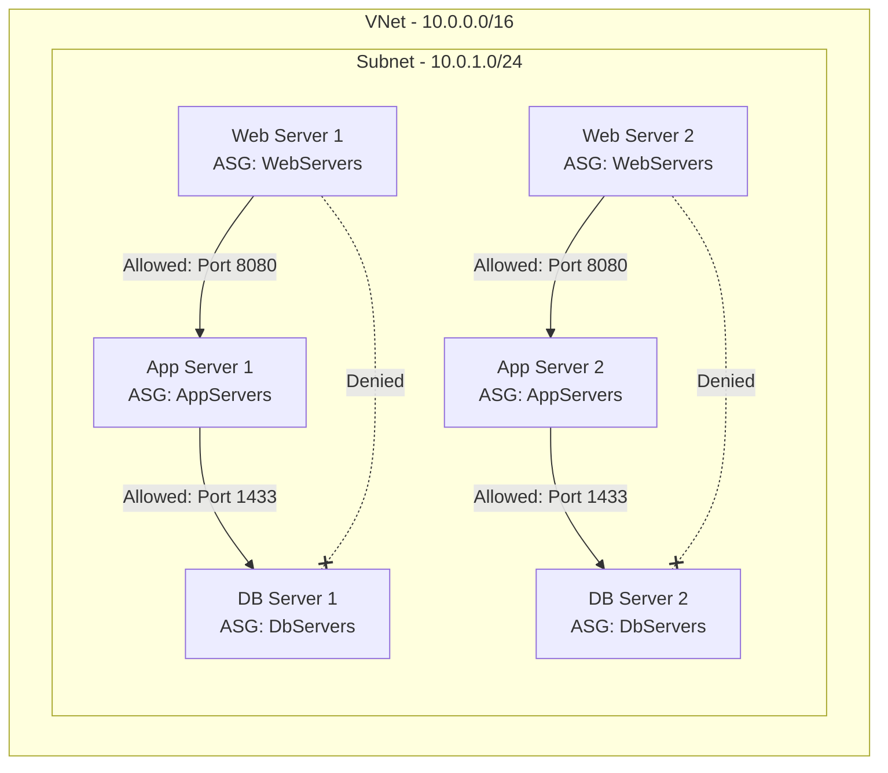

# How to Configure Network Security Groups with Application Security Groups for Micro-Segmentation

Author: [nawazdhandala](https://www.github.com/nawazdhandala)

Tags: Azure, NSG, Application Security Groups, Micro-Segmentation, Network Security, Zero Trust

Description: Learn how to use Azure Application Security Groups with Network Security Groups to implement micro-segmentation without managing IP addresses in security rules.

---

Traditional network security in Azure uses Network Security Groups (NSGs) with IP-based rules. This works fine when you have a handful of VMs, but it becomes a management headache as your environment grows. Every time a VM gets a new IP or you scale out, you need to update NSG rules. Application Security Groups (ASGs) solve this by letting you group VMs by role or function and reference those groups in NSG rules instead of IP addresses.

This guide walks through implementing micro-segmentation using NSGs and ASGs together. We will build a multi-tier application setup where web servers can talk to app servers, app servers can talk to database servers, but web servers cannot directly reach the database tier.

## What Micro-Segmentation Looks Like

In a flat network, any VM can talk to any other VM. Micro-segmentation breaks this wide-open model by enforcing access controls between workloads, even when they are on the same subnet.



With ASGs, you define rules like "WebServers can reach AppServers on port 8080" without knowing or caring about the actual IP addresses.

## Prerequisites

- An Azure subscription
- A virtual network with at least one subnet
- VMs that you want to segment (or plans to create them)
- Azure CLI installed

## Step 1: Create Application Security Groups

Create an ASG for each logical tier of your application:

```bash
# Create ASGs for each application tier
# All ASGs must be in the same region as the VMs they will contain

az network asg create \
  --name WebServers \
  --resource-group myResourceGroup \
  --location eastus

az network asg create \
  --name AppServers \
  --resource-group myResourceGroup \
  --location eastus

az network asg create \
  --name DbServers \
  --resource-group myResourceGroup \
  --location eastus

az network asg create \
  --name ManagementHosts \
  --resource-group myResourceGroup \
  --location eastus
```

ASGs are just logical grouping constructs. They do not contain any networking configuration themselves - they are referenced in NSG rules and associated with VM network interfaces.

## Step 2: Assign VMs to Application Security Groups

Associate each VM's network interface with the appropriate ASG:

```bash
# Assign web server NICs to the WebServers ASG
az network nic ip-config update \
  --name ipconfig1 \
  --nic-name web-vm1-nic \
  --resource-group myResourceGroup \
  --application-security-groups WebServers

az network nic ip-config update \
  --name ipconfig1 \
  --nic-name web-vm2-nic \
  --resource-group myResourceGroup \
  --application-security-groups WebServers

# Assign app server NICs to the AppServers ASG
az network nic ip-config update \
  --name ipconfig1 \
  --nic-name app-vm1-nic \
  --resource-group myResourceGroup \
  --application-security-groups AppServers

az network nic ip-config update \
  --name ipconfig1 \
  --nic-name app-vm2-nic \
  --resource-group myResourceGroup \
  --application-security-groups AppServers

# Assign database server NICs to the DbServers ASG
az network nic ip-config update \
  --name ipconfig1 \
  --nic-name db-vm1-nic \
  --resource-group myResourceGroup \
  --application-security-groups DbServers

az network nic ip-config update \
  --name ipconfig1 \
  --nic-name db-vm2-nic \
  --resource-group myResourceGroup \
  --application-security-groups DbServers
```

A single NIC can be associated with multiple ASGs if the VM serves multiple roles.

## Step 3: Create the NSG with Micro-Segmentation Rules

Now create the NSG rules that reference ASGs instead of IP addresses:

```bash
# Create the NSG
az network nsg create \
  --name micro-seg-nsg \
  --resource-group myResourceGroup \
  --location eastus

# Rule 1: Allow internet traffic to web servers on port 443
az network nsg rule create \
  --nsg-name micro-seg-nsg \
  --resource-group myResourceGroup \
  --name AllowHTTPSToWeb \
  --priority 100 \
  --direction Inbound \
  --access Allow \
  --protocol Tcp \
  --source-address-prefixes Internet \
  --destination-asgs WebServers \
  --destination-port-ranges 443

# Rule 2: Allow web servers to reach app servers on port 8080
az network nsg rule create \
  --nsg-name micro-seg-nsg \
  --resource-group myResourceGroup \
  --name AllowWebToApp \
  --priority 200 \
  --direction Inbound \
  --access Allow \
  --protocol Tcp \
  --source-asgs WebServers \
  --destination-asgs AppServers \
  --destination-port-ranges 8080

# Rule 3: Allow app servers to reach database servers on port 1433
az network nsg rule create \
  --nsg-name micro-seg-nsg \
  --resource-group myResourceGroup \
  --name AllowAppToDb \
  --priority 300 \
  --direction Inbound \
  --access Allow \
  --protocol Tcp \
  --source-asgs AppServers \
  --destination-asgs DbServers \
  --destination-port-ranges 1433

# Rule 4: Allow management hosts to SSH into all servers
az network nsg rule create \
  --nsg-name micro-seg-nsg \
  --resource-group myResourceGroup \
  --name AllowSSHFromManagement \
  --priority 400 \
  --direction Inbound \
  --access Allow \
  --protocol Tcp \
  --source-asgs ManagementHosts \
  --destination-asgs WebServers AppServers DbServers \
  --destination-port-ranges 22

# Rule 5: Deny all other inbound traffic (explicit deny-all)
az network nsg rule create \
  --nsg-name micro-seg-nsg \
  --resource-group myResourceGroup \
  --name DenyAllInbound \
  --priority 4000 \
  --direction Inbound \
  --access Deny \
  --protocol "*" \
  --source-address-prefixes "*" \
  --destination-address-prefixes "*" \
  --destination-port-ranges "*"
```

The rules are evaluated in priority order (lowest number first). The explicit deny-all at priority 4000 ensures that any traffic not matched by a higher-priority allow rule gets blocked.

## Step 4: Associate the NSG with the Subnet

Apply the NSG to the subnet containing your VMs:

```bash
# Associate the NSG with the application subnet
az network vnet subnet update \
  --name appSubnet \
  --vnet-name myVNet \
  --resource-group myResourceGroup \
  --network-security-group micro-seg-nsg
```

## Step 5: Verify the Rules

Test connectivity between tiers to make sure the rules work as expected:

```bash
# From a web server, this should succeed (web to app on port 8080)
# SSH into web-vm1 and run:
nc -zv 10.0.1.20 8080

# From a web server, this should fail (web to db on port 1433)
nc -zv 10.0.1.30 1433

# From an app server, this should succeed (app to db on port 1433)
nc -zv 10.0.1.30 1433
```

You can also use Azure Network Watcher to verify connectivity without logging into the VMs:

```bash
# Use Network Watcher IP flow verify
az network watcher test-ip-flow \
  --direction Inbound \
  --local 10.0.1.20:8080 \
  --remote 10.0.1.10:50000 \
  --protocol TCP \
  --resource-group myResourceGroup \
  --vm web-vm1
```

## Step 6: Enable NSG Flow Logs

Flow logs give you visibility into what traffic is being allowed and denied by your NSG rules:

```bash
# Enable NSG flow logs (requires a storage account and Network Watcher)
az network watcher flow-log create \
  --name micro-seg-flow-log \
  --resource-group myResourceGroup \
  --nsg micro-seg-nsg \
  --storage-account myStorageAccount \
  --enabled true \
  --format JSON \
  --log-version 2 \
  --retention 30 \
  --traffic-analytics true \
  --workspace "/subscriptions/{sub-id}/resourceGroups/myResourceGroup/providers/Microsoft.OperationalInsights/workspaces/myWorkspace"
```

Traffic Analytics processes the flow logs and gives you visual dashboards showing traffic patterns between your ASGs.

## Scaling Considerations

One of the biggest advantages of ASGs is how they handle scaling. When you add a new web server to your environment, you just need to:

1. Create the VM
2. Associate its NIC with the WebServers ASG
3. That is it - the NSG rules automatically apply

No IP address updates, no rule modifications. The same applies to auto-scaling scenarios with Virtual Machine Scale Sets. VMs created by the scale set inherit the ASG membership defined in the scale set's network configuration.

```bash
# When creating a VMSS, specify ASG membership in the network profile
az vmss create \
  --name webServerScaleSet \
  --resource-group myResourceGroup \
  --image Ubuntu2204 \
  --instance-count 2 \
  --vnet-name myVNet \
  --subnet appSubnet \
  --application-security-groups WebServers \
  --admin-username azureuser \
  --generate-ssh-keys
```

## Rules Design Best Practices

**Start with deny-all**: Always add an explicit deny-all rule at a high priority number. This ensures you know exactly what is allowed and forces you to create explicit allow rules for every legitimate traffic flow.

**Use descriptive rule names**: Rule names like "AllowWebToApp" are much easier to audit than "Rule1" or "Allow100".

**Minimize port ranges**: Allow only the specific ports your application needs. Avoid ranges like 1-65535.

**Document your ASG strategy**: Keep a mapping of which ASGs correspond to which application tiers and which VMs are members. This documentation is invaluable during incident response.

**Audit regularly**: Use Traffic Analytics to identify traffic flows that should not exist and tighten rules accordingly.

## Wrapping Up

Application Security Groups turn IP-based NSG rules into role-based access controls for your network. By grouping VMs into ASGs and writing rules that reference those groups, you get micro-segmentation that scales with your environment and does not break when IP addresses change. The combination of NSGs and ASGs, backed by flow logs and Traffic Analytics, gives you the visibility and control you need to implement a zero-trust network within Azure.
