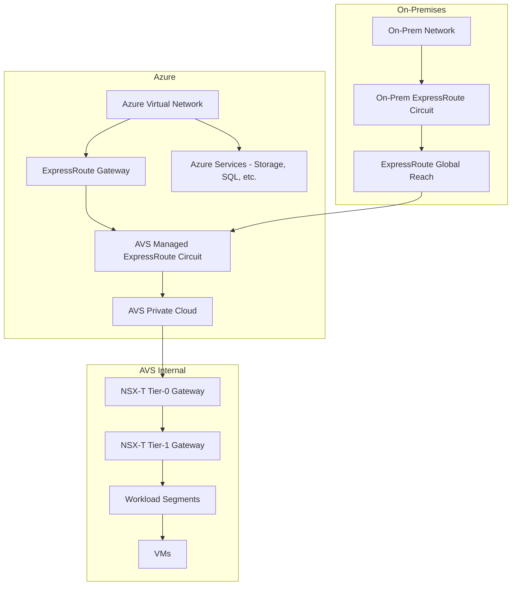

# How to Configure Networking and ExpressRoute Connectivity for Azure VMware Solution

Author: [nawazdhandala](https://www.github.com/nawazdhandala)

Tags: Azure, VMware, ExpressRoute, Networking, NSX-T, Private Cloud, Connectivity

Description: Learn how to configure networking and ExpressRoute connectivity for Azure VMware Solution to enable communication between AVS, Azure, and on-premises networks.

---

Networking is the foundation that makes Azure VMware Solution (AVS) useful. Without proper connectivity, your AVS private cloud is an isolated island. You need it talking to your Azure virtual networks for accessing native Azure services, to your on-premises data center for hybrid operations, and to the internet for public-facing workloads. Azure VMware Solution uses ExpressRoute as its primary connectivity mechanism, with NSX-T providing the internal networking.

This guide covers the full network architecture: ExpressRoute setup, virtual network peering, on-premises connectivity, DNS configuration, and internet access.

## AVS Networking Architecture

Understanding the architecture helps make configuration decisions clearer.



Three distinct connectivity paths exist:

1. **AVS to Azure VNet** - Through the managed ExpressRoute circuit connected to an ExpressRoute gateway.
2. **AVS to On-Premises** - Through ExpressRoute Global Reach, which peers the AVS circuit with your existing on-premises circuit.
3. **AVS Internal** - Through NSX-T segments within the private cloud.

## Prerequisites

- An Azure VMware Solution private cloud deployed.
- An Azure Virtual Network with an ExpressRoute gateway (or plan to create one).
- For on-premises connectivity: an existing ExpressRoute circuit connecting your data center to Azure.
- IP address planning completed (no overlapping subnets between AVS, Azure, and on-premises).

## Step 1: Plan IP Address Space

IP planning is critical and hard to change later. Here are the networks you need to plan:

| Network | Purpose | Recommended Size |
|---------|---------|-----------------|
| AVS management block | vCenter, ESXi, vSAN, NSX-T management | /22 (set during deployment) |
| Workload segments | VM networks in AVS | /24 each, as many as needed |
| Azure VNet | Hub network for ExpressRoute gateway | /16 or /24 depending on design |
| Gateway subnet | ExpressRoute gateway | /27 minimum |
| Transit networks | HCX and inter-segment routing | /26 each |

The absolute rule: no IP range can overlap between AVS management, AVS workloads, Azure VNets, and on-premises networks. Plan this carefully before deployment because the AVS management /22 block cannot be changed.

## Step 2: Create the ExpressRoute Gateway

If you do not already have an ExpressRoute gateway in your hub virtual network, create one.

```bash
# Create a virtual network for the hub (if not existing)
az network vnet create \
  --resource-group myNetworkRG \
  --name hub-vnet \
  --address-prefixes 10.100.0.0/16 \
  --subnet-name GatewaySubnet \
  --subnet-prefixes 10.100.0.0/27

# Create a public IP for the gateway
az network public-ip create \
  --resource-group myNetworkRG \
  --name avs-gateway-pip \
  --sku Standard \
  --allocation-method Static

# Create the ExpressRoute gateway (use at least ErGw1AZ for production)
az network vnet-gateway create \
  --resource-group myNetworkRG \
  --name avs-expressroute-gw \
  --vnet hub-vnet \
  --public-ip-addresses avs-gateway-pip \
  --gateway-type ExpressRoute \
  --sku ErGw1AZ
```

Gateway creation takes 30-45 minutes. The SKU matters for throughput:

- **ErGw1AZ**: Up to 1 Gbps - suitable for development and small workloads.
- **ErGw2AZ**: Up to 2 Gbps - suitable for most production environments.
- **ErGw3AZ**: Up to 10 Gbps - for high-throughput production scenarios.
- **Ultra Performance**: Up to 10 Gbps with FastPath support.

## Step 3: Connect AVS to the Virtual Network

Create an authorization key from AVS and use it to connect to the ExpressRoute gateway.

```bash
# Create an ExpressRoute authorization key
az vmware authorization create \
  --resource-group myResourceGroup \
  --private-cloud myAVSPrivateCloud \
  --name "hub-vnet-auth"

# Retrieve the authorization key and circuit ID
AUTH_KEY=$(az vmware authorization show \
  --resource-group myResourceGroup \
  --private-cloud myAVSPrivateCloud \
  --name "hub-vnet-auth" \
  --query "expressRouteAuthorizationKey" \
  --output tsv)

CIRCUIT_ID=$(az vmware private-cloud show \
  --resource-group myResourceGroup \
  --name myAVSPrivateCloud \
  --query "circuit.expressRouteId" \
  --output tsv)

# Connect the AVS ExpressRoute circuit to the gateway
az network vpn-connection create \
  --resource-group myNetworkRG \
  --name avs-connection \
  --vnet-gateway1 avs-expressroute-gw \
  --express-route-circuit2 "$CIRCUIT_ID" \
  --authorization-key "$AUTH_KEY" \
  --routing-weight 0
```

Once connected, resources in the virtual network can reach AVS management interfaces (vCenter, NSX-T Manager) and any configured workload segments.

## Step 4: Connect AVS to On-Premises via Global Reach

ExpressRoute Global Reach connects two ExpressRoute circuits directly through the Microsoft backbone, bypassing the virtual network gateway. This provides the fastest path between on-premises and AVS.

```bash
# Get the AVS circuit ID and authorization key (from Step 3)
# Get your on-premises ExpressRoute circuit ID
ONPREM_CIRCUIT_ID="/subscriptions/<sub-id>/resourceGroups/<rg>/providers/Microsoft.Network/expressRouteCircuits/onprem-circuit"

# Create a Global Reach connection
az network express-route peering connection create \
  --resource-group myNetworkRG \
  --circuit-name onprem-circuit \
  --peering-name AzurePrivatePeering \
  --name avs-global-reach \
  --peer-circuit "$CIRCUIT_ID" \
  --address-prefix "172.16.0.0/29" \
  --authorization-key "$AUTH_KEY"
```

The `--address-prefix` is a /29 network used for the Global Reach peering. It must not overlap with any other networks.

After Global Reach is established, on-premises VMs can communicate directly with AVS VMs (and vice versa) without traffic passing through the Azure virtual network gateway.

## Step 5: Configure NSX-T Segments for Workloads

NSX-T manages the internal networking within AVS. Create network segments where your VMs will connect.

```bash
# Create a Tier-1 gateway if one does not already exist
# AVS typically creates a default Tier-1 gateway during deployment

# Create a workload network segment
az vmware workload-network segment create \
  --resource-group myResourceGroup \
  --private-cloud myAVSPrivateCloud \
  --segment-id web-tier \
  --display-name "Web Tier" \
  --connected-gateway "/infra/tier-1s/TNT##-T1" \
  --subnet dhcp-range="10.180.10.10-10.180.10.200" \
         gateway-address="10.180.10.1/24"

# Create a second segment for the database tier
az vmware workload-network segment create \
  --resource-group myResourceGroup \
  --private-cloud myAVSPrivateCloud \
  --segment-id db-tier \
  --display-name "Database Tier" \
  --connected-gateway "/infra/tier-1s/TNT##-T1" \
  --subnet dhcp-range="10.180.20.10-10.180.20.200" \
         gateway-address="10.180.20.1/24"
```

## Step 6: Configure DNS

DNS configuration ensures VMs in AVS can resolve names for on-premises resources and Azure private endpoints.

```bash
# Create a DNS service for workload VMs
az vmware workload-network dns-service create \
  --resource-group myResourceGroup \
  --private-cloud myAVSPrivateCloud \
  --dns-service-id workload-dns \
  --display-name "Workload DNS Service" \
  --default-dns-zone "default-zone" \
  --fqdn-zones "corp.example.com" "azure.example.com" \
  --dns-service-ip "10.180.0.53" \
  --log-level "INFO"

# Create a DNS zone for conditional forwarding to on-premises
az vmware workload-network dns-zone create \
  --resource-group myResourceGroup \
  --private-cloud myAVSPrivateCloud \
  --dns-zone-id onprem-zone \
  --display-name "On-Premises DNS Zone" \
  --domain "corp.example.com" \
  --dns-server-ips "10.0.0.53" "10.0.0.54" \
  --revision 1
```

This setup forwards DNS queries for `corp.example.com` to your on-premises DNS servers, while other queries use the default Azure DNS resolution.

## Step 7: Configure Internet Access for AVS VMs

By default, AVS VMs do not have internet access. You have two options:

**Option A: Azure public IP on NSX-T edge** - Gives AVS VMs direct internet access through the AVS gateway.

```bash
# Enable internet access through AVS
az vmware private-cloud update \
  --resource-group myResourceGroup \
  --name myAVSPrivateCloud \
  --internet Enabled
```

**Option B: Route through Azure Firewall or NVA** - Routes internet traffic through your hub virtual network for centralized security. This is the recommended approach for production.

```bash
# Create a route table with a default route pointing to the Azure Firewall
az network route-table create \
  --resource-group myNetworkRG \
  --name avs-route-table

az network route-table route create \
  --resource-group myNetworkRG \
  --route-table-name avs-route-table \
  --name default-to-firewall \
  --address-prefix "0.0.0.0/0" \
  --next-hop-type VirtualAppliance \
  --next-hop-ip-address "10.100.1.4"
```

## Step 8: Verify Connectivity

Test connectivity from different locations to confirm everything works.

```bash
# From an Azure VM in the hub VNet, test connectivity to vCenter
curl -k https://10.175.0.2/ui

# Test DNS resolution
nslookup vcenter.avs.azure.com 10.180.0.53

# Test connectivity to a workload VM
ping 10.180.10.100

# Verify route propagation on the gateway
az network vnet-gateway list-learned-routes \
  --resource-group myNetworkRG \
  --name avs-expressroute-gw \
  --output table
```

The learned routes should include the AVS management /22 block and any NSX-T segments you created.

## Network Security Considerations

- **NSX-T distributed firewall**: Use microsegmentation policies to control east-west traffic between workload segments.
- **Azure Firewall**: Control north-south traffic (internet and cross-VNet) through a centralized firewall in your hub VNet.
- **Network Security Groups**: Apply NSGs to subnets in Azure VNets that communicate with AVS.
- **ExpressRoute encryption**: ExpressRoute traffic is not encrypted by default. Consider enabling MACsec on your ExpressRoute Direct circuit for encryption at the physical layer.

## Summary

Networking for Azure VMware Solution involves three layers: the managed ExpressRoute circuit for Azure connectivity, Global Reach for direct on-premises connectivity, and NSX-T for internal workload networking. Getting the IP address planning right upfront saves you from painful reconfigurations later. Once the ExpressRoute connections are established and NSX-T segments are configured, your AVS private cloud integrates seamlessly into your existing network architecture, making it feel like a natural extension of your on-premises environment.
