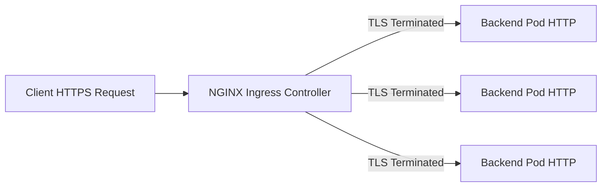

# How to Configure NGINX Ingress Controller with TLS Termination on AKS

Author: [nawazdhandala](https://www.github.com/nawazdhandala)

Tags: AKS, NGINX, Ingress Controller, TLS, Kubernetes, Azure, HTTPS

Description: Step-by-step guide to deploying NGINX Ingress Controller on AKS and configuring TLS termination with certificates for secure HTTPS traffic.

---

Exposing services on AKS through HTTPS requires an ingress controller that handles TLS termination. NGINX Ingress Controller is the go-to choice for most Kubernetes clusters because of its flexibility, wide community support, and solid performance characteristics. This guide covers deploying NGINX Ingress Controller on AKS and configuring TLS termination so your services are reachable over HTTPS with proper certificates.

## What TLS Termination Means in Practice

TLS termination is the process of decrypting incoming HTTPS traffic at the ingress controller rather than at the application pod. The ingress controller presents the TLS certificate to clients, handles the SSL/TLS handshake, and then forwards plain HTTP traffic to the backend pods. This offloads the cryptographic work from your applications and centralizes certificate management.

The flow looks like this:



## Prerequisites

You will need:

- An AKS cluster with at least 2 nodes
- Helm 3 installed locally
- kubectl configured for your AKS cluster
- A domain name pointed at your cluster's public IP (or you can use nip.io for testing)
- Azure CLI installed

## Step 1: Install NGINX Ingress Controller with Helm

The official NGINX Ingress Controller is maintained by the Kubernetes community. Install it using Helm from the ingress-nginx repository.

```bash
# Add the ingress-nginx Helm repository
helm repo add ingress-nginx https://kubernetes.github.io/ingress-nginx

# Update your local Helm chart repository cache
helm repo update

# Install NGINX Ingress Controller into its own namespace
# The controller will provision an Azure Load Balancer automatically
helm install ingress-nginx ingress-nginx/ingress-nginx \
  --create-namespace \
  --namespace ingress-nginx \
  --set controller.replicaCount=2 \
  --set controller.nodeSelector."kubernetes\.io/os"=linux \
  --set controller.service.annotations."service\.beta\.kubernetes\.io/azure-load-balancer-health-probe-request-path"=/healthz
```

This deploys two replicas of the NGINX controller for redundancy and sets the health probe path that the Azure Load Balancer uses to check the controller's health.

## Step 2: Get the External IP

After installation, the NGINX Ingress Controller creates a Kubernetes service of type LoadBalancer. Azure provisions a public IP for it.

```bash
# Wait for the external IP to be assigned
# It can take 1-2 minutes for Azure to provision the load balancer
kubectl get service ingress-nginx-controller -n ingress-nginx --watch
```

Once the EXTERNAL-IP column shows an IP address instead of `<pending>`, note it down. Point your DNS record to this IP.

## Step 3: Create a TLS Certificate Secret

For TLS termination, you need a certificate and private key stored as a Kubernetes Secret. If you have a certificate from a CA, create the secret from your cert and key files.

```bash
# Create a TLS secret from certificate files
# tls.crt is your certificate (or certificate chain)
# tls.key is your private key
kubectl create secret tls my-tls-secret \
  --cert=tls.crt \
  --key=tls.key \
  --namespace default
```

For testing, you can generate a self-signed certificate.

```bash
# Generate a self-signed certificate for testing purposes
# Replace myapp.example.com with your actual domain
openssl req -x509 -nodes -days 365 -newkey rsa:2048 \
  -keyout tls.key \
  -out tls.crt \
  -subj "/CN=myapp.example.com/O=myorg"

# Create the Kubernetes secret from the generated files
kubectl create secret tls my-tls-secret \
  --cert=tls.crt \
  --key=tls.key \
  --namespace default
```

## Step 4: Deploy a Sample Application

Let us deploy a simple application to test the ingress configuration.

```yaml
# sample-app.yaml
# A basic nginx deployment and service for testing ingress
apiVersion: apps/v1
kind: Deployment
metadata:
  name: sample-app
  namespace: default
spec:
  replicas: 2
  selector:
    matchLabels:
      app: sample-app
  template:
    metadata:
      labels:
        app: sample-app
    spec:
      containers:
      - name: nginx
        image: nginx:1.25
        ports:
        - containerPort: 80
---
apiVersion: v1
kind: Service
metadata:
  name: sample-app
  namespace: default
spec:
  type: ClusterIP
  ports:
  - port: 80
    targetPort: 80
  selector:
    app: sample-app
```

Apply it with `kubectl apply -f sample-app.yaml`.

## Step 5: Create the Ingress Resource with TLS

Now create the Ingress resource that ties everything together - the host, the TLS secret, and the backend service.

```yaml
# ingress-tls.yaml
# Ingress resource with TLS termination
# Traffic arrives on HTTPS, gets decrypted, and forwards to the service on HTTP
apiVersion: networking.k8s.io/v1
kind: Ingress
metadata:
  name: sample-app-ingress
  namespace: default
  annotations:
    # Force HTTPS redirect for any HTTP requests
    nginx.ingress.kubernetes.io/ssl-redirect: "true"
    # Use the NGINX ingress class
    nginx.ingress.kubernetes.io/force-ssl-redirect: "true"
spec:
  ingressClassName: nginx
  tls:
  - hosts:
    - myapp.example.com
    secretName: my-tls-secret
  rules:
  - host: myapp.example.com
    http:
      paths:
      - path: /
        pathType: Prefix
        backend:
          service:
            name: sample-app
            port:
              number: 80
```

Apply with `kubectl apply -f ingress-tls.yaml`.

## Step 6: Verify TLS Is Working

Test the endpoint with curl to confirm TLS termination is functioning.

```bash
# Test the HTTPS endpoint
# Use -k if you're using a self-signed certificate
curl -v https://myapp.example.com

# Check that HTTP redirects to HTTPS
curl -v http://myapp.example.com
```

The HTTP request should return a 308 redirect to the HTTPS URL. The HTTPS request should return a 200 with the NGINX welcome page.

## Automating Certificates with cert-manager

Managing certificates manually works for a few services, but it does not scale. cert-manager automates certificate issuance and renewal using Let's Encrypt or other ACME providers.

```bash
# Install cert-manager using Helm
helm repo add jetstack https://charts.jetstack.io
helm repo update

helm install cert-manager jetstack/cert-manager \
  --namespace cert-manager \
  --create-namespace \
  --set crds.enabled=true
```

Create a ClusterIssuer for Let's Encrypt.

```yaml
# cluster-issuer.yaml
# ClusterIssuer that uses Let's Encrypt production ACME server
apiVersion: cert-manager.io/v1
kind: ClusterIssuer
metadata:
  name: letsencrypt-prod
spec:
  acme:
    server: https://acme-v02.api.letsencrypt.org/directory
    email: your-email@example.com
    privateKeySecretRef:
      name: letsencrypt-prod-key
    solvers:
    - http01:
        ingress:
          class: nginx
```

Now update your Ingress to use cert-manager annotations instead of a manually created secret.

```yaml
# ingress-certmanager.yaml
# Ingress with automatic certificate provisioning via cert-manager
apiVersion: networking.k8s.io/v1
kind: Ingress
metadata:
  name: sample-app-ingress
  namespace: default
  annotations:
    nginx.ingress.kubernetes.io/ssl-redirect: "true"
    # Tell cert-manager which issuer to use
    cert-manager.io/cluster-issuer: "letsencrypt-prod"
spec:
  ingressClassName: nginx
  tls:
  - hosts:
    - myapp.example.com
    # cert-manager will create this secret automatically
    secretName: myapp-tls-auto
  rules:
  - host: myapp.example.com
    http:
      paths:
      - path: /
        pathType: Prefix
        backend:
          service:
            name: sample-app
            port:
              number: 80
```

cert-manager handles the ACME challenge, obtains the certificate, stores it in the secret, and renews it before expiration.

## Performance Tuning for TLS

NGINX Ingress Controller allows tuning TLS-related settings through annotations and ConfigMap values. Here are useful settings for production.

```bash
# Update the NGINX ConfigMap for TLS performance tuning
# These settings apply globally to all ingress resources
kubectl edit configmap ingress-nginx-controller -n ingress-nginx
```

Key settings to consider in the ConfigMap:

```yaml
data:
  # Enable OCSP stapling for faster TLS handshakes
  enable-ocsp: "true"
  # Set minimum TLS version (disable TLS 1.0 and 1.1)
  ssl-protocols: "TLSv1.2 TLSv1.3"
  # Prefer server cipher order
  ssl-prefer-server-ciphers: "true"
  # Enable HTTP/2 for better performance
  use-http2: "true"
  # Set HSTS header
  hsts: "true"
  hsts-max-age: "31536000"
  hsts-include-subdomains: "true"
```

## Troubleshooting Common Issues

**Certificate not being served**: Check that the secret exists in the same namespace as the Ingress resource. Run `kubectl describe ingress sample-app-ingress` and look for events indicating errors.

**503 errors after TLS setup**: The backend service might not be reachable. Verify the service name and port match what is defined in the Ingress resource. Check that pods are running and healthy.

**Mixed content warnings**: If your application serves assets over HTTP while the page loads over HTTPS, browsers will block those assets. Update your application to use relative URLs or HTTPS URLs.

**cert-manager not issuing certificates**: Check the Certificate and CertificateRequest resources. Run `kubectl describe certificate myapp-tls-auto` to see the status. Common issues include DNS not pointing to the cluster IP and rate limits from Let's Encrypt.

## Summary

Setting up NGINX Ingress Controller with TLS termination on AKS involves deploying the controller, creating TLS secrets, and configuring Ingress resources with the right annotations. For production environments, pairing the ingress controller with cert-manager eliminates the manual certificate management burden. The combination gives you automatic HTTPS with certificate renewal, HTTP-to-HTTPS redirects, and the ability to tune TLS settings for security and performance across all your services.
