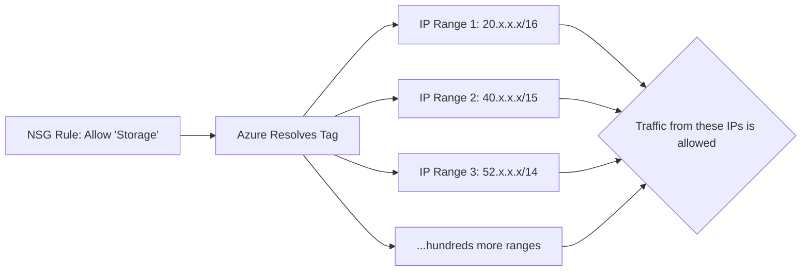

# How to Configure NSG Rules to Allow Traffic Only from Specific Azure Service Tags

Author: [nawazdhandala](https://www.github.com/nawazdhandala)

Tags: NSG, Azure Service Tags, Network Security, Firewall Rules, Azure Networking, Cloud Security, Azure

Description: Learn how to use Azure Service Tags in NSG rules to allow traffic only from specific Azure services without hardcoding IP addresses.

---

Managing Network Security Group rules with IP addresses is a losing battle when it comes to Azure services. Azure services use large, dynamic pools of IP addresses that change regularly. If you hardcode these IPs in your NSG rules, they go stale, and you spend your time chasing updated IP ranges instead of building things.

Service Tags solve this problem. They are named groups of IP address ranges that Azure maintains automatically. When you use a Service Tag in an NSG rule, Azure resolves it to the current IP ranges at evaluation time. The IPs update behind the scenes, and your rules stay correct without any maintenance.

This guide covers how to use Service Tags effectively in NSG rules, which tags are available for common scenarios, and how to handle edge cases where Service Tags alone are not enough.

## What Are Service Tags?

A Service Tag represents a group of IP address prefixes associated with a specific Azure service. For example, the `Storage` tag includes all IP ranges used by Azure Storage across all regions. The `AzureCloud.EastUS` tag includes all Azure IP ranges in the East US region.

Service Tags are maintained by Microsoft and updated automatically as IP ranges change. When you use a Service Tag in an NSG rule, you do not need to know or manage the underlying IP ranges.



## Commonly Used Service Tags

Here are the Service Tags you are most likely to use in production NSG rules:

| Service Tag | Description |
|---|---|
| `Internet` | All public internet IP space (anything outside Azure) |
| `VirtualNetwork` | The VNet address space, peered VNets, and on-prem via VPN/ExpressRoute |
| `AzureLoadBalancer` | Azure's infrastructure load balancer health probes |
| `Storage` | Azure Storage service IP ranges |
| `Storage.EastUS` | Azure Storage IP ranges in East US only |
| `Sql` | Azure SQL Database service IP ranges |
| `AzureKeyVault` | Azure Key Vault service IP ranges |
| `AzureMonitor` | Azure Monitor and Log Analytics IP ranges |
| `AzureActiveDirectory` | Microsoft Entra ID authentication endpoints |
| `EventHub` | Azure Event Hubs IP ranges |
| `ServiceBus` | Azure Service Bus IP ranges |
| `AzureContainerRegistry` | Azure Container Registry IP ranges |
| `AzureCosmosDB` | Azure Cosmos DB IP ranges |
| `AppService` | Azure App Service IP ranges |
| `GatewayManager` | Azure VPN Gateway management traffic |
| `AzureFrontDoor.Frontend` | Azure Front Door frontend IP ranges |

Most Service Tags also have regional variants. For example, `Storage.WestEurope` includes only the Storage IP ranges for the West Europe region. Using regional variants narrows the allowed IP ranges, which is better from a security perspective.

## Step 1: Create an NSG with Service Tag Rules

Let me walk through a practical scenario. You have a VM that runs an application connecting to Azure SQL Database, Azure Storage, and Azure Key Vault. You want to allow outbound traffic to these services while blocking everything else.

```bash
# Create the NSG
az network nsg create \
  --resource-group myResourceGroup \
  --name app-vm-nsg \
  --location eastus

# Allow outbound to Azure SQL Database
az network nsg rule create \
  --resource-group myResourceGroup \
  --nsg-name app-vm-nsg \
  --name AllowSqlOutbound \
  --priority 100 \
  --direction Outbound \
  --access Allow \
  --protocol Tcp \
  --source-address-prefixes VirtualNetwork \
  --destination-address-prefixes Sql.EastUS \
  --destination-port-ranges 1433

# Allow outbound to Azure Storage
az network nsg rule create \
  --resource-group myResourceGroup \
  --nsg-name app-vm-nsg \
  --name AllowStorageOutbound \
  --priority 200 \
  --direction Outbound \
  --access Allow \
  --protocol Tcp \
  --source-address-prefixes VirtualNetwork \
  --destination-address-prefixes Storage.EastUS \
  --destination-port-ranges 443

# Allow outbound to Azure Key Vault
az network nsg rule create \
  --resource-group myResourceGroup \
  --nsg-name app-vm-nsg \
  --name AllowKeyVaultOutbound \
  --priority 300 \
  --direction Outbound \
  --access Allow \
  --protocol Tcp \
  --source-address-prefixes VirtualNetwork \
  --destination-address-prefixes AzureKeyVault.EastUS \
  --destination-port-ranges 443

# Allow outbound to Microsoft Entra ID for authentication
az network nsg rule create \
  --resource-group myResourceGroup \
  --nsg-name app-vm-nsg \
  --name AllowAADOutbound \
  --priority 400 \
  --direction Outbound \
  --access Allow \
  --protocol Tcp \
  --source-address-prefixes VirtualNetwork \
  --destination-address-prefixes AzureActiveDirectory \
  --destination-port-ranges 443

# Allow outbound to Azure Monitor for diagnostics
az network nsg rule create \
  --resource-group myResourceGroup \
  --nsg-name app-vm-nsg \
  --name AllowMonitorOutbound \
  --priority 500 \
  --direction Outbound \
  --access Allow \
  --protocol Tcp \
  --source-address-prefixes VirtualNetwork \
  --destination-address-prefixes AzureMonitor \
  --destination-port-ranges 443

# Deny all other outbound internet traffic
az network nsg rule create \
  --resource-group myResourceGroup \
  --nsg-name app-vm-nsg \
  --name DenyAllOutbound \
  --priority 4000 \
  --direction Outbound \
  --access Deny \
  --protocol '*' \
  --source-address-prefixes '*' \
  --destination-address-prefixes Internet \
  --destination-port-ranges '*'
```

Notice the use of regional variants like `Sql.EastUS` and `Storage.EastUS`. This limits allowed traffic to Azure services in the same region, which is both more secure and aligns with data residency requirements.

## Step 2: Secure Inbound Traffic with Service Tags

Service Tags are equally useful for inbound rules. For example, if your VM hosts an API that should only be accessible through Azure Front Door, use the Front Door Service Tag.

```bash
# Allow inbound HTTPS only from Azure Front Door
az network nsg rule create \
  --resource-group myResourceGroup \
  --nsg-name app-vm-nsg \
  --name AllowFrontDoorInbound \
  --priority 100 \
  --direction Inbound \
  --access Allow \
  --protocol Tcp \
  --source-address-prefixes AzureFrontDoor.Backend \
  --destination-address-prefixes VirtualNetwork \
  --destination-port-ranges 443

# Allow inbound from Azure Load Balancer health probes
az network nsg rule create \
  --resource-group myResourceGroup \
  --nsg-name app-vm-nsg \
  --name AllowLBProbes \
  --priority 200 \
  --direction Inbound \
  --access Allow \
  --protocol Tcp \
  --source-address-prefixes AzureLoadBalancer \
  --destination-address-prefixes VirtualNetwork \
  --destination-port-ranges '*'

# Deny all other inbound from internet
az network nsg rule create \
  --resource-group myResourceGroup \
  --nsg-name app-vm-nsg \
  --name DenyAllInbound \
  --priority 4000 \
  --direction Inbound \
  --access Deny \
  --protocol '*' \
  --source-address-prefixes Internet \
  --destination-address-prefixes '*' \
  --destination-port-ranges '*'
```

## Step 3: View Resolved IP Ranges for a Service Tag

Sometimes you need to know the actual IP ranges behind a Service Tag, for documentation or for configuring non-Azure firewalls.

```bash
# List the IP ranges for a specific Service Tag
az network list-service-tags \
  --location eastus \
  --query "values[?name=='Storage.EastUS'].properties.addressPrefixes" \
  --output json
```

This returns all the IP prefixes that make up the Service Tag. The output can be long - some Service Tags include hundreds of CIDR blocks.

You can also download the full list of Service Tags as a JSON file.

```bash
# Get the download URL for the Service Tag JSON file
az network list-service-tags \
  --location eastus \
  --query "values[?name=='Storage.EastUS'].properties.{changeNumber: changeNumber, region: region, totalPrefixes: addressPrefixes | length(@)}" \
  --output table
```

## Step 4: Using Service Tags with Terraform

If you manage your infrastructure with Terraform, Service Tags work directly in NSG rule definitions.

```hcl
# Terraform NSG rule using Service Tags
resource "azurerm_network_security_rule" "allow_sql" {
  name                        = "AllowSqlOutbound"
  priority                    = 100
  direction                   = "Outbound"
  access                      = "Allow"
  protocol                    = "Tcp"
  source_port_range           = "*"
  destination_port_ranges     = ["1433"]
  source_address_prefix       = "VirtualNetwork"
  # Use the regional Service Tag for Azure SQL
  destination_address_prefix  = "Sql.EastUS"
  resource_group_name         = azurerm_resource_group.main.name
  network_security_group_name = azurerm_network_security_group.main.name
}

resource "azurerm_network_security_rule" "allow_storage" {
  name                        = "AllowStorageOutbound"
  priority                    = 200
  direction                   = "Outbound"
  access                      = "Allow"
  protocol                    = "Tcp"
  source_port_range           = "*"
  destination_port_ranges     = ["443"]
  source_address_prefix       = "VirtualNetwork"
  destination_address_prefix  = "Storage.EastUS"
  resource_group_name         = azurerm_resource_group.main.name
  network_security_group_name = azurerm_network_security_group.main.name
}

resource "azurerm_network_security_rule" "deny_internet" {
  name                        = "DenyAllOutbound"
  priority                    = 4000
  direction                   = "Outbound"
  access                      = "Deny"
  protocol                    = "*"
  source_port_range           = "*"
  destination_port_ranges     = ["*"]
  source_address_prefix       = "*"
  destination_address_prefix  = "Internet"
  resource_group_name         = azurerm_resource_group.main.name
  network_security_group_name = azurerm_network_security_group.main.name
}
```

## Limitations of Service Tags

Service Tags are not a silver bullet. Keep these limitations in mind:

**Service Tags allow traffic to the entire service, not just your resources.** When you allow `Storage.EastUS`, you are allowing traffic to every Azure Storage account in East US, not just yours. An attacker could set up a storage account in the same region and receive data from your VM through the allowed rule. For higher security, combine Service Tags with Private Link.

**Not all services have Service Tags.** Some newer or smaller Azure services do not have dedicated Service Tags yet. Check the documentation for the specific service.

**Service Tags cannot be combined with IP addresses in a single rule.** Each rule uses either a Service Tag or an IP address/CIDR, not both.

**Regional variants are not available for all Service Tags.** Some tags like `AzureActiveDirectory` only have a global variant because the service is multi-regional by nature.

## Combining Service Tags with Other Security Features

For defense in depth, combine Service Tags with:

- **Private Link/Private Endpoints**: For traffic that should never traverse the public network
- **Azure Firewall**: For more granular FQDN-based filtering
- **Application Security Groups**: For workload-level grouping on the source side
- **Azure Policy**: To enforce that all NSGs use Service Tags instead of hardcoded IPs

```bash
# Azure Policy to audit NSG rules that use hardcoded IPs instead of Service Tags
# This helps identify rules that should be updated
az policy definition create \
  --name "audit-nsg-hardcoded-ips" \
  --display-name "Audit NSG rules with hardcoded IP addresses" \
  --description "Identifies NSG rules using specific IP addresses that could use Service Tags instead" \
  --rules '{"if":{"allOf":[{"field":"type","equals":"Microsoft.Network/networkSecurityGroups/securityRules"},{"not":{"anyOf":[{"field":"Microsoft.Network/networkSecurityGroups/securityRules/sourceAddressPrefix","in":["*","VirtualNetwork","AzureLoadBalancer","Internet"]},{"field":"Microsoft.Network/networkSecurityGroups/securityRules/sourceAddressPrefix","like":"*.*.*.*/*"}]}}]},"then":{"effect":"audit"}}' \
  --mode All
```

## Wrapping Up

Azure Service Tags are a fundamental building block for network security in Azure. They keep your NSG rules clean, accurate, and maintenance-free by abstracting away the constantly changing IP ranges of Azure services. Use regional variants for tighter security, combine with Private Link for resources that should not traverse the public network, and set up Azure Policy to audit rules that still use hardcoded IPs. Service Tags are not a complete security solution on their own, but they are the right foundation to build your network security rules on.
