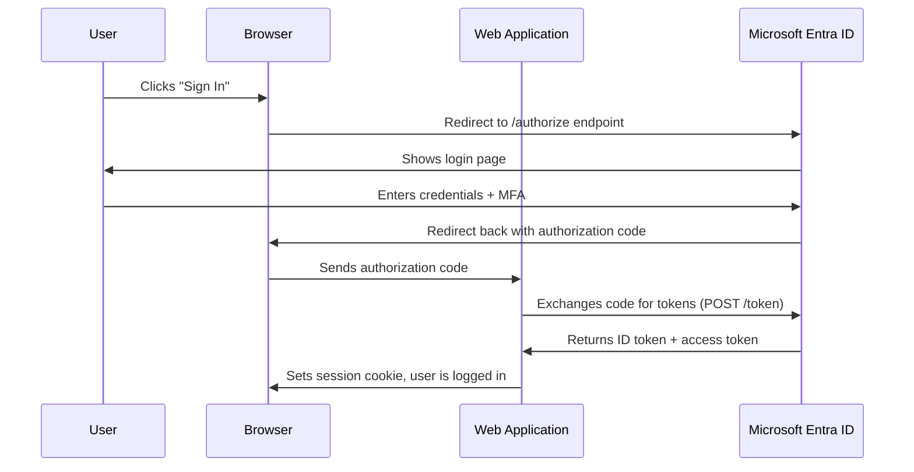

# How to Configure OpenID Connect Authentication for a Web Application Using Microsoft Entra ID

Author: [nawazdhandala](https://www.github.com/nawazdhandala)

Tags: OpenID Connect, Microsoft Entra ID, Authentication, Azure AD, Web Application, OAuth, Identity

Description: Step-by-step guide to configuring OpenID Connect authentication for your web application using Microsoft Entra ID as the identity provider.

---

OpenID Connect (OIDC) is the standard protocol for adding authentication to web applications, and Microsoft Entra ID is one of the most widely used identity providers that supports it. Whether you are building an internal tool for your organization or a customer-facing SaaS product, integrating OIDC with Entra ID gives you single sign-on, multi-factor authentication, and centralized user management without building any of that yourself.

This guide walks through the entire setup, from registering your application in Entra ID to handling tokens in your code.

## How OpenID Connect Works

Before jumping into configuration, here is a quick refresher on the OIDC authorization code flow, which is the recommended flow for server-side web applications.



The key thing to understand is that your application never sees the user's password. Entra ID handles authentication and sends back signed tokens that your application validates.

## Step 1: Register the Application in Entra ID

Open the Azure portal and navigate to Microsoft Entra ID > App registrations > New registration.

Fill in the following:
- **Name**: Something descriptive like "Contoso Web App"
- **Supported account types**: Choose based on your audience. For internal apps, select "Accounts in this organizational directory only." For multi-tenant apps, choose "Accounts in any organizational directory."
- **Redirect URI**: Set the platform to "Web" and enter your callback URL. For local development, this is typically `https://localhost:3000/auth/callback`. For production, use your actual domain.

Click Register. Azure will create the application and show you the Overview page with two important values:
- **Application (client) ID** - uniquely identifies your app
- **Directory (tenant) ID** - identifies your Entra ID tenant

Copy both of these. You will need them in your application configuration.

## Step 2: Create a Client Secret

Your web application needs a way to prove its identity when exchanging the authorization code for tokens. The simplest approach is a client secret.

Go to Certificates & secrets > Client secrets > New client secret. Give it a description and choose an expiration period. I recommend 12 months for production and shorter for development.

Copy the secret value immediately - it is only shown once. Store it in a secure location like Azure Key Vault or your application's secret manager.

## Step 3: Configure API Permissions

By default, a new app registration has the `User.Read` permission for Microsoft Graph, which lets your application read the signed-in user's profile. This is usually sufficient for basic authentication.

If you need additional permissions (like reading group memberships or accessing other APIs), add them under API permissions > Add a permission.

For most OIDC scenarios, you want at least these scopes:
- `openid` - required for OIDC
- `profile` - gives you the user's name and other profile attributes
- `email` - gives you the user's email address

These are delegated permissions, meaning they act on behalf of the signed-in user.

## Step 4: Configure Your Web Application

Now switch to your application code. I will show examples using Node.js with Express, but the concepts apply to any framework.

First, install the Microsoft identity platform library.

```bash
# Install the MSAL library for Node.js and Express middleware
npm install @azure/msal-node express-session
```

Create a configuration file with your Entra ID settings.

```javascript
// auth-config.js - Configuration for Microsoft Entra ID OIDC
const authConfig = {
  auth: {
    clientId: process.env.ENTRA_CLIENT_ID,       // Application (client) ID
    authority: `https://login.microsoftonline.com/${process.env.ENTRA_TENANT_ID}`, // Tenant-specific endpoint
    clientSecret: process.env.ENTRA_CLIENT_SECRET // Client secret from step 2
  },
  system: {
    loggerOptions: {
      logLevel: 3, // Info level logging for debugging
    }
  }
};

// The scopes your application requests during login
const REDIRECT_URI = process.env.REDIRECT_URI || "http://localhost:3000/auth/callback";
const POST_LOGOUT_REDIRECT_URI = process.env.POST_LOGOUT_URI || "http://localhost:3000";
const GRAPH_ME_ENDPOINT = "https://graph.microsoft.com/v1.0/me";

module.exports = { authConfig, REDIRECT_URI, POST_LOGOUT_REDIRECT_URI, GRAPH_ME_ENDPOINT };
```

## Step 5: Implement the Authentication Flow

Set up your Express routes to handle the OIDC flow.

```javascript
// app.js - Express application with OIDC authentication
const express = require('express');
const session = require('express-session');
const msal = require('@azure/msal-node');
const { authConfig, REDIRECT_URI, POST_LOGOUT_REDIRECT_URI } = require('./auth-config');

const app = express();

// Session middleware to store user state between requests
app.use(session({
  secret: process.env.SESSION_SECRET,
  resave: false,
  saveUninitialized: false,
  cookie: { secure: true, httpOnly: true, maxAge: 3600000 }
}));

// Create the MSAL confidential client application
const msalClient = new msal.ConfidentialClientApplication(authConfig);

// Route that initiates the login flow
app.get('/auth/login', async (req, res) => {
  const authCodeUrlParameters = {
    scopes: ['openid', 'profile', 'email'],  // OIDC scopes
    redirectUri: REDIRECT_URI,
    responseMode: 'query'
  };

  try {
    // Generate the authorization URL and redirect the user to Entra ID
    const authUrl = await msalClient.getAuthCodeUrl(authCodeUrlParameters);
    res.redirect(authUrl);
  } catch (error) {
    console.error('Error generating auth URL:', error);
    res.status(500).send('Authentication error');
  }
});

// Callback route that handles the response from Entra ID
app.get('/auth/callback', async (req, res) => {
  const tokenRequest = {
    code: req.query.code,            // Authorization code from Entra ID
    scopes: ['openid', 'profile', 'email'],
    redirectUri: REDIRECT_URI,
  };

  try {
    // Exchange the authorization code for tokens
    const response = await msalClient.acquireTokenByCode(tokenRequest);

    // Store user information in the session
    req.session.user = {
      name: response.account.name,
      username: response.account.username,
      tenantId: response.account.tenantId
    };
    req.session.isAuthenticated = true;

    res.redirect('/');
  } catch (error) {
    console.error('Error acquiring token:', error);
    res.status(500).send('Token acquisition failed');
  }
});

// Logout route
app.get('/auth/logout', (req, res) => {
  req.session.destroy(() => {
    // Redirect to Entra ID logout endpoint to clear the SSO session
    const logoutUri = `https://login.microsoftonline.com/${process.env.ENTRA_TENANT_ID}/oauth2/v2.0/logout?post_logout_redirect_uri=${encodeURIComponent(POST_LOGOUT_REDIRECT_URI)}`;
    res.redirect(logoutUri);
  });
});

// Protected route example
app.get('/', (req, res) => {
  if (req.session.isAuthenticated) {
    res.send(`Hello, ${req.session.user.name}! <a href="/auth/logout">Logout</a>`);
  } else {
    res.send('<a href="/auth/login">Sign in with Microsoft</a>');
  }
});

app.listen(3000, () => console.log('Server running on port 3000'));
```

## Step 6: Validate the ID Token

The MSAL library handles token validation automatically when you call `acquireTokenByCode`. It verifies the token signature against Entra ID's public keys, checks the issuer and audience claims, and confirms the token has not expired.

If you are implementing OIDC without a library (which I do not recommend, but sometimes you have to), you need to validate these claims manually:

- `iss` (issuer) must match `https://login.microsoftonline.com/{tenant-id}/v2.0`
- `aud` (audience) must match your application's client ID
- `exp` (expiration) must be in the future
- `nonce` must match the value you sent in the authorization request

## Step 7: Handle Token Refresh

ID tokens expire after about one hour. For web applications using sessions, this is usually not a problem because the session cookie handles the user state. However, if your application also uses access tokens to call APIs like Microsoft Graph, you need to handle token refresh.

```javascript
// Middleware to refresh tokens before they expire
async function refreshTokenIfNeeded(req, res, next) {
  if (!req.session.isAuthenticated) return next();

  const account = await msalClient.getTokenCache().getAccountByHomeId(req.session.homeAccountId);
  if (!account) return next();

  try {
    // MSAL will use the refresh token to get a new access token silently
    const silentRequest = {
      account: account,
      scopes: ['User.Read'],
    };
    const response = await msalClient.acquireTokenSilent(silentRequest);
    req.session.accessToken = response.accessToken;
  } catch (error) {
    // If silent refresh fails, the user needs to re-authenticate
    console.error('Silent token refresh failed:', error);
    return res.redirect('/auth/login');
  }

  next();
}
```

## Common Pitfalls

**Redirect URI mismatch**: The redirect URI in your code must exactly match what you registered in Entra ID. Even a trailing slash difference will cause an error. Check the protocol (http vs https), the domain, the port, and the path.

**Wrong authority URL**: For single-tenant apps, use `https://login.microsoftonline.com/{tenant-id}`. For multi-tenant apps, use `https://login.microsoftonline.com/common`. Using the wrong one will reject users from valid tenants or allow users from tenants you did not intend.

**Not handling the state parameter**: OIDC uses a `state` parameter to prevent CSRF attacks. MSAL handles this automatically, but if you are rolling your own implementation, you must generate a random state value, store it in the session before redirecting, and verify it matches when the callback arrives.

**Forgetting to handle errors from Entra ID**: The callback URL can receive error responses if the user denies consent or if something goes wrong. Always check for `error` and `error_description` query parameters in addition to the `code` parameter.

## Testing Your Configuration

Set your environment variables and start the application.

```bash
# Set environment variables for local development
export ENTRA_CLIENT_ID="your-client-id"
export ENTRA_TENANT_ID="your-tenant-id"
export ENTRA_CLIENT_SECRET="your-client-secret"
export SESSION_SECRET="a-random-string-for-session-encryption"
export REDIRECT_URI="http://localhost:3000/auth/callback"

# Start the application
node app.js
```

Open your browser to `http://localhost:3000` and click the sign-in link. You should be redirected to the Microsoft login page. After authenticating, you will be redirected back to your application with a personalized greeting.

## Wrapping Up

Configuring OpenID Connect with Microsoft Entra ID involves a few steps, but once you understand the flow, it becomes straightforward. Register the app, set up a secret, configure your routes to handle the authorization code flow, and let the MSAL library take care of token validation and refresh. The result is secure, standards-based authentication that integrates with the full Microsoft identity ecosystem, including conditional access, MFA, and single sign-on across all your applications.
