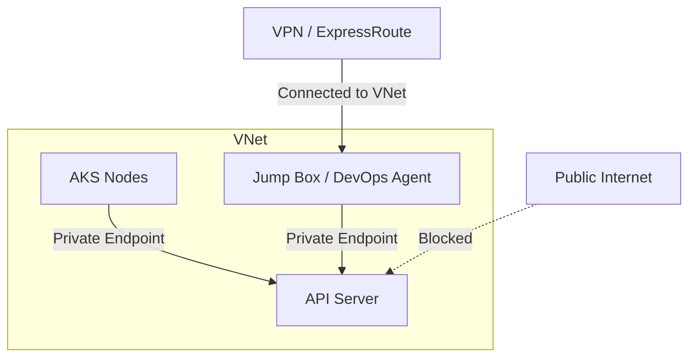

# How to Configure Private AKS Cluster with Azure Private Link and Private DNS Zone

Author: [nawazdhandala](https://www.github.com/nawazdhandala)

Tags: AKS, Private Cluster, Azure Private Link, Private DNS, Kubernetes, Security, Networking

Description: How to deploy a fully private AKS cluster with Private Link and Private DNS zones to keep the API server and cluster traffic off the public internet.

---

A standard AKS cluster exposes its Kubernetes API server on a public endpoint. Anyone who knows the URL can attempt to connect (though they still need valid credentials). For organizations with strict security requirements - healthcare, finance, government - this public exposure is unacceptable. A private AKS cluster uses Azure Private Link to make the API server accessible only through a private IP address in your virtual network, keeping all management traffic off the public internet.

## What Makes a Cluster "Private"

In a private AKS cluster:

- The Kubernetes API server gets a private IP address instead of a public one.
- The API server is accessible only from within the VNet (or connected networks).
- Communication between the API server and node pools goes through private endpoints.
- No public endpoint exists for the API server (or you can optionally keep a restricted public endpoint).



## Prerequisites

- Azure CLI 2.40+
- A VNet with at least two subnets (one for AKS nodes, one for private endpoints)
- DNS infrastructure that can resolve private DNS zones (or Azure Private DNS)
- A jump box, VPN connection, or Azure DevOps self-hosted agent inside the VNet for kubectl access

## Step 1: Create the VNet and Subnets

```bash
# Create a VNet with subnets for AKS and private endpoints
az network vnet create \
  --resource-group myResourceGroup \
  --name myVNet \
  --address-prefixes 10.0.0.0/8 \
  --subnet-name aks-subnet \
  --subnet-prefixes 10.240.0.0/16

# Add a subnet for private endpoints and management VMs
az network vnet subnet create \
  --resource-group myResourceGroup \
  --vnet-name myVNet \
  --name management-subnet \
  --address-prefixes 10.241.0.0/24
```

## Step 2: Create the Private AKS Cluster

Use the `--enable-private-cluster` flag to create a private cluster.

```bash
# Create a private AKS cluster
# The API server will only be accessible via a private endpoint
az aks create \
  --resource-group myResourceGroup \
  --name myPrivateAKS \
  --node-count 3 \
  --node-vm-size Standard_DS3_v2 \
  --network-plugin azure \
  --vnet-subnet-id "/subscriptions/<sub-id>/resourceGroups/myResourceGroup/providers/Microsoft.Network/virtualNetworks/myVNet/subnets/aks-subnet" \
  --enable-private-cluster \
  --enable-managed-identity \
  --generate-ssh-keys
```

This creates the cluster with a private API server endpoint. Azure automatically creates a private DNS zone linked to the VNet.

## Step 3: Verify Private Endpoint Configuration

Check that the private endpoint and DNS are configured correctly.

```bash
# Check the cluster's FQDN and private FQDN
az aks show \
  --resource-group myResourceGroup \
  --name myPrivateAKS \
  --query "{fqdn:fqdn, privateFqdn:privateFqdn, apiServerAccessProfile:apiServerAccessProfile}" \
  --output json
```

The `privateFqdn` field shows the private DNS name for the API server (something like `myPrivateAKS-abc123.hcp.eastus.azmk8s.io`). This resolves to a private IP only from within the VNet.

```bash
# Check the private DNS zone that was created
az network private-dns zone list \
  --resource-group "MC_myResourceGroup_myPrivateAKS_eastus" \
  --output table
```

## Step 4: Access the Private Cluster

Since the API server is not publicly accessible, you need to connect from within the VNet.

### Option A: Jump Box VM

Create a VM in the same VNet.

```bash
# Create a jump box VM in the management subnet
az vm create \
  --resource-group myResourceGroup \
  --name jumpbox \
  --image Ubuntu2204 \
  --vnet-name myVNet \
  --subnet management-subnet \
  --admin-username azureuser \
  --generate-ssh-keys \
  --size Standard_B2s

# SSH into the jump box
ssh azureuser@<jumpbox-public-ip>

# Install Azure CLI and kubectl on the jump box
curl -sL https://aka.ms/InstallAzureCLIDeb | sudo bash
sudo az aks install-cli

# Get cluster credentials
az login
az aks get-credentials --resource-group myResourceGroup --name myPrivateAKS

# Now kubectl works from the jump box
kubectl get nodes
```

### Option B: Azure VPN Gateway

For regular access without a jump box, set up a point-to-site VPN.

```bash
# Create a VPN gateway subnet
az network vnet subnet create \
  --resource-group myResourceGroup \
  --vnet-name myVNet \
  --name GatewaySubnet \
  --address-prefixes 10.242.0.0/24

# Create a public IP for the VPN gateway
az network public-ip create \
  --resource-group myResourceGroup \
  --name vpn-gateway-ip \
  --allocation-method Static \
  --sku Standard

# Create the VPN gateway (this takes 30-45 minutes)
az network vnet-gateway create \
  --resource-group myResourceGroup \
  --name myVPNGateway \
  --vnet myVNet \
  --public-ip-addresses vpn-gateway-ip \
  --gateway-type Vpn \
  --vpn-type RouteBased \
  --sku VpnGw1 \
  --vpn-gateway-generation Generation1
```

After the VPN is set up, connect from your local machine and run kubectl as if you were on the VNet.

### Option C: Azure Bastion

Azure Bastion provides browser-based SSH/RDP access to the jump box without exposing it to the public internet.

```bash
# Create a Bastion subnet
az network vnet subnet create \
  --resource-group myResourceGroup \
  --vnet-name myVNet \
  --name AzureBastionSubnet \
  --address-prefixes 10.243.0.0/26

# Create Azure Bastion
az network bastion create \
  --resource-group myResourceGroup \
  --name myBastion \
  --vnet-name myVNet \
  --public-ip-address bastion-ip
```

## Step 5: Configure Private DNS for Peered VNets

If you have other VNets peered to the AKS VNet, they need to resolve the private DNS zone too.

```bash
# Get the private DNS zone name
DNS_ZONE=$(az network private-dns zone list \
  --resource-group "MC_myResourceGroup_myPrivateAKS_eastus" \
  --query "[0].name" \
  --output tsv)

# Link the private DNS zone to the peered VNet
az network private-dns link vnet create \
  --resource-group "MC_myResourceGroup_myPrivateAKS_eastus" \
  --zone-name "$DNS_ZONE" \
  --name peered-vnet-link \
  --virtual-network "/subscriptions/<sub-id>/resourceGroups/otherRG/providers/Microsoft.Network/virtualNetworks/otherVNet" \
  --registration-enabled false
```

Without this link, VMs in peered VNets cannot resolve the API server's private FQDN.

## Step 6: Set Up CI/CD for Private Clusters

CI/CD pipelines need to reach the private API server. The two main approaches are self-hosted agents and Azure DevOps managed private networking.

### Self-Hosted Agent

Deploy a self-hosted DevOps agent inside the VNet.

```yaml
# agent-deployment.yaml
# Azure DevOps self-hosted agent running in the private VNet
apiVersion: apps/v1
kind: Deployment
metadata:
  name: devops-agent
  namespace: devops
spec:
  replicas: 2
  selector:
    matchLabels:
      app: devops-agent
  template:
    metadata:
      labels:
        app: devops-agent
    spec:
      containers:
      - name: agent
        image: myacr.azurecr.io/azure-devops-agent:latest
        env:
        - name: AZP_URL
          value: "https://dev.azure.com/myorg"
        - name: AZP_TOKEN
          valueFrom:
            secretKeyRef:
              name: devops-agent-secret
              key: token
        - name: AZP_POOL
          value: "AKS-Agents"
```

## Step 7: Optional - Add a Restricted Public Endpoint

If you need public API server access for specific scenarios but want to restrict it, you can authorize specific IP ranges.

```bash
# Enable a restricted public endpoint alongside the private endpoint
az aks update \
  --resource-group myResourceGroup \
  --name myPrivateAKS \
  --enable-public-fqdn

# Authorize specific IP ranges
az aks update \
  --resource-group myResourceGroup \
  --name myPrivateAKS \
  --api-server-authorized-ip-ranges "203.0.113.0/24,198.51.100.10/32"
```

This creates a public FQDN for the API server but restricts access to the specified IP ranges. The private endpoint still works for VNet access.

## Step 8: Connect to Azure Services Privately

In a fully private cluster, pods should also access Azure services through private endpoints.

```bash
# Create a private endpoint for Azure Container Registry
az network private-endpoint create \
  --resource-group myResourceGroup \
  --name acr-private-endpoint \
  --vnet-name myVNet \
  --subnet aks-subnet \
  --private-connection-resource-id "/subscriptions/<sub-id>/resourceGroups/myResourceGroup/providers/Microsoft.ContainerRegistry/registries/myACR" \
  --group-id registry \
  --connection-name acr-connection

# Create a private endpoint for Key Vault
az network private-endpoint create \
  --resource-group myResourceGroup \
  --name kv-private-endpoint \
  --vnet-name myVNet \
  --subnet aks-subnet \
  --private-connection-resource-id "/subscriptions/<sub-id>/resourceGroups/myResourceGroup/providers/Microsoft.KeyVault/vaults/myKeyVault" \
  --group-id vault \
  --connection-name kv-connection
```

Create corresponding private DNS zones for each service.

```bash
# Create private DNS zone for ACR
az network private-dns zone create \
  --resource-group myResourceGroup \
  --name "privatelink.azurecr.io"

az network private-dns link vnet create \
  --resource-group myResourceGroup \
  --zone-name "privatelink.azurecr.io" \
  --name acr-dns-link \
  --virtual-network myVNet \
  --registration-enabled false
```

## Troubleshooting

**kubectl times out**: You are not connected to the VNet. Verify your VPN connection, jump box access, or that you are running from a VM in the VNet.

**DNS resolution fails for the API server**: The private DNS zone might not be linked to your VNet. Check with `az network private-dns link vnet list`.

**Cannot pull images from ACR**: Without a private endpoint for ACR, image pulls go through the public internet. If you have restricted outbound access, create a private endpoint for ACR.

**CI/CD pipeline fails to deploy**: The pipeline agent must be inside the VNet or connected through a VPN. Cloud-hosted agents cannot reach private API servers.

## Summary

Private AKS clusters keep your Kubernetes API server off the public internet, accessible only through private endpoints in your VNet. The setup requires careful planning for DNS resolution, VNet connectivity, and CI/CD access. Use jump boxes, VPN gateways, or Azure Bastion for interactive access, and self-hosted agents for CI/CD pipelines. Combine with private endpoints for ACR, Key Vault, and other Azure services to create a fully private cluster environment where no management or data traffic traverses the public internet.
