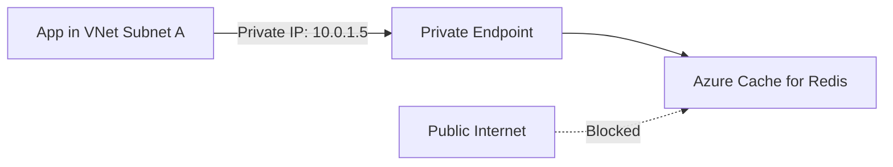

# How to Configure Private Endpoint Access for Azure Cache for Redis

Author: [nawazdhandala](https://www.github.com/nawazdhandala)

Tags: Azure, Redis, Private Endpoint, Networking, Security, Azure Cache for Redis, Virtual Network

Description: Learn how to configure private endpoint access for Azure Cache for Redis to secure your cache within a virtual network and eliminate public internet exposure.

---

By default, Azure Cache for Redis is accessible over the public internet. Any client with the hostname and access key can connect. For many production workloads - especially those handling sensitive data or operating under compliance requirements - this is not acceptable. Private endpoints let you bring your Redis cache into your virtual network, giving it a private IP address and removing the public endpoint entirely.

This guide walks through the complete setup of private endpoint access for Azure Cache for Redis, from network planning to DNS configuration to verification.

## What Is a Private Endpoint?

A private endpoint is a network interface that connects you privately and securely to a service powered by Azure Private Link. Instead of reaching Azure Cache for Redis over its public IP through the internet, your application connects through a private IP address within your virtual network (VNet).

The traffic between your application and Redis never leaves the Microsoft backbone network. From a networking perspective, your Redis cache behaves as if it were deployed directly inside your VNet.



## Why Use Private Endpoints Instead of VNet Injection?

Azure offers two methods for restricting Redis access to a VNet:

- **VNet injection** (Premium tier only): Deploys the Redis nodes directly into a subnet of your VNet.
- **Private endpoints** (all tiers Standard and above): Creates a private link to the Redis service.

Private endpoints are generally preferred for several reasons:

1. **Available on more tiers**: VNet injection requires Premium tier. Private endpoints work on Standard and Premium.
2. **Simpler networking**: VNet injection requires careful subnet sizing and NSG rule management. Private endpoints are just a network interface.
3. **Better with hub-spoke topologies**: Private endpoints work naturally with hub-spoke VNet designs and peering.
4. **Consistent with other Azure services**: Private endpoints work the same way for SQL, Storage, Cosmos DB, and dozens of other services. One pattern to learn.

## Prerequisites

- An Azure Cache for Redis instance (Standard C1 or higher)
- A virtual network with at least one subnet for the private endpoint
- Azure CLI version 2.40 or later
- Network Contributor role (or equivalent) on the VNet

## Step 1: Create the Virtual Network and Subnet

If you already have a VNet, skip to Step 2. Otherwise, create one.

```bash
# Create a resource group
az group create --name rg-redis-private --location eastus

# Create a virtual network with a default subnet
az network vnet create \
  --name vnet-redis \
  --resource-group rg-redis-private \
  --location eastus \
  --address-prefix 10.0.0.0/16 \
  --subnet-name snet-endpoints \
  --subnet-prefix 10.0.1.0/24
```

The subnet for private endpoints does not need any special configuration. Unlike VNet injection, you do not need to set service endpoints or delegation on the subnet.

However, you do need to disable the network policy for private endpoints on the subnet:

```bash
# Disable private endpoint network policies on the subnet
# This allows the private endpoint to be created in this subnet
az network vnet subnet update \
  --name snet-endpoints \
  --vnet-name vnet-redis \
  --resource-group rg-redis-private \
  --disable-private-endpoint-network-policies true
```

## Step 2: Create the Azure Cache for Redis Instance

```bash
# Create a Standard C1 Redis cache
az redis create \
  --name my-private-redis \
  --resource-group rg-redis-private \
  --location eastus \
  --sku Standard \
  --vm-size C1 \
  --enable-non-ssl-port false
```

Wait for provisioning to complete before creating the private endpoint.

## Step 3: Create the Private Endpoint

Now create the private endpoint that links your VNet to the Redis cache.

```bash
# Get the resource ID of the Redis cache
REDIS_ID=$(az redis show \
  --name my-private-redis \
  --resource-group rg-redis-private \
  --query id -o tsv)

# Create the private endpoint
az network private-endpoint create \
  --name pe-redis \
  --resource-group rg-redis-private \
  --vnet-name vnet-redis \
  --subnet snet-endpoints \
  --private-connection-resource-id $REDIS_ID \
  --group-id redisCache \
  --connection-name redis-private-connection \
  --location eastus
```

The `--group-id redisCache` tells Azure which sub-resource of the Redis cache to connect to. For Azure Cache for Redis, this is always `redisCache`.

After this command completes, your Redis cache has a private IP address in the 10.0.1.0/24 subnet.

```bash
# Verify the private endpoint was created and get its private IP
az network private-endpoint show \
  --name pe-redis \
  --resource-group rg-redis-private \
  --query "customDnsConfigurations[0].ipAddresses[0]" -o tsv
```

## Step 4: Configure Private DNS

This is the step people most often skip, and it causes mysterious connection failures. When your application connects to `my-private-redis.redis.cache.windows.net`, the DNS resolution must return the private IP (10.0.1.x), not the public IP. You achieve this with a private DNS zone.

```bash
# Create a private DNS zone for Redis
az network private-dns zone create \
  --name privatelink.redis.cache.windows.net \
  --resource-group rg-redis-private

# Link the DNS zone to your VNet so resources in the VNet use it
az network private-dns link vnet create \
  --name redis-dns-link \
  --resource-group rg-redis-private \
  --zone-name privatelink.redis.cache.windows.net \
  --virtual-network vnet-redis \
  --registration-enabled false

# Create a DNS zone group to automatically manage DNS records
az network private-endpoint dns-zone-group create \
  --name redis-dns-group \
  --resource-group rg-redis-private \
  --endpoint-name pe-redis \
  --private-dns-zone privatelink.redis.cache.windows.net \
  --zone-name rediscache
```

The DNS zone group automatically creates an A record in the private DNS zone that maps `my-private-redis.privatelink.redis.cache.windows.net` to the private IP. When combined with the VNet link, DNS queries from within the VNet will resolve to the private IP.

## Step 5: Disable Public Network Access

Creating a private endpoint does not automatically disable public access. If you want the cache to be reachable only through the private endpoint, you need to explicitly disable public access.

```bash
# Disable public network access
az redis update \
  --name my-private-redis \
  --resource-group rg-redis-private \
  --set publicNetworkAccess=Disabled
```

After this change, any attempt to connect to the Redis cache from the public internet will be rejected, even with valid credentials.

## Step 6: Verify Connectivity

Test that your private endpoint is working by connecting from a VM or service within the VNet.

### From a VM in the VNet

```bash
# SSH into a VM in the same VNet and test DNS resolution
nslookup my-private-redis.redis.cache.windows.net

# Expected output should show the private IP (10.0.1.x)
# instead of the public IP

# Test connectivity with redis-cli
redis-cli -h my-private-redis.redis.cache.windows.net \
  -p 6380 --tls -a <access-key> PING
# Should return PONG
```

### From Azure App Service with VNet Integration

If your application runs on Azure App Service, you need VNet integration for it to reach the private endpoint.

```bash
# Enable VNet integration for an App Service
az webapp vnet-integration add \
  --name my-web-app \
  --resource-group rg-redis-private \
  --vnet vnet-redis \
  --subnet snet-apps
```

Make sure the App Service's subnet can reach the private endpoint subnet. If they are in the same VNet, this works automatically. If they are in different VNets, you need VNet peering.

## Troubleshooting Common Issues

### DNS Resolution Returns Public IP

If nslookup returns the public IP instead of the private IP, the private DNS zone is not linked to your VNet correctly. Check:

```bash
# Verify the DNS zone link exists
az network private-dns link vnet list \
  --zone-name privatelink.redis.cache.windows.net \
  --resource-group rg-redis-private \
  -o table
```

### Connection Times Out

If DNS resolves correctly but connections time out:

1. Check NSG rules on the private endpoint subnet. Port 6380 (TLS) must be allowed.
2. Verify that the connecting resource is in a VNet that can reach the private endpoint (same VNet or peered VNet).
3. Check if there are any route tables that might be redirecting traffic through a firewall that blocks Redis traffic.

### App Service Cannot Connect

App Service VNet integration uses a separate subnet. Ensure:
- The subnet is delegated to `Microsoft.Web/serverFarms`
- The subnet has enough available IP addresses
- DNS resolution from the App Service resolves to the private IP (check with the Kudu console)

## Network Architecture Patterns

### Hub-Spoke with Centralized Private Endpoints

In a hub-spoke topology, place private endpoints in the hub VNet and peer spoke VNets to the hub. All spokes can reach the private endpoint through peering. Make sure DNS is shared across all VNets:

```bash
# Link each spoke VNet to the private DNS zone
az network private-dns link vnet create \
  --name spoke1-dns-link \
  --resource-group rg-redis-private \
  --zone-name privatelink.redis.cache.windows.net \
  --virtual-network /subscriptions/<sub-id>/resourceGroups/rg-spoke1/providers/Microsoft.Network/virtualNetworks/vnet-spoke1 \
  --registration-enabled false
```

### On-Premises Access via ExpressRoute or VPN

If on-premises applications need to reach the private endpoint, ensure:
- The VPN or ExpressRoute gateway is in a VNet linked to the private DNS zone
- DNS forwarders or conditional forwarding is configured for `privatelink.redis.cache.windows.net`
- The private IP range is routable from on-premises through the gateway

## Wrapping Up

Private endpoints for Azure Cache for Redis give you network-level isolation that access keys alone cannot provide. The setup involves creating the private endpoint, configuring DNS correctly, and optionally disabling public access. The DNS piece is the most critical part - get that wrong and nothing connects. Once it is working, your Redis traffic stays on the Microsoft backbone, never touching the public internet, which satisfies both security requirements and compliance auditors.
