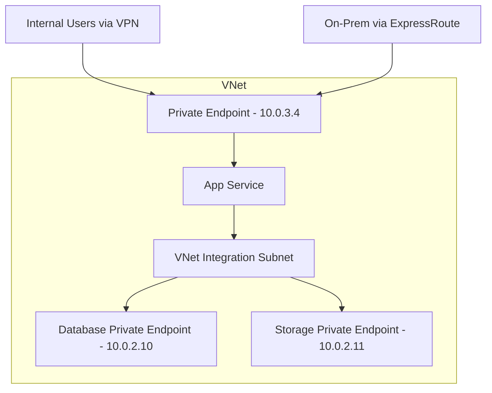

# How to Configure Private Endpoints for Azure App Service

Author: [nawazdhandala](https://www.github.com/nawazdhandala)

Tags: Azure, App Service, Private Endpoints, Networking, Security, Private Link

Description: Learn how to configure private endpoints for Azure App Service to restrict inbound access to your VNet and eliminate public internet exposure.

---

By default, Azure App Service is accessible from the public internet. Anyone who knows the URL can send requests to your application. For internal applications, admin panels, APIs that only backend services should access, or compliance-sensitive workloads, this is not acceptable. Private endpoints let you bring your App Service's inbound traffic into your VNet, giving it a private IP address and removing public internet access entirely.

This is different from VNet Integration, which handles outbound traffic. Private endpoints handle inbound traffic. Together, they create a fully private network path: traffic enters through a private endpoint and outbound connections go through VNet Integration.

## How Private Endpoints Work for App Service

When you create a private endpoint for an App Service, Azure provisions a network interface in your VNet with a private IP address. DNS is configured so that the App Service's hostname (myapp.azurewebsites.net) resolves to this private IP instead of the public IP. Traffic to the App Service flows over the Azure backbone through your VNet, never touching the public internet.

The key behaviors:

- The App Service gets a private IP from your VNet subnet
- The public endpoint can be disabled (recommended) or left accessible
- DNS resolution changes so the hostname points to the private IP
- Clients outside the VNet cannot reach the app unless they are connected via VPN, ExpressRoute, or VNet peering
- The private endpoint works with deployment slots (each slot can have its own private endpoint)

## Prerequisites

- App Service must be on a Basic tier or higher (for private endpoint support)
- A VNet with a subnet that has enough available IP addresses
- The subnet does NOT need to be delegated (unlike VNet Integration subnets)
- Azure Private DNS zone or custom DNS configuration

## Step 1: Create the Private Endpoint

```bash
# Create a subnet for private endpoints (if you do not have one)
az network vnet subnet create \
  --resource-group myAppRG \
  --vnet-name myVNet \
  --name private-endpoints-subnet \
  --address-prefix 10.0.3.0/24

# Disable network policies on the subnet (required for private endpoints)
az network vnet subnet update \
  --resource-group myAppRG \
  --vnet-name myVNet \
  --name private-endpoints-subnet \
  --disable-private-endpoint-network-policies true

# Get the App Service resource ID
APP_ID=$(az webapp show \
  --resource-group myAppRG \
  --name myapp \
  --query id -o tsv)

# Create the private endpoint
az network private-endpoint create \
  --resource-group myAppRG \
  --name myapp-private-endpoint \
  --vnet-name myVNet \
  --subnet private-endpoints-subnet \
  --private-connection-resource-id $APP_ID \
  --group-ids sites \
  --connection-name myapp-connection
```

## Step 2: Configure Private DNS

For the private endpoint to work properly, DNS needs to resolve the App Service hostname to its private IP. The standard approach is to use an Azure Private DNS zone:

```bash
# Create the private DNS zone for App Service
az network private-dns zone create \
  --resource-group myAppRG \
  --name privatelink.azurewebsites.net

# Link the DNS zone to your VNet
az network private-dns zone virtual-network-link create \
  --resource-group myAppRG \
  --zone-name privatelink.azurewebsites.net \
  --name vnet-dns-link \
  --virtual-network myVNet \
  --registration-enabled false

# Create a DNS zone group for automatic DNS record management
az network private-endpoint dns-zone-group create \
  --resource-group myAppRG \
  --endpoint-name myapp-private-endpoint \
  --name default \
  --private-dns-zone privatelink.azurewebsites.net \
  --zone-name privatelink.azurewebsites.net
```

The DNS zone group automatically creates and maintains the A record that maps `myapp.privatelink.azurewebsites.net` to the private endpoint's IP address. The regular `myapp.azurewebsites.net` hostname has a CNAME to the privatelink hostname, so resolution chains correctly.

Verify DNS resolution:

```bash
# From a VM in the VNet, verify resolution
nslookup myapp.azurewebsites.net

# Should return something like:
# Name: myapp.privatelink.azurewebsites.net
# Address: 10.0.3.4
```

## Step 3: Disable Public Access

With the private endpoint in place, disable public access to ensure all traffic comes through the VNet:

```bash
# Disable public access
az webapp update \
  --resource-group myAppRG \
  --name myapp \
  --set publicNetworkAccess=Disabled
```

After this, the App Service is only reachable through the private endpoint. Requests from the public internet will be refused.

If you want to keep public access for some scenarios (like allowing specific IPs), use access restrictions instead:

```bash
# Allow access only from the VNet and specific IPs
az webapp config access-restriction add \
  --resource-group myAppRG \
  --name myapp \
  --rule-name "AllowVNet" \
  --priority 100 \
  --vnet-name myVNet \
  --subnet private-endpoints-subnet

az webapp config access-restriction add \
  --resource-group myAppRG \
  --name myapp \
  --rule-name "AllowOfficeIP" \
  --priority 200 \
  --ip-address 203.0.113.50/32
```

## Step 4: Configure SCM Site Private Endpoint

The SCM (Kudu) site used for deployments has its own endpoint. By default, creating a private endpoint for the main site also covers the SCM site. But you can configure them separately if needed:

```bash
# Check SCM site access
az webapp show \
  --resource-group myAppRG \
  --name myapp \
  --query "siteConfig.scmIpSecurityRestrictionsDefaultAction" -o tsv
```

If you disabled public access, deployments from GitHub Actions or Azure DevOps will need to come through the VNet too. You have several options:

**Option A: Self-hosted runners in the VNet**: Deploy GitHub Actions runners or Azure DevOps agents as VMs in your VNet.

**Option B: Allow SCM public access**: Keep the SCM site publicly accessible while restricting the main site.

```bash
# Allow public access to SCM site for deployments
az webapp config access-restriction set \
  --resource-group myAppRG \
  --name myapp \
  --use-same-restrictions-for-scm-site false

# Set SCM default action to allow
az webapp update \
  --resource-group myAppRG \
  --name myapp \
  --set siteConfig.scmIpSecurityRestrictionsDefaultAction=Allow
```

## Architecture with Both Private Endpoints and VNet Integration

For a fully private setup, combine private endpoints (inbound) with VNet Integration (outbound):



```bash
# Complete setup: Private Endpoint + VNet Integration

# 1. VNet Integration (outbound to private resources)
az webapp vnet-integration add \
  --resource-group myAppRG \
  --name myapp \
  --vnet myVNet \
  --subnet appservice-subnet

# 2. Private Endpoint (inbound from VNet only)
az network private-endpoint create \
  --resource-group myAppRG \
  --name myapp-private-endpoint \
  --vnet-name myVNet \
  --subnet private-endpoints-subnet \
  --private-connection-resource-id $APP_ID \
  --group-ids sites \
  --connection-name myapp-connection

# 3. Disable public access
az webapp update \
  --resource-group myAppRG \
  --name myapp \
  --set publicNetworkAccess=Disabled

# 4. Route all outbound through VNet
az webapp config appsettings set \
  --resource-group myAppRG \
  --name myapp \
  --settings WEBSITE_VNET_ROUTE_ALL=1
```

## Private Endpoints for Deployment Slots

Each deployment slot can have its own private endpoint. This is important for testing in the staging slot before swapping:

```bash
# Get the staging slot resource ID
SLOT_ID=$(az webapp show \
  --resource-group myAppRG \
  --name myapp \
  --slot staging \
  --query id -o tsv)

# Create a private endpoint for the staging slot
az network private-endpoint create \
  --resource-group myAppRG \
  --name myapp-staging-pe \
  --vnet-name myVNet \
  --subnet private-endpoints-subnet \
  --private-connection-resource-id $SLOT_ID \
  --group-ids sites-staging \
  --connection-name myapp-staging-connection
```

## Cross-VNet Access with VNet Peering

If clients in a different VNet need to access the App Service through its private endpoint, set up VNet peering:

```bash
# Peer the client VNet with the App Service VNet
az network vnet peering create \
  --resource-group clientRG \
  --name client-to-app-peering \
  --vnet-name clientVNet \
  --remote-vnet "/subscriptions/<sub-id>/resourceGroups/myAppRG/providers/Microsoft.Network/virtualNetworks/myVNet" \
  --allow-vnet-access

# Peer in the other direction
az network vnet peering create \
  --resource-group myAppRG \
  --name app-to-client-peering \
  --vnet-name myVNet \
  --remote-vnet "/subscriptions/<sub-id>/resourceGroups/clientRG/providers/Microsoft.Network/virtualNetworks/clientVNet" \
  --allow-vnet-access

# Link the private DNS zone to the client VNet
az network private-dns zone virtual-network-link create \
  --resource-group myAppRG \
  --zone-name privatelink.azurewebsites.net \
  --name client-vnet-link \
  --virtual-network "/subscriptions/<sub-id>/resourceGroups/clientRG/providers/Microsoft.Network/virtualNetworks/clientVNet" \
  --registration-enabled false
```

## Troubleshooting

### DNS Resolution Returns Public IP

If `nslookup myapp.azurewebsites.net` returns a public IP instead of the private IP:
- Verify the private DNS zone is linked to the VNet
- Verify the A record exists in the privatelink zone
- If using custom DNS, ensure it forwards to Azure DNS (168.63.129.16)

### Connection Timeout

If you get timeouts connecting to the private endpoint:
- Check NSG rules on the private endpoint subnet
- Verify the private endpoint is in a "Succeeded" provisioning state
- Test from a VM in the same VNet to rule out peering or VPN issues

```bash
# Check private endpoint status
az network private-endpoint show \
  --resource-group myAppRG \
  --name myapp-private-endpoint \
  --query "{Status:provisioningState, IP:customDnsConfigs[0].ipAddresses[0]}" -o json
```

### Deployment Failures After Disabling Public Access

If CI/CD deployments fail after disabling public access:
- Use self-hosted runners in the VNet
- Use an IP access restriction to allow your CI/CD service's IP range
- Keep SCM site public access if the main site private endpoint is sufficient for your security requirements

## Monitoring Private Endpoints

Monitor the health and connectivity of your private endpoints:

```bash
# List all private endpoints in the resource group
az network private-endpoint list \
  --resource-group myAppRG \
  --query "[].{Name:name, Status:provisioningState, SubnetId:subnet.id}" -o table
```

Use OneUptime to monitor the private endpoint from within your VNet. Set up health checks from agents running inside VMs in the same VNet to verify that the App Service is reachable through the private endpoint. This catches DNS resolution failures and network connectivity issues before users report them.

## Wrapping Up

Private endpoints for Azure App Service eliminate public internet exposure for your web applications. The setup involves creating the private endpoint, configuring DNS with a private DNS zone, and optionally disabling public access. Combine private endpoints with VNet Integration for a fully private networking setup where both inbound and outbound traffic flows through your VNet. Plan your deployment strategy for the SCM site, and set up monitoring from within the VNet to verify end-to-end connectivity.
