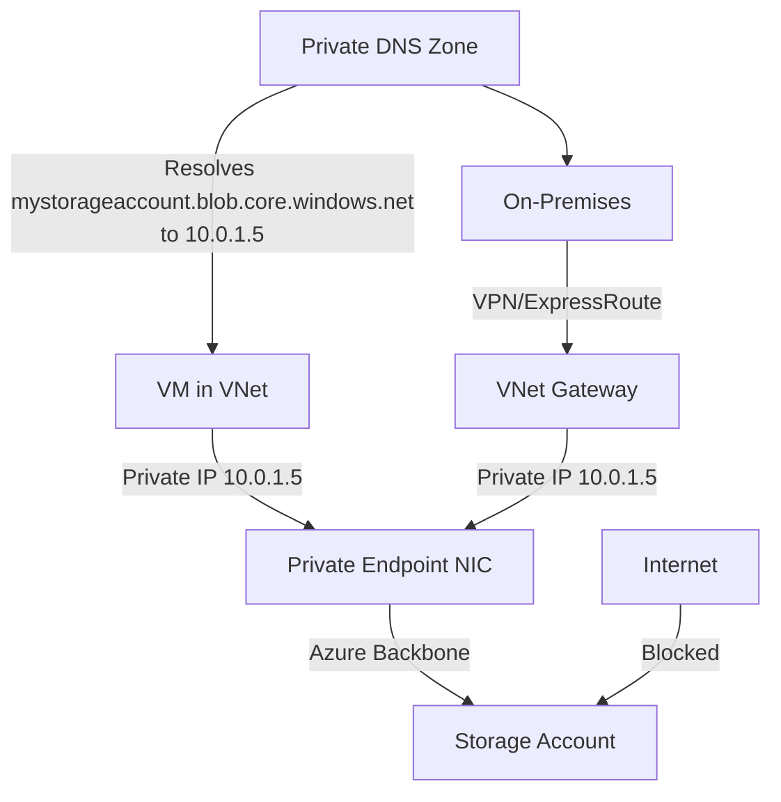

# How to Configure Private Endpoints for Azure Storage Accounts

Author: [nawazdhandala](https://www.github.com/nawazdhandala)

Tags: Azure, Private Endpoints, Storage Account, Network Security, Private Link, Virtual Network

Description: Learn how to set up Azure Private Endpoints for storage accounts to route all traffic through your virtual network and eliminate public internet exposure.

---

Private endpoints bring Azure Storage into your virtual network. Instead of traffic traveling over the public internet to reach your storage account, it flows through a private IP address within your VNet. This means your data never leaves the Microsoft backbone network, and you can completely disable public access to the storage account. In this post, I will cover how to set up private endpoints, configure DNS, and validate the connection.

## How Private Endpoints Work

When you create a private endpoint for a storage account, Azure provisions a network interface with a private IP address from your subnet. This IP address maps to a specific storage service (Blob, File, Queue, Table, or DFS/Data Lake). Traffic from your VNet to the storage account is routed through this private IP over the Azure backbone network.

The key benefits are:

- Data stays on the Microsoft network, never traversing the public internet.
- You can disable all public access to the storage account.
- Private endpoints work across VNet peering and VPN/ExpressRoute connections.
- You get network-level isolation that complements your existing firewall rules.

## Creating a Private Endpoint with Azure CLI

Each storage service (blob, file, queue, table, dfs) needs its own private endpoint. Most commonly, you will create one for blob storage.

```bash
# Create a private endpoint for blob storage
az network private-endpoint create \
  --name pe-storage-blob \
  --resource-group my-resource-group \
  --vnet-name my-vnet \
  --subnet my-private-endpoint-subnet \
  --private-connection-resource-id "/subscriptions/<sub>/resourceGroups/my-resource-group/providers/Microsoft.Storage/storageAccounts/mystorageaccount" \
  --group-id blob \
  --connection-name pe-storage-blob-connection \
  --location eastus

# Verify the private endpoint was created
az network private-endpoint show \
  --name pe-storage-blob \
  --resource-group my-resource-group \
  --query "{name:name, subnet:subnet.id, status:privateLinkServiceConnections[0].privateLinkServiceConnectionState.status}" \
  --output table
```

The `--group-id` specifies which storage service to connect. Valid values are: `blob`, `blob_secondary`, `file`, `file_secondary`, `queue`, `queue_secondary`, `table`, `table_secondary`, `web`, `web_secondary`, `dfs`, `dfs_secondary`.

## Creating Private Endpoints for Multiple Services

If your application uses both blob and table storage, create a separate private endpoint for each.

```bash
# Private endpoint for blob
az network private-endpoint create \
  --name pe-storage-blob \
  --resource-group my-resource-group \
  --vnet-name my-vnet \
  --subnet pe-subnet \
  --private-connection-resource-id "$STORAGE_ACCOUNT_ID" \
  --group-id blob \
  --connection-name blob-connection

# Private endpoint for table
az network private-endpoint create \
  --name pe-storage-table \
  --resource-group my-resource-group \
  --vnet-name my-vnet \
  --subnet pe-subnet \
  --private-connection-resource-id "$STORAGE_ACCOUNT_ID" \
  --group-id table \
  --connection-name table-connection

# Private endpoint for Data Lake Storage Gen2
az network private-endpoint create \
  --name pe-storage-dfs \
  --resource-group my-resource-group \
  --vnet-name my-vnet \
  --subnet pe-subnet \
  --private-connection-resource-id "$STORAGE_ACCOUNT_ID" \
  --group-id dfs \
  --connection-name dfs-connection
```

## Configuring Private DNS

For private endpoints to work correctly, DNS resolution must return the private IP address instead of the public IP. Azure Private DNS Zones handle this.

```bash
# Create a private DNS zone for blob storage
az network private-dns zone create \
  --name "privatelink.blob.core.windows.net" \
  --resource-group my-resource-group

# Link the DNS zone to your VNet
az network private-dns link vnet create \
  --name blob-dns-link \
  --resource-group my-resource-group \
  --zone-name "privatelink.blob.core.windows.net" \
  --virtual-network my-vnet \
  --registration-enabled false

# Create a DNS zone group to auto-register the private endpoint's IP
az network private-endpoint dns-zone-group create \
  --name blob-dns-group \
  --resource-group my-resource-group \
  --endpoint-name pe-storage-blob \
  --private-dns-zone "/subscriptions/<sub>/resourceGroups/my-resource-group/providers/Microsoft.Network/privateDnsZones/privatelink.blob.core.windows.net" \
  --zone-name blob
```

The DNS zone names follow a pattern for each storage service:

- Blob: `privatelink.blob.core.windows.net`
- File: `privatelink.file.core.windows.net`
- Queue: `privatelink.queue.core.windows.net`
- Table: `privatelink.table.core.windows.net`
- DFS: `privatelink.dfs.core.windows.net`

## Creating Private Endpoints with PowerShell

```powershell
# Get the storage account resource
$storage = Get-AzStorageAccount -ResourceGroupName "my-resource-group" -Name "mystorageaccount"

# Get the subnet
$subnet = Get-AzVirtualNetwork -Name "my-vnet" -ResourceGroupName "my-resource-group" |
  Get-AzVirtualNetworkSubnetConfig -Name "pe-subnet"

# Create a private link service connection
$plsConnection = New-AzPrivateLinkServiceConnection `
  -Name "blob-connection" `
  -PrivateLinkServiceId $storage.Id `
  -GroupId "blob"

# Create the private endpoint
$pe = New-AzPrivateEndpoint `
  -Name "pe-storage-blob" `
  -ResourceGroupName "my-resource-group" `
  -Location "eastus" `
  -Subnet $subnet `
  -PrivateLinkServiceConnection $plsConnection

# Create DNS zone and registration
$dnsZone = New-AzPrivateDnsZone -Name "privatelink.blob.core.windows.net" -ResourceGroupName "my-resource-group"

# Link DNS zone to VNet
$vnet = Get-AzVirtualNetwork -Name "my-vnet" -ResourceGroupName "my-resource-group"
New-AzPrivateDnsVirtualNetworkLink `
  -Name "blob-dns-link" `
  -ResourceGroupName "my-resource-group" `
  -ZoneName "privatelink.blob.core.windows.net" `
  -VirtualNetworkId $vnet.Id

Write-Output "Private endpoint configured for blob storage"
```

## Configuring with Terraform

```hcl
# Create the private endpoint
resource "azurerm_private_endpoint" "storage_blob" {
  name                = "pe-storage-blob"
  location            = azurerm_resource_group.main.location
  resource_group_name = azurerm_resource_group.main.name
  subnet_id           = azurerm_subnet.pe_subnet.id

  private_service_connection {
    name                           = "blob-connection"
    private_connection_resource_id = azurerm_storage_account.main.id
    subresource_names              = ["blob"]
    is_manual_connection           = false
  }

  # Automatically register DNS
  private_dns_zone_group {
    name                 = "blob-dns-group"
    private_dns_zone_ids = [azurerm_private_dns_zone.blob.id]
  }
}

resource "azurerm_private_dns_zone" "blob" {
  name                = "privatelink.blob.core.windows.net"
  resource_group_name = azurerm_resource_group.main.name
}

resource "azurerm_private_dns_zone_virtual_network_link" "blob" {
  name                  = "blob-dns-link"
  resource_group_name   = azurerm_resource_group.main.name
  private_dns_zone_name = azurerm_private_dns_zone.blob.name
  virtual_network_id    = azurerm_virtual_network.main.id
}
```

## Disabling Public Access

After setting up private endpoints, you can disable public access entirely.

```bash
# Disable public network access to the storage account
az storage account update \
  --name mystorageaccount \
  --resource-group my-resource-group \
  --public-network-access Disabled

# Verify
az storage account show \
  --name mystorageaccount \
  --resource-group my-resource-group \
  --query "publicNetworkAccess"
```

## Validating the Private Endpoint

From a VM in the same VNet, verify that DNS resolves to the private IP.

```bash
# From a VM in the VNet, resolve the storage account DNS
nslookup mystorageaccount.blob.core.windows.net

# Expected output should show the private IP, like:
# Name: mystorageaccount.privatelink.blob.core.windows.net
# Address: 10.0.1.5

# Test connectivity to the private endpoint
curl -s -o /dev/null -w "%{http_code}" \
  "https://mystorageaccount.blob.core.windows.net/?comp=list"
```

## Architecture Diagram



## Subnet Requirements

The subnet used for private endpoints should have network policies disabled (this is done automatically by Azure for most configurations). The subnet does not need a service endpoint - private endpoints and service endpoints are different mechanisms.

```bash
# Ensure the subnet allows private endpoint network policies
az network vnet subnet update \
  --name pe-subnet \
  --vnet-name my-vnet \
  --resource-group my-resource-group \
  --disable-private-endpoint-network-policies true
```

## Private Endpoints vs. Service Endpoints

Service endpoints extend your VNet identity to the storage account over the public endpoint. The traffic still goes to the storage account's public IP, but Azure verifies it came from an authorized VNet.

Private endpoints create a private IP in your VNet that routes to the storage account over a private connection. The storage account's public endpoint can be completely disabled.

For maximum security, use private endpoints. They provide true network-level isolation and work with on-premises networks through VPN or ExpressRoute.

Private endpoints are the gold standard for securing Azure Storage connectivity. They eliminate public internet exposure and keep all traffic on the Microsoft backbone. The setup requires a few extra steps for DNS configuration, but the security benefits make it worthwhile for any production workload handling sensitive data.
