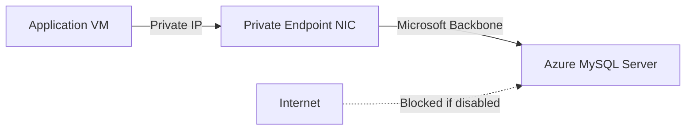

# How to Configure Private Link Access for Azure Database for MySQL

Author: [nawazdhandala](https://www.github.com/nawazdhandala)

Tags: Azure, MySQL, Private Link, Networking, Security, VNet, Private Endpoint

Description: Learn how to configure Azure Private Link for Azure Database for MySQL to ensure your database traffic never traverses the public internet.

---

By default, Azure Database for MySQL Flexible Server can be accessed over a public endpoint. While firewall rules restrict which IP addresses can connect, the traffic still routes through the public internet. For many organizations, this is not acceptable. Compliance requirements, security policies, and general best practices all point toward keeping database traffic on private networks.

Azure Private Link solves this problem by bringing the MySQL service into your virtual network through a private endpoint. Your application connects to a private IP address within your VNet, and the traffic never leaves Microsoft's network backbone.

In this post, I will walk you through setting up Private Link access for Azure Database for MySQL, including the networking concepts, step-by-step configuration, and DNS considerations that often trip people up.

## Private Access vs. Private Link

Azure Database for MySQL Flexible Server offers two approaches to private networking:

**VNet Integration (Private Access)**: The server is deployed directly into a delegated subnet in your VNet. This is configured during server creation and cannot be changed later.

**Private Link (Private Endpoint)**: A private endpoint is created in your VNet that maps to the MySQL server. The server itself can have a public endpoint, but you access it through the private IP.

The key differences:

| Feature | VNet Integration | Private Link |
|---------|-----------------|--------------|
| When configured | Server creation only | Anytime |
| Server placement | Inside your VNet | Outside VNet, accessed via endpoint |
| Cross-VNet access | Requires peering | Works with any VNet |
| Cross-region access | No | Yes |
| DNS configuration | Automatic | Manual or Azure Private DNS Zone |

If you are creating a new server and want it completely isolated in your network, VNet Integration is simpler. If you have an existing server with public access or need cross-region private connectivity, Private Link is the way to go.

## How Private Link Works

When you create a private endpoint for your MySQL server, Azure does the following:

1. Creates a network interface in your specified subnet with a private IP address.
2. Maps that private IP to your MySQL server's resource.
3. Traffic from your VNet to the MySQL server routes through the private endpoint.



From your application's perspective, it connects to a private IP address (like 10.0.1.5) instead of a public FQDN. The connection feels like talking to a server on your local network.

## Prerequisites

Before setting up Private Link:

- An Azure Database for MySQL Flexible Server (public access mode).
- A Virtual Network with at least one subnet for the private endpoint.
- The subnet must not have the `Microsoft.DBforMySQL/flexibleServers` delegation (that is for VNet Integration, not Private Link).
- Network Contributor role on the VNet.

## Step 1: Create the Private Endpoint

### Using Azure CLI

```bash
# Get the resource ID of your MySQL server
MYSQL_ID=$(az mysql flexible-server show \
  --resource-group myResourceGroup \
  --name my-mysql-server \
  --query "id" \
  --output tsv)

# Create the private endpoint in your VNet
az network private-endpoint create \
  --resource-group myResourceGroup \
  --name my-mysql-private-endpoint \
  --vnet-name myVNet \
  --subnet mySubnet \
  --private-connection-resource-id "$MYSQL_ID" \
  --group-id mysqlServer \
  --connection-name my-mysql-connection \
  --location eastus
```

### Using the Azure Portal

1. Navigate to your MySQL Flexible Server.
2. Click "Networking" in the left menu.
3. Click the "Private endpoint connections" tab.
4. Click "Add private endpoint."
5. Fill in the basics: name, region, resource group.
6. On the Resource tab, confirm the target sub-resource is "mysqlServer."
7. On the Virtual Network tab, select your VNet and subnet.
8. On the DNS tab, choose to integrate with Azure Private DNS Zone (recommended).
9. Review and create.

## Step 2: Configure Private DNS

This is the part that causes the most confusion. When you connect to `my-mysql-server.mysql.database.azure.com`, that FQDN resolves to the public IP by default. You need it to resolve to the private IP instead.

### Option A: Azure Private DNS Zone (Recommended)

Create a private DNS zone and link it to your VNet:

```bash
# Create a private DNS zone for MySQL
az network private-dns zone create \
  --resource-group myResourceGroup \
  --name privatelink.mysql.database.azure.com

# Link the DNS zone to your VNet
az network private-dns zone vnet-link create \
  --resource-group myResourceGroup \
  --zone-name privatelink.mysql.database.azure.com \
  --name myVNetLink \
  --virtual-network myVNet \
  --registration-enabled false

# Create the DNS record for your MySQL server
# Get the private endpoint's private IP first
PRIVATE_IP=$(az network private-endpoint show \
  --resource-group myResourceGroup \
  --name my-mysql-private-endpoint \
  --query "customDnsConfigurations[0].ipAddresses[0]" \
  --output tsv)

# Create an A record pointing the server name to the private IP
az network private-dns record-set a add-record \
  --resource-group myResourceGroup \
  --zone-name privatelink.mysql.database.azure.com \
  --record-set-name my-mysql-server \
  --ipv4-address "$PRIVATE_IP"
```

Now, any VM in the linked VNet that resolves `my-mysql-server.mysql.database.azure.com` will get the private IP address instead of the public one.

### Option B: Custom DNS Server

If you use a custom DNS server in your VNet:

1. Configure a conditional forwarder for `privatelink.mysql.database.azure.com` pointing to 168.63.129.16 (Azure's recursive resolver).
2. Or manually add an A record for `my-mysql-server.privatelink.mysql.database.azure.com` pointing to the private IP.

### Option C: Hosts File (Development Only)

For quick testing, edit the hosts file on your VM:

```bash
# Add to /etc/hosts (Linux) or C:\Windows\System32\drivers\etc\hosts (Windows)
10.0.1.5  my-mysql-server.mysql.database.azure.com
```

This is fine for development but not suitable for production.

## Step 3: Verify DNS Resolution

From a VM in the VNet, verify the DNS resolution:

```bash
# Check that the FQDN resolves to the private IP
nslookup my-mysql-server.mysql.database.azure.com

# Expected output should show the private IP (e.g., 10.0.1.5)
# not the public IP
```

If you still see the public IP, the DNS zone is not linked correctly or your VM is using a custom DNS server that is not configured for the private zone.

## Step 4: Disable Public Access (Optional but Recommended)

Once Private Link is working, you can disable public access to ensure all connections go through the private endpoint:

```bash
# Deny public network access
az mysql flexible-server update \
  --resource-group myResourceGroup \
  --name my-mysql-server \
  --public-network-access Disabled
```

After disabling public access, only connections through private endpoints will work. Make sure all your applications are configured to use the private endpoint before doing this.

## Step 5: Test the Connection

From a VM in the VNet:

```bash
# Test connectivity to the private endpoint
mysql -h my-mysql-server.mysql.database.azure.com \
  -u myadmin \
  -p \
  --ssl-mode=REQUIRED

# Once connected, verify the connection source
SELECT USER(), @@hostname;
```

## Cross-VNet and Cross-Region Access

One of the advantages of Private Link over VNet Integration is that it works across VNets and regions.

### Cross-VNet Access with VNet Peering

If your application is in a different VNet:

1. Peer the two VNets.
2. Link the private DNS zone to both VNets.
3. The private endpoint is now accessible from both VNets.

```bash
# Link the private DNS zone to the second VNet
az network private-dns zone vnet-link create \
  --resource-group myResourceGroup \
  --zone-name privatelink.mysql.database.azure.com \
  --name mySecondVNetLink \
  --virtual-network mySecondVNet \
  --registration-enabled false
```

### Cross-Region Access

Private endpoints can be accessed from VNets in other regions through global VNet peering. The traffic stays on Microsoft's backbone network regardless of the regions involved.

## Network Security Groups

You can apply Network Security Groups (NSGs) to the subnet containing the private endpoint to control which resources can reach it:

```bash
# Create an NSG rule allowing MySQL traffic only from the app subnet
az network nsg rule create \
  --resource-group myResourceGroup \
  --nsg-name myNSG \
  --name AllowMySQL \
  --protocol Tcp \
  --direction Inbound \
  --priority 100 \
  --source-address-prefix 10.0.0.0/24 \
  --destination-port-range 3306 \
  --access Allow
```

## Monitoring Private Endpoint Connections

Track who is connecting through the private endpoint:

```bash
# List all private endpoint connections to your server
az mysql flexible-server show \
  --resource-group myResourceGroup \
  --name my-mysql-server \
  --query "privateEndpointConnections"
```

You can approve or reject pending private endpoint connections:

```bash
# Approve a pending connection
az mysql flexible-server private-endpoint-connection approve \
  --resource-group myResourceGroup \
  --server-name my-mysql-server \
  --name my-pending-connection \
  --description "Approved for production app"
```

## Troubleshooting

**Cannot connect through private endpoint**: Check DNS resolution first. 90% of Private Link issues are DNS-related. Run `nslookup` and verify the FQDN resolves to a private IP.

**Connection works from one VNet but not another**: Make sure the private DNS zone is linked to all VNets that need access, and that VNet peering is configured.

**Intermittent connectivity**: Check NSG rules on the subnet. Ensure outbound traffic from your application subnet and inbound traffic to the private endpoint subnet are allowed on port 3306.

## Summary

Private Link for Azure Database for MySQL gives you a clean, secure way to keep database traffic off the public internet. The setup involves creating a private endpoint, configuring DNS resolution, and optionally disabling public access. The DNS configuration is the trickiest part, but Azure Private DNS Zones handle it well when set up correctly. For production workloads, combining Private Link with disabled public access gives you the strongest network isolation available.
