# How to Configure Proximity Placement Groups for Low-Latency Azure VMs

Author: [nawazdhandala](https://www.github.com/nawazdhandala)

Tags: Azure, Proximity Placement Groups, Virtual Machine, Low Latency, Networking, Performance, High Performance Computing

Description: How to use Azure Proximity Placement Groups to colocate VMs in the same datacenter for minimal network latency between instances.

---

When you deploy multiple VMs in the same Azure region, there is no guarantee they will end up physically close to each other. Azure regions are large, containing multiple datacenters, and VMs can be spread across different buildings or even different campuses within the same region. For most workloads, this is fine. But for latency-sensitive applications like high-frequency trading, real-time gaming backends, SAP HANA clusters, or tightly coupled HPC workloads, the extra milliseconds of network latency between distant VMs can be a real problem.

Proximity Placement Groups (PPGs) solve this by telling Azure to place your VMs as close together as physically possible, ideally on the same network spine within the same datacenter.

## What Is a Proximity Placement Group?

A Proximity Placement Group is a logical grouping that constrains Azure to deploy VMs in close physical proximity. When the first VM in a PPG is created, Azure "anchors" the group to a specific datacenter and network cluster. Subsequent VMs in the same PPG are placed as close to that anchor as possible.

The result is sub-millisecond network latency between VMs in the same PPG, compared to potentially 1-2 milliseconds for VMs in the same region but different datacenters.

```mermaid
graph TD
    subgraph "Without PPG - VMs Scattered"
        DC1[Datacenter A] --> VM1A[VM 1]
        DC2[Datacenter B] --> VM2A[VM 2]
        DC3[Datacenter C] --> VM3A[VM 3]
    end
    subgraph "With PPG - VMs Colocated"
        DC4[Single Datacenter] --> VM1B[VM 1]
        DC4 --> VM2B[VM 2]
        DC4 --> VM3B[VM 3]
    end
```



## When to Use Proximity Placement Groups

PPGs are designed for specific workload patterns:

**SAP HANA deployments**: SAP workloads are extremely sensitive to latency between the application servers and the database. Microsoft recommends PPGs for all SAP HANA deployments on Azure.

**High-Performance Computing (HPC)**: Tightly coupled MPI workloads where nodes communicate frequently need minimal latency. PPGs, often combined with InfiniBand networking, provide the best performance.

**Real-time applications**: Gaming backends, financial trading systems, and live video processing all benefit from placing related VMs close together.

**Multi-tier applications with heavy inter-tier communication**: If your web servers make thousands of requests per second to your application servers, the latency between them matters.

## When NOT to Use Proximity Placement Groups

PPGs come with trade-offs:

- **Reduced availability**: By constraining VMs to a small physical area, you increase the risk that a localized failure affects multiple VMs. PPGs should not be combined with availability zones.
- **VM size availability**: Not all VM sizes may be available in the specific datacenter where the PPG is anchored. This can cause allocation failures.
- **Scaling limitations**: As you add more VMs to a PPG, it becomes harder for Azure to find capacity in the same physical location.

For workloads where availability is more important than latency, use availability zones instead.

## Creating a Proximity Placement Group

Creating a PPG is simple:

```bash
# Create a Proximity Placement Group
az ppg create \
  --resource-group myResourceGroup \
  --name myPPG \
  --location eastus \
  --type Standard
```

The `--type Standard` is the default and only option currently available. The PPG itself is free - there is no cost for creating or using one.

## Deploying VMs in a PPG

When creating VMs, specify the PPG:

```bash
# Create the first VM in the PPG (this anchors the group)
az vm create \
  --resource-group myResourceGroup \
  --name appServer1 \
  --image Ubuntu2204 \
  --size Standard_D8s_v5 \
  --ppg myPPG \
  --admin-username azureuser \
  --generate-ssh-keys

# Create additional VMs in the same PPG
az vm create \
  --resource-group myResourceGroup \
  --name appServer2 \
  --image Ubuntu2204 \
  --size Standard_D8s_v5 \
  --ppg myPPG \
  --admin-username azureuser \
  --generate-ssh-keys \
  --no-wait

az vm create \
  --resource-group myResourceGroup \
  --name dbServer1 \
  --image Ubuntu2204 \
  --size Standard_E16s_v5 \
  --ppg myPPG \
  --admin-username azureuser \
  --generate-ssh-keys \
  --no-wait
```

The first VM created in the PPG determines where the group is anchored. Choose your most critical or largest VM first, as it determines the physical location for all subsequent VMs.

## Using PPGs with Availability Sets

You can combine PPGs with availability sets to get both colocation and fault domain protection:

```bash
# Create an availability set within the PPG
az vm availability-set create \
  --resource-group myResourceGroup \
  --name myAvailSet \
  --ppg myPPG \
  --platform-fault-domain-count 2 \
  --platform-update-domain-count 5 \
  --location eastus

# Create VMs in the availability set (which is in the PPG)
az vm create \
  --resource-group myResourceGroup \
  --name webServer1 \
  --availability-set myAvailSet \
  --image Ubuntu2204 \
  --size Standard_D4s_v5 \
  --admin-username azureuser \
  --generate-ssh-keys

az vm create \
  --resource-group myResourceGroup \
  --name webServer2 \
  --availability-set myAvailSet \
  --image Ubuntu2204 \
  --size Standard_D4s_v5 \
  --admin-username azureuser \
  --generate-ssh-keys
```

This gives you fault domain protection within a colocated group. The VMs are on different racks (fault domains) but within the same datacenter.

## Using PPGs with VM Scale Sets

For auto-scaling scenarios, PPGs work with scale sets:

```bash
# Create a VM Scale Set in a PPG
az vmss create \
  --resource-group myResourceGroup \
  --name myScaleSet \
  --image Ubuntu2204 \
  --vm-sku Standard_D4s_v5 \
  --instance-count 5 \
  --ppg myPPG \
  --admin-username azureuser \
  --generate-ssh-keys
```

Keep in mind that scaling out becomes harder with a PPG because all new instances must fit in the same physical location. Monitor for allocation failures when scaling.

## Measuring Network Latency

After deploying VMs in a PPG, measure the actual latency to verify the improvement:

Install a latency testing tool on both VMs:

```bash
# Install sockperf on both VMs
sudo apt install -y sockperf
```

On the server VM:

```bash
# Start sockperf in server mode
sockperf sr --daemonize
```

On the client VM:

```bash
# Run a ping-pong latency test
sockperf ping-pong -i 10.0.1.5 -t 30 --msg-size 14
```

Typical results:
- VMs in the same PPG: 30-100 microseconds round-trip
- VMs in the same region without PPG: 200-500 microseconds
- VMs in different regions: 10-100 milliseconds

The difference is significant for workloads that make thousands of inter-VM calls per second.

## Handling Allocation Failures

The most common issue with PPGs is allocation failures. Azure might not have enough capacity in the specific location where the PPG is anchored.

If you get an allocation failure:

```bash
# Check the current status of VMs in the PPG
az ppg show \
  --resource-group myResourceGroup \
  --name myPPG \
  --include-colocation-status \
  --output json
```

Solutions for allocation failures:

1. **Deallocate all VMs and restart them.** This releases the anchor and lets Azure find a new location with more capacity:

```bash
# Deallocate all VMs in the PPG
az vm deallocate --resource-group myResourceGroup --name appServer1
az vm deallocate --resource-group myResourceGroup --name appServer2
az vm deallocate --resource-group myResourceGroup --name dbServer1

# Start them back up - Azure will find a new anchor location
az vm start --resource-group myResourceGroup --name appServer1
az vm start --resource-group myResourceGroup --name appServer2
az vm start --resource-group myResourceGroup --name dbServer1
```

2. **Try a different VM size.** Some sizes have more availability than others.

3. **Deploy at a different time.** Azure datacenter capacity fluctuates. Off-peak hours might have more availability.

4. **Use a different region.** If the region is consistently low on capacity for your VM sizes, consider an alternative region.

## PPG Best Practices

1. **Start with the largest or most critical VM.** The first VM anchors the PPG location. If you start with a small VM, the location might not have capacity for larger VMs later.

2. **Use a single PPG per workload.** Do not mix unrelated workloads in the same PPG. Each workload should have its own PPG.

3. **Do not combine PPGs with availability zones.** Availability zones are in different datacenters by design. A PPG constrains to a single location, which contradicts the purpose of zones.

4. **Plan for allocation failures.** Have a fallback strategy. For critical workloads, keep documentation on how to recreate the PPG and redeploy if needed.

5. **Monitor latency regularly.** Use network monitoring tools to verify that the latency stays within expected bounds. If Azure migrates VMs during maintenance, latency might change temporarily.

6. **Keep the PPG small.** The more VMs you add, the harder it is for Azure to find space. Keep PPGs focused on the VMs that actually need low latency between them.

## Multi-Tier Architecture with PPGs

For a typical multi-tier application:

```bash
# Create the PPG
az ppg create --resource-group myResourceGroup --name appPPG --location eastus

# Deploy the database tier (largest, deploy first to anchor)
az vm create --resource-group myResourceGroup --name dbPrimary \
  --size Standard_E32s_v5 --ppg appPPG --image Ubuntu2204 \
  --admin-username azureuser --generate-ssh-keys

# Deploy application servers
for i in 1 2 3; do
  az vm create --resource-group myResourceGroup --name appServer${i} \
    --size Standard_D8s_v5 --ppg appPPG --image Ubuntu2204 \
    --admin-username azureuser --generate-ssh-keys --no-wait
done
```

The database server, which handles the most latency-sensitive queries, is deployed first to anchor the PPG. Application servers are then colocated near the database.

## Wrapping Up

Proximity Placement Groups are a targeted solution for a specific problem: inter-VM network latency. They are not needed for every workload, but when latency matters, they make a measurable difference. The setup is minimal - just create the PPG and reference it during VM creation. The main challenge is capacity management, so plan ahead, start with your most important VMs, and be prepared to handle allocation failures. For SAP, HPC, and real-time applications on Azure, PPGs should be part of your standard deployment architecture.
