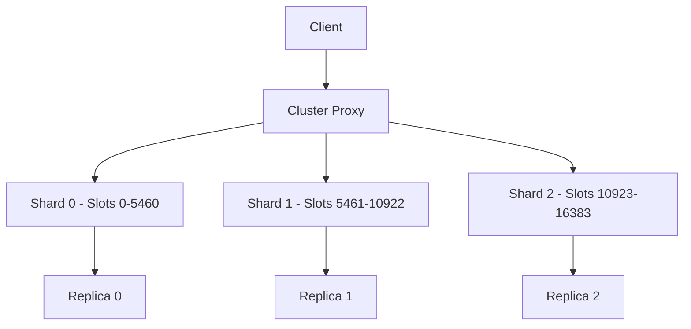

# How to Configure Redis Clustering in Azure Cache for Redis Premium Tier

Author: [nawazdhandala](https://www.github.com/nawazdhandala)

Tags: Azure, Redis, Clustering, Azure Cache for Redis, Premium Tier, Scalability, Performance

Description: A hands-on guide to configuring Redis clustering in Azure Cache for Redis Premium Tier for horizontal scalability and higher throughput.

---

A single Redis instance has limits. No matter how much memory you give it, there is a ceiling on the data it can hold and the throughput it can deliver. Redis clustering breaks through that ceiling by distributing data across multiple shards, each handling a portion of the total keyspace. Azure Cache for Redis Premium Tier supports Redis clustering natively, letting you scale horizontally without managing the cluster infrastructure yourself.

In this post, I will walk through how Redis clustering works, how to set it up on Azure, and the application-level changes you need to make to work with a clustered cache.

## How Redis Clustering Works

Redis Cluster distributes data across multiple shards using hash slots. The total keyspace is divided into 16,384 hash slots, and each shard owns a subset of those slots.

When you write a key, Redis computes the hash slot for that key using CRC16, and routes the operation to the shard owning that slot.



Each shard is a primary-replica pair. The primary handles reads and writes for its slots, and the replica provides failover protection.

Key benefits of clustering:

- **Linear scalability**: Double the shards, roughly double the throughput and memory.
- **Data distribution**: Each shard handles a fraction of the total data.
- **High availability**: Each shard has its own replica for failover.

## When to Use Clustering

Clustering makes sense when:

- Your cache data exceeds 53 GB (the maximum for a single Premium node).
- You need higher throughput than a single instance can provide.
- You want to distribute the workload across multiple CPU cores.
- Your read/write patterns benefit from parallel processing.

Clustering adds complexity, so if a single instance meets your needs, keep it simple.

## Creating a Clustered Azure Cache for Redis

### Using Azure CLI

```bash
# Create a Premium tier Redis cache with 3 shards
az redis create \
  --resource-group myResourceGroup \
  --name my-redis-cluster \
  --location eastus \
  --sku Premium \
  --vm-size P1 \
  --shard-count 3 \
  --enable-non-ssl-port false
```

The `--shard-count` parameter sets the number of shards. Each shard includes a primary and a replica, so 3 shards means 6 Redis nodes total.

### Using the Azure Portal

1. Search for "Azure Cache for Redis" and click Create.
2. Select the Premium pricing tier.
3. In the "Advanced" tab, set "Clustering" to Enabled.
4. Choose the number of shards (1-10).
5. Review and create.

### Available Shard Counts

| Shards | Total Nodes | Hash Slot Distribution |
|--------|------------|----------------------|
| 1 | 2 (1 primary + 1 replica) | All 16,384 slots |
| 2 | 4 | ~8,192 slots each |
| 3 | 6 | ~5,461 slots each |
| 6 | 12 | ~2,730 slots each |
| 10 | 20 | ~1,638 slots each |

Each additional shard adds proportional memory and throughput. A P1 instance with 6 GB per shard and 3 shards gives you 18 GB total cache capacity.

## Connecting to the Cluster

Azure Cache for Redis Premium with clustering uses a single connection endpoint. You do not need to know the individual shard addresses - Azure handles the routing.

```bash
# Get the connection details
az redis show \
  --resource-group myResourceGroup \
  --name my-redis-cluster \
  --query "{hostName:hostName, port:sslPort, enableNonSslPort:enableNonSslPort}"

# Get the access keys
az redis list-keys \
  --resource-group myResourceGroup \
  --name my-redis-cluster
```

### Python with redis-py

```python
import redis

# Connect to the clustered cache
# Azure handles routing internally, so use a regular connection
r = redis.StrictRedis(
    host='my-redis-cluster.redis.cache.windows.net',
    port=6380,
    password='your-access-key',
    ssl=True,
    decode_responses=True
)

# Basic operations work the same as non-clustered
r.set('user:1001', 'Alice')
r.set('user:1002', 'Bob')

print(r.get('user:1001'))  # Alice
print(r.get('user:1002'))  # Bob
```

### Node.js with ioredis

```javascript
const Redis = require('ioredis');

// Connect to the Azure Redis cluster
const redis = new Redis({
    host: 'my-redis-cluster.redis.cache.windows.net',
    port: 6380,
    password: 'your-access-key',
    tls: {
        servername: 'my-redis-cluster.redis.cache.windows.net'
    }
});

// Operations work normally
redis.set('session:abc123', JSON.stringify({ userId: 42 }));
redis.get('session:abc123').then(data => {
    console.log(JSON.parse(data));
});
```

### C# with StackExchange.Redis

```csharp
using StackExchange.Redis;

// Connect to the cluster
var connection = ConnectionMultiplexer.Connect(
    "my-redis-cluster.redis.cache.windows.net:6380,password=your-access-key,ssl=True,abortConnect=False"
);

var db = connection.GetDatabase();

// Standard operations
db.StringSet("product:5001", "Widget A");
var product = db.StringGet("product:5001");
Console.WriteLine(product);  // Widget A
```

## Working with Hash Tags

In a clustered setup, multi-key operations (like MGET, transactions, or Lua scripts) require all keys to be on the same shard. Redis uses hash tags to control which shard a key goes to.

A hash tag is a substring within curly braces in the key name. Only the content inside the braces is used for hash slot calculation:

```python
# These keys all hash to the same slot because {user:1001} is the hash tag
r.set('{user:1001}:name', 'Alice')
r.set('{user:1001}:email', 'alice@example.com')
r.set('{user:1001}:preferences', '{"theme": "dark"}')

# Multi-key operation works because all keys are on the same shard
values = r.mget('{user:1001}:name', '{user:1001}:email', '{user:1001}:preferences')
print(values)  # ['Alice', 'alice@example.com', '{"theme": "dark"}']
```

Without hash tags, MGET across keys on different shards would fail in a native Redis Cluster, but Azure's proxy layer handles some of this transparently for basic commands.

## Scaling the Cluster

### Adding Shards

You can add shards to an existing cluster without downtime:

```bash
# Scale from 3 to 6 shards
az redis update \
  --resource-group myResourceGroup \
  --name my-redis-cluster \
  --shard-count 6
```

When you add shards, Redis rebalances the hash slots across the new topology. This process runs in the background and may temporarily increase latency for affected keys.

### Removing Shards

You can also scale down:

```bash
# Scale from 6 to 3 shards
az redis update \
  --resource-group myResourceGroup \
  --name my-redis-cluster \
  --shard-count 3
```

Scaling down moves data from the removed shards to the remaining ones. Make sure the remaining shards have enough memory to hold all the data.

### Scaling the VM Size

You can also scale the individual shard size:

```bash
# Upgrade from P1 (6 GB per shard) to P2 (13 GB per shard)
az redis update \
  --resource-group myResourceGroup \
  --name my-redis-cluster \
  --sku Premium \
  --vm-size P2
```

## Monitoring the Cluster

### Azure Monitor Metrics

Key metrics to watch for clustered caches:

```bash
# View per-shard metrics
az monitor metrics list \
  --resource "/subscriptions/{sub-id}/resourceGroups/myResourceGroup/providers/Microsoft.Cache/redis/my-redis-cluster" \
  --metric "cacheRead,cacheWrite,connectedclients,serverLoad" \
  --interval PT5M
```

Important metrics:

- **Server Load (per shard)**: If any shard exceeds 80%, consider scaling up or out.
- **Cache Hits/Misses (per shard)**: Uneven distribution indicates hot keys.
- **Connected Clients**: Monitor across shards to detect imbalances.
- **Used Memory (per shard)**: Alert before any shard runs out of memory.

### Detecting Hot Shards

If one shard has significantly higher load than others, you likely have hot keys:

```bash
# Set up alert for individual shard CPU
az monitor metrics alert create \
  --name redis-shard-load-alert \
  --resource-group myResourceGroup \
  --scopes "/subscriptions/{sub-id}/resourceGroups/myResourceGroup/providers/Microsoft.Cache/redis/my-redis-cluster" \
  --condition "avg serverLoad > 80" \
  --description "Redis shard load exceeds 80%" \
  --action-group myActionGroup
```

## Cluster-Specific Limitations

Not all Redis commands work across multiple shards:

- **KEYS**: Avoid in production (scans all shards sequentially). Use SCAN instead.
- **Multi-key operations**: MGET, MSET, and others require all keys on the same shard (use hash tags).
- **Transactions (MULTI/EXEC)**: All keys in the transaction must be on the same shard.
- **Lua scripts**: All keys accessed by the script must be on the same shard.
- **DBSELECT**: Only database 0 is available in cluster mode.

## Best Practices

1. **Use hash tags for related keys**: Group related data on the same shard for atomic operations.
2. **Distribute keys evenly**: Avoid key patterns that concentrate data on one shard.
3. **Monitor per-shard metrics**: A hot shard can bottleneck the entire cluster.
4. **Start with fewer shards**: Scale out as needed. Over-sharding from the start wastes resources.
5. **Test scaling operations**: Scale up/down in staging before production.
6. **Avoid KEYS command**: Use SCAN for key enumeration in clustered environments.

## Cost Considerations

Clustering multiplies the base instance cost by the number of shards:

| SKU | Per-Shard Cost | 3 Shards | 6 Shards | 10 Shards |
|-----|---------------|----------|----------|-----------|
| P1 (6 GB) | ~$170/month | ~$510 | ~$1,020 | ~$1,700 |
| P2 (13 GB) | ~$340/month | ~$1,020 | ~$2,040 | ~$3,400 |
| P3 (26 GB) | ~$680/month | ~$2,040 | ~$4,080 | ~$6,800 |

Each shard includes a replica at no additional cost. Factor in both memory needs and throughput needs when choosing shard count and VM size.

## Summary

Redis clustering in Azure Cache for Redis Premium Tier gives you horizontal scalability for cache workloads that outgrow a single instance. The setup is straightforward - specify the shard count during creation or scale later. Your application connects to a single endpoint, and Azure handles the routing. The main application-level concern is ensuring multi-key operations target keys on the same shard using hash tags. Monitor per-shard metrics to detect imbalances, and scale shards up or out as your workload grows.
