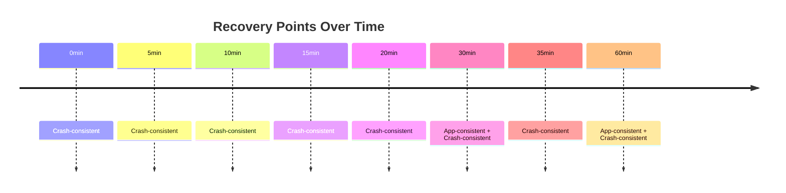

# How to Configure Replication Policies for RPO and Retention in Azure Site Recovery

Author: [nawazdhandala](https://www.github.com/nawazdhandala)

Tags: Azure Site Recovery, Replication Policy, RPO, Retention, Disaster Recovery, Recovery Points, Azure

Description: Learn how to configure replication policies in Azure Site Recovery to control RPO targets, recovery point retention, and application-consistent snapshot frequency.

---

Every disaster recovery strategy comes down to two numbers: RPO and RTO. Your Recovery Point Objective (RPO) defines how much data you can afford to lose, measured in time. Your Recovery Time Objective (RTO) defines how quickly you need to be back up and running. Azure Site Recovery replication policies let you configure these parameters to match your business requirements.

Getting the replication policy right is important because it directly affects your data loss exposure, storage costs, and failover options. This guide covers how to create and tune replication policies in Azure Site Recovery.

## Understanding RPO and Recovery Points

Azure Site Recovery creates recovery points continuously as it replicates your VM disks to the target region. A recovery point is a snapshot of your VM's disk state at a specific moment in time.

**RPO** in the context of ASR is the maximum acceptable time gap between the last recovery point and a potential failure event. If your RPO is 1 hour, you are saying the business can tolerate losing up to 1 hour of data changes.

ASR creates two types of recovery points:

**Crash-consistent recovery points** - These capture the exact state of the disk at a moment in time, similar to pulling the power cord on a running machine. The data on disk is consistent, but any data that was in memory or in application write buffers is lost. ASR generates these every 5 minutes by default.

**Application-consistent recovery points** - These use VSS (Volume Shadow Copy Service) on Windows or custom pre/post scripts on Linux to flush application memory and pending writes to disk before taking the snapshot. When you recover from an app-consistent point, applications come up cleanly without needing crash recovery. These are generated at a configurable frequency.



## Default Replication Policy Settings

When you first enable replication for a VM, ASR creates a default policy with these settings:

| Setting | Default Value |
|---------|--------------|
| Recovery point retention | 24 hours |
| App-consistent snapshot frequency | 4 hours |
| Crash-consistent snapshot frequency | 5 minutes (not configurable) |
| Multi-VM consistency | Disabled |

These defaults work for many scenarios, but they might not match your specific requirements.

## Step 1: Create a Custom Replication Policy

Instead of modifying the default policy (which affects all VMs using it), create custom policies for different workload tiers.

### Using the Azure Portal

1. Open the Recovery Services vault
2. Go to "Site Recovery Infrastructure"
3. Click "Replication policies"
4. Click "Create policy"
5. Configure:
   - **Name**: e.g., `policy-tier1-critical` or `policy-tier2-standard`
   - **Recovery point retention**: Set in hours (1-72 hours)
   - **App-consistent snapshot frequency**: Set in hours (1-12 hours, or 0 to disable)
6. Click "Create"

### Using PowerShell

```powershell
# Create a custom replication policy for Tier 1 critical workloads
# This policy keeps 72 hours of recovery points with hourly app-consistent snapshots

$vault = Get-AzRecoveryServicesVault -Name "rsv-dr-centralus-001" -ResourceGroupName "rg-dr-centralus"
Set-AzRecoveryServicesAsrVaultContext -Vault $vault

# Get the ASR fabric (represents the source region)
$fabric = Get-AzRecoveryServicesAsrFabric | Where-Object FriendlyName -eq "eastus2"

# Create the replication policy
New-AzRecoveryServicesAsrPolicy `
    -AzureToAzure `
    -Name "policy-tier1-critical" `
    -RecoveryPointRetentionInHours 72 `
    -ApplicationConsistentSnapshotFrequencyInHours 1

Write-Output "Tier 1 policy created: 72h retention, 1h app-consistent snapshots"

# Create a second policy for less critical workloads
New-AzRecoveryServicesAsrPolicy `
    -AzureToAzure `
    -Name "policy-tier2-standard" `
    -RecoveryPointRetentionInHours 24 `
    -ApplicationConsistentSnapshotFrequencyInHours 4

Write-Output "Tier 2 policy created: 24h retention, 4h app-consistent snapshots"

# Create a policy for dev/test with minimal retention
New-AzRecoveryServicesAsrPolicy `
    -AzureToAzure `
    -Name "policy-tier3-devtest" `
    -RecoveryPointRetentionInHours 4 `
    -ApplicationConsistentSnapshotFrequencyInHours 0  # Disable app-consistent snapshots

Write-Output "Tier 3 policy created: 4h retention, no app-consistent snapshots"
```

## Step 2: Apply Policies to VMs

After creating a policy, associate it with VMs through protection container mappings.

When you enable replication for a new VM, you can select which policy to use. For VMs that are already replicating, you can change the policy:

1. Go to the replicated item in the vault
2. Click "Replication policy" in the settings
3. Select the new policy
4. Save

The policy change takes effect immediately. Recovery points created under the old policy are retained until they expire according to the old policy's retention settings.

## Step 3: Tune RPO for Your Workloads

Different workloads need different RPO targets. Here is a framework for deciding:

### Tier 1: Business-Critical (RPO under 15 minutes)

These are your revenue-generating applications and core databases. Data loss is extremely costly.

- **Recovery point retention**: 72 hours
- **App-consistent frequency**: 1 hour
- **Action**: Enable multi-VM consistency if the application spans multiple VMs
- **Monitoring**: Set RPO alerts at 10 minutes

### Tier 2: Important (RPO under 1 hour)

Supporting applications, internal tools, and secondary databases. Data loss is painful but manageable.

- **Recovery point retention**: 24 hours
- **App-consistent frequency**: 4 hours
- **Monitoring**: Set RPO alerts at 30 minutes

### Tier 3: Non-Critical (RPO under 4 hours)

Development environments, staging servers, testing infrastructure. Data can be recreated if needed.

- **Recovery point retention**: 4-12 hours
- **App-consistent frequency**: Disabled (crash-consistent is sufficient)
- **Monitoring**: Weekly RPO check

## Step 4: Configure Multi-VM Consistency

When an application runs across multiple VMs (for example, a web server and a database), you want all VMs to recover to the same point in time. Without multi-VM consistency, you might recover the web server to 2:05 PM and the database to 2:03 PM, causing data inconsistency.

Multi-VM consistency groups create shared recovery points across all VMs in the group.

1. Enable replication for all VMs in the application
2. In the replication settings, enable "Multi-VM consistency"
3. Add all related VMs to the same consistency group

There are limitations:
- Maximum 16 VMs per consistency group
- VMs must be in the same replication policy
- Enabling multi-VM consistency increases replication traffic because VMs must coordinate snapshot timing

```powershell
# Enable multi-VM consistency for a group of application VMs
# All VMs in the group will share recovery points

$vault = Get-AzRecoveryServicesVault -Name "rsv-dr-centralus-001" -ResourceGroupName "rg-dr-centralus"
Set-AzRecoveryServicesAsrVaultContext -Vault $vault

# Get the replicated items
$container = Get-AzRecoveryServicesAsrProtectionContainer
$webVM = Get-AzRecoveryServicesAsrReplicationProtectedItem -ProtectionContainer $container -FriendlyName "vm-web-01"
$appVM = Get-AzRecoveryServicesAsrReplicationProtectedItem -ProtectionContainer $container -FriendlyName "vm-app-01"
$dbVM = Get-AzRecoveryServicesAsrReplicationProtectedItem -ProtectionContainer $container -FriendlyName "vm-sql-01"

# Update each VM to be part of the same multi-VM consistency group
Set-AzRecoveryServicesAsrReplicationProtectedItem `
    -ReplicationProtectedItem $webVM `
    -EnableMultiVMSync "Enable" `
    -MultiVMGroupName "erp-app-group"

Set-AzRecoveryServicesAsrReplicationProtectedItem `
    -ReplicationProtectedItem $appVM `
    -EnableMultiVMSync "Enable" `
    -MultiVMGroupName "erp-app-group"

Set-AzRecoveryServicesAsrReplicationProtectedItem `
    -ReplicationProtectedItem $dbVM `
    -EnableMultiVMSync "Enable" `
    -MultiVMGroupName "erp-app-group"
```

## Step 5: Monitor RPO Compliance

Set up alerts to know when RPO targets are breached:

1. In the Recovery Services vault, go to "Monitoring"
2. Create alert rules for RPO threshold breaches
3. Configure notification to your operations team

You can also check RPO status programmatically:

```powershell
# Check RPO for all replicated items and flag any breaches
# Useful for daily compliance reports

$vault = Get-AzRecoveryServicesVault -Name "rsv-dr-centralus-001" -ResourceGroupName "rg-dr-centralus"
Set-AzRecoveryServicesAsrVaultContext -Vault $vault

$container = Get-AzRecoveryServicesAsrProtectionContainer
$items = Get-AzRecoveryServicesAsrReplicationProtectedItem -ProtectionContainer $container

foreach ($item in $items) {
    $rpoDuration = $item.ProviderSpecificDetails.LastRpoCalculatedTime
    $rpoMinutes = ((Get-Date) - $rpoDuration).TotalMinutes

    $status = if ($rpoMinutes -le 15) { "OK" }
              elseif ($rpoMinutes -le 60) { "WARNING" }
              else { "CRITICAL" }

    Write-Output "$($item.FriendlyName): RPO = $([math]::Round($rpoMinutes, 1)) minutes [$status]"
}
```

## Factors That Affect Actual RPO

Your configured policy sets the target, but actual RPO depends on several real-world factors:

**Disk write rate (churn)** - VMs with high write rates generate more replication traffic. If the replication bandwidth cannot keep up with the churn rate, RPO increases. Monitor the "Data change rate" metric for each replicated VM.

**Network bandwidth** - Replication traffic travels from the source region to the target region. If bandwidth is constrained (e.g., by ExpressRoute limits or virtual network peering costs), replication falls behind.

**Cache storage performance** - Replication data passes through a cache storage account. If the cache becomes a bottleneck, RPO suffers. Use Standard or Premium storage accounts for the cache depending on your throughput needs.

**VM size and disk tier** - Premium SSD disks have higher throughput limits than Standard HDD, which helps maintain low RPO for high-churn workloads.

## Cost Implications of Retention Settings

Longer retention periods mean more recovery points are stored, which means more storage consumption in the target region. Each crash-consistent recovery point stores incremental changes (not full copies), so the cost impact is usually modest. App-consistent recovery points can be slightly larger because they include flushed application data.

For most workloads, the cost difference between 24-hour and 72-hour retention is negligible. The bigger cost factor is the replica managed disks themselves, which exist regardless of how many recovery points you keep.

## Wrapping Up

Replication policies in Azure Site Recovery give you fine-grained control over your disaster recovery posture. Create tiered policies that match your business requirements - aggressive retention and frequent app-consistent snapshots for critical workloads, and lighter settings for less important systems. Monitor RPO compliance actively, and investigate any persistent breaches before they become a problem during an actual disaster.
