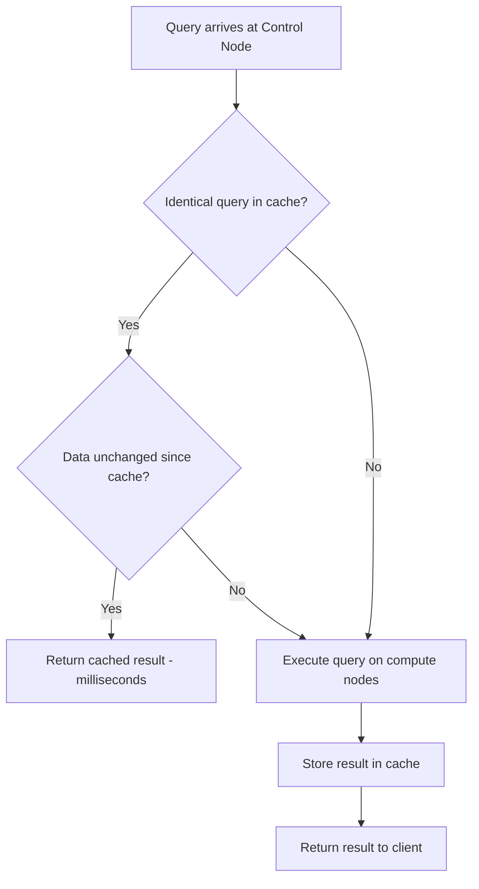

# How to Configure Result Set Caching in Azure Synapse Dedicated SQL Pool

Author: [nawazdhandala](https://www.github.com/nawazdhandala)

Tags: Azure, Synapse Analytics, Result Set Caching, Dedicated SQL Pool, Query Performance, Optimization, Caching

Description: Learn how to enable and manage result set caching in Azure Synapse dedicated SQL pool to dramatically improve repeated query performance.

---

When the same query runs over and over against data that has not changed, there is no reason to re-execute it every time. Result set caching in Azure Synapse dedicated SQL pool stores query results and serves them directly for identical subsequent queries - without touching the compute nodes or scanning any data. For dashboard workloads where the same visualizations are refreshed repeatedly, this can reduce query times from seconds to milliseconds.

## How Result Set Caching Works

When result set caching is enabled and a query executes, the engine stores the result set in the control node's storage. When an identical query arrives later, the engine checks:

1. Is the query text exactly the same? (Whitespace and capitalization differences matter)
2. Is the result set still in the cache? (Cache entries expire after 48 hours or when underlying data changes)
3. Does the user have permission to see the cached result?

If all conditions are met, the result is served directly from the cache without involving any compute nodes.



## When to Use Result Set Caching

Result set caching is most effective for:

- **Dashboard queries**: Power BI or Tableau dashboards that refresh the same queries at regular intervals.
- **Repeated reports**: Daily, weekly, or monthly reports where the underlying data does not change between runs.
- **Multi-user shared queries**: When multiple users run the same query (e.g., a shared dashboard).
- **Complex aggregations**: Queries that scan large tables and produce small result sets.

It is less effective for:

- **Ad-hoc queries**: Every query is unique, so nothing gets cached.
- **Frequently changing data**: If the underlying tables are updated constantly, cache entries are invalidated quickly.
- **Queries returning large result sets**: The cache has a 10 GB total capacity. Large results consume this quickly.

## Step 1: Enable Result Set Caching

Result set caching is disabled by default. Enable it at the database level.

```sql
-- Enable result set caching for the database
-- This must be run against the master database
ALTER DATABASE myDataWarehouse
SET RESULT_SET_CACHING ON;
```

You need to be connected to the `master` database to run this command, not the user database. After enabling, all queries against `myDataWarehouse` are eligible for caching.

To check if caching is enabled:

```sql
-- Check the current result set caching setting
SELECT name, is_result_set_caching_on
FROM sys.databases
WHERE name = 'myDataWarehouse';
```

## Step 2: Verify Caching Is Working

Run a query twice and check whether the second execution used the cache.

```sql
-- Run a query that performs a heavy aggregation
SELECT
    ProductCategory,
    YEAR(OrderDate) AS SalesYear,
    SUM(TotalAmount) AS Revenue,
    COUNT(*) AS OrderCount,
    AVG(TotalAmount) AS AvgOrderValue
FROM dbo.FactSales
GROUP BY ProductCategory, YEAR(OrderDate)
ORDER BY Revenue DESC;

-- Run the exact same query again

-- Check if the second execution used the cache
SELECT
    request_id,
    command,
    result_cache_hit,
    start_time,
    total_elapsed_time
FROM sys.dm_pdw_exec_requests
WHERE command LIKE '%ProductCategory%'
ORDER BY start_time DESC;
```

The `result_cache_hit` column tells you:
- **1**: The result was served from cache (cache hit)
- **0**: The query was executed on compute nodes (cache miss)

## Step 3: Control Caching at the Session Level

Individual sessions can opt out of caching. This is useful when you are testing query performance without cache influence.

```sql
-- Disable caching for this session only
SET RESULT_SET_CACHING OFF;

-- Run a query that will always execute without cache
SELECT ...

-- Re-enable caching for this session
SET RESULT_SET_CACHING ON;
```

This does not affect other sessions. The database-level setting still applies to everyone else.

## Step 4: Monitor Cache Usage

### Check Cache Hit Rates

```sql
-- View cache hit statistics for recent queries
SELECT
    result_cache_hit,
    COUNT(*) AS query_count,
    AVG(total_elapsed_time) AS avg_elapsed_ms
FROM sys.dm_pdw_exec_requests
WHERE start_time > DATEADD(hour, -24, GETDATE())
    AND resource_class IS NOT NULL   -- Exclude system queries
    AND command NOT LIKE '%dm_pdw%'  -- Exclude monitoring queries
GROUP BY result_cache_hit;
```

This shows how many queries hit the cache versus how many were executed. A healthy dashboard workload should see 50%+ cache hits.

### Check Cache Size and Entries

```sql
-- View result set cache space usage
DBCC SHOWRESULTCACHESPACEUSED;
```

This returns:
- **reserved_space**: Total space reserved for result set cache
- **data_space**: Space currently used by cached results
- **index_space**: Space used by the cache index
- **unused_space**: Available cache space

The total cache size is 10 GB per database. Once the cache is full, the oldest entries are evicted to make room for new ones.

### Identify Top Cached Queries

```sql
-- Find queries that benefit most from caching
SELECT TOP 20
    command,
    COUNT(*) AS execution_count,
    SUM(CASE WHEN result_cache_hit = 1 THEN 1 ELSE 0 END) AS cache_hits,
    SUM(CASE WHEN result_cache_hit = 0 THEN 1 ELSE 0 END) AS cache_misses,
    AVG(CASE WHEN result_cache_hit = 1 THEN total_elapsed_time END) AS avg_cached_ms,
    AVG(CASE WHEN result_cache_hit = 0 THEN total_elapsed_time END) AS avg_uncached_ms
FROM sys.dm_pdw_exec_requests
WHERE start_time > DATEADD(day, -7, GETDATE())
    AND resource_class IS NOT NULL
GROUP BY command
HAVING COUNT(*) > 5
ORDER BY execution_count DESC;
```

This helps you understand which queries benefit most from caching and what the time savings are.

## Cache Invalidation

The cache is automatically invalidated when:

- **Data changes**: Any INSERT, UPDATE, DELETE, TRUNCATE, or COPY INTO on a table referenced by a cached query invalidates all cache entries that reference that table.
- **Schema changes**: ALTER TABLE or DROP TABLE invalidates related cache entries.
- **Time expiration**: Cache entries expire after 48 hours, even if the data has not changed.
- **Manual clear**: You can manually clear the cache.

### Manually Clear the Cache

```sql
-- Clear all cached result sets for the database
DBCC DROPRESULTSETCACHE;
```

This is useful after major data loads when you want to force fresh query execution.

## Optimizing for Cache Effectiveness

### 1. Standardize Query Text

Cache matching is based on exact query text comparison. These two queries will NOT share a cache entry:

```sql
-- Query A
SELECT ProductCategory, SUM(TotalAmount) FROM FactSales GROUP BY ProductCategory;

-- Query B (extra space before FROM)
SELECT ProductCategory, SUM(TotalAmount)  FROM FactSales GROUP BY ProductCategory;
```

To maximize cache hits, use views or stored procedures that generate consistent query text:

```sql
-- Create a view that standardizes the query
CREATE VIEW dbo.vw_SalesByCategory AS
SELECT
    ProductCategory,
    SUM(TotalAmount) AS Revenue,
    COUNT(*) AS OrderCount
FROM dbo.FactSales
GROUP BY ProductCategory;

-- All users query the same view, generating identical SQL
SELECT * FROM dbo.vw_SalesByCategory ORDER BY Revenue DESC;
```

### 2. Schedule Data Loads to Maximize Cache Window

Since data changes invalidate the cache, time your ETL loads to happen during off-peak hours. This gives the cache the maximum useful lifetime during business hours when dashboard users are active.

```
Optimal schedule:
  2:00 AM - ETL load starts (cache invalidated)
  3:00 AM - ETL load completes
  8:00 AM - Users start querying (cache starts warming)
  8:15 AM - Most dashboard queries are cached
  5:00 PM - End of business day (cache still valid)
```

### 3. Avoid Functions That Prevent Caching

Some query patterns prevent result set caching:

- **Non-deterministic functions**: `GETDATE()`, `NEWID()`, `RAND()` - these return different values each time, so the result cannot be cached.
- **Temp tables**: Queries that reference temporary tables are not cached.
- **User-defined functions**: Some UDFs prevent caching.

```sql
-- This query will NOT be cached because of GETDATE()
SELECT ProductCategory, SUM(TotalAmount) AS Revenue
FROM FactSales
WHERE OrderDate >= DATEADD(day, -30, GETDATE())
GROUP BY ProductCategory;

-- This query CAN be cached because the date is a literal
SELECT ProductCategory, SUM(TotalAmount) AS Revenue
FROM FactSales
WHERE OrderDate >= '2026-01-17'
GROUP BY ProductCategory;
```

For dashboard queries, compute the date filter in the application layer and pass it as a literal rather than using GETDATE() in SQL.

### 4. Combine with Materialized Views

Result set caching and materialized views complement each other:

- **Materialized views** pre-compute and store aggregation results as physical data. They speed up the first execution.
- **Result set caching** stores the final query output. It speeds up subsequent identical executions.

```sql
-- Create a materialized view for common aggregations
CREATE MATERIALIZED VIEW dbo.mvw_DailySales
WITH (DISTRIBUTION = HASH(ProductCategory))
AS
SELECT
    ProductCategory,
    CAST(OrderDate AS DATE) AS SalesDate,
    SUM(TotalAmount) AS Revenue,
    COUNT_BIG(*) AS OrderCount
FROM dbo.FactSales
GROUP BY ProductCategory, OrderDate;

-- Queries against this data benefit from both:
-- 1. Materialized view speeds up first execution
-- 2. Result set cache speeds up subsequent executions
SELECT SalesDate, SUM(Revenue) AS DailyRevenue
FROM dbo.mvw_DailySales
WHERE SalesDate >= '2026-01-01'
GROUP BY SalesDate
ORDER BY SalesDate;
```

## Disabling Result Set Caching

If you need to disable caching (e.g., for troubleshooting or specific workloads):

```sql
-- Disable at the database level (run from master)
ALTER DATABASE myDataWarehouse
SET RESULT_SET_CACHING OFF;
```

This immediately stops caching new results and stops serving cached results. Existing cache entries are cleaned up automatically.

## Wrapping Up

Result set caching in Azure Synapse dedicated SQL pool is a low-effort, high-impact optimization for workloads with repeated queries. Enable it at the database level, standardize your query text through views, schedule data loads during off-peak hours, and avoid non-deterministic functions in queries you want cached. The combination of result set caching for repeated queries and materialized views for first-time query acceleration can transform dashboard performance from seconds to milliseconds.
