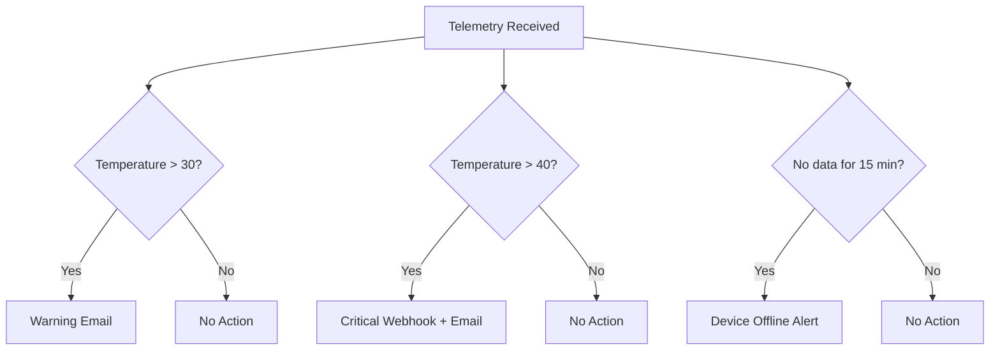

# How to Configure Rules and Email Alerts in Azure IoT Central Based on Device Telemetry

Author: [nawazdhandala](https://www.github.com/nawazdhandala)

Tags: Azure IoT Central, Rules Engine, Email Alerts, Device Telemetry, IoT Monitoring, Alerting, Automation

Description: Learn how to set up rules and email alerts in Azure IoT Central that trigger based on device telemetry thresholds and conditions.

---

One of the biggest advantages of Azure IoT Central over building your own IoT platform from scratch is the built-in rules engine. You can set up alerts that fire when device telemetry crosses a threshold, when a device stops sending data, or when a combination of conditions is met. The rules are configured entirely through the portal - no code required for basic scenarios - and they can trigger email notifications, webhooks, or integrations with Power Automate and Logic Apps.

This guide shows you how to configure rules and email alerts based on device telemetry, starting with simple threshold alerts and building up to more sophisticated multi-condition rules.

## Prerequisites

Before setting up rules, you need:

- An Azure IoT Central application with at least one device template defined
- At least one device connected and sending telemetry
- The email addresses of the people who should receive alerts

If you do not have a device template yet, check out our guide on creating custom device templates in Azure IoT Central.

## Understanding the Rules Engine

The rules engine in IoT Central evaluates incoming telemetry against conditions you define. When all conditions in a rule are met, the rule fires and executes the configured actions. Here is the key behavior to understand:

- Rules evaluate on a per-device basis. A rule that checks "temperature > 30" fires independently for each device that exceeds that threshold.
- Rules operate on the most recent telemetry value. They do not aggregate over time windows by default (though you can configure time aggregation).
- Once a rule fires, it has a cooldown period to prevent alert storms. The default is 5 minutes.
- Rules can only evaluate telemetry defined in the device template. You cannot create rules on arbitrary JSON fields.

## Creating a Simple Threshold Rule

Let us start with a straightforward rule: send an email when a device reports a temperature above 35 degrees Celsius.

**Step 1: Navigate to Rules**

In your IoT Central application, click Rules in the left navigation panel.

**Step 2: Create a New Rule**

Click "New" to create a rule. Give it a descriptive name like "High Temperature Alert."

**Step 3: Select the Target Devices**

Under "Target devices," select the device template this rule applies to (e.g., "Environmental Sensor"). You can optionally add device filters to narrow the scope. For example, you might only want to alert on devices in a specific device group or location.

**Step 4: Define the Condition**

Click "Add condition" and configure it:

- **Telemetry:** Select "Temperature"
- **Operator:** Select "is greater than"
- **Value:** Enter 35

This means the rule fires whenever any device using this template reports a temperature above 35.

**Step 5: Add an Email Action**

Click "Add action" and select "Email." Fill in:

- **Display name:** "Temperature Alert Email"
- **To:** Enter the email addresses of the recipients (comma-separated)
- **Note:** Add optional text like "A device has reported a temperature above 35C. Please investigate."

Click Save. The rule is now active.

## Adding Time Aggregation

A single spike above a threshold might be sensor noise. You probably want to alert only when the temperature has been consistently high. Use time aggregation to smooth out the data.

Edit the rule and modify the condition:

- **Telemetry:** Temperature
- **Aggregation:** Average
- **Time window:** 5 minutes
- **Operator:** is greater than
- **Value:** 35

Now the rule fires only when the 5-minute rolling average of temperature exceeds 35 degrees. This eliminates false positives from transient spikes.

Available aggregation functions:

| Function | Description |
|---|---|
| Average | Mean value over the time window |
| Minimum | Lowest value in the time window |
| Maximum | Highest value in the time window |
| Count | Number of telemetry messages in the time window |
| Sum | Total of all values in the time window |

## Multi-Condition Rules

Real alerting scenarios often require multiple conditions. For example, high temperature is more concerning when combined with high humidity (which could indicate equipment malfunction or dangerous working conditions).

Create a rule with multiple conditions:

**Condition 1:**
- Telemetry: Temperature
- Aggregation: Average over 5 minutes
- Operator: is greater than
- Value: 35

**Condition 2:**
- Telemetry: Humidity
- Aggregation: Average over 5 minutes
- Operator: is greater than
- Value: 80

Both conditions must be true simultaneously for the rule to fire. This is an AND logic - IoT Central does not support OR logic within a single rule. If you need OR behavior, create separate rules.

## Device State-Based Rules

Beyond telemetry thresholds, you can create rules based on device property values. This is useful for alerting on device health conditions.

For example, trigger an alert when battery level drops below 20%:

- **Telemetry:** Battery Level
- **Operator:** is less than
- **Value:** 20

Or alert when a device has not sent telemetry for a period:

- **Telemetry:** Any telemetry field
- **Aggregation:** Count over 15 minutes
- **Operator:** is less than
- **Value:** 1

This "silence detection" pattern is particularly useful for catching devices that have gone offline without a clean disconnection event.

## Configuring Webhook Actions

Email alerts are great for human operators, but automated systems need webhook notifications. Add a webhook action to integrate with external systems.

In the rule action section, select "Webhook" and configure:

- **Display name:** "Temperature Alert Webhook"
- **Callback URL:** Your endpoint (e.g., `https://api.example.com/iot-alerts`)

The webhook payload looks like this:

```json
{
  "id": "rule-id-here",
  "displayName": "High Temperature Alert",
  "timestamp": "2026-02-16T14:30:00.000Z",
  "device": {
    "id": "sensor-device-01",
    "displayName": "Warehouse Sensor 1",
    "templateId": "dtmi:myorg:EnvironmentalSensor;1"
  },
  "telemetry": {
    "temperature": 37.2,
    "humidity": 82.5
  },
  "application": {
    "id": "your-app-id",
    "displayName": "Environmental Monitoring"
  }
}
```

You can process this webhook in an Azure Function, Logic App, or any HTTP endpoint to trigger downstream actions like creating tickets in a service management system or sending push notifications.

## Integrating with Power Automate

For more sophisticated automation, connect rules to Power Automate flows. This lets you do things like:

- Send Teams messages to a channel when an alert fires
- Create work items in Azure DevOps
- Update a SharePoint list for tracking
- Call a custom API with enriched data

In the rule action section, select "Power Automate" and you will be redirected to Power Automate to build a flow triggered by the IoT Central rule.

## Best Practices for Rule Design

After working with IoT Central rules across several projects, here are the patterns that work well:

**Use descriptive rule names.** When you have 30 rules, "Rule 1" and "Rule 2" are useless. Use names like "Cold Storage Temperature Warning - Building A" that tell you exactly what the rule does and where it applies.

**Set appropriate time windows.** A 1-minute window catches issues quickly but generates more false positives. A 15-minute window is more stable but delays alerts. Match the window to the urgency of the condition.

**Layer your alerts.** Create warning-level rules with lower thresholds and email actions, plus critical-level rules with higher thresholds and webhook actions that page on-call engineers.



**Test rules with simulated data.** Before deploying rules to production, use IoT Central's device simulation feature or send test telemetry from a script to verify that rules fire correctly and emails arrive as expected.

**Document your alerting strategy.** Keep a spreadsheet or wiki page that lists all rules, their thresholds, who gets notified, and the expected response procedure. When an alert fires at 3 AM, the on-call engineer needs to know what to do without figuring it out from scratch.

## Managing Alert Fatigue

The fastest way to make alerts useless is to send too many of them. If your team gets 50 emails a day from IoT Central, they will start ignoring all of them. Here are strategies to keep alerts actionable:

- Use the minimum cooldown period wisely. The default 5 minutes means you get at most 12 alerts per hour per device per rule. Increase it for non-critical rules.
- Scope rules to specific device groups rather than all devices. Not every device needs every rule.
- Review and tune thresholds monthly. As you collect more data, you will learn what "normal" looks like for your environment and can tighten or loosen thresholds accordingly.

## Wrapping Up

The rules engine in Azure IoT Central gives you a no-code path to setting up meaningful alerts on device telemetry. Start with simple threshold rules to catch the most critical conditions, then layer in time aggregation and multi-condition rules as you learn your data patterns. Pair email alerts for human operators with webhook and Power Automate actions for automated responses. The goal is not to alert on everything, but to alert on the right things at the right time so your team can respond before a sensor reading becomes an incident.
