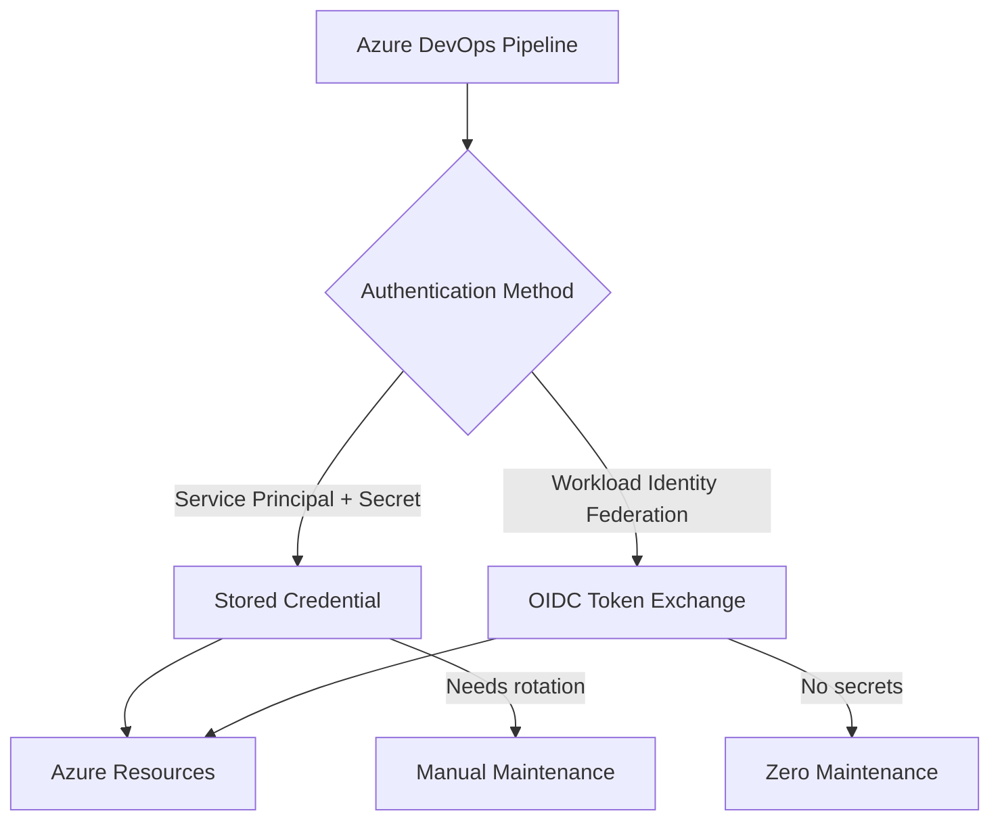

# How to Configure Service Connections in Azure DevOps for Secure Azure Resource Access

Author: [nawazdhandala](https://www.github.com/nawazdhandala)

Tags: Azure DevOps, Service Connections, Security, Azure, Service Principal, CI/CD, DevOps

Description: Set up and manage service connections in Azure DevOps to securely authenticate pipelines to Azure resources without exposing credentials.

---

Every Azure Pipelines deployment needs a way to authenticate to Azure. You cannot just type a password into a pipeline YAML file (well, you could, but please do not). Service connections are Azure DevOps's answer to this problem. They store the credentials needed to connect to external services - most commonly Azure subscriptions - and make them available to pipelines without exposing the actual secrets.

In this post, I will cover creating service connections for Azure, managing their lifecycle, applying security best practices, and troubleshooting the common issues that block deployments.

## What Is a Service Connection?

A service connection is a named, secure reference to an external service. When your pipeline needs to deploy to Azure, push to a Docker registry, or connect to a Kubernetes cluster, it references a service connection by name. The connection handles authentication behind the scenes.

For Azure connections specifically, a service connection wraps a service principal (or managed identity) that has been granted access to your Azure resources. The pipeline never sees the actual credentials - it just says "use this service connection" and Azure DevOps handles the rest.

## Creating an Azure Resource Manager Service Connection

There are two approaches: automatic and manual. The automatic approach is simpler but gives you less control.

### Automatic Creation

Go to **Project Settings > Service connections > New service connection > Azure Resource Manager**.

Select **Service principal (automatic)**.

Configure:

- **Scope level**: Subscription or Resource Group
- **Subscription**: Select your Azure subscription
- **Resource group**: If scoping to a resource group, select it
- **Service connection name**: Something descriptive like `azure-dev` or `azure-production`

Azure DevOps will:

1. Create a new app registration in your Azure Entra ID
2. Create a service principal
3. Assign the Contributor role at the scope you selected
4. Store the credentials securely in Azure DevOps

This is the fastest way to get started, but you lose control over the service principal name, role assignment, and lifecycle.

### Manual Creation

For production environments, I recommend creating the service principal manually so you control every aspect.

First, create the service principal in Azure.

```bash
# Create a service principal with a descriptive name
az ad sp create-for-rbac \
  --name "sp-azuredevops-production" \
  --role Contributor \
  --scopes /subscriptions/<subscription-id>/resourceGroups/rg-production \
  --years 2

# Output:
# {
#   "appId": "xxxxxxxx-xxxx-xxxx-xxxx-xxxxxxxxxxxx",
#   "displayName": "sp-azuredevops-production",
#   "password": "xxxxxxxx-xxxx-xxxx-xxxx-xxxxxxxxxxxx",
#   "tenant": "xxxxxxxx-xxxx-xxxx-xxxx-xxxxxxxxxxxx"
# }
```

Save the output values. Now create the service connection in Azure DevOps.

Go to **Project Settings > Service connections > New service connection > Azure Resource Manager > Service principal (manual)**.

Fill in:

- **Subscription Id**: Your Azure subscription ID
- **Subscription Name**: A friendly name
- **Service Principal Id**: The `appId` from the CLI output
- **Service principal key**: The `password` from the CLI output
- **Tenant Id**: The `tenant` from the CLI output
- **Service connection name**: `azure-production`

Click **Verify** to confirm the credentials work, then save.

### Workload Identity Federation (Recommended)

The newest and most secure option is workload identity federation, which eliminates stored secrets entirely. Instead of a password, Azure DevOps uses OIDC tokens to authenticate.

Go to **Project Settings > Service connections > New service connection > Azure Resource Manager > Workload Identity federation (automatic)**.

This creates a federated credential on the app registration, similar to how GitHub Actions OIDC works. The connection never stores a secret, and there is nothing to rotate.



## Using Service Connections in Pipelines

Reference the service connection by name in your pipeline tasks.

```yaml
# azure-pipelines.yml - Using a service connection
trigger:
  - main

pool:
  vmImage: 'ubuntu-latest'

steps:
  # Deploy to Azure using the service connection
  - task: AzureWebApp@1
    displayName: 'Deploy to Web App'
    inputs:
      azureSubscription: 'azure-production'  # Service connection name
      appName: 'myapp-production'
      package: '$(Build.ArtifactStagingDirectory)/**/*.zip'

  # Use Azure CLI with the service connection
  - task: AzureCLI@2
    displayName: 'Run Azure CLI commands'
    inputs:
      azureSubscription: 'azure-production'  # Same connection
      scriptType: 'bash'
      scriptLocation: 'inlineScript'
      inlineScript: |
        # The CLI is automatically authenticated
        az account show
        az webapp list --resource-group rg-production --output table
```

The `azureSubscription` parameter in tasks refers to the service connection name, not the actual Azure subscription name.

## Managing Service Connection Security

### Pipeline Permissions

By default, a new service connection is available to all pipelines in the project. This is too permissive for production connections.

Go to the service connection's settings, click **Security**, and configure:

- **Pipeline permissions**: Restrict to specific pipelines. Click "Restrict permission" and then grant access only to the pipelines that need it.
- **Project permissions**: Control which projects can use the connection (for organization-scoped connections).

When a pipeline tries to use a restricted service connection for the first time, Azure DevOps will prompt an administrator to approve the access.

### User Permissions

Service connection permissions follow a role-based model:

- **Reader**: Can view the connection but not use it in pipelines or modify it
- **User**: Can reference the connection in pipelines
- **Creator**: Can create new service connections
- **Administrator**: Full control including deletion and security settings

Assign these roles based on the principle of least privilege.

```yaml
# This pipeline will be blocked unless it has been granted
# permission to use the 'azure-production' service connection
steps:
  - task: AzureCLI@2
    inputs:
      azureSubscription: 'azure-production'
      scriptType: 'bash'
      scriptLocation: 'inlineScript'
      inlineScript: |
        echo "This only works if the pipeline has permission"
```

### Approval and Checks

You can add approvals and checks to service connections, similar to environments. This means using the service connection in a pipeline triggers an approval workflow.

Go to the service connection, click **Approvals and checks**, and add:

- **Approvals**: Require human approval before the connection is used
- **Business hours**: Only allow usage during work hours
- **Branch control**: Only allow usage from specific branches

This is particularly useful for production service connections. Even if a pipeline has permission to use the connection, it still requires approval before each use.

## Creating Connections for Different Services

### Docker Registry Connection

For pushing images to Azure Container Registry or Docker Hub.

```yaml
# Using a Docker registry service connection
- task: Docker@2
  displayName: 'Build and push'
  inputs:
    containerRegistry: 'my-acr-connection'  # Docker registry service connection
    repository: 'myapp'
    command: 'buildAndPush'
    Dockerfile: 'Dockerfile'
```

### Kubernetes Connection

For deploying to Kubernetes clusters.

```yaml
# Using a Kubernetes service connection
- task: KubernetesManifest@1
  displayName: 'Deploy to K8s'
  inputs:
    action: 'deploy'
    connectionType: 'kubernetesServiceConnection'
    kubernetesServiceConnection: 'my-k8s-connection'
    manifests: 'k8s/*.yaml'
```

### Generic Service Connection

For services that do not have a specific connection type, use a generic connection that stores a URL and authentication credentials.

## Credential Rotation

If you are using service principal secrets (not workload identity federation), you need to rotate credentials before they expire.

### Checking Expiration

```bash
# Check when the service principal credential expires
az ad app credential list \
  --id <app-id> \
  --query "[].{description:description, endDateTime:endDateTime}" \
  --output table
```

### Rotating Credentials

```bash
# Create a new credential (old one still works)
az ad app credential reset \
  --id <app-id> \
  --append \
  --years 2

# Update the service connection in Azure DevOps with the new password
# Then delete the old credential
az ad app credential delete \
  --id <app-id> \
  --key-id <old-key-id>
```

After rotating, update the service connection in Azure DevOps:

1. Go to the service connection settings
2. Click **Edit**
3. Update the service principal key with the new password
4. Click **Verify** to confirm
5. Save

### Automating Rotation

For organizations with many service connections, automate rotation with a pipeline that runs on a schedule.

```yaml
# Scheduled pipeline for credential rotation alerts
schedules:
  - cron: '0 9 * * 1'  # Every Monday at 9 AM
    displayName: 'Weekly credential check'
    branches:
      include: [main]
    always: true

steps:
  - task: AzureCLI@2
    displayName: 'Check credential expiration'
    inputs:
      azureSubscription: 'azure-admin'
      scriptType: 'bash'
      scriptLocation: 'inlineScript'
      inlineScript: |
        # List all service principals with credentials expiring in 30 days
        THRESHOLD=$(date -u -d "+30 days" '+%Y-%m-%dT%H:%M:%SZ')

        # Check each service principal
        for APP_ID in $(az ad app list --query "[].appId" -o tsv); do
          EXPIRY=$(az ad app credential list --id $APP_ID \
            --query "[0].endDateTime" -o tsv 2>/dev/null)

          if [ -n "$EXPIRY" ] && [[ "$EXPIRY" < "$THRESHOLD" ]]; then
            APP_NAME=$(az ad app show --id $APP_ID --query "displayName" -o tsv)
            echo "WARNING: $APP_NAME ($APP_ID) credential expires on $EXPIRY"
          fi
        done
```

## Troubleshooting Common Issues

**"Could not find service connection"**: The service connection name in your YAML does not match any connection in the project. Names are case-sensitive.

**"Pipeline is not authorized to use this service connection"**: The service connection has restricted pipeline permissions. An admin needs to grant access to your specific pipeline.

**"Failed to obtain the token"**: The service principal credentials have expired or been revoked. Check the credential status and rotate if needed.

**"Insufficient privileges"**: The service principal does not have the required Azure RBAC role. Check the role assignments on the target resource group or subscription.

## Wrapping Up

Service connections are the bridge between Azure DevOps and your Azure resources. Setting them up correctly - with appropriate scope, least-privilege roles, restricted pipeline access, and credential rotation - is foundational to a secure CI/CD pipeline. If you are starting fresh, use workload identity federation to eliminate credential management entirely. If you have existing service principal connections, put a rotation schedule in place and restrict pipeline access to only the pipelines that genuinely need each connection.
