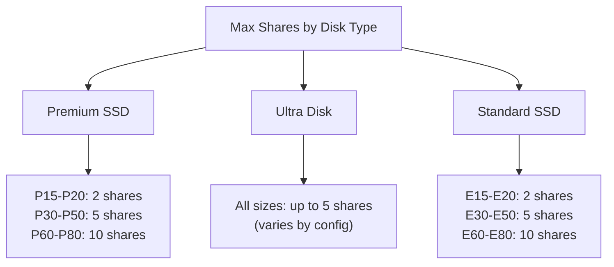
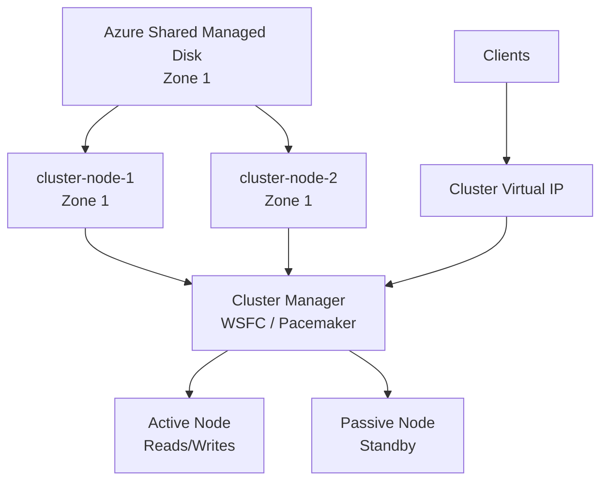

# How to Configure Shared Disks in Azure for Clustered Applications

Author: [nawazdhandala](https://www.github.com/nawazdhandala)

Tags: Azure, Shared Disks, Clustering, High Availability, Managed Disks, Failover, Windows Server

Description: Learn how to set up Azure Shared Disks to enable multi-attach scenarios for clustered applications like Windows Server Failover Clustering and Pacemaker.

---

Azure Shared Disks allow a single managed disk to be attached to multiple virtual machines simultaneously. This is essential for running clustered applications that need shared storage, like Windows Server Failover Clustering (WSFC), SQL Server Failover Cluster Instances, SAP ASCS/SCS, or Linux Pacemaker clusters. In this post, I will cover how to create and configure shared disks, attach them to multiple VMs, and set up the clustering layer.

## When You Need Shared Disks

Traditional clustering architectures rely on shared storage. Multiple cluster nodes read from and write to the same disk, with a cluster manager coordinating access. Before Azure Shared Disks, you had to use alternative approaches like Storage Spaces Direct (S2D) or third-party replication products. Shared Disks bring the familiar shared-storage model to Azure.

Common use cases include:

- SQL Server Failover Cluster Instances (FCI)
- SAP ASCS/SCS with Windows or Linux clusters
- Oracle RAC (Real Application Clusters)
- Custom applications designed for shared-disk clustering
- File server clusters

## Supported Disk Types

Shared Disks are supported on:

- Premium SSD (all sizes P15 and above)
- Standard SSD (all sizes E15 and above)
- Ultra Disk (all sizes)
- Premium SSD v2 (all sizes)

Standard HDD does not support shared disks.

## Creating a Shared Disk

The key parameter is `--max-shares`, which specifies how many VMs can attach the disk simultaneously.

```bash
# Create a Premium SSD shared disk that can be attached to 2 VMs
# The max-shares parameter determines how many VMs can mount it at once
az disk create \
  --name cluster-shared-disk \
  --resource-group my-resource-group \
  --location eastus \
  --zone 1 \
  --sku Premium_LRS \
  --size-gb 256 \
  --max-shares 2

# Verify the shared disk configuration
az disk show \
  --name cluster-shared-disk \
  --resource-group my-resource-group \
  --query "{name:name, size:diskSizeGb, maxShares:maxShares, sku:sku.name}" \
  --output table
```

The maximum number of shares depends on the disk type and size.



## Creating a Shared Disk with PowerShell

```powershell
# Create a shared disk configuration
$diskConfig = New-AzDiskConfig `
  -Location "eastus" `
  -CreateOption "Empty" `
  -DiskSizeGB 256 `
  -SkuName "Premium_LRS" `
  -MaxSharesCount 2 `
  -Zone 1

# Create the shared disk
$sharedDisk = New-AzDisk `
  -ResourceGroupName "my-resource-group" `
  -DiskName "cluster-shared-disk" `
  -Disk $diskConfig

Write-Output "Shared disk created: $($sharedDisk.Name), Max shares: $($sharedDisk.MaxShares)"
```

## Creating a Shared Ultra Disk

Ultra Disks give you the most flexibility with shared disks since you can independently configure IOPS and throughput.

```bash
# Create a shared Ultra Disk with custom performance settings
az disk create \
  --name cluster-ultra-shared \
  --resource-group my-resource-group \
  --location eastus \
  --zone 1 \
  --sku UltraSSD_LRS \
  --size-gb 512 \
  --disk-iops-read-write 20000 \
  --disk-mbps-read-write 500 \
  --max-shares 3
```

## Attaching the Shared Disk to Multiple VMs

Both VMs must be in the same availability zone as the shared disk. Attach the disk to each VM.

```bash
# Attach the shared disk to the first cluster node
az vm disk attach \
  --vm-name cluster-node-1 \
  --resource-group my-resource-group \
  --name cluster-shared-disk \
  --lun 0

# Attach the same disk to the second cluster node
az vm disk attach \
  --vm-name cluster-node-2 \
  --resource-group my-resource-group \
  --name cluster-shared-disk \
  --lun 0

# Verify both VMs see the disk
az disk show \
  --name cluster-shared-disk \
  --resource-group my-resource-group \
  --query "managedByExtended" \
  --output table
```

## Setting Up Windows Server Failover Clustering

After the shared disk is attached to both Windows VMs, configure WSFC.

```powershell
# Run on both cluster nodes

# Install the Failover Clustering feature
Install-WindowsFeature -Name Failover-Clustering -IncludeManagementTools

# Validate the cluster configuration (run on one node)
Test-Cluster -Node cluster-node-1, cluster-node-2

# Create the cluster
New-Cluster `
  -Name "my-cluster" `
  -Node cluster-node-1, cluster-node-2 `
  -StaticAddress 10.0.0.100

# The shared disk should appear automatically in Failover Cluster Manager
# Add it as a cluster disk
Get-ClusterAvailableDisk | Add-ClusterDisk

# Verify the cluster disk
Get-ClusterResource | Where-Object ResourceType -eq "Physical Disk"
```

## Setting Up a Linux Pacemaker Cluster

For Linux clusters, the shared disk works with Pacemaker and SCSI persistent reservations.

```bash
# Run on both Linux cluster nodes

# Install clustering packages (RHEL/CentOS example)
sudo yum install -y pacemaker pcs fence-agents-azure-arm

# Enable and start the cluster service
sudo systemctl enable pcsd
sudo systemctl start pcsd

# Set the hacluster password on both nodes
echo "StrongPassword123" | sudo passwd --stdin hacluster

# Authenticate the nodes (run on one node)
sudo pcs cluster auth cluster-node-1 cluster-node-2 -u hacluster -p StrongPassword123

# Create the cluster
sudo pcs cluster setup --name my-cluster cluster-node-1 cluster-node-2

# Start the cluster
sudo pcs cluster start --all
sudo pcs cluster enable --all
```

Then configure the shared disk as a cluster resource.

```bash
# Format the shared disk (only on one node, before adding to cluster)
sudo mkfs.ext4 /dev/sdc

# Create the filesystem resource in Pacemaker
sudo pcs resource create shared-fs Filesystem \
  device="/dev/sdc" \
  directory="/shared-data" \
  fstype="ext4" \
  --group cluster-resources

# Verify the resource is running
sudo pcs status
```

## SCSI Persistent Reservations

Shared disks use SCSI persistent reservations (SCSI PR) to coordinate access between VMs. The cluster software manages reservations, but you should understand how they work.

When a node takes ownership of a shared disk, it registers a SCSI reservation. Other nodes can see the disk but cannot write to it unless the reservation is released or they are granted shared access.

```bash
# Check SCSI reservation status on Linux
# Install sg3_utils if not present
sudo yum install -y sg3_utils

# Read the reservation keys on the shared disk
sudo sg_persist --in --read-keys /dev/sdc

# Read the current reservation
sudo sg_persist --in --read-reservation /dev/sdc
```

## Architecture Diagram



## Important Considerations

All VMs sharing a disk must be in the same availability zone. Cross-zone shared disks are not supported.

Azure does not manage disk coordination between VMs. You must use cluster software (WSFC, Pacemaker) or your application's own coordination mechanism to prevent data corruption from concurrent writes.

Disk caching must be set to None for shared disks. ReadOnly and ReadWrite caching are not supported when max-shares is greater than 1.

```bash
# Shared disks must have caching disabled
# This happens automatically, but you can verify
az vm show \
  --name cluster-node-1 \
  --resource-group my-resource-group \
  --query "storageProfile.dataDisks[?name=='cluster-shared-disk'].caching" \
  --output table
```

## Shared Disk Fencing

In a cluster, fencing prevents a failed node from corrupting the shared disk. Azure provides fencing agents for both WSFC and Pacemaker.

For WSFC, the Azure Witness or Cloud Witness provides quorum voting. For Pacemaker, the fence_azure_arm agent can power off failed nodes.

Shared disks bring traditional clustering models to Azure. They require careful planning around availability zones and cluster configuration, but they enable running clustered workloads that previously were difficult or impossible to host in the cloud.
