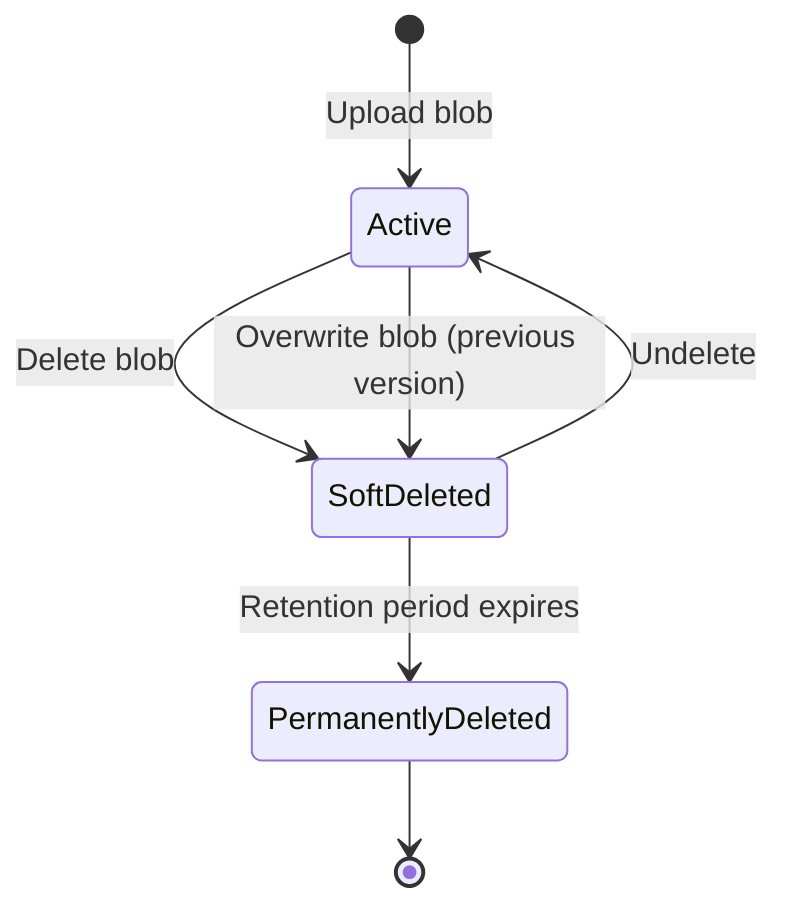

# How to Configure Soft Delete for Azure Blob Storage and Recover Deleted Blobs

Author: [nawazdhandala](https://www.github.com/nawazdhandala)

Tags: Azure, Blob Storage, Soft Delete, Data Recovery, Data Protection, Azure Storage, Disaster Recovery

Description: Step-by-step guide to enabling soft delete for Azure Blob Storage, configuring retention periods, and recovering accidentally deleted blobs and containers.

---

Accidentally deleting a blob from Azure Storage is one of those mistakes that can ruin your afternoon. Without soft delete enabled, a deleted blob is gone for good. Soft delete changes this by keeping deleted data around for a configurable retention period, giving you the chance to recover it before it disappears permanently.

Azure Blob Storage actually has two separate soft delete features: one for blobs and one for containers. In this guide, I will cover both and walk through the recovery process.

## Understanding Blob Soft Delete

When blob soft delete is enabled, deleted blobs and overwritten blobs are retained in a soft-deleted state for a specified number of days. During this retention window, you can list the soft-deleted blobs and restore (undelete) them.

Here is how the lifecycle looks:



When a blob is overwritten and soft delete is enabled, the previous content is saved as a soft-deleted snapshot. This means you can recover from accidental overwrites, not just deletes.

## Enabling Blob Soft Delete

### Azure Portal

1. Go to your storage account in the Azure Portal.
2. Navigate to "Data protection" under "Data management."
3. Check "Enable soft delete for blobs."
4. Set the retention period (1 to 365 days).
5. Click Save.

### Azure CLI

```bash
# Enable blob soft delete with a 14-day retention period
az storage blob service-properties delete-policy update \
  --account-name mystorageaccount \
  --enable true \
  --days-retained 14
```

To verify the configuration:

```bash
# Check the current soft delete configuration
az storage blob service-properties delete-policy show \
  --account-name mystorageaccount
```

### Bicep Template

```bicep
// Enable blob soft delete in infrastructure-as-code
resource blobService 'Microsoft.Storage/storageAccounts/blobServices@2023-01-01' = {
  name: '${storageAccount.name}/default'
  properties: {
    deleteRetentionPolicy: {
      enabled: true
      days: 14  // Keep deleted blobs for 14 days
    }
  }
}
```

## Enabling Container Soft Delete

Container soft delete works independently from blob soft delete. It protects against accidental deletion of entire containers. When a container is deleted with soft delete enabled, the container and all its contents are preserved in a soft-deleted state.

### Azure CLI

```bash
# Enable container soft delete with a 7-day retention period
az storage account blob-service-properties update \
  --account-name mystorageaccount \
  --resource-group myresourcegroup \
  --enable-container-delete-retention true \
  --container-delete-retention-days 7
```

### Bicep Template

```bicep
// Enable container soft delete alongside blob soft delete
resource blobService 'Microsoft.Storage/storageAccounts/blobServices@2023-01-01' = {
  name: '${storageAccount.name}/default'
  properties: {
    deleteRetentionPolicy: {
      enabled: true
      days: 14
    }
    containerDeleteRetentionPolicy: {
      enabled: true
      days: 7
    }
  }
}
```

## Listing Soft-Deleted Blobs

To see which blobs are in a soft-deleted state, you need to include deleted items in your list request:

```bash
# List all blobs including soft-deleted ones
az storage blob list \
  --account-name mystorageaccount \
  --container-name mycontainer \
  --include d \
  --output table
```

The `--include d` flag tells the list operation to include deleted blobs. Soft-deleted blobs will show up with a `Deleted` property set to `true`.

Using the Python SDK:

```python
from azure.storage.blob import BlobServiceClient

# Connect to the storage account
blob_service_client = BlobServiceClient.from_connection_string("your-connection-string")
container_client = blob_service_client.get_container_client("mycontainer")

# List all blobs including soft-deleted ones
# The include parameter with "deleted" fetches soft-deleted blobs
all_blobs = container_client.list_blobs(include=["deleted"])

for blob in all_blobs:
    if blob.deleted:
        print(f"DELETED: {blob.name} (deleted on: {blob.deleted_time})")
    else:
        print(f"ACTIVE: {blob.name}")
```

## Recovering a Soft-Deleted Blob

Once you have identified the blob you want to recover, undeleting it is straightforward.

### Azure CLI

```bash
# Undelete a soft-deleted blob
az storage blob undelete \
  --account-name mystorageaccount \
  --container-name mycontainer \
  --name myfile.txt
```

### Python SDK

```python
from azure.storage.blob import BlobServiceClient

blob_service_client = BlobServiceClient.from_connection_string("your-connection-string")

# Get a reference to the deleted blob
blob_client = blob_service_client.get_blob_client(
    container="mycontainer",
    blob="myfile.txt"
)

# Undelete the blob - this restores it to active state
blob_client.undelete_blob()
print("Blob restored successfully")
```

### C# SDK

```csharp
using Azure.Storage.Blobs;

// Connect to the storage account and get a reference to the deleted blob
var blobServiceClient = new BlobServiceClient("your-connection-string");
var containerClient = blobServiceClient.GetBlobContainerClient("mycontainer");
var blobClient = containerClient.GetBlobClient("myfile.txt");

// Undelete the blob to restore it
await blobClient.UndeleteAsync();
Console.WriteLine("Blob restored successfully");
```

## Recovering a Soft-Deleted Container

Recovering a deleted container is slightly different. You need to know the container's version (which Azure assigns when it is deleted).

```bash
# List deleted containers
az storage container list \
  --account-name mystorageaccount \
  --include-deleted \
  --query "[?deleted]" \
  --output table
```

Then restore it:

```bash
# Restore a soft-deleted container
# You need the deleted container's version from the list output
az storage container restore \
  --account-name mystorageaccount \
  --name mycontainer \
  --deleted-version "01D8B9A1F2C3D4E5"
```

Note that you cannot restore a container if a container with the same name already exists. You would need to delete or rename the existing container first.

## Recovering from Overwrites

When blob soft delete is enabled and a blob gets overwritten, the previous content is preserved as a soft-deleted snapshot. To recover the previous content:

1. List the blob's snapshots, including deleted ones.
2. Find the snapshot that represents the previous version.
3. Copy the snapshot back to the base blob.

```python
from azure.storage.blob import BlobServiceClient

blob_service_client = BlobServiceClient.from_connection_string("your-connection-string")
container_client = blob_service_client.get_container_client("mycontainer")

# List snapshots including deleted ones
blobs = container_client.list_blobs(
    name_starts_with="myfile.txt",
    include=["deleted", "snapshots"]
)

# Find the deleted snapshot you want to restore
for blob in blobs:
    if blob.snapshot and blob.deleted:
        print(f"Found deleted snapshot: {blob.snapshot}")

        # Undelete the snapshot first
        snapshot_client = container_client.get_blob_client(
            blob.name, snapshot=blob.snapshot
        )
        snapshot_client.undelete_blob()

        # Then copy the snapshot back to the base blob
        base_blob = container_client.get_blob_client("myfile.txt")
        source_url = snapshot_client.url
        base_blob.start_copy_from_url(source_url)
        print("Previous version restored")
        break
```

## Choosing a Retention Period

The retention period determines how long soft-deleted data is kept. A longer period gives you more time to discover and recover from mistakes, but it also means you pay for the storage of deleted data for longer.

Consider these factors:

- **How quickly do you typically notice data issues?** If you have good monitoring, 7 days might be enough. If issues sometimes go unnoticed for weeks, set a longer period.
- **How much data do you delete regularly?** If your application constantly creates and deletes temporary blobs, soft delete retention can significantly increase your storage costs.
- **Compliance requirements.** Some regulations mandate minimum data retention periods.

For most workloads, 14 to 30 days is a reasonable starting point.

## Cost Considerations

Soft-deleted data is billed at the same rate as active data in the same access tier. If you delete a 1 TB blob from hot storage and have a 30-day retention period, you continue paying for 1 TB of hot storage for those 30 days.

This can add up quickly if your application has a high churn rate (frequently creating and deleting blobs). Monitor your storage capacity metrics to understand the impact.

## Soft Delete vs. Versioning

Both soft delete and versioning protect your data, but they address different scenarios:

- **Soft delete** protects against accidental deletion. It keeps deleted blobs recoverable.
- **Versioning** protects against accidental overwrites. It keeps every previous version of a blob.

For comprehensive data protection, enable both. They work together - when both are enabled and a blob is deleted, the current version becomes a soft-deleted previous version.

## Best Practices

**Enable both blob and container soft delete.** Container deletion is rare but catastrophic when it happens by accident.

**Pair soft delete with versioning** for protection against both deletes and overwrites.

**Use Azure Policy** to enforce that soft delete is enabled across all storage accounts in your subscription. This prevents anyone from creating unprotected storage accounts.

**Monitor soft delete usage** through Azure Monitor metrics. Track the amount of soft-deleted data to understand cost impact.

**Test your recovery process** before you need it. Do not wait for an actual incident to figure out how to recover soft-deleted blobs.

**Set up alerts** for bulk delete operations. If someone deletes a large number of blobs, you want to know about it quickly while soft delete still has the data.

## Wrapping Up

Soft delete is one of the easiest data protection features to enable in Azure Blob Storage, and there is very little reason not to use it. The cost overhead is predictable and manageable, and the protection it provides against accidental data loss is invaluable. Enable it today, set a reasonable retention period, and sleep a little easier knowing your data has a safety net.
