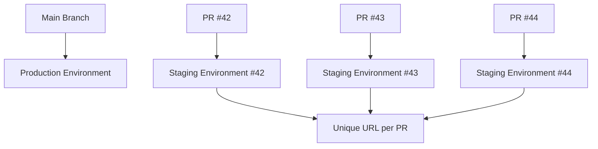

# How to Configure Staging Environments and Preview Branches in Azure Static Web Apps

Author: [nawazdhandala](https://www.github.com/nawazdhandala)

Tags: Azure, Static Web Apps, Staging, Preview, CI/CD, GitHub, Branching

Description: Learn how to use staging environments and preview branches in Azure Static Web Apps for safe testing before merging changes to production.

---

One of the most practical features of Azure Static Web Apps is automatic staging environments. Every time you open a pull request against your production branch, Azure spins up a temporary environment with its own unique URL. Reviewers can click the link, test the changes live, and approve or reject the PR with confidence. When the pull request closes, the staging environment is automatically torn down.

This workflow eliminates the "it works on my machine" problem and removes the need for shared staging servers that are always slightly out of date.

## How Preview Environments Work

When you push a commit or open a pull request against the production branch, the GitHub Actions workflow runs. For PR events, instead of deploying to production, Azure creates an isolated environment with a unique URL pattern:

```
https://happy-river-0a1b2c3d4-<PR_NUMBER>.azurestaticapps.net
```

Each pull request gets its own environment. Multiple open PRs each get separate environments running simultaneously. The staging environment receives the exact same build as production would, including any API functions.



When a pull request is merged or closed, the cleanup job in the GitHub Actions workflow destroys the staging environment automatically. No manual intervention required, no orphaned resources lingering.

## Prerequisites

- An Azure Static Web App connected to a GitHub repository.
- A GitHub Actions workflow file already generated by Azure (this happens automatically when you create the Static Web App).
- Contributor access to the GitHub repository.

## Step 1: Understand the Default Workflow

When Azure creates the GitHub Actions workflow file, it already includes support for staging environments. Look at the workflow file in `.github/workflows/`.

```yaml
# The workflow triggers on both pushes and pull requests
on:
  push:
    branches:
      - main
  pull_request:
    types: [opened, synchronize, reopened, closed]
    branches:
      - main

jobs:
  build_and_deploy_job:
    # This condition ensures the build runs on pushes and on PR events that are not closures
    if: github.event_name == 'push' || (github.event_name == 'pull_request' && github.event.action != 'closed')
    runs-on: ubuntu-latest
    steps:
      - uses: actions/checkout@v3
        with:
          submodules: true
      - name: Build And Deploy
        uses: Azure/static-web-apps-deploy@v1
        with:
          azure_static_web_apps_api_token: ${{ secrets.AZURE_STATIC_WEB_APPS_API_TOKEN }}
          repo_token: ${{ secrets.GITHUB_TOKEN }}
          action: "upload"
          app_location: "/"
          output_location: "build"

  close_pull_request_job:
    # This job runs only when a PR is closed, cleaning up the staging environment
    if: github.event_name == 'pull_request' && github.event.action == 'closed'
    runs-on: ubuntu-latest
    steps:
      - name: Close Pull Request
        uses: Azure/static-web-apps-deploy@v1
        with:
          azure_static_web_apps_api_token: ${{ secrets.AZURE_STATIC_WEB_APPS_API_TOKEN }}
          action: "close"
```

The key piece is the `close_pull_request_job`. When a PR is closed (whether merged or abandoned), this job tells Azure to tear down the staging environment.

## Step 2: Test the Preview Workflow

To see it in action, create a feature branch and open a pull request.

```bash
# Create a new branch with some changes
git checkout -b feature/new-homepage
```

Make a change to your app - for example, update the homepage text.

```bash
# Commit and push the feature branch
git add .
git commit -m "Update homepage hero section"
git push -u origin feature/new-homepage
```

Open a pull request on GitHub from `feature/new-homepage` to `main`. The GitHub Actions workflow triggers automatically.

Once the workflow completes, look for a comment on the pull request from the Azure Static Web Apps bot. It posts the staging URL directly in the PR conversation.

The comment looks something like:

> Azure Static Web Apps: Your stage site is ready! Visit it here: https://happy-river-0a1b2c3d4-2.azurestaticapps.net

Click the link to see your changes live in the staging environment.

## Step 3: Configure Environment-Specific Settings

Staging environments may need different configuration than production. For example, you might want to point the API at a test database or show a banner indicating that it is a staging environment.

Use the GitHub Actions workflow to pass environment-specific variables.

```yaml
- name: Build And Deploy
  uses: Azure/static-web-apps-deploy@v1
  with:
    azure_static_web_apps_api_token: ${{ secrets.AZURE_STATIC_WEB_APPS_API_TOKEN }}
    repo_token: ${{ secrets.GITHUB_TOKEN }}
    action: "upload"
    app_location: "/"
    output_location: "build"
  env:
    # Set different API URL based on whether this is a PR or production deployment
    REACT_APP_API_URL: ${{ github.event_name == 'pull_request' && 'https://api-staging.example.com' || 'https://api.example.com' }}
    REACT_APP_ENVIRONMENT: ${{ github.event_name == 'pull_request' && 'staging' || 'production' }}
```

In your app code, you can use these environment variables to display a staging indicator.

```javascript
// Show a banner on staging environments so testers know they are not on production
function StagingBanner() {
  if (process.env.REACT_APP_ENVIRONMENT !== 'staging') {
    return null;
  }

  return (
    <div style={{
      backgroundColor: '#ff9800',
      color: 'white',
      padding: '8px',
      textAlign: 'center',
      fontWeight: 'bold'
    }}>
      STAGING ENVIRONMENT - This is not production
    </div>
  );
}
```

## Step 4: Manage Staging Environment Secrets

Application settings in Azure Static Web Apps apply to all environments (production and staging) by default. This means your staging environments use the same database connection strings and API keys as production.

For sensitive operations, you might want staging to use separate credentials. One approach is to use different settings based on the environment type in your API functions.

```javascript
// api/shared/config.js
// Select the appropriate configuration based on environment
function getConfig() {
  const isProduction = process.env.AZURE_STATIC_WEB_APPS_ENVIRONMENT === 'production';

  return {
    databaseUrl: isProduction
      ? process.env.PROD_DATABASE_URL
      : process.env.STAGING_DATABASE_URL,
    apiKey: isProduction
      ? process.env.PROD_API_KEY
      : process.env.STAGING_API_KEY
  };
}

module.exports = { getConfig };
```

Then set both production and staging values in the application settings.

```bash
# Set both production and staging configuration values
az staticwebapp appsettings set \
  --name my-static-app \
  --resource-group myResourceGroup \
  --setting-names \
    "PROD_DATABASE_URL=mongodb://prod-server/mydb" \
    "STAGING_DATABASE_URL=mongodb://staging-server/mydb" \
    "PROD_API_KEY=prod-key-here" \
    "STAGING_API_KEY=staging-key-here"
```

## Step 5: Protect Staging Environments

By default, anyone with the URL can access a staging environment. For private projects, you can restrict access using password protection in the configuration.

Add this to your `staticwebapp.config.json`.

```json
{
  "forwardingGateway": {
    "requiredHeaders": {
      "X-Azure-FDID": "your-front-door-id"
    }
  }
}
```

Alternatively, you can require authentication for the staging environment by using route rules that apply only to staging URLs.

A simpler approach is to keep the staging URLs unlisted. They are not indexed by search engines and are only shared through the PR comment. For most teams, obscurity combined with the temporary nature of staging environments is sufficient.

## Step 6: Deploy Named Environments

Beyond PR-based staging environments, you can create named environments for persistent staging or QA purposes. These are environments that are not tied to a specific pull request.

```bash
# Deploy to a named environment from a specific branch
az staticwebapp environment create \
  --name my-static-app \
  --resource-group myResourceGroup \
  --environment-name "qa"
```

Named environments persist until you explicitly delete them, making them useful for dedicated QA testing, demo environments, or integration testing with external services.

## Step 7: Monitor Environment Status

You can list all active environments (production and staging) using the CLI.

```bash
# List all active environments for your Static Web App
az staticwebapp environment list \
  --name my-static-app \
  --resource-group myResourceGroup \
  --output table
```

This shows each environment's name, status, and hostname. It is useful for auditing how many staging environments are currently running.

## Step 8: Clean Up Stale Environments

Staging environments are automatically cleaned up when pull requests close. However, if a PR was closed without the cleanup job running (due to a GitHub outage or misconfigured workflow), you might have orphaned environments.

```bash
# Manually delete a specific staging environment
az staticwebapp environment delete \
  --name my-static-app \
  --resource-group myResourceGroup \
  --environment-name "2" \
  --yes
```

The environment name for PR-based environments is the pull request number. For the example above, environment "2" corresponds to PR #2.

## Workflow Customization Tips

**Run tests before deploying**: Add a testing step in the workflow before the deploy action.

```yaml
- name: Run Tests
  run: |
    cd src
    npm ci
    npm test -- --watchAll=false

- name: Build And Deploy
  uses: Azure/static-web-apps-deploy@v1
  # ... rest of config
```

**Deploy only certain branches**: Modify the `on` trigger to limit which branches create staging environments.

```yaml
on:
  pull_request:
    types: [opened, synchronize, reopened, closed]
    branches:
      - main
      - release/*
```

**Skip deployment for documentation changes**: Use path filters to avoid deploying when only docs change.

```yaml
on:
  push:
    branches:
      - main
    paths-ignore:
      - 'docs/**'
      - '*.md'
```

## Summary

Staging environments in Azure Static Web Apps work out of the box with zero configuration. Every pull request gets an isolated preview environment, complete with its own URL and API backend. This makes code review more effective because reviewers can test changes live instead of guessing from diffs. The environments clean themselves up when PRs close, and you can customize the workflow to add tests, environment-specific configuration, and branch restrictions as your team's needs grow.
