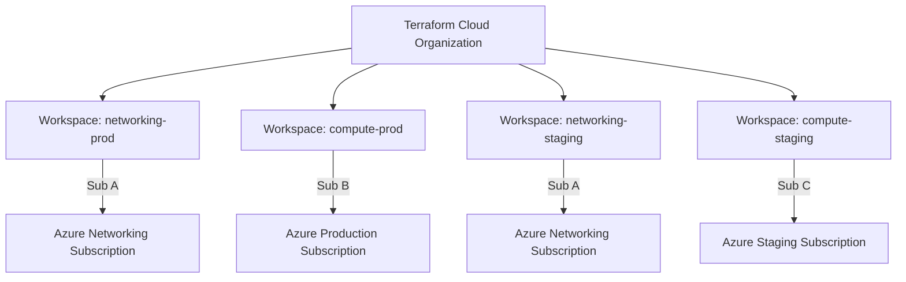

# How to Configure Terraform Cloud Workspaces for Azure Multi-Subscription Deployments

Author: [nawazdhandala](https://www.github.com/nawazdhandala)

Tags: Terraform Cloud, Azure, Workspaces, Multi-Subscription, Infrastructure as Code, DevOps, Enterprise

Description: Configure Terraform Cloud workspaces to manage Azure infrastructure across multiple subscriptions with proper isolation, variable management, and run triggers.

---

Most enterprise Azure environments span multiple subscriptions - one for production, one for staging, one for shared services, maybe separate ones for security and networking. Managing Terraform deployments across all of these from local machines or basic CI/CD pipelines gets messy fast. Terraform Cloud provides a centralized platform for managing state, running plans and applies, and controlling access across all your subscriptions from a single place.

In this post, I will walk through setting up Terraform Cloud workspaces for multi-subscription Azure deployments, including authentication, variable management, workspace chaining, and operational patterns that work at scale.

## Why Terraform Cloud for Multi-Subscription?

The fundamental problem with multi-subscription deployments is that each subscription needs its own authentication, its own state, and often its own approval workflows. Terraform Cloud solves these with workspace isolation - each workspace has its own variables, state, and permissions.



## Setting Up the Organization

Start by creating a Terraform Cloud organization and configuring it for your Azure environment. I recommend structuring workspaces with a naming convention that includes the component and environment:

```
{component}-{environment}
```

For example: `networking-prod`, `compute-prod`, `database-staging`, `shared-services`.

## Configuring Azure Authentication

Each workspace needs credentials for its target Azure subscription. Create a service principal per subscription and store the credentials as workspace variables.

First, create service principals for each subscription:

```bash
# Create a service principal for the production subscription
az account set --subscription "Production"
az ad sp create-for-rbac \
  --name "sp-terraform-production" \
  --role "Contributor" \
  --scopes "/subscriptions/$(az account show --query id -o tsv)" \
  --sdk-auth

# Create a service principal for the staging subscription
az account set --subscription "Staging"
az ad sp create-for-rbac \
  --name "sp-terraform-staging" \
  --role "Contributor" \
  --scopes "/subscriptions/$(az account show --query id -o tsv)" \
  --sdk-auth
```

## Creating Workspaces with Terraform

I manage Terraform Cloud workspaces using Terraform itself. Yes, it is Terraform all the way down:

```hcl
# tfc-config/main.tf - Manage Terraform Cloud workspaces with Terraform

terraform {
  required_providers {
    tfe = {
      source  = "hashicorp/tfe"
      version = "~> 0.51"
    }
  }
}

provider "tfe" {
  # Token from TFC_TOKEN environment variable
}

variable "tfc_organization" {
  default = "my-company"
}

variable "azure_subscriptions" {
  description = "Map of Azure subscription configurations"
  type = map(object({
    subscription_id = string
    client_id       = string
    client_secret   = string
    tenant_id       = string
  }))
  sensitive = true
}

# Define all workspaces as a local map
locals {
  workspaces = {
    "networking-prod" = {
      description     = "Production networking - VNets, peering, firewall"
      subscription    = "production"
      working_dir     = "infrastructure/networking"
      vcs_branch      = "main"
      auto_apply      = false  # Require manual approval for production
      trigger_prefixes = ["infrastructure/networking/", "modules/networking/"]
    }
    "compute-prod" = {
      description     = "Production compute - VMs, VMSS, AKS"
      subscription    = "production"
      working_dir     = "infrastructure/compute"
      vcs_branch      = "main"
      auto_apply      = false
      trigger_prefixes = ["infrastructure/compute/", "modules/compute/"]
    }
    "networking-staging" = {
      description     = "Staging networking"
      subscription    = "staging"
      working_dir     = "infrastructure/networking"
      vcs_branch      = "main"
      auto_apply      = true  # Auto-apply for staging
      trigger_prefixes = ["infrastructure/networking/", "modules/networking/"]
    }
    "compute-staging" = {
      description     = "Staging compute"
      subscription    = "staging"
      working_dir     = "infrastructure/compute"
      vcs_branch      = "main"
      auto_apply      = true
      trigger_prefixes = ["infrastructure/compute/", "modules/compute/"]
    }
  }
}

# Create workspaces
resource "tfe_workspace" "this" {
  for_each     = local.workspaces
  name         = each.key
  organization = var.tfc_organization
  description  = each.value.description

  # VCS integration
  vcs_repo {
    identifier     = "my-company/azure-infrastructure"
    branch         = each.value.vcs_branch
    oauth_token_id = tfe_oauth_client.github.oauth_token_id
  }

  working_directory  = each.value.working_dir
  auto_apply         = each.value.auto_apply
  terraform_version  = "1.7.0"
  queue_all_runs     = false

  # Only trigger runs when files in these paths change
  trigger_prefixes = each.value.trigger_prefixes

  tag_names = [
    split("-", each.key)[1],  # Environment: prod, staging
    split("-", each.key)[0],  # Component: networking, compute
  ]
}

# Set Azure credentials as workspace variables
resource "tfe_variable" "arm_client_id" {
  for_each     = local.workspaces
  key          = "ARM_CLIENT_ID"
  value        = var.azure_subscriptions[each.value.subscription].client_id
  category     = "env"  # Environment variable
  workspace_id = tfe_workspace.this[each.key].id
  sensitive    = true
  description  = "Azure service principal client ID"
}

resource "tfe_variable" "arm_client_secret" {
  for_each     = local.workspaces
  key          = "ARM_CLIENT_SECRET"
  value        = var.azure_subscriptions[each.value.subscription].client_secret
  category     = "env"
  workspace_id = tfe_workspace.this[each.key].id
  sensitive    = true
  description  = "Azure service principal client secret"
}

resource "tfe_variable" "arm_subscription_id" {
  for_each     = local.workspaces
  key          = "ARM_SUBSCRIPTION_ID"
  value        = var.azure_subscriptions[each.value.subscription].subscription_id
  category     = "env"
  workspace_id = tfe_workspace.this[each.key].id
  sensitive    = true
  description  = "Target Azure subscription ID"
}

resource "tfe_variable" "arm_tenant_id" {
  for_each     = local.workspaces
  key          = "ARM_TENANT_ID"
  value        = var.azure_subscriptions[each.value.subscription].tenant_id
  category     = "env"
  workspace_id = tfe_workspace.this[each.key].id
  sensitive    = true
  description  = "Azure tenant ID"
}
```

## Workspace Chaining with Run Triggers

In many cases, workspaces depend on each other. The compute workspace needs outputs from the networking workspace (like subnet IDs). Run triggers tell Terraform Cloud to queue a run in one workspace after another completes:

```hcl
# When networking-prod completes, trigger compute-prod
resource "tfe_run_trigger" "compute_after_networking_prod" {
  workspace_id  = tfe_workspace.this["compute-prod"].id
  sourceable_id = tfe_workspace.this["networking-prod"].id
}

resource "tfe_run_trigger" "compute_after_networking_staging" {
  workspace_id  = tfe_workspace.this["compute-staging"].id
  sourceable_id = tfe_workspace.this["networking-staging"].id
}
```

The downstream workspace reads outputs from the upstream workspace using `tfe_outputs`:

```hcl
# infrastructure/compute/main.tf - Read networking outputs from TFC

# Read outputs from the networking workspace
data "tfe_outputs" "networking" {
  organization = "my-company"
  workspace    = "networking-${var.environment}"
}

# Use the networking outputs
locals {
  vnet_id    = data.tfe_outputs.networking.values.vnet_id
  subnet_ids = data.tfe_outputs.networking.values.subnet_ids
}

# Deploy VMs into the subnets from the networking workspace
resource "azurerm_linux_virtual_machine" "app" {
  name                = "vm-app-${var.environment}-001"
  resource_group_name = azurerm_resource_group.compute.name
  location            = azurerm_resource_group.compute.location
  size                = var.vm_size

  network_interface_ids = [azurerm_network_interface.app.id]

  # ... VM configuration ...
}

resource "azurerm_network_interface" "app" {
  name                = "nic-app-${var.environment}-001"
  location            = azurerm_resource_group.compute.location
  resource_group_name = azurerm_resource_group.compute.name

  ip_configuration {
    name                          = "internal"
    subnet_id                     = local.subnet_ids["app"]  # From networking workspace
    private_ip_address_allocation = "Dynamic"
  }
}
```

## Variable Sets for Shared Configuration

Some variables are shared across multiple workspaces. Use variable sets to avoid duplicating them:

```hcl
# Variable set for common tags applied to all workspaces
resource "tfe_variable_set" "common_tags" {
  name         = "Common Azure Tags"
  description  = "Standard tags applied to all Azure resources"
  organization = var.tfc_organization
}

resource "tfe_variable" "company_tag" {
  key             = "company"
  value           = "MyCompany"
  category        = "terraform"
  variable_set_id = tfe_variable_set.common_tags.id
  description     = "Company name tag value"
}

# Apply variable set to all workspaces
resource "tfe_workspace_variable_set" "common_tags" {
  for_each        = tfe_workspace.this
  variable_set_id = tfe_variable_set.common_tags.id
  workspace_id    = each.value.id
}
```

## Team Access Control

Different teams should have different access levels per workspace:

```hcl
# Platform team gets admin access to all workspaces
resource "tfe_team" "platform" {
  name         = "platform-engineering"
  organization = var.tfc_organization
}

resource "tfe_team_access" "platform_all" {
  for_each     = tfe_workspace.this
  access       = "admin"
  team_id      = tfe_team.platform.id
  workspace_id = each.value.id
}

# App developers only get read access to production
resource "tfe_team" "developers" {
  name         = "application-developers"
  organization = var.tfc_organization
}

resource "tfe_team_access" "developers_staging" {
  for_each = {
    for k, v in tfe_workspace.this : k => v
    if endswith(k, "-staging")
  }
  access       = "write"
  team_id      = tfe_team.developers.id
  workspace_id = each.value.id
}

resource "tfe_team_access" "developers_prod" {
  for_each = {
    for k, v in tfe_workspace.this : k => v
    if endswith(k, "-prod")
  }
  access       = "read"
  team_id      = tfe_team.developers.id
  workspace_id = each.value.id
}
```

## Operational Patterns

A few patterns I have found work well for multi-subscription Terraform Cloud setups:

**Promote through environments.** Changes flow from staging to production. The VCS trigger runs staging automatically. After validation, manually trigger the production workspace.

**Use Sentinel policies.** If you are on Terraform Cloud Plus, Sentinel policies can enforce rules like "production workspaces must not auto-apply" or "all Azure resources must have required tags."

**Monitor workspace health.** Terraform Cloud sends notifications for failed runs. Configure Slack or email notifications on every workspace so your team knows when something breaks.

**Rotate credentials regularly.** Service principal secrets should be rotated on a schedule. Update the workspace variables through Terraform or the TFC API.

## Wrapping Up

Terraform Cloud workspaces provide a clean model for managing Azure infrastructure across multiple subscriptions. Each workspace gets its own state, credentials, and access controls while sharing modules and configuration through VCS integration. The combination of run triggers for dependency management, variable sets for shared configuration, and team-based access control gives you the governance structure that multi-subscription Azure environments require. Start with a workspace per component per environment, and adjust the granularity as your needs evolve.
