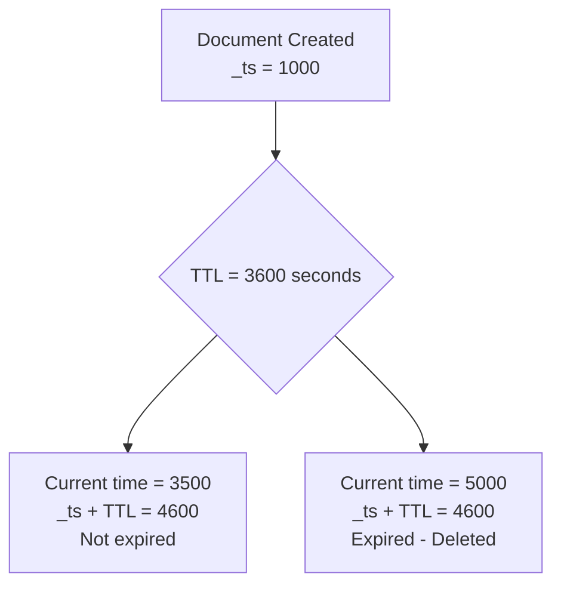

# How to Configure Time-to-Live (TTL) on Azure Cosmos DB Documents

Author: [nawazdhandala](https://www.github.com/nawazdhandala)

Tags: Azure, Cosmos DB, TTL, Data Lifecycle, Automatic Deletion, NoSQL

Description: Set up Time-to-Live on Azure Cosmos DB containers and documents to automatically expire and delete data after a specified period.

---

Time-to-Live (TTL) in Azure Cosmos DB automatically deletes documents after a specified number of seconds. This is perfect for session data, temporary caches, event logs, audit trails with retention periods, and any data that has a natural expiration. Instead of building your own cleanup jobs, you configure TTL and Cosmos DB handles the deletion in the background without consuming your provisioned throughput.

## How TTL Works

TTL operates at two levels:

1. **Container-level default**: A default TTL value applied to all documents in the container that do not have their own TTL value
2. **Document-level override**: Individual documents can have their own TTL that overrides the container default

The TTL countdown starts from the document's `_ts` (last modified timestamp) property. When `current_time - _ts > ttl_value`, the document is eligible for deletion.



Important details:

- Deletion happens in the background and does not consume your provisioned RU/s
- There may be a short delay between expiration and actual deletion (usually seconds, but can be longer under heavy load)
- Expired documents are not returned by queries, even before they are physically deleted
- TTL deletions appear in the change feed (as deletes, if using all versions and deletes mode)

## Enabling TTL on a Container

TTL must be enabled at the container level before individual documents can use it.

### Enable with a Default TTL Value

```bash
# Create a container with a default TTL of 1 hour (3600 seconds)
# All documents expire after 1 hour unless they specify their own TTL
az cosmosdb sql container create \
    --account-name myCosmosAccount \
    --database-name mydb \
    --name sessions \
    --partition-key-path "/userId" \
    --default-ttl 3600 \
    --resource-group myResourceGroup
```

### Enable TTL Without a Default

Setting the default TTL to -1 enables the TTL feature but does not set a default. Only documents with an explicit `ttl` property will expire:

```bash
# Enable TTL without a container-level default
# Documents only expire if they have their own ttl property
az cosmosdb sql container update \
    --account-name myCosmosAccount \
    --database-name mydb \
    --name events \
    --default-ttl -1 \
    --resource-group myResourceGroup
```

### Using the .NET SDK

```csharp
// Create a container with TTL enabled
ContainerProperties containerProperties = new ContainerProperties
{
    Id = "sessions",
    PartitionKeyPath = "/userId",
    DefaultTimeToLive = 3600  // 1 hour default TTL
};

Container container = await database.CreateContainerAsync(containerProperties, throughput: 4000);
Console.WriteLine("Container created with 1 hour default TTL");
```

```csharp
// Enable TTL on an existing container
Container container = client.GetContainer("mydb", "events");
ContainerResponse response = await container.ReadContainerAsync();
ContainerProperties properties = response.Resource;

// Set the default TTL (enables the feature)
properties.DefaultTimeToLive = 86400; // 24 hours

await container.ReplaceContainerAsync(properties);
Console.WriteLine("TTL enabled with 24 hour default");
```

## Setting TTL on Individual Documents

Documents can override the container's default TTL by including a `ttl` property:

```csharp
// Document with a custom TTL of 30 minutes
var shortLivedSession = new
{
    id = "session-abc123",
    userId = "user-42",
    token = "jwt-token-here",
    createdAt = DateTime.UtcNow,
    ttl = 1800  // 30 minutes - overrides the container default
};
await container.CreateItemAsync(shortLivedSession, new PartitionKey("user-42"));

// Document with a longer TTL of 7 days
var longLivedSession = new
{
    id = "session-xyz789",
    userId = "user-42",
    token = "jwt-token-here",
    rememberMe = true,
    ttl = 604800  // 7 days
};
await container.CreateItemAsync(longLivedSession, new PartitionKey("user-42"));

// Document that never expires (even if container has a default TTL)
var permanentDoc = new
{
    id = "config-global",
    userId = "system",
    settings = new { theme = "dark", language = "en" },
    ttl = -1  // -1 means this document never expires
};
await container.CreateItemAsync(permanentDoc, new PartitionKey("system"));
```

## TTL Scenarios

### Session Management

```csharp
// Store user sessions with automatic expiration
public class UserSession
{
    [JsonProperty("id")]
    public string Id { get; set; }

    [JsonProperty("userId")]
    public string UserId { get; set; }

    [JsonProperty("token")]
    public string Token { get; set; }

    [JsonProperty("ipAddress")]
    public string IpAddress { get; set; }

    [JsonProperty("lastActivity")]
    public DateTime LastActivity { get; set; }

    // TTL in seconds - session expires after 30 minutes of inactivity
    [JsonProperty("ttl")]
    public int Ttl { get; set; } = 1800;
}

// Create a session
var session = new UserSession
{
    Id = Guid.NewGuid().ToString(),
    UserId = "user-42",
    Token = GenerateToken(),
    IpAddress = "203.0.113.50",
    LastActivity = DateTime.UtcNow
};
await container.CreateItemAsync(session, new PartitionKey("user-42"));

// Extend session on activity (resets the TTL countdown)
// Replacing the document updates _ts, which resets the TTL timer
session.LastActivity = DateTime.UtcNow;
await container.ReplaceItemAsync(session, session.Id, new PartitionKey("user-42"));
```

### Event Log with Retention Period

```csharp
// Store events that automatically expire after 90 days
var auditEvent = new
{
    id = Guid.NewGuid().ToString(),
    userId = "user-42",
    action = "login",
    details = "Successful login from 203.0.113.50",
    timestamp = DateTime.UtcNow,
    ttl = 7776000  // 90 days in seconds
};
await container.CreateItemAsync(auditEvent, new PartitionKey("user-42"));
```

### Temporary Cache

```csharp
// Use Cosmos DB as a distributed cache with TTL
var cachedResult = new
{
    id = "cache:product-list:electronics",
    partitionKey = "cache",
    data = productList,
    cachedAt = DateTime.UtcNow,
    ttl = 300  // Cache expires in 5 minutes
};
await container.UpsertItemAsync(cachedResult, new PartitionKey("cache"));
```

### Scheduled Notifications

```csharp
// Store notifications that expire after being read or after 7 days
var notification = new
{
    id = Guid.NewGuid().ToString(),
    userId = "user-42",
    message = "Your order has shipped!",
    read = false,
    createdAt = DateTime.UtcNow,
    ttl = 604800  // 7 days
};
await container.CreateItemAsync(notification, new PartitionKey("user-42"));

// When user reads the notification, shorten the TTL
notification.read = true;
notification.ttl = 86400; // Delete after 1 more day
await container.ReplaceItemAsync(notification, notification.id, new PartitionKey("user-42"));
```

## Disabling TTL

### Remove TTL from a Container

```csharp
// Disable TTL on a container - no documents will expire
Container container = client.GetContainer("mydb", "sessions");
ContainerResponse response = await container.ReadContainerAsync();
ContainerProperties properties = response.Resource;

// Setting to null disables TTL entirely
properties.DefaultTimeToLive = null;
await container.ReplaceContainerAsync(properties);
```

### Remove TTL from a Document

To stop a specific document from expiring, set its TTL to -1:

```csharp
// Make a document permanent by setting ttl to -1
dynamic doc = await container.ReadItemAsync<dynamic>("doc-123", new PartitionKey("pk-1"));
doc.ttl = -1;
await container.ReplaceItemAsync(doc, "doc-123", new PartitionKey("pk-1"));
```

## TTL Priority Rules

Here is how the TTL hierarchy works:

| Container Default TTL | Document TTL | Result |
|----------------------|-------------|--------|
| Not set (null) | Any value | No expiration (TTL feature disabled) |
| -1 (enabled, no default) | Not set | No expiration |
| -1 (enabled, no default) | 3600 | Expires in 1 hour |
| 3600 | Not set | Expires in 1 hour (uses container default) |
| 3600 | 1800 | Expires in 30 minutes (document overrides) |
| 3600 | -1 | Never expires (document opts out) |

## Monitoring TTL Deletions

Track how much data TTL is cleaning up:

```bash
# Check TTL-deleted document count in Azure Monitor
az monitor metrics list \
    --resource "/subscriptions/{sub}/resourceGroups/{rg}/providers/Microsoft.DocumentDB/databaseAccounts/myCosmosAccount" \
    --metric "DocumentCount" \
    --interval PT1H
```

In the Azure Portal under Metrics, watch the Document Count metric over time. A steadily growing and then stabilizing count indicates TTL is working to balance ingestion and expiration.

## Things to Keep in Mind

1. TTL values are in seconds, not milliseconds. A common mistake is setting `ttl = 3600000` thinking it is one hour, when it is actually 41 days.

2. Updating a document resets the `_ts` timestamp, which restarts the TTL countdown. If you want the TTL to count from the original creation time, store the creation time separately and calculate the remaining TTL when updating.

3. TTL deletions do not consume your provisioned RU/s, making them essentially free. This is a major advantage over running cleanup queries.

4. There may be a delay between when a document becomes eligible for deletion and when it is actually deleted. Do not design your application to depend on split-second TTL accuracy.

TTL is one of those features that saves you from writing and maintaining background cleanup jobs. Configure it once, and Cosmos DB handles data lifecycle management automatically. For any data that has a natural lifespan - sessions, caches, logs, temporary tokens - TTL should be your first choice for cleanup.
