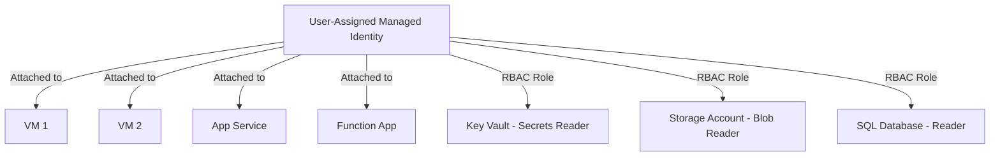

# How to Configure User-Assigned Managed Identities and Share Them Across Multiple Azure Resources

Author: [nawazdhandala](https://www.github.com/nawazdhandala)

Tags: Managed Identity, Azure, User-Assigned Identity, RBAC, Security, Authentication, Azure Resources

Description: Learn how to create user-assigned managed identities and share them across VMs, App Services, and other Azure resources for consistent credential-free authentication.

---

Azure Managed Identities eliminate the need for applications to store credentials. Instead of managing service principal secrets or certificates, your Azure resources authenticate to other services using identities managed entirely by the platform. There are two types: system-assigned (tied to a single resource) and user-assigned (created independently and shared across multiple resources).

User-assigned managed identities are particularly useful when multiple resources need the same level of access. Instead of granting RBAC roles to each resource's system-assigned identity individually, you create one user-assigned identity, grant it the necessary roles, and attach it to all the resources that need those permissions.

This guide covers creating user-assigned identities, assigning them to different resource types, and managing the RBAC configuration.

## System-Assigned vs. User-Assigned: When to Use Each

Both types provide credential-free authentication, but they serve different purposes.

**System-assigned identity:**
- Created when you enable it on a specific resource
- Lifecycle tied to the resource (deleted when the resource is deleted)
- One identity per resource
- Best for single-resource scenarios where the identity should not outlive the resource

**User-assigned identity:**
- Created as a standalone Azure resource
- Independent lifecycle (persists even if attached resources are deleted)
- Can be shared across multiple resources
- Best for multi-resource scenarios where consistent permissions are needed



The advantage is clear: one identity, one set of role assignments, shared across all resources that need the same access pattern.

## Step 1: Create the User-Assigned Managed Identity

Create the identity as a standalone resource in your resource group.

```bash
# Create a user-assigned managed identity
az identity create \
  --resource-group myResourceGroup \
  --name app-workload-identity \
  --location eastus
```

Retrieve the identity details you will need for the next steps.

```bash
# Get the identity's resource ID, client ID, and principal ID
az identity show \
  --resource-group myResourceGroup \
  --name app-workload-identity \
  --query '{resourceId: id, clientId: clientId, principalId: principalId}' \
  --output json
```

Save all three values:
- **Resource ID**: Used when attaching the identity to Azure resources
- **Client ID**: Used in application code to specify which identity to authenticate with
- **Principal ID**: Used when creating RBAC role assignments

## Step 2: Assign RBAC Roles

Grant the identity the permissions it needs. Since this identity will be shared across multiple resources, think carefully about which roles to assign.

```bash
# Get the principal ID
PRINCIPAL_ID=$(az identity show \
  --resource-group myResourceGroup \
  --name app-workload-identity \
  --query principalId -o tsv)

# Grant Key Vault Secrets User role on a specific Key Vault
az role assignment create \
  --assignee-object-id $PRINCIPAL_ID \
  --assignee-principal-type ServicePrincipal \
  --role "Key Vault Secrets User" \
  --scope "/subscriptions/YOUR_SUB/resourceGroups/myResourceGroup/providers/Microsoft.KeyVault/vaults/myKeyVault"

# Grant Storage Blob Data Reader on a storage account
az role assignment create \
  --assignee-object-id $PRINCIPAL_ID \
  --assignee-principal-type ServicePrincipal \
  --role "Storage Blob Data Reader" \
  --scope "/subscriptions/YOUR_SUB/resourceGroups/myResourceGroup/providers/Microsoft.Storage/storageAccounts/myStorageAccount"

# Grant Azure SQL Database Reader access
az role assignment create \
  --assignee-object-id $PRINCIPAL_ID \
  --assignee-principal-type ServicePrincipal \
  --role "Reader" \
  --scope "/subscriptions/YOUR_SUB/resourceGroups/myResourceGroup/providers/Microsoft.Sql/servers/myServer"
```

The key principle is least privilege. If your application only reads secrets from Key Vault, use "Key Vault Secrets User" instead of "Key Vault Administrator."

## Step 3: Attach the Identity to Virtual Machines

Assign the user-assigned identity to your VMs.

```bash
# Get the identity's resource ID
IDENTITY_ID=$(az identity show \
  --resource-group myResourceGroup \
  --name app-workload-identity \
  --query id -o tsv)

# Assign the identity to VM 1
az vm identity assign \
  --resource-group myResourceGroup \
  --name vm-1 \
  --identities $IDENTITY_ID

# Assign the identity to VM 2
az vm identity assign \
  --resource-group myResourceGroup \
  --name vm-2 \
  --identities $IDENTITY_ID

# Verify the identity is attached
az vm identity show \
  --resource-group myResourceGroup \
  --name vm-1 \
  --query 'userAssignedIdentities'
```

A VM can have multiple user-assigned identities attached simultaneously, and it can also have a system-assigned identity alongside them.

## Step 4: Attach the Identity to App Service

```bash
# Assign the identity to an App Service
az webapp identity assign \
  --resource-group myResourceGroup \
  --name myWebApp \
  --identities $IDENTITY_ID

# Verify the assignment
az webapp identity show \
  --resource-group myResourceGroup \
  --name myWebApp \
  --query 'userAssignedIdentities'
```

## Step 5: Attach the Identity to Azure Functions

```bash
# Assign the identity to a Function App
az functionapp identity assign \
  --resource-group myResourceGroup \
  --name myFunctionApp \
  --identities $IDENTITY_ID
```

## Step 6: Attach the Identity to AKS Pods

For Kubernetes workloads on AKS, you can use workload identity federation to associate the managed identity with specific pods.

```bash
# Enable workload identity on the AKS cluster
az aks update \
  --resource-group myResourceGroup \
  --name myAksCluster \
  --enable-oidc-issuer \
  --enable-workload-identity

# Create a federated identity credential linking the managed identity to a K8s service account
az identity federated-credential create \
  --name aks-federation \
  --identity-name app-workload-identity \
  --resource-group myResourceGroup \
  --issuer "$(az aks show --resource-group myResourceGroup --name myAksCluster --query oidcIssuerProfile.issuerUrl -o tsv)" \
  --subject "system:serviceaccount:default:app-service-account" \
  --audience "api://AzureADTokenExchange"
```

Then annotate your Kubernetes service account to use the managed identity.

```yaml
# kubernetes/service-account.yaml
apiVersion: v1
kind: ServiceAccount
metadata:
  name: app-service-account
  namespace: default
  annotations:
    # Link this service account to the user-assigned managed identity
    azure.workload.identity/client-id: "YOUR_CLIENT_ID"
  labels:
    azure.workload.identity/use: "true"
```

## Step 7: Use the Identity in Application Code

The Azure SDK automatically discovers and uses managed identities. The `DefaultAzureCredential` class tries multiple authentication methods in order, including managed identity.

When you have multiple user-assigned identities or want to be explicit, specify the client ID.

### Python Example

```python
# Python - authenticate with a specific user-assigned managed identity
from azure.identity import ManagedIdentityCredential
from azure.keyvault.secrets import SecretClient

# Specify the client ID of the user-assigned managed identity
# This is important when the resource has multiple identities attached
credential = ManagedIdentityCredential(
    client_id="YOUR_USER_ASSIGNED_IDENTITY_CLIENT_ID"
)

# Use the credential to access Key Vault
vault_url = "https://myKeyVault.vault.azure.net"
client = SecretClient(vault_url=vault_url, credential=credential)

# Retrieve a secret - no passwords or connection strings needed
secret = client.get_secret("database-connection-string")
print(f"Retrieved secret: {secret.name}")
```

### .NET Example

```csharp
// C# - authenticate with a specific user-assigned managed identity
using Azure.Identity;
using Azure.Security.KeyVault.Secrets;

// Specify the client ID to use a specific user-assigned identity
var credential = new ManagedIdentityCredential(
    "YOUR_USER_ASSIGNED_IDENTITY_CLIENT_ID"
);

var client = new SecretClient(
    new Uri("https://myKeyVault.vault.azure.net"),
    credential
);

// Retrieve a secret
KeyVaultSecret secret = await client.GetSecretAsync("database-connection-string");
Console.WriteLine($"Retrieved: {secret.Name}");
```

### Node.js Example

```javascript
// Node.js - authenticate with a specific user-assigned managed identity
const { ManagedIdentityCredential } = require("@azure/identity");
const { SecretClient } = require("@azure/keyvault-secrets");

// Pass the client ID for the user-assigned identity
const credential = new ManagedIdentityCredential(
  "YOUR_USER_ASSIGNED_IDENTITY_CLIENT_ID"
);

const vaultUrl = "https://myKeyVault.vault.azure.net";
const client = new SecretClient(vaultUrl, credential);

async function getSecret() {
  // No credentials stored in code or config files
  const secret = await client.getSecret("database-connection-string");
  console.log(`Retrieved: ${secret.name}`);
}

getSecret();
```

## Step 8: Configure App Service to Use the User-Assigned Identity by Default

When an App Service has both system-assigned and user-assigned identities, you need to tell the Azure SDK which one to use. Set an environment variable.

```bash
# Set the App Service app setting to specify the default managed identity client ID
az webapp config appsettings set \
  --resource-group myResourceGroup \
  --name myWebApp \
  --settings AZURE_CLIENT_ID="YOUR_USER_ASSIGNED_IDENTITY_CLIENT_ID"
```

The `DefaultAzureCredential` class checks the `AZURE_CLIENT_ID` environment variable and uses that identity when authenticating.

## Managing Identity Lifecycle

User-assigned identities persist independently of the resources they are attached to. This means you need to manage their lifecycle explicitly.

```bash
# List all user-assigned managed identities in a resource group
az identity list \
  --resource-group myResourceGroup \
  --query '[].{name: name, clientId: clientId, principalId: principalId}' \
  --output table

# Remove the identity from a specific resource
az vm identity remove \
  --resource-group myResourceGroup \
  --name vm-1 \
  --identities $IDENTITY_ID

# Delete the identity entirely (removes all role assignments too)
az identity delete \
  --resource-group myResourceGroup \
  --name app-workload-identity
```

Deleting a user-assigned identity automatically removes it from all resources it was attached to and deletes its role assignments. Be cautious with this operation in production.

## Best Practices

1. **Name identities after their purpose, not the resource.** Use names like `app-workload-identity` or `data-pipeline-identity` rather than `vm-1-identity`. This makes the shared nature clear.

2. **Scope RBAC roles tightly.** Just because an identity is shared does not mean it needs broad permissions. Assign roles at the narrowest scope possible.

3. **Document which resources use each identity.** Since the identity is shared, you need to know the full blast radius before modifying its permissions.

4. **Use separate identities for different permission sets.** If some resources need Key Vault access and others need Storage access, consider using separate identities rather than one identity with both roles.

5. **Monitor identity usage.** Use Azure Monitor and Entra ID sign-in logs to track which resources are using the identity and catch unauthorized usage.

## Wrapping Up

User-assigned managed identities simplify credential management across multi-resource architectures. Create the identity once, assign RBAC roles once, and attach it to every resource that needs the same access pattern. Your application code stays clean, there are no secrets to rotate, and permission changes propagate instantly to all attached resources. For any Azure architecture with more than a couple of resources accessing shared backend services, user-assigned identities are the clean, secure way to handle authentication.
