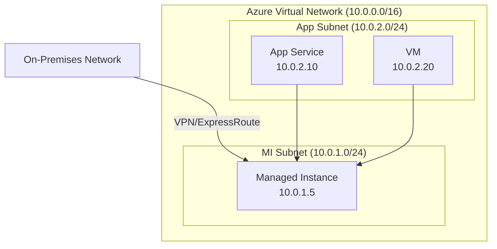

# How to Configure Virtual Network Connectivity for Azure SQL Managed Instance

Author: [nawazdhandala](https://www.github.com/nawazdhandala)

Tags: Azure SQL, Managed Instance, Virtual Network, Networking, VNet, Azure, Security

Description: Learn how to configure virtual network connectivity for Azure SQL Managed Instance, including subnet requirements, NSG rules, and route tables.

---

Azure SQL Managed Instance is deployed inside an Azure Virtual Network (VNet), making it fundamentally different from Azure SQL Database in terms of networking. While Azure SQL Database has a public endpoint that you control with firewall rules, Managed Instance lives inside your VNet as a first-class network citizen. This gives you much stronger network isolation but also requires careful network planning.

In this post, I will cover the networking requirements for Managed Instance, how to set up the VNet and subnet correctly, configure network security groups, set up route tables, and establish connectivity from on-premises networks and other Azure services.

## Networking Architecture

A Managed Instance is deployed into a dedicated subnet within your VNet. This subnet cannot contain any other resources - it is exclusively for the Managed Instance. The instance gets a private IP address from the subnet range and is accessible from within the VNet by default.



## Subnet Requirements

The subnet for Managed Instance has strict requirements:

**Minimum subnet size**: The minimum is /27 (32 addresses) for a single instance, but Microsoft strongly recommends /24 (256 addresses) or larger. This is because:
- Each Managed Instance uses several IP addresses for internal management
- If you plan to have multiple instances in the same subnet, you need more space
- Scaling operations may require additional temporary IP addresses

**Dedicated subnet**: The subnet must be delegated to `Microsoft.Sql/managedInstances` and cannot contain any other Azure resources.

**No subnet changes after deployment**: Changing the subnet after deployment is possible but involves a lengthy operation. Plan your subnet size correctly upfront.

### Creating the VNet and Subnet

```bash
# Create a VNet for the Managed Instance
az network vnet create \
    --resource-group myResourceGroup \
    --name mi-vnet \
    --address-prefix 10.0.0.0/16 \
    --location eastus

# Create a dedicated subnet for the Managed Instance
az network vnet subnet create \
    --resource-group myResourceGroup \
    --vnet-name mi-vnet \
    --name mi-subnet \
    --address-prefix 10.0.1.0/24 \
    --delegations Microsoft.Sql/managedInstances
```

### Creating Additional Subnets

You will likely need other subnets for applications that connect to the Managed Instance:

```bash
# Create a subnet for application VMs or App Service VNet integration
az network vnet subnet create \
    --resource-group myResourceGroup \
    --vnet-name mi-vnet \
    --name app-subnet \
    --address-prefix 10.0.2.0/24

# Create a subnet for a VPN gateway (if connecting to on-premises)
az network vnet subnet create \
    --resource-group myResourceGroup \
    --vnet-name mi-vnet \
    --name GatewaySubnet \
    --address-prefix 10.0.255.0/27
```

## Network Security Group (NSG) Configuration

The Managed Instance subnet requires a Network Security Group with specific rules. Azure automatically adds some required rules when you deploy the instance, but understanding them helps with troubleshooting and security audits.

### Required Inbound Rules

```bash
# Create an NSG for the Managed Instance subnet
az network nsg create \
    --resource-group myResourceGroup \
    --name mi-nsg \
    --location eastus

# Allow inbound management traffic from Azure
az network nsg rule create \
    --resource-group myResourceGroup \
    --nsg-name mi-nsg \
    --name allow-management-inbound \
    --priority 100 \
    --direction Inbound \
    --access Allow \
    --protocol Tcp \
    --source-address-prefix SqlManagement \
    --destination-port-ranges 9000 9003 1438 1440 1452 \
    --destination-address-prefix '*'

# Allow inbound health probe traffic
az network nsg rule create \
    --resource-group myResourceGroup \
    --nsg-name mi-nsg \
    --name allow-health-probe \
    --priority 200 \
    --direction Inbound \
    --access Allow \
    --protocol '*' \
    --source-address-prefix AzureLoadBalancer \
    --destination-port-ranges '*' \
    --destination-address-prefix '*'

# Allow inbound traffic from within the MI subnet
az network nsg rule create \
    --resource-group myResourceGroup \
    --nsg-name mi-nsg \
    --name allow-mi-subnet-inbound \
    --priority 300 \
    --direction Inbound \
    --access Allow \
    --protocol '*' \
    --source-address-prefix 10.0.1.0/24 \
    --destination-port-ranges '*' \
    --destination-address-prefix '*'

# Allow TDS (SQL) traffic from application subnets
az network nsg rule create \
    --resource-group myResourceGroup \
    --nsg-name mi-nsg \
    --name allow-tds-inbound \
    --priority 1000 \
    --direction Inbound \
    --access Allow \
    --protocol Tcp \
    --source-address-prefix 10.0.2.0/24 \
    --destination-port-ranges 1433 \
    --destination-address-prefix '*'
```

### Required Outbound Rules

```bash
# Allow outbound management traffic to Azure
az network nsg rule create \
    --resource-group myResourceGroup \
    --nsg-name mi-nsg \
    --name allow-management-outbound \
    --priority 100 \
    --direction Outbound \
    --access Allow \
    --protocol Tcp \
    --destination-address-prefix AzureCloud \
    --destination-port-ranges 443 12000 \
    --source-address-prefix '*'

# Allow outbound traffic within the MI subnet
az network nsg rule create \
    --resource-group myResourceGroup \
    --nsg-name mi-nsg \
    --name allow-mi-subnet-outbound \
    --priority 200 \
    --direction Outbound \
    --access Allow \
    --protocol '*' \
    --destination-address-prefix 10.0.1.0/24 \
    --destination-port-ranges '*' \
    --source-address-prefix '*'
```

### Associate NSG with the Subnet

```bash
# Associate the NSG with the Managed Instance subnet
az network vnet subnet update \
    --resource-group myResourceGroup \
    --vnet-name mi-vnet \
    --name mi-subnet \
    --network-security-group mi-nsg
```

## Route Table Configuration

Managed Instance requires a route table to ensure management traffic flows correctly.

```bash
# Create a route table for the MI subnet
az network route-table create \
    --resource-group myResourceGroup \
    --name mi-route-table \
    --location eastus

# Associate the route table with the MI subnet
az network vnet subnet update \
    --resource-group myResourceGroup \
    --vnet-name mi-vnet \
    --name mi-subnet \
    --route-table mi-route-table
```

If you have custom routes or a forced tunneling setup (all internet traffic routed through a firewall), you need to add routes that ensure management traffic can still reach Azure:

```bash
# Add a route for MI management traffic (required if using forced tunneling)
az network route-table route create \
    --resource-group myResourceGroup \
    --route-table-name mi-route-table \
    --name mi-management \
    --address-prefix SqlManagement \
    --next-hop-type Internet
```

## Connecting from On-Premises

To connect from an on-premises network to the Managed Instance, you need either a VPN Gateway or ExpressRoute.

### Site-to-Site VPN

1. Create a VPN Gateway in the GatewaySubnet.
2. Configure the on-premises VPN device.
3. Create the VPN connection.

Once the VPN is established, on-premises machines can reach the Managed Instance using its private IP address and port 1433.

### ExpressRoute

For production workloads with high bandwidth requirements, ExpressRoute provides a dedicated private connection to Azure. The Managed Instance is accessible over the ExpressRoute circuit through its private IP address.

## Connecting from Other Azure Services

### From VMs in the Same VNet

VMs in other subnets within the same VNet can connect to the Managed Instance directly using the private endpoint hostname:

```
Server=mi-instance.abc123.database.windows.net,1433
```

### From App Service with VNet Integration

Azure App Service can connect to a Managed Instance using regional VNet integration:

1. Go to your App Service in the Azure Portal.
2. Under "Networking", click "VNet integration".
3. Add VNet integration and select the VNet and a non-MI subnet (e.g., the app-subnet).
4. The App Service can now reach the Managed Instance through the VNet.

### From Other VNets (VNet Peering)

If your applications are in a different VNet, set up VNet peering:

```bash
# Peer the MI VNet with the application VNet
az network vnet peering create \
    --resource-group myResourceGroup \
    --name mi-to-app \
    --vnet-name mi-vnet \
    --remote-vnet /subscriptions/{sub-id}/resourceGroups/appRG/providers/Microsoft.Network/virtualNetworks/app-vnet \
    --allow-vnet-access

# Create the reverse peering
az network vnet peering create \
    --resource-group appRG \
    --name app-to-mi \
    --vnet-name app-vnet \
    --remote-vnet /subscriptions/{sub-id}/resourceGroups/myResourceGroup/providers/Microsoft.Network/virtualNetworks/mi-vnet \
    --allow-vnet-access
```

## Public Endpoint

By default, Managed Instance only has a private endpoint. You can optionally enable a public endpoint for scenarios where you need to connect from outside the VNet (e.g., from SSMS on your local machine during development).

```bash
# Enable the public endpoint on the Managed Instance
az sql mi update \
    --resource-group myResourceGroup \
    --name myMI \
    --public-data-endpoint-enabled true
```

When the public endpoint is enabled:
- The port is 3342 (not 1433)
- The hostname is `mi-instance.public.abc123.database.windows.net`
- You must add NSG rules to allow traffic on port 3342
- I recommend restricting the source IPs in the NSG rule to known addresses

## DNS Resolution

The Managed Instance hostname resolves to its private IP address within the VNet. If you are connecting from on-premises through VPN, you need DNS resolution to work correctly.

Options:
- Configure your on-premises DNS server to forward queries to Azure DNS
- Use Azure Private DNS zones
- Use the IP address directly (not recommended, as it can change during maintenance)

## Troubleshooting Connectivity

If you cannot connect to your Managed Instance, check these in order:

1. **NSG rules**: Verify that inbound traffic on port 1433 (private) or 3342 (public) is allowed from the source.
2. **Route table**: Ensure routes are not sending traffic to unexpected places.
3. **VNet peering**: If connecting from a peered VNet, verify that peering is in "Connected" state in both directions.
4. **DNS resolution**: Confirm the hostname resolves to the correct private IP.
5. **Firewall/NVA**: If using a network virtual appliance, ensure it allows SQL traffic through.
6. **Connection string**: Verify you are using the correct port (1433 for private, 3342 for public).

## Summary

Azure SQL Managed Instance networking requires a dedicated, properly sized subnet within a VNet, configured with the right NSG rules and route table entries. Plan your subnet size generously (/24 recommended), set up NSG rules to allow management and application traffic, and establish connectivity from on-premises using VPN or ExpressRoute. For cross-VNet connectivity, use VNet peering. Enable the public endpoint only when necessary and restrict it with NSG rules. Proper network planning upfront saves significant troubleshooting effort later.
