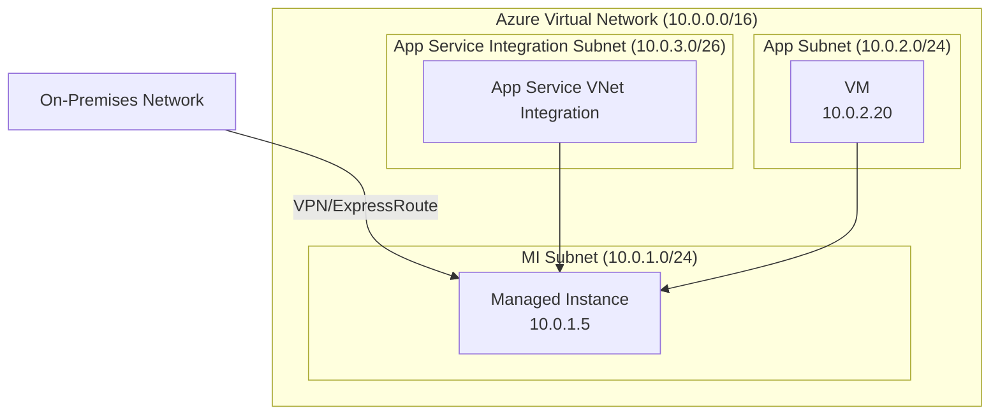

# How to Configure Virtual Network Connectivity for Azure SQL Managed Instance

Author: [nawazdhandala](https://www.github.com/nawazdhandala)

Tags: Azure SQL, Managed Instance, Virtual Network, Networking, VNet, Azure, Security

Description: Learn how to configure virtual network connectivity for Azure SQL Managed Instance, including subnet requirements, NSG rules, and route tables.

---

Azure SQL Managed Instance is deployed inside an Azure Virtual Network (VNet), making it fundamentally different from Azure SQL Database in terms of networking. While Azure SQL Database has a public endpoint that you control with firewall rules, Managed Instance lives inside your VNet as a first-class network citizen. This gives you much stronger network isolation but also requires careful network planning.

In this post, I will cover the networking requirements for Managed Instance, how to set up the VNet and subnet correctly, configure network security groups, set up route tables, and establish connectivity from on-premises networks and other Azure services.

## Networking Architecture

A Managed Instance is deployed into a dedicated subnet within your VNet. This subnet cannot contain any other resources - it is exclusively for the Managed Instance. Its VNet-local endpoint resolves to an IP address from the subnet range and is accessible from within the VNet by default.


```mermaid
graph TB
    subgraph "Azure Virtual Network (10.0.0.0/16)"
        subgraph "MI Subnet (10.0.1.0/24)"
            A[Managed Instance<br/>10.0.1.5]
        end
        subgraph "App Subnet (10.0.2.0/24)"
            C[VM<br/>10.0.2.20]
        end
        subgraph "App Service Integration Subnet (10.0.3.0/26)"
            B[App Service VNet Integration]
        end
    end
    D[On-Premises Network] -->|VPN/ExpressRoute| A
    B --> A
    C --> A
```

## Subnet Requirements

The subnet for Managed Instance has strict requirements:

**Minimum subnet size**: The minimum is /27 (32 addresses), but you should calculate the subnet size for your expected number of instances, service tiers, hardware configurations, and scaling operations. Many teams choose /24 (256 addresses) or larger for room to grow. This is because:
- Each Managed Instance uses several IP addresses for internal management
- If you plan to have multiple instances in the same subnet, you need more space
- Scaling operations may require additional temporary IP addresses

**Dedicated subnet**: The subnet must be delegated to `Microsoft.Sql/managedInstances` and cannot contain any other Azure resources.

**No subnet changes after deployment**: Changing the subnet after deployment is possible but involves a lengthy operation. Plan your subnet size correctly upfront.

### Creating the VNet and Subnet

```bash
# Create a VNet for the Managed Instance

az network vnet create \
    --resource-group myResourceGroup \
    --name mi-vnet \
    --address-prefix 10.0.0.0/16 \
    --location eastus

# Create a dedicated subnet for the Managed Instance
az network vnet subnet create \
    --resource-group myResourceGroup \
    --vnet-name mi-vnet \
    --name mi-subnet \
    --address-prefix 10.0.1.0/24 \
    --delegations Microsoft.Sql/managedInstances
```

### Creating Additional Subnets

You will likely need other subnets for applications that connect to the Managed Instance:

```bash
# Create a subnet for application VMs
az network vnet subnet create \
    --resource-group myResourceGroup \
    --vnet-name mi-vnet \
    --name app-subnet \
    --address-prefix 10.0.2.0/24

# If you use Azure App Service VNet integration, create a separate
# empty subnet delegated to App Service
az network vnet subnet create \
    --resource-group myResourceGroup \
    --vnet-name mi-vnet \
    --name app-service-integration-subnet \
    --address-prefix 10.0.3.0/26 \
    --delegations Microsoft.Web/serverFarms

# Create a subnet for a VPN gateway (if connecting to on-premises)
az network vnet subnet create \
    --resource-group myResourceGroup \
    --vnet-name mi-vnet \
    --name GatewaySubnet \
    --address-prefix 10.0.255.0/27
```

## Network Security Group (NSG) Configuration

The Managed Instance subnet requires a Network Security Group. Azure SQL Managed Instance uses service-aided subnet configuration and network intent policy to automatically add and maintain the mandatory management rules. Create your own explicit rules for the client data traffic you want to allow, and avoid editing service-managed rules that start with `Microsoft.Sql-managedInstances_UseOnly_mi-`.

### Inbound Rules

```bash
# Create an NSG for the Managed Instance subnet
az network nsg create \
    --resource-group myResourceGroup \
    --name mi-nsg \
    --location eastus

# Allow TDS (SQL) traffic from application subnets
az network nsg rule create \
    --resource-group myResourceGroup \
    --nsg-name mi-nsg \
    --name allow-tds-inbound \
    --priority 1000 \
    --direction Inbound \
    --access Allow \
    --protocol Tcp \
    --source-address-prefixes 10.0.2.0/24 \
    --destination-port-ranges 1433 \
    --destination-address-prefixes '*'
```

If the managed instance is configured for redirect connections, allow the SQL clients and any network appliances in the path to reach the entire Managed Instance subnet range on port 1433. Older guidance also opened ports 11000-11999 for redirect; current Azure SQL Managed Instance connection-type guidance lists port 1433 as the client connectivity requirement.

### Outbound Rules

The service adds and enforces the mandatory outbound rules it needs for management and internal node connectivity. Add custom outbound rules only if your security baseline restricts outbound traffic from the subnet.

### Associate NSG with the Subnet

```bash
# Associate the NSG with the Managed Instance subnet
az network vnet subnet update \
    --resource-group myResourceGroup \
    --vnet-name mi-vnet \
    --name mi-subnet \
    --network-security-group mi-nsg
```

## Route Table Configuration

Managed Instance requires a route table. Azure SQL Managed Instance automatically provisions and manages the route entries it requires for management and internal connectivity.

```bash
# Create a route table for the MI subnet
az network route-table create \
    --resource-group myResourceGroup \
    --name mi-route-table \
    --location eastus

# Associate the route table with the MI subnet
az network vnet subnet update \
    --resource-group myResourceGroup \
    --vnet-name mi-vnet \
    --name mi-subnet \
    --route-table mi-route-table
```

If you have custom routes or a forced tunneling setup (all internet traffic routed through a firewall), make sure you do not remove or override the service-managed routes that start with `Microsoft.Sql-managedInstances_UseOnly_mi-`. Add your own routes only for your application traffic, on-premises networks, or public endpoint return paths.

```bash
# Example: route on-premises address space through a virtual network gateway
az network route-table route create \
    --resource-group myResourceGroup \
    --route-table-name mi-route-table \
    --name on-premises \
    --address-prefix 172.16.0.0/12 \
    --next-hop-type VirtualNetworkGateway
```

## Connecting from On-Premises

To connect from an on-premises network to the Managed Instance, you need either a VPN Gateway or ExpressRoute.

### Site-to-Site VPN

1. Create a VPN Gateway in the GatewaySubnet.
2. Configure the on-premises VPN device.
3. Create the VPN connection.

Once the VPN is established, on-premises machines can reach the Managed Instance using its VNet-local fully qualified domain name and port 1433.

### ExpressRoute

For production workloads with high bandwidth requirements, ExpressRoute provides a dedicated private connection to Azure. The Managed Instance is accessible over the ExpressRoute circuit through its VNet-local fully qualified domain name.

## Connecting from Other Azure Services

### From VMs in the Same VNet

VMs in other subnets within the same VNet can connect to the Managed Instance directly using the VNet-local endpoint hostname:

```text
Server=mi-instance.abc123.database.windows.net,1433
```

### From App Service with VNet Integration

Azure App Service can connect to a Managed Instance using regional VNet integration:

1. Go to your App Service in the Azure Portal.
2. Under "Networking", click "VNet integration".
3. Add VNet integration and select the VNet and an empty, non-MI subnet delegated to `Microsoft.Web/serverFarms` (e.g., the app-service-integration-subnet).
4. The App Service can now reach the Managed Instance through the VNet.

### From Other VNets (VNet Peering)

If your applications are in a different VNet, set up VNet peering:

```bash
# Peer the MI VNet with the application VNet
az network vnet peering create \
    --resource-group myResourceGroup \
    --name mi-to-app \
    --vnet-name mi-vnet \
    --remote-vnet /subscriptions/{sub-id}/resourceGroups/appRG/providers/Microsoft.Network/virtualNetworks/app-vnet \
    --allow-vnet-access

# Create the reverse peering
az network vnet peering create \
    --resource-group appRG \
    --name app-to-mi \
    --vnet-name app-vnet \
    --remote-vnet /subscriptions/{sub-id}/resourceGroups/myResourceGroup/providers/Microsoft.Network/virtualNetworks/mi-vnet \
    --allow-vnet-access
```

## Public Endpoint

By default, Managed Instance exposes a VNet-local endpoint only. You can optionally enable a public endpoint for scenarios where you need to connect from outside the VNet (e.g., from SSMS on your local machine during development).

```bash
# Enable the public endpoint on the Managed Instance
az sql mi update \
    --resource-group myResourceGroup \
    --name myMI \
    --public-data-endpoint-enabled true
```

When the public endpoint is enabled:
- The port is 3342 (not 1433)
- The hostname is `mi-instance.public.abc123.database.windows.net`
- You must add NSG rules to allow traffic on port 3342
- If you use a route table with a default route through an appliance, make sure public endpoint return traffic is routed back to the internet
- I recommend restricting the source IPs in the NSG rule to known addresses

## DNS Resolution

The Managed Instance VNet-local hostname resolves to an IP address from the Managed Instance subnet. The hostname is publicly resolvable, but the private address is reachable only through the VNet, a peered VNet, VPN, or ExpressRoute. If you are connecting from on-premises through VPN, you need DNS resolution to work correctly.

Options:
- Use Azure DNS as-is if your clients can resolve the public `database.windows.net` name and route to the returned private address
- Use Azure DNS Private Resolver or a DNS forwarder VM when you need hybrid DNS forwarding for private DNS zones
- Avoid using the IP address directly, as it can change during maintenance

## Troubleshooting Connectivity

If you cannot connect to your Managed Instance, check these in order:

1. **NSG rules**: Verify that inbound traffic on port 1433 (private) or 3342 (public) is allowed from the source.
2. **Route table**: Ensure routes are not sending traffic to unexpected places.
3. **VNet peering**: If connecting from a peered VNet, verify that peering is in "Connected" state in both directions.
4. **DNS resolution**: Confirm the hostname resolves to an IP address in the Managed Instance subnet.
5. **Firewall/NVA**: If using a network virtual appliance, ensure it allows SQL traffic through.
6. **Connection string**: Verify you are using the correct port (1433 for private, 3342 for public).

## Summary

Azure SQL Managed Instance networking requires a dedicated, properly sized subnet within a VNet, configured with an NSG and route table. Plan your subnet size generously, let service-aided subnet configuration manage the required management rules and routes, set up NSG rules to allow application traffic, and establish connectivity from on-premises using VPN or ExpressRoute. For cross-VNet connectivity, use VNet peering. Enable the public endpoint only when necessary and restrict it with NSG rules. Proper network planning upfront saves significant troubleshooting effort later.
