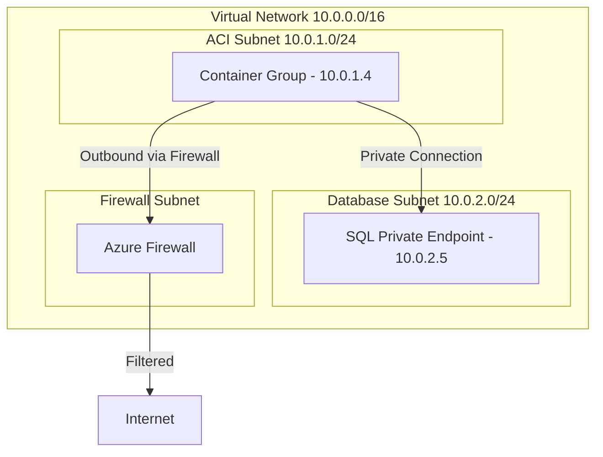

# How to Configure Virtual Network Deployment for Azure Container Instances

Author: [nawazdhandala](https://www.github.com/nawazdhandala)

Tags: Azure, Container Instances, Virtual Network, VNet, Networking, Security, Cloud Computing

Description: How to deploy Azure Container Instances into a virtual network for private networking, secure communication with other Azure services, and network isolation.

---

By default, Azure Container Instances get a public IP address and are accessible from the internet. That works for public-facing services, but many workloads need to run in a private network - backend processors, internal APIs, or containers that need to communicate with databases and other services that should not be exposed publicly.

Deploying ACI into a Virtual Network (VNet) gives your containers a private IP address within your network, allowing them to communicate with other Azure resources securely and keeping them off the public internet.

## Why Deploy ACI into a VNet?

There are several reasons to use VNet-integrated ACI:

- **Private access only** - The container group gets a private IP address. No public internet access to the container.
- **Secure communication** - Containers can talk to other resources in the VNet (VMs, databases, other services) using private IPs.
- **Network security groups** - Apply NSG rules to control traffic to and from the containers.
- **On-premises connectivity** - Access on-premises resources through VPN Gateway or ExpressRoute.
- **DNS resolution** - Use Azure Private DNS zones for name resolution within the VNet.

## Prerequisites

- An Azure Virtual Network with a dedicated subnet for ACI
- The subnet must be delegated to `Microsoft.ContainerInstance/containerGroups`
- Azure CLI installed

## Step 1: Create the Virtual Network and Subnet

The ACI subnet needs to be delegated exclusively to container instances. No other resources can be deployed in this subnet.

```bash
# Create a resource group
az group create \
    --name my-resource-group \
    --location eastus

# Create a virtual network
az network vnet create \
    --resource-group my-resource-group \
    --name my-vnet \
    --address-prefix 10.0.0.0/16 \
    --subnet-name aci-subnet \
    --subnet-prefix 10.0.1.0/24

# Delegate the subnet to Azure Container Instances
az network vnet subnet update \
    --resource-group my-resource-group \
    --vnet-name my-vnet \
    --name aci-subnet \
    --delegations Microsoft.ContainerInstance/containerGroups
```

The delegation tells Azure that this subnet is reserved for container instances. When you try to deploy other resources to this subnet, Azure will reject them.

## Step 2: Deploy a Container into the VNet

### Using Azure CLI

```bash
# Deploy a container into the VNet subnet
az container create \
    --resource-group my-resource-group \
    --name my-private-container \
    --image nginx:latest \
    --cpu 1 \
    --memory 1.5 \
    --vnet my-vnet \
    --subnet aci-subnet \
    --ports 80

# Check the private IP address
az container show \
    --resource-group my-resource-group \
    --name my-private-container \
    --query "ipAddress.ip" \
    --output tsv
```

Note that when deploying to a VNet, you do not specify `--ip-address Public`. The container gets a private IP within the subnet range.

### Using YAML

For more detailed configuration:

```yaml
# vnet-container.yaml - Container deployed into a VNet
apiVersion: '2021-09-01'
location: eastus
name: my-private-container
properties:
  containers:
    - name: web-api
      properties:
        image: myregistry.azurecr.io/api:latest
        resources:
          requests:
            cpu: 2.0
            memoryInGb: 4.0
        ports:
          - port: 8080
            protocol: TCP
        environmentVariables:
          - name: DB_HOST
            value: '10.0.2.5'
          - name: DB_PASSWORD
            secureValue: 'your-db-password'
  osType: Linux
  ipAddress:
    type: Private
    ports:
      - port: 8080
        protocol: TCP
  # Reference the subnet by its resource ID
  subnetIds:
    - id: /subscriptions/<subscription-id>/resourceGroups/my-resource-group/providers/Microsoft.Network/virtualNetworks/my-vnet/subnets/aci-subnet
  restartPolicy: Always
type: Microsoft.ContainerInstance/containerGroups
```

Deploy it:

```bash
az container create \
    --resource-group my-resource-group \
    --file vnet-container.yaml
```

## Step 3: Configure Network Security Groups

Apply a Network Security Group (NSG) to the ACI subnet to control traffic flow:

```bash
# Create an NSG
az network nsg create \
    --resource-group my-resource-group \
    --name aci-nsg

# Allow inbound traffic on port 8080 from the VNet
az network nsg rule create \
    --resource-group my-resource-group \
    --nsg-name aci-nsg \
    --name AllowVNetInbound \
    --priority 100 \
    --direction Inbound \
    --access Allow \
    --protocol TCP \
    --source-address-prefixes VirtualNetwork \
    --destination-port-ranges 8080

# Deny all other inbound traffic
az network nsg rule create \
    --resource-group my-resource-group \
    --nsg-name aci-nsg \
    --name DenyAllInbound \
    --priority 200 \
    --direction Inbound \
    --access Deny \
    --protocol '*' \
    --source-address-prefixes '*' \
    --destination-port-ranges '*'

# Associate the NSG with the ACI subnet
az network vnet subnet update \
    --resource-group my-resource-group \
    --vnet-name my-vnet \
    --name aci-subnet \
    --network-security-group aci-nsg
```

## Communicating with Other Azure Resources

Once your container is in a VNet, it can communicate with other resources in the same VNet or peered VNets using private IP addresses.

### Connecting to a Database

If you have an Azure SQL Database with a private endpoint in the same VNet:

```yaml
# The container can connect to the database using its private IP
environmentVariables:
  - name: DB_CONNECTION
    secureValue: 'Server=10.0.2.5;Database=mydb;User Id=admin;Password=secret;'
```

### Connecting to Azure Services via Private Endpoints

Many Azure services support Private Endpoints, which place a network interface in your VNet:

```bash
# Create a private endpoint for Azure Storage in your VNet
az network private-endpoint create \
    --resource-group my-resource-group \
    --name storage-private-endpoint \
    --vnet-name my-vnet \
    --subnet services-subnet \
    --private-connection-resource-id "/subscriptions/{sub}/resourceGroups/{rg}/providers/Microsoft.Storage/storageAccounts/{account}" \
    --group-id blob \
    --connection-name storage-connection
```

Your container can then access the storage account through the private endpoint without going over the public internet.

## DNS Configuration

By default, VNet-deployed containers use Azure-provided DNS. For resolving private endpoint hostnames and custom DNS names, configure a private DNS zone:

```bash
# Create a private DNS zone
az network private-dns zone create \
    --resource-group my-resource-group \
    --name privatelink.database.windows.net

# Link the DNS zone to your VNet
az network private-dns zone link vnet create \
    --resource-group my-resource-group \
    --zone-name privatelink.database.windows.net \
    --name dns-link \
    --virtual-network my-vnet \
    --registration-enabled false

# Add a DNS record for your database's private endpoint
az network private-dns record-set a add-record \
    --resource-group my-resource-group \
    --zone-name privatelink.database.windows.net \
    --record-set-name mydb \
    --ipv4-address 10.0.2.5
```

Now your container can connect to `mydb.privatelink.database.windows.net` and it resolves to the private IP.

## Outbound Internet Access

VNet-deployed containers can still make outbound connections to the internet by default. The outbound traffic goes through the VNet's default route. If you need to control outbound traffic:

### Using a NAT Gateway

```bash
# Create a NAT gateway for predictable outbound IPs
az network nat gateway create \
    --resource-group my-resource-group \
    --name aci-nat-gateway \
    --location eastus

# Create a public IP for the NAT gateway
az network public-ip create \
    --resource-group my-resource-group \
    --name nat-public-ip \
    --sku Standard \
    --allocation-method Static

# Associate the public IP with the NAT gateway
az network nat gateway update \
    --resource-group my-resource-group \
    --name aci-nat-gateway \
    --public-ip-addresses nat-public-ip

# Associate the NAT gateway with the ACI subnet
az network vnet subnet update \
    --resource-group my-resource-group \
    --vnet-name my-vnet \
    --name aci-subnet \
    --nat-gateway aci-nat-gateway
```

This gives your containers a static outbound IP, which is useful when you need to whitelist your IP address with external services.

### Using a Firewall

For more control, route outbound traffic through Azure Firewall using a route table:

```bash
# Create a route table
az network route-table create \
    --resource-group my-resource-group \
    --name aci-routes

# Add a route that sends all traffic to the firewall
az network route-table route create \
    --resource-group my-resource-group \
    --route-table-name aci-routes \
    --name default-route \
    --address-prefix 0.0.0.0/0 \
    --next-hop-type VirtualAppliance \
    --next-hop-ip-address 10.0.3.4

# Associate the route table with the ACI subnet
az network vnet subnet update \
    --resource-group my-resource-group \
    --vnet-name my-vnet \
    --name aci-subnet \
    --route-table aci-routes
```

## Architecture Diagram

Here is a typical architecture with VNet-deployed ACI:



## Limitations

A few things to keep in mind:

- VNet deployment is only supported for Linux containers
- Windows containers are not supported for VNet deployment
- The ACI subnet requires delegation and cannot contain other resource types
- VNet-deployed containers do not support public IP addresses
- Some regions may have limited availability for VNet deployment

## Summary

Deploying Azure Container Instances into a virtual network gives you the security and isolation benefits of private networking while keeping the simplicity of serverless containers. It is the right choice when your containers need to communicate with backend services, databases, or on-premises resources without exposure to the public internet. Set up the dedicated subnet, delegate it to ACI, and your containers get private IPs that integrate seamlessly with the rest of your Azure network infrastructure.
