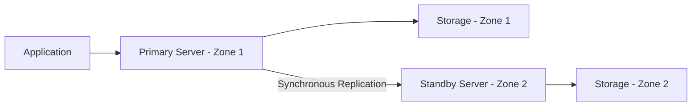

# How to Configure Zone-Redundant High Availability for Azure Database for MySQL

Author: [nawazdhandala](https://www.github.com/nawazdhandala)

Tags: Azure, MySQL, High Availability, Zone Redundant, Flexible Server, Disaster Recovery, Cloud Database

Description: Learn how to configure zone-redundant high availability for Azure Database for MySQL Flexible Server to protect against zone-level failures.

---

When you are running MySQL in production on Azure, you need to think about what happens when things go wrong. Hardware fails, racks lose power, and sometimes entire availability zones go offline. Zone-redundant high availability (HA) for Azure Database for MySQL Flexible Server gives you automatic failover protection against these scenarios. The standby replica lives in a different availability zone, so even a full zone outage will not take your database offline.

In this post, I will explain how zone-redundant HA works, walk through the setup, and share some operational lessons that might save you headaches down the road.

## How Zone-Redundant HA Works

When you enable zone-redundant HA, Azure deploys two copies of your MySQL server in different availability zones within the same region. One is the primary and the other is the standby. Here is what the architecture looks like at a high level:



The key points:

- Data is replicated synchronously between the primary and standby.
- The standby server is not accessible for reads or connections. It sits idle, waiting for a failover.
- Failover is automatic. Azure detects the failure and promotes the standby.
- After failover, a new standby is automatically provisioned.

The synchronous replication means no data loss during failover - your committed transactions are safe. The trade-off is slightly higher write latency because each commit must be acknowledged by both zones.

## Same-Zone HA vs. Zone-Redundant HA

Azure offers two flavors of HA for Flexible Server:

| Feature | Same-Zone HA | Zone-Redundant HA |
|---------|-------------|-------------------|
| Standby location | Same availability zone | Different availability zone |
| Protects against | Server/hardware failure | Server, hardware, and zone failure |
| Failover time | 60-120 seconds | 60-120 seconds |
| Write latency impact | Minimal | Slightly higher (cross-zone) |
| Cost | ~2x compute | ~2x compute |

If your region supports availability zones and your workload is business-critical, zone-redundant HA is the better choice. Same-zone HA is a reasonable option when zone-level protection is not required or the region does not support zones.

## Prerequisites

Before enabling zone-redundant HA:

- Your server must be on General Purpose or Memory Optimized tier. Burstable tier does not support HA.
- The region must support availability zones.
- You need at least two availability zones in the region.
- Your application should use retry logic for connections, since failover takes 60-120 seconds.

## Enabling HA During Server Creation

The easiest way to set up HA is during server creation. If you are using the Azure CLI:

```bash
# Create a MySQL Flexible Server with zone-redundant HA
az mysql flexible-server create \
  --resource-group myResourceGroup \
  --name my-ha-mysql-server \
  --location eastus \
  --admin-user myadmin \
  --admin-password 'StrongPassword123!' \
  --sku-name Standard_D4ds_v4 \
  --tier GeneralPurpose \
  --version 8.0.21 \
  --storage-size 128 \
  --high-availability ZoneRedundant \
  --zone 1 \
  --standby-zone 3
```

The `--zone` flag specifies where the primary runs, and `--standby-zone` specifies where the standby lives. Pick zones that make sense for your region.

In the Azure portal, you configure HA on the "High Availability" tab during creation. Select "Zone redundant" and choose your preferred zones.

## Enabling HA on an Existing Server

If you already have a Flexible Server running without HA, you can enable it:

```bash
# Enable zone-redundant HA on an existing server
az mysql flexible-server update \
  --resource-group myResourceGroup \
  --name my-existing-mysql-server \
  --high-availability ZoneRedundant \
  --standby-zone 2
```

This operation takes several minutes. Azure provisions the standby server and sets up synchronous replication. During this process, there may be a brief interruption, so plan accordingly.

In the portal, go to your server, click "High availability" in the left menu under Settings, check "Zone redundant," select the standby zone, and click Save.

## Monitoring HA Status

After enabling HA, you should verify everything is healthy. Use the CLI:

```bash
# Check the HA state and zone information
az mysql flexible-server show \
  --resource-group myResourceGroup \
  --name my-ha-mysql-server \
  --query "{haState:highAvailability.state, haMode:highAvailability.mode, zone:availabilityZone, standbyZone:highAvailability.standbyAvailabilityZone}"
```

You should see the state as "Healthy" and the mode as "ZoneRedundant." If the state shows "NotEnabled" or "CreatingStandby," give it more time.

In Azure Monitor, you can set up alerts on the HA health metric:

```bash
# Create an alert rule for HA failover events
az monitor metrics alert create \
  --name mysql-ha-failover-alert \
  --resource-group myResourceGroup \
  --scopes "/subscriptions/{sub-id}/resourceGroups/myResourceGroup/providers/Microsoft.DBforMySQL/flexibleServers/my-ha-mysql-server" \
  --condition "total HADRHealthStatus < 1" \
  --description "Alert when HA health degrades" \
  --action-group myActionGroup
```

## What Happens During Failover

When the primary server fails, here is the sequence of events:

1. Azure detects the failure (typically within seconds).
2. The standby server is promoted to primary.
3. DNS records are updated to point to the new primary.
4. Your application connections using the server FQDN automatically route to the new primary.
5. A new standby is provisioned in the background.

The total failover time is usually 60-120 seconds. During this window, connections will fail. Your application needs to handle this gracefully.

## Application-Side Considerations

HA at the database layer is only half the story. Your application needs to be ready for failovers too.

### Connection Retry Logic

Implement exponential backoff retry logic in your application. Here is a Python example:

```python
import mysql.connector
import time

def get_connection(max_retries=5):
    """
    Attempt to connect to MySQL with exponential backoff.
    This handles brief outages during HA failover events.
    """
    retries = 0
    while retries < max_retries:
        try:
            conn = mysql.connector.connect(
                host="my-ha-mysql-server.mysql.database.azure.com",
                user="myadmin",
                password="StrongPassword123!",
                database="myapp",
                ssl_ca="/path/to/DigiCertGlobalRootCA.crt.pem",
                connection_timeout=10
            )
            return conn
        except mysql.connector.Error as err:
            retries += 1
            wait_time = min(2 ** retries, 30)  # Cap at 30 seconds
            print(f"Connection failed: {err}. Retrying in {wait_time}s...")
            time.sleep(wait_time)
    raise Exception("Failed to connect after maximum retries")
```

### Connection Pooling

Use a connection pool that can detect and replace dead connections:

```python
from mysql.connector import pooling

# Create a connection pool that handles stale connections
pool = pooling.MySQLConnectionPool(
    pool_name="myapp_pool",
    pool_size=10,
    pool_reset_session=True,  # Reset session state on reuse
    host="my-ha-mysql-server.mysql.database.azure.com",
    user="appuser",
    password="AppPassword456!",
    database="myapp",
    ssl_ca="/path/to/DigiCertGlobalRootCA.crt.pem"
)
```

### DNS Caching

Make sure your application does not cache DNS results aggressively. During failover, the DNS record for your server changes. If your app caches the old IP, it will keep trying to connect to the failed primary.

In Java, set the DNS TTL to a low value:

```java
// Set DNS cache TTL to 30 seconds in your application startup
java.security.Security.setProperty("networkaddress.cache.ttl", "30");
```

## Testing Failover

You should test failover before you need it in production. Azure lets you trigger a planned failover:

```bash
# Trigger a planned failover for testing
az mysql flexible-server restart \
  --resource-group myResourceGroup \
  --name my-ha-mysql-server \
  --failover Planned
```

During a planned failover, the standby takes over and the old primary becomes the new standby. Time the failover and observe how your application handles it. Ideally, run this test during a maintenance window.

You can also trigger a forced failover to simulate an unplanned outage:

```bash
# Trigger a forced (unplanned) failover for testing
az mysql flexible-server restart \
  --resource-group myResourceGroup \
  --name my-ha-mysql-server \
  --failover Forced
```

Forced failover is more realistic but slightly riskier. Use it in staging first.

## Cost Implications

Zone-redundant HA roughly doubles your compute cost because you are running two servers. Storage costs do not double since the standby uses the same storage mechanism.

For a Standard_D4ds_v4 server (4 vCores, 16 GB RAM):

- Without HA: ~$250/month (compute only)
- With zone-redundant HA: ~$500/month (compute only)

If the doubling feels steep, consider whether your business can absorb 60+ minutes of downtime during a zone failure. For most production workloads, the answer is no, and the HA cost is justified.

## Common Issues and Troubleshooting

**HA state stuck in "CreatingStandby"**: This usually resolves on its own within 30 minutes. If it persists, check the Azure service health dashboard for regional issues.

**Frequent unplanned failovers**: This can indicate resource pressure on the primary. Check CPU and memory utilization. You might need to scale up.

**Application downtime longer than expected**: Check your DNS caching settings and connection retry logic. The database failover itself is fast, but application recovery depends on how quickly your code reconnects.

**Cannot enable HA**: Make sure you are on General Purpose or Memory Optimized tier. Burstable tier does not support HA.

## Summary

Zone-redundant HA for Azure Database for MySQL Flexible Server is a straightforward way to protect your database against zone-level failures. The setup is simple - a few clicks in the portal or a CLI flag during server creation. The real work is on the application side: retry logic, connection pooling, and DNS handling. Test your failover before you need it, and monitor the HA health metrics so you are never caught off guard.
