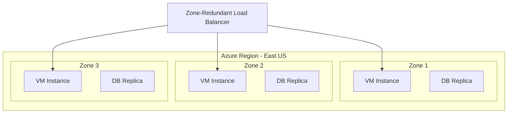

# How to Configure Zone-Redundant Services in Azure for 99.99% Availability

Author: [nawazdhandala](https://www.github.com/nawazdhandala)

Tags: Azure, Availability Zones, Zone Redundancy, High Availability, SLA, Resilience, Cloud Architecture

Description: Configure zone-redundant deployments across Azure services to achieve 99.99% availability SLAs and protect against datacenter failures.

---

Azure Availability Zones are physically separate locations within an Azure region. Each zone has independent power, cooling, and networking. When you deploy services across multiple zones, you protect your application against the failure of an entire datacenter. Many Azure services offer a zone-redundant option that automatically distributes resources across zones, giving you a 99.99% availability SLA instead of the standard 99.95%.

In this post, I will show you how to configure zone redundancy for the most commonly used Azure services.

## What Are Availability Zones

Each Azure region that supports availability zones has at least three independent zones. They are close enough for low-latency communication (under 2ms round-trip) but far enough apart that a localized disaster (fire, flood, power failure) only affects one zone.



There are two deployment models:

- **Zonal** - you pin a resource to a specific zone. If that zone fails, the resource is unavailable.
- **Zone-redundant** - the service automatically distributes across all zones. If one zone fails, the remaining zones continue serving traffic.

Always prefer zone-redundant deployments for production workloads.

## Zone-Redundant App Service

Azure App Service Premium v3 and Isolated v2 plans support zone redundancy. You need at least 3 instances for the service to distribute across all zones:

```bash
# Create a zone-redundant App Service plan
# Minimum 3 instances required for zone redundancy
az appservice plan create \
  --resource-group prod-rg \
  --name my-app-plan \
  --sku P1V3 \
  --location eastus \
  --zone-redundant true \
  --number-of-workers 3

# Deploy your web app on the zone-redundant plan
az webapp create \
  --resource-group prod-rg \
  --plan my-app-plan \
  --name myapp-prod \
  --runtime "DOTNET:8.0"
```

With zone redundancy enabled, Azure distributes the 3 instances across 3 zones. If Zone 1 goes down, the instances in Zones 2 and 3 continue handling requests.

## Zone-Redundant Azure SQL Database

Azure SQL Database offers zone-redundant configuration at the Premium, Business Critical, and Hyperscale tiers:

```bash
# Create a zone-redundant Azure SQL database
az sql db create \
  --resource-group prod-rg \
  --server my-sql-server \
  --name my-database \
  --edition BusinessCritical \
  --capacity 4 \
  --zone-redundant true \
  --backup-storage-redundancy Zone

# For existing databases, enable zone redundancy
az sql db update \
  --resource-group prod-rg \
  --server my-sql-server \
  --name my-database \
  --zone-redundant true
```

In the Business Critical tier, zone redundancy means the primary replica and its read replicas are spread across zones. Even if a zone fails, the database promotes a replica in another zone and continues operating within seconds.

## Zone-Redundant Azure Kubernetes Service

AKS supports availability zones for both the control plane and node pools:

```bash
# Create an AKS cluster with zone-redundant nodes
az aks create \
  --resource-group prod-rg \
  --name my-aks-cluster \
  --node-count 3 \
  --zones 1 2 3 \
  --node-vm-size Standard_D4s_v3 \
  --location eastus \
  --enable-managed-identity

# Add a zone-redundant user node pool
az aks nodepool add \
  --resource-group prod-rg \
  --cluster-name my-aks-cluster \
  --name apppool \
  --node-count 6 \
  --zones 1 2 3 \
  --node-vm-size Standard_D8s_v3
```

When you specify zones 1 2 3, AKS distributes nodes evenly across all three zones. Configure pod topology spread constraints to ensure your pods are also evenly distributed:

```yaml
# Pod topology spread constraint for zone distribution
apiVersion: apps/v1
kind: Deployment
metadata:
  name: order-service
spec:
  replicas: 6
  selector:
    matchLabels:
      app: order-service
  template:
    metadata:
      labels:
        app: order-service
    spec:
      # Ensure pods are spread across availability zones
      topologySpreadConstraints:
        - maxSkew: 1
          topologyKey: topology.kubernetes.io/zone
          whenUnsatisfiable: DoNotSchedule
          labelSelector:
            matchLabels:
              app: order-service
      containers:
        - name: order-service
          image: myacr.azurecr.io/order-service:v1.0
          resources:
            requests:
              cpu: "500m"
              memory: "512Mi"
```

## Zone-Redundant Azure Cache for Redis

Redis Enterprise and Premium tiers support zone redundancy:

```bash
# Create a zone-redundant Redis cache
az redis create \
  --resource-group prod-rg \
  --name myapp-cache \
  --location eastus \
  --sku Premium \
  --vm-size P1 \
  --zones 1 2 3 \
  --replicas-per-master 1
```

This deploys the primary node in one zone and replicas in other zones. If the zone hosting the primary fails, Redis promotes a replica in another zone.

## Zone-Redundant Storage

Azure Storage supports zone-redundant storage (ZRS) that replicates your data across three availability zones:

```bash
# Create a storage account with zone-redundant replication
az storage account create \
  --resource-group prod-rg \
  --name mystorageaccount \
  --location eastus \
  --sku Standard_ZRS \
  --kind StorageV2

# For even higher durability, use GZRS (geo-zone-redundant)
# Replicates across zones locally AND to a secondary region
az storage account create \
  --resource-group prod-rg \
  --name mycriticalstorage \
  --location eastus \
  --sku Standard_GZRS \
  --kind StorageV2
```

| Replication Type | Copies | Zones | Regions | Durability |
|-----------------|--------|-------|---------|------------|
| LRS | 3 | 1 | 1 | 99.999999999% |
| ZRS | 3 | 3 | 1 | 99.9999999999% |
| GRS | 6 | 1 | 2 | 99.99999999999999% |
| GZRS | 6 | 3 | 2 | 99.99999999999999% |

## Zone-Redundant Load Balancer

Azure Standard Load Balancer supports zone-redundant frontends:

```bash
# Create a zone-redundant public IP
az network public-ip create \
  --resource-group prod-rg \
  --name lb-public-ip \
  --sku Standard \
  --zone 1 2 3

# Create a load balancer with the zone-redundant IP
az network lb create \
  --resource-group prod-rg \
  --name my-load-balancer \
  --sku Standard \
  --public-ip-address lb-public-ip \
  --frontend-ip-name myFrontend \
  --backend-pool-name myBackendPool
```

A zone-redundant frontend IP survives any single zone failure. Traffic is still distributed to healthy backends in the remaining zones.

## Zone-Redundant VPN and ExpressRoute Gateways

Network gateways should also be zone-redundant for production:

```bash
# Create zone-redundant public IPs for the gateway
az network public-ip create \
  --resource-group prod-rg \
  --name vpn-gw-pip \
  --sku Standard \
  --zone 1 2 3

# Create the VPN gateway with a zone-redundant SKU
# SKUs ending in 'AZ' are zone-redundant
az network vnet-gateway create \
  --resource-group prod-rg \
  --name my-vpn-gateway \
  --vnet hub-vnet \
  --public-ip-addresses vpn-gw-pip \
  --gateway-type Vpn \
  --vpn-type RouteBased \
  --sku VpnGw2AZ
```

## Zone-Redundant Azure Service Bus

Service Bus Premium tier supports zone redundancy:

```bash
# Create a zone-redundant Service Bus namespace
az servicebus namespace create \
  --resource-group prod-rg \
  --name my-service-bus \
  --location eastus \
  --sku Premium \
  --capacity 1 \
  --zone-redundant true
```

## Putting It All Together

Here is a checklist for a fully zone-redundant deployment:

1. App Service Plan - Premium v3 with zone-redundant flag and minimum 3 instances
2. Azure SQL Database - Business Critical tier with zone-redundant enabled
3. Azure Cache for Redis - Premium tier deployed across zones 1, 2, 3
4. Azure Storage - ZRS or GZRS replication
5. Load Balancer - Standard SKU with zone-redundant frontend IP
6. VPN/ExpressRoute Gateway - AZ SKU
7. AKS - Node pools spanning zones 1, 2, 3 with topology spread constraints
8. Service Bus - Premium tier with zone redundancy

## Cost Impact

Zone redundancy is not free. Some services charge more for zone-redundant configurations:

- **App Service** - same price, but you need minimum 3 instances
- **Azure SQL** - zone redundancy is included in Business Critical tier pricing
- **Redis** - same price per node, but you may want more replicas
- **Storage** - ZRS costs about 20% more than LRS
- **AKS** - same price per node, but more nodes across zones

The total cost increase is typically 20-40% compared to a single-zone deployment, but you get a 99.99% SLA and protection against datacenter-level failures.

## Summary

Configuring zone redundancy across your Azure services is one of the most impactful things you can do for availability. It protects against datacenter failures with minimal architectural complexity - you do not need to manage replication or failover yourself. The key is to ensure every layer of your stack is zone-redundant, because a single non-redundant component becomes the bottleneck for your overall availability. Check each service, enable zone redundancy where available, and verify your SLA targets are met across the entire stack.
