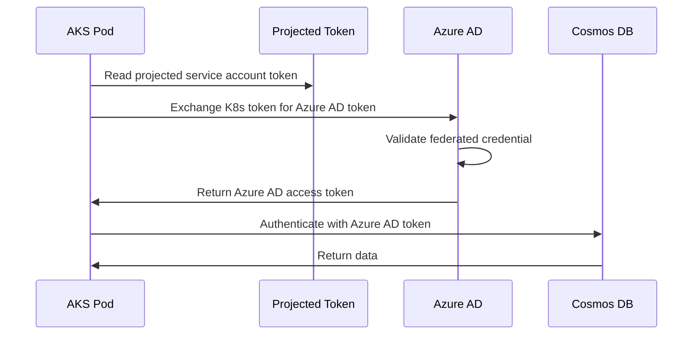

# How to Connect AKS Pods to Azure Cosmos DB Using Workload Identity Authentication

Author: [nawazdhandala](https://www.github.com/nawazdhandala)

Tags: AKS, Cosmos DB, Workload Identity, Azure, Authentication, Kubernetes, Security

Description: Learn how to securely connect AKS pods to Azure Cosmos DB using workload identity federation instead of storing connection strings in secrets.

---

Hardcoding database connection strings in Kubernetes secrets is one of those things that works fine until it becomes a security nightmare. Secrets need rotation, they can be accidentally exposed, and anyone with access to the namespace can read them. Workload identity federation solves this by letting your AKS pods authenticate to Azure services using Azure AD tokens - no secrets to manage, no credentials to rotate. In this guide, I will show you how to connect your AKS pods to Azure Cosmos DB using workload identity, removing the need for connection strings entirely.

## How Workload Identity Works

AKS workload identity builds on Kubernetes service account token volume projection and Azure AD federated credentials. Here is the flow:

1. Your pod runs with a specific Kubernetes service account
2. Kubernetes projects a signed token into the pod
3. The Azure Identity SDK in your app exchanges that token for an Azure AD token
4. The Azure AD token is used to authenticate to Cosmos DB

No shared secrets, no connection strings, no credential rotation headaches. The trust is established through a federated credential that links a Kubernetes service account to an Azure AD managed identity.

## Prerequisites

You need an AKS cluster with OIDC issuer and workload identity enabled, an Azure Cosmos DB account, and Azure CLI 2.47 or later. If your cluster was not created with these features, you can enable them on an existing cluster.

## Step 1: Enable Workload Identity on AKS

If your cluster does not already have OIDC issuer and workload identity enabled, update it.

```bash
# Enable OIDC issuer and workload identity on existing cluster
az aks update \
  --resource-group myResourceGroup \
  --name myAKSCluster \
  --enable-oidc-issuer \
  --enable-workload-identity

# Get the OIDC issuer URL (you will need this later)
AKS_OIDC_ISSUER=$(az aks show \
  --resource-group myResourceGroup \
  --name myAKSCluster \
  --query "oidcIssuerProfile.issuerUrl" -o tsv)

echo "OIDC Issuer: $AKS_OIDC_ISSUER"
```

## Step 2: Create a Managed Identity

Create a user-assigned managed identity that your pods will use to authenticate.

```bash
# Create a managed identity for the workload
az identity create \
  --name cosmos-workload-identity \
  --resource-group myResourceGroup \
  --location eastus

# Get the client ID and principal ID
IDENTITY_CLIENT_ID=$(az identity show \
  --name cosmos-workload-identity \
  --resource-group myResourceGroup \
  --query clientId -o tsv)

IDENTITY_PRINCIPAL_ID=$(az identity show \
  --name cosmos-workload-identity \
  --resource-group myResourceGroup \
  --query principalId -o tsv)

echo "Client ID: $IDENTITY_CLIENT_ID"
```

## Step 3: Grant Cosmos DB Access to the Managed Identity

Assign the appropriate RBAC role to the managed identity on your Cosmos DB account. For most applications, the Cosmos DB Built-in Data Contributor role works.

```bash
# Get the Cosmos DB account resource ID
COSMOS_ID=$(az cosmosdb show \
  --name mycosmosaccount \
  --resource-group myResourceGroup \
  --query id -o tsv)

# Assign the Cosmos DB Built-in Data Contributor role
az cosmosdb sql role assignment create \
  --account-name mycosmosaccount \
  --resource-group myResourceGroup \
  --role-definition-id "00000000-0000-0000-0000-000000000002" \
  --principal-id $IDENTITY_PRINCIPAL_ID \
  --scope "/"
```

The role definition ID `00000000-0000-0000-0000-000000000002` is the built-in Cosmos DB Data Contributor role. The scope "/" applies it to the entire account. You can narrow this to specific databases or containers if needed.

## Step 4: Create a Kubernetes Service Account

Create a service account in your cluster that is annotated with the managed identity's client ID.

```yaml
# service-account.yaml
# Kubernetes service account linked to the Azure managed identity
apiVersion: v1
kind: ServiceAccount
metadata:
  name: cosmos-sa
  namespace: default
  annotations:
    # This annotation links the service account to the Azure managed identity
    azure.workload.identity/client-id: "<IDENTITY_CLIENT_ID>"
  labels:
    # This label is required for workload identity webhook to inject env vars
    azure.workload.identity/use: "true"
```

Replace `<IDENTITY_CLIENT_ID>` with the actual client ID from Step 2, then apply it.

```bash
# Apply the service account
kubectl apply -f service-account.yaml
```

## Step 5: Create the Federated Credential

This is the step that ties everything together. The federated credential establishes trust between the Kubernetes service account and the Azure managed identity.

```bash
# Create the federated credential linking the K8s service account to the managed identity
az identity federated-credential create \
  --name cosmos-federated-cred \
  --identity-name cosmos-workload-identity \
  --resource-group myResourceGroup \
  --issuer $AKS_OIDC_ISSUER \
  --subject system:serviceaccount:default:cosmos-sa \
  --audiences api://AzureADTokenExchange
```

The `--subject` must match the exact namespace and service account name: `system:serviceaccount:<namespace>:<service-account-name>`.

## Step 6: Deploy Your Application

Now deploy your application using the service account. The workload identity webhook will automatically inject the necessary environment variables and projected token volume.

```yaml
# app-deployment.yaml
# Application deployment using workload identity for Cosmos DB access
apiVersion: apps/v1
kind: Deployment
metadata:
  name: cosmos-app
  namespace: default
spec:
  replicas: 2
  selector:
    matchLabels:
      app: cosmos-app
  template:
    metadata:
      labels:
        app: cosmos-app
    spec:
      # Use the service account with workload identity
      serviceAccountName: cosmos-sa
      containers:
        - name: app
          image: myregistry.azurecr.io/cosmos-app:v1
          ports:
            - containerPort: 8080
          env:
            # Your app needs to know the Cosmos DB endpoint
            - name: COSMOS_ENDPOINT
              value: "https://mycosmosaccount.documents.azure.com:443/"
          resources:
            requests:
              cpu: 100m
              memory: 128Mi
            limits:
              cpu: 500m
              memory: 256Mi
```

When this pod starts, the workload identity webhook injects three key things:

- `AZURE_CLIENT_ID` environment variable
- `AZURE_TENANT_ID` environment variable
- `AZURE_FEDERATED_TOKEN_FILE` pointing to the projected service account token

## Step 7: Update Your Application Code

Your application uses the Azure Identity SDK to authenticate. The `DefaultAzureCredential` class automatically picks up the workload identity environment variables.

Here is a .NET example of connecting to Cosmos DB with workload identity.

```csharp
// Program.cs
// Connect to Cosmos DB using workload identity - no connection string needed
using Azure.Identity;
using Microsoft.Azure.Cosmos;

// DefaultAzureCredential automatically uses workload identity
// when running in AKS with the proper service account
var credential = new DefaultAzureCredential();

// Create the Cosmos client with token-based authentication
var cosmosClient = new CosmosClient(
    accountEndpoint: Environment.GetEnvironmentVariable("COSMOS_ENDPOINT"),
    tokenCredential: credential
);

// Get a reference to the database and container
var database = cosmosClient.GetDatabase("mydb");
var container = database.GetContainer("orders");

// Query works exactly the same as with connection strings
var query = new QueryDefinition("SELECT * FROM c WHERE c.status = @status")
    .WithParameter("@status", "active");

using var iterator = container.GetItemQueryIterator<dynamic>(query);
while (iterator.HasMoreResults)
{
    var response = await iterator.ReadNextAsync();
    foreach (var item in response)
    {
        Console.WriteLine(item);
    }
}
```

Here is the same thing in Python.

```python
# app.py
# Connect to Cosmos DB using workload identity authentication
import os
from azure.identity import DefaultAzureCredential
from azure.cosmos import CosmosClient

# DefaultAzureCredential automatically detects workload identity
credential = DefaultAzureCredential()

# No connection string needed - just the endpoint and credential
cosmos_endpoint = os.environ["COSMOS_ENDPOINT"]
client = CosmosClient(url=cosmos_endpoint, credential=credential)

# Access database and container as usual
database = client.get_database_client("mydb")
container = database.get_container_client("orders")

# Query items
items = container.query_items(
    query="SELECT * FROM c WHERE c.status = @status",
    parameters=[{"name": "@status", "value": "active"}],
    enable_cross_partition_query=True
)

for item in items:
    print(item)
```

## The Authentication Flow

Here is a visual of how the authentication chain works.



## Verifying the Setup

After deploying, check that the workload identity webhook injected the expected environment variables.

```bash
# Check that workload identity env vars are injected
kubectl exec -it deploy/cosmos-app -- env | grep AZURE

# Expected output:
# AZURE_CLIENT_ID=<your-client-id>
# AZURE_TENANT_ID=<your-tenant-id>
# AZURE_FEDERATED_TOKEN_FILE=/var/run/secrets/azure/tokens/azure-identity-token
```

If the environment variables are missing, check that the service account has the `azure.workload.identity/use: "true"` label and the pod spec references the correct service account.

## Troubleshooting Common Issues

**Token exchange fails.** Verify the federated credential subject matches the namespace and service account name exactly. A typo here will cause authentication failures.

**Permission denied on Cosmos DB.** The RBAC role assignment can take a few minutes to propagate. Also, make sure you used the Cosmos DB data plane role, not a regular Azure RBAC role. Cosmos DB has its own RBAC system for data operations.

**DefaultAzureCredential tries other credential types first.** If you want to skip the discovery process and go straight to workload identity, use `WorkloadIdentityCredential` directly instead of `DefaultAzureCredential`.

## Benefits Over Connection Strings

Switching to workload identity for Cosmos DB access eliminates credential management entirely. There are no secrets to create, no connection strings to rotate, and no risk of accidentally logging credentials. Access is scoped to specific service accounts, so you get fine-grained access control at the pod level. When you delete the service account or the federated credential, access is immediately revoked.

For production workloads, this is the approach I recommend. It aligns with zero-trust principles and removes an entire category of security concerns from your operational burden.
