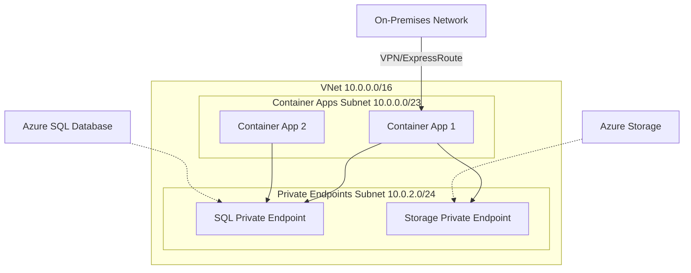

# How to Connect Azure Container Apps to a Virtual Network

Author: [nawazdhandala](https://www.github.com/nawazdhandala)

Tags: Azure, Container Apps, Virtual Network, VNet, Networking, Security, Private Endpoints

Description: Learn how to deploy Azure Container Apps into a virtual network for private connectivity, network isolation, and secure access to backend resources.

---

By default, Azure Container Apps run on shared infrastructure with public endpoints. For production workloads that need to access private databases, internal APIs, or comply with network security requirements, you need to deploy your Container Apps into a Virtual Network (VNet). VNet integration gives you control over network traffic, lets you use private endpoints, and enables communication with resources in your corporate network. This post walks through the setup from scratch.

## Why Use VNet Integration?

There are several reasons to connect Container Apps to a VNet:

- **Access private resources:** Reach databases, storage accounts, and other services that are not exposed to the internet.
- **Network isolation:** Control inbound and outbound traffic with Network Security Groups (NSGs).
- **Compliance:** Meet regulatory requirements that mandate network-level isolation.
- **Hybrid connectivity:** Connect to on-premises resources through VPN or ExpressRoute.
- **Internal-only applications:** Deploy apps that should never be accessible from the public internet.

## Step 1: Create a Virtual Network with Subnets

Azure Container Apps requires a dedicated subnet with a minimum of /23 CIDR range (512 addresses). The subnet cannot be shared with other resources.

```bash
# Create a VNet with a large enough address space
az network vnet create \
  --name my-vnet \
  --resource-group my-rg \
  --location eastus \
  --address-prefix 10.0.0.0/16

# Create a dedicated subnet for Container Apps
# Must be at least /23 (512 addresses)
az network vnet subnet create \
  --name container-apps-subnet \
  --resource-group my-rg \
  --vnet-name my-vnet \
  --address-prefix 10.0.0.0/23

# Create another subnet for private endpoints (databases, storage, etc.)
az network vnet subnet create \
  --name private-endpoints-subnet \
  --resource-group my-rg \
  --vnet-name my-vnet \
  --address-prefix 10.0.2.0/24
```

## Step 2: Get the Subnet Resource ID

You will need the subnet's full resource ID when creating the Container Apps environment.

```bash
# Get the subnet resource ID
SUBNET_ID=$(az network vnet subnet show \
  --name container-apps-subnet \
  --resource-group my-rg \
  --vnet-name my-vnet \
  --query "id" -o tsv)

echo $SUBNET_ID
```

## Step 3: Create the Container Apps Environment in the VNet

When you create the environment, specify the subnet to deploy into. You also choose whether the environment allows external access or is entirely internal.

```bash
# Create a Container Apps environment with VNet integration
# Internal mode: no public IP, only accessible from within the VNet
az containerapp env create \
  --name my-secure-env \
  --resource-group my-rg \
  --location eastus \
  --infrastructure-subnet-resource-id $SUBNET_ID \
  --internal-only true
```

Setting `--internal-only true` means the environment gets a private IP address. No public endpoint is created. Apps in this environment are only reachable from within the VNet or through peered networks.

If you want external access but still need VNet integration for outbound traffic, omit the `--internal-only` flag.

```bash
# External environment with VNet integration
# Public endpoint available, but outbound traffic goes through VNet
az containerapp env create \
  --name my-env-external \
  --resource-group my-rg \
  --location eastus \
  --infrastructure-subnet-resource-id $SUBNET_ID
```

## Step 4: Deploy Apps into the VNet-Integrated Environment

Deploy container apps as usual. They automatically inherit the VNet configuration from the environment.

```bash
# Deploy an app into the VNet-integrated environment
az containerapp create \
  --name internal-api \
  --resource-group my-rg \
  --environment my-secure-env \
  --image myregistry.azurecr.io/internal-api:v1 \
  --target-port 3000 \
  --ingress internal
```

This app is now only accessible from within the VNet. The FQDN will resolve to a private IP address.

## Step 5: Connect to a Private Database

One of the most common reasons for VNet integration is accessing a database through a private endpoint.

```bash
# Create a private endpoint for Azure SQL
az network private-endpoint create \
  --name sql-private-endpoint \
  --resource-group my-rg \
  --vnet-name my-vnet \
  --subnet private-endpoints-subnet \
  --private-connection-resource-id "/subscriptions/{sub-id}/resourceGroups/my-rg/providers/Microsoft.Sql/servers/my-sql-server" \
  --group-id sqlServer \
  --connection-name sql-pe-connection

# Create a private DNS zone for SQL
az network private-dns zone create \
  --resource-group my-rg \
  --name privatelink.database.windows.net

# Link the DNS zone to the VNet
az network private-dns zone virtual-network-link create \
  --resource-group my-rg \
  --zone-name privatelink.database.windows.net \
  --name sql-dns-link \
  --virtual-network my-vnet \
  --registration-enabled false

# Create DNS record for the private endpoint
az network private-endpoint dns-zone-group create \
  --resource-group my-rg \
  --endpoint-name sql-private-endpoint \
  --name sql-dns-group \
  --private-dns-zone privatelink.database.windows.net \
  --zone-name privatelink.database.windows.net
```

Now your container app can connect to `my-sql-server.database.windows.net` and the DNS will resolve to the private IP of the SQL server.

## Network Architecture

Here is how the networking looks.



## Step 6: Configure Network Security Groups

NSGs let you control traffic flow at the subnet level. Add rules to restrict what your container apps can access.

```bash
# Create an NSG
az network nsg create \
  --name container-apps-nsg \
  --resource-group my-rg \
  --location eastus

# Allow outbound HTTPS traffic
az network nsg rule create \
  --nsg-name container-apps-nsg \
  --resource-group my-rg \
  --name allow-https-outbound \
  --priority 100 \
  --direction Outbound \
  --access Allow \
  --protocol Tcp \
  --destination-port-ranges 443

# Allow traffic to the SQL private endpoint subnet
az network nsg rule create \
  --nsg-name container-apps-nsg \
  --resource-group my-rg \
  --name allow-sql \
  --priority 200 \
  --direction Outbound \
  --access Allow \
  --protocol Tcp \
  --destination-address-prefixes 10.0.2.0/24 \
  --destination-port-ranges 1433

# Associate NSG with the container apps subnet
az network vnet subnet update \
  --name container-apps-subnet \
  --resource-group my-rg \
  --vnet-name my-vnet \
  --network-security-group container-apps-nsg
```

Be careful with NSGs on the Container Apps subnet. Azure Container Apps needs outbound access to Azure management endpoints. Blocking these will break the platform. The recommended approach is to start permissive and gradually tighten.

## Step 7: Set Up VNet Peering for Multi-VNet Architectures

If your resources span multiple VNets, use VNet peering to connect them.

```bash
# Peer the container apps VNet with another VNet
az network vnet peering create \
  --name apps-to-backend \
  --resource-group my-rg \
  --vnet-name my-vnet \
  --remote-vnet /subscriptions/{sub-id}/resourceGroups/backend-rg/providers/Microsoft.Network/virtualNetworks/backend-vnet \
  --allow-vnet-access true

# Create the reverse peering
az network vnet peering create \
  --name backend-to-apps \
  --resource-group backend-rg \
  --vnet-name backend-vnet \
  --remote-vnet /subscriptions/{sub-id}/resourceGroups/my-rg/providers/Microsoft.Network/virtualNetworks/my-vnet \
  --allow-vnet-access true
```

## Troubleshooting

**Container cannot reach private endpoint:** Verify that DNS is resolving correctly. From within the container, the database FQDN should resolve to the private IP, not the public one. Check that the private DNS zone is linked to the VNet.

**Environment creation fails:** Make sure the subnet has at least /23 address space and is not used by other resources. The subnet must be delegated to `Microsoft.App/environments`.

**Apps cannot reach the internet:** If you have an NSG on the subnet, make sure outbound rules allow traffic to the internet. Azure Container Apps need outbound access for pulling images and platform management.

**VNet peering not working:** Ensure peering is configured in both directions and that "Allow VNet Access" is enabled on both sides.

## Summary

VNet integration is essential for production Azure Container Apps deployments that need to access private resources or meet network security requirements. The setup involves creating a properly sized subnet, deploying the Container Apps environment into it, and configuring private endpoints for backend services. Combined with NSGs and VNet peering, you get a network architecture that is both secure and flexible.
