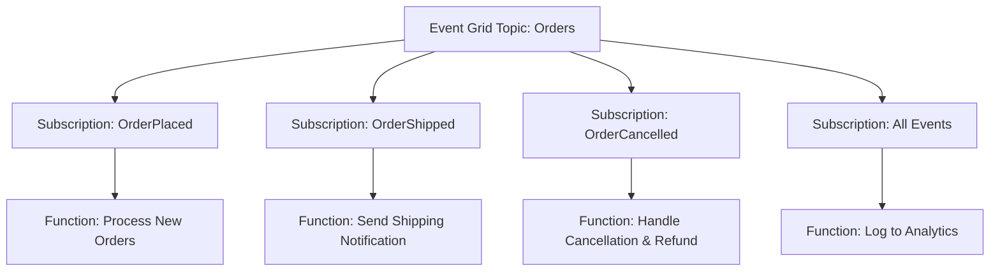

# How to Connect Azure Event Grid to Azure Functions as Event Handler

Author: [nawazdhandala](https://www.github.com/nawazdhandala)

Tags: Azure, Event Grid, Azure Functions, Serverless, Event Handler, Event-Driven, Cloud Computing

Description: A complete guide to connecting Azure Event Grid events to Azure Functions using triggers, bindings, and proper error handling patterns.

---

Azure Functions is the most natural event handler for Azure Event Grid. Functions spin up on demand, scale automatically based on event volume, and you only pay for the compute time you use. Connecting the two is straightforward, but there are nuances around trigger types, batching, error handling, and scaling that matter for production workloads.

## Two Ways to Connect

There are two ways to wire Event Grid events to Azure Functions:

1. **Event Grid Trigger** - The function uses the `EventGridTrigger` binding, and Event Grid pushes events directly to the function runtime. This is the recommended approach.

2. **HTTP Trigger with Event Grid subscription** - The function uses an `HttpTrigger`, and Event Grid delivers events as HTTP POST requests to the function's URL. This gives you more control but requires you to handle the validation handshake yourself.

For most scenarios, use the Event Grid Trigger. It handles validation automatically, deserializes events for you, and integrates with the Functions scaling infrastructure.

## Setting Up an Event Grid Trigger Function (Isolated Worker)

Here is a function using the .NET isolated worker model (the recommended model for new projects).

```csharp
using Azure.Messaging.EventGrid;
using Microsoft.Azure.Functions.Worker;
using Microsoft.Extensions.Logging;

public class OrderEventHandler
{
    private readonly ILogger<OrderEventHandler> _logger;

    public OrderEventHandler(ILogger<OrderEventHandler> logger)
    {
        _logger = logger;
    }

    // This function triggers whenever Event Grid delivers an event
    [Function("HandleOrderEvent")]
    public async Task Run(
        [EventGridTrigger] EventGridEvent eventGridEvent)
    {
        // The event is already deserialized for you
        _logger.LogInformation("Event Type: {Type}", eventGridEvent.EventType);
        _logger.LogInformation("Subject: {Subject}", eventGridEvent.Subject);
        _logger.LogInformation("Event Time: {Time}", eventGridEvent.EventTime);

        // Deserialize the data payload
        var orderData = eventGridEvent.Data.ToObjectFromJson<OrderPlacedData>();

        _logger.LogInformation(
            "Processing order {OrderId} for customer {CustomerId}, amount: ${Amount}",
            orderData.OrderId,
            orderData.CustomerId,
            orderData.TotalAmount
        );

        // Your business logic here
        await ProcessOrder(orderData);
    }

    private async Task ProcessOrder(OrderPlacedData order)
    {
        // Save to database, send notification, update inventory, etc.
        await Task.CompletedTask;
    }
}

public class OrderPlacedData
{
    public string OrderId { get; set; }
    public string CustomerId { get; set; }
    public decimal TotalAmount { get; set; }
    public string Currency { get; set; }
}
```

## Creating the Event Subscription

Once your function is deployed, create an Event Grid subscription pointing to it.

```bash
# Get the function's resource ID
FUNCTION_ID="/subscriptions/{sub-id}/resourceGroups/rg-app/providers/Microsoft.Web/sites/func-order-handler/functions/HandleOrderEvent"

# Create the subscription
az eventgrid event-subscription create \
  --name sub-orders-to-function \
  --source-resource-id "/subscriptions/{sub-id}/resourceGroups/rg-events/providers/Microsoft.EventGrid/topics/topic-orders" \
  --endpoint "$FUNCTION_ID" \
  --endpoint-type azurefunction \
  --included-event-types "Orders.OrderPlaced"
```

## Event Grid Trigger with Python

Here is the same function in Python.

```python
import azure.functions as func
import logging
import json

app = func.FunctionApp()

# Event Grid trigger function
@app.function_name(name="HandleOrderEvent")
@app.event_grid_trigger(arg_name="event")
def handle_order_event(event: func.EventGridEvent):
    logging.info("Event Type: %s", event.event_type)
    logging.info("Subject: %s", event.subject)

    # Parse the event data
    event_data = event.get_json()

    logging.info(
        "Processing order %s for customer %s",
        event_data.get("orderId"),
        event_data.get("customerId")
    )

    # Your processing logic
    process_order(event_data)

def process_order(data: dict):
    # Business logic here
    logging.info("Order processed: %s", data.get("orderId"))
```

## Event Grid Trigger with Node.js

And in TypeScript for Node.js.

```typescript
import { app, EventGridEvent, InvocationContext } from "@azure/functions";

// Register the Event Grid trigger
app.eventGrid("HandleOrderEvent", {
  handler: async (event: EventGridEvent, context: InvocationContext) => {
    context.log("Event Type:", event.eventType);
    context.log("Subject:", event.subject);

    // Access the event data
    const orderData = event.data as OrderPlacedData;
    context.log(`Processing order ${orderData.orderId}`);

    // Your processing logic
    await processOrder(orderData);
  },
});

interface OrderPlacedData {
  orderId: string;
  customerId: string;
  totalAmount: number;
  currency: string;
}

async function processOrder(data: OrderPlacedData): Promise<void> {
  // Business logic here
  console.log(`Order ${data.orderId} processed`);
}
```

## Batch Event Delivery

By default, Event Grid sends one event per function invocation. For high-throughput scenarios, you can configure batch delivery to reduce the number of function invocations.

```bash
# Create subscription with batch delivery
az eventgrid event-subscription create \
  --name sub-batch-orders \
  --source-resource-id "/subscriptions/{sub-id}/resourceGroups/rg-events/providers/Microsoft.EventGrid/topics/topic-orders" \
  --endpoint "$FUNCTION_ID" \
  --endpoint-type azurefunction \
  --max-events-per-batch 10 \
  --preferred-batch-size-in-kilobytes 64
```

When using batch delivery, your function receives an array of events. Handle this in your HTTP trigger function (Event Grid triggers currently receive one event at a time).

```csharp
// HTTP trigger function that handles batched Event Grid events
[Function("HandleBatchedEvents")]
public async Task<HttpResponseData> RunBatched(
    [HttpTrigger(AuthorizationLevel.Function, "post")] HttpRequestData req)
{
    var body = await req.ReadAsStringAsync();
    var events = JsonSerializer.Deserialize<EventGridEvent[]>(body);

    _logger.LogInformation("Received batch of {Count} events", events.Length);

    // Process each event in the batch
    foreach (var ev in events)
    {
        try
        {
            await ProcessSingleEvent(ev);
        }
        catch (Exception ex)
        {
            // Log but continue processing remaining events in the batch
            _logger.LogError(ex, "Failed to process event {EventId}", ev.Id);
        }
    }

    return req.CreateResponse(System.Net.HttpStatusCode.OK);
}
```

## Error Handling and Retries

When your function throws an exception or returns a failure status code, Event Grid retries the delivery based on the subscription's retry policy.

For Event Grid Trigger functions, an unhandled exception causes the function to return a 500 status code, which triggers Event Grid's retry mechanism with exponential backoff.

```csharp
[Function("HandleOrderEvent")]
public async Task Run([EventGridTrigger] EventGridEvent eventGridEvent)
{
    try
    {
        var orderData = eventGridEvent.Data.ToObjectFromJson<OrderPlacedData>();
        await ProcessOrder(orderData);
    }
    catch (TransientException ex)
    {
        // Let this bubble up - Event Grid will retry
        _logger.LogWarning(ex, "Transient error, Event Grid will retry");
        throw;
    }
    catch (PermanentException ex)
    {
        // Log and swallow - no point retrying
        _logger.LogError(ex, "Permanent error processing event {Id}", eventGridEvent.Id);
        // The function succeeds (no exception), so Event Grid marks it as delivered
        // Consider sending to a dead-letter queue manually
        await SendToErrorQueue(eventGridEvent, ex);
    }
}
```

## Scaling Behavior

Event Grid Trigger functions scale based on the event rate. The Functions runtime monitors the incoming event rate and scales out instances to keep up. Key factors that affect scaling:

- **Consumption plan**: Scales to hundreds of instances automatically, but has a cold start penalty
- **Premium plan**: Pre-warmed instances eliminate cold starts, scales based on event rate
- **Dedicated plan**: Fixed number of instances, no automatic scaling

For latency-sensitive event processing, use the Premium plan to avoid cold starts. For cost-sensitive workloads with tolerance for occasional delays, the Consumption plan works well.

## Architecture: Multi-Function Fan-Out

A common pattern is to use multiple functions as handlers for the same Event Grid topic, each filtering for different event types.



Each subscription has its own filter and delivers to a separate function, creating a clean separation of concerns.

## Monitoring and Diagnostics

Enable Application Insights for your Function App to get end-to-end tracing from Event Grid through your function.

```bash
# Check function invocation logs
az monitor app-insights query \
  --app func-order-handler \
  --analytics-query "requests | where name == 'HandleOrderEvent' | summarize count() by resultCode | order by count_ desc"
```

Key metrics to monitor:
- Function execution count and duration
- Failure rate
- Event Grid delivery success vs failure
- Queue depth (if events are backing up)

## Bicep: Complete Setup

Here is a Bicep template that creates the function app, Event Grid topic, and subscription together.

```bicep
// Bicep: Event Grid topic with Azure Function subscription
param location string = resourceGroup().location
param functionAppName string = 'func-order-handler'

resource topic 'Microsoft.EventGrid/topics@2022-06-15' = {
  name: 'topic-orders'
  location: location
}

resource functionApp 'Microsoft.Web/sites@2023-01-01' existing = {
  name: functionAppName
}

resource subscription 'Microsoft.EventGrid/topics/eventSubscriptions@2022-06-15' = {
  parent: topic
  name: 'sub-to-function'
  properties: {
    destination: {
      endpointType: 'AzureFunction'
      properties: {
        resourceId: '${functionApp.id}/functions/HandleOrderEvent'
        maxEventsPerBatch: 1
        preferredBatchSizeInKilobytes: 64
      }
    }
    filter: {
      includedEventTypes: ['Orders.OrderPlaced']
    }
    retryPolicy: {
      maxDeliveryAttempts: 10
      eventTimeToLiveInMinutes: 1440
    }
  }
}
```

## Summary

Azure Functions and Event Grid are built to work together. Use the Event Grid Trigger for the simplest integration, handle errors deliberately by choosing when to throw (retry) vs swallow (no retry), and monitor with Application Insights. For high-throughput scenarios, consider batch delivery and the Premium hosting plan. The combination gives you a fully serverless, event-driven processing pipeline that scales from zero to thousands of events per second.
